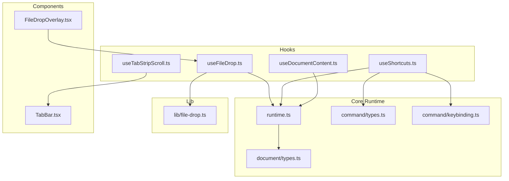
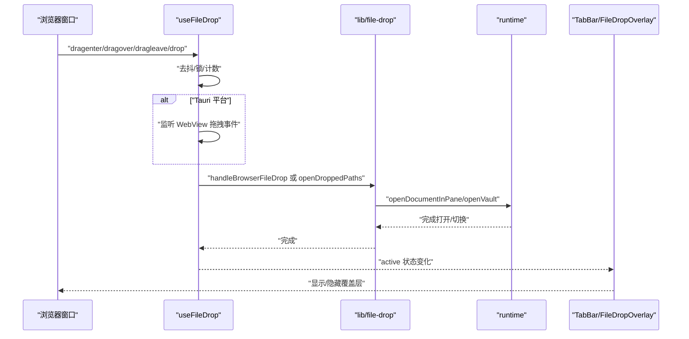
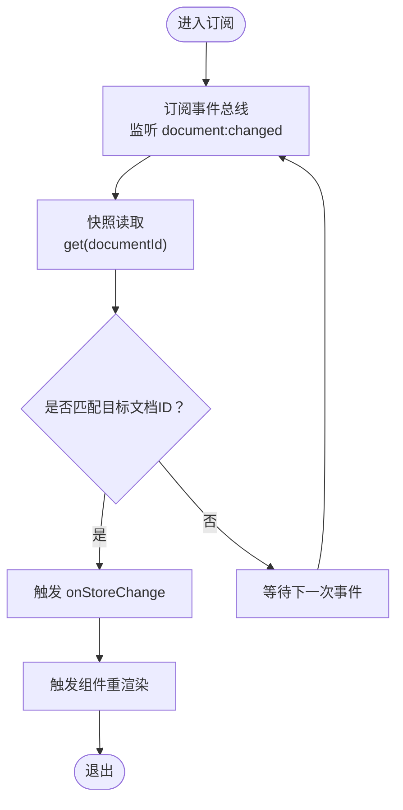
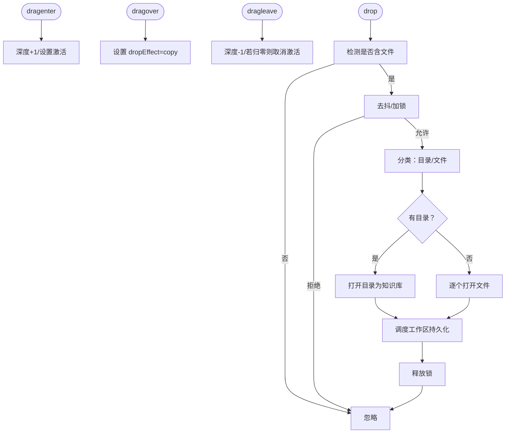
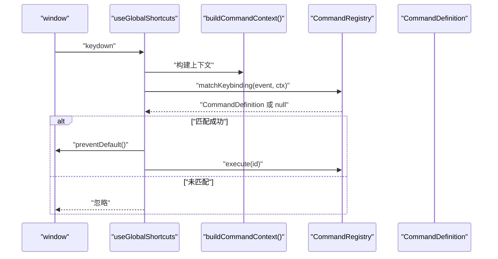
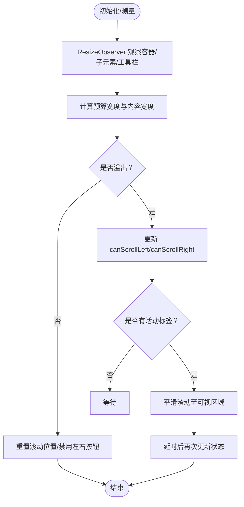
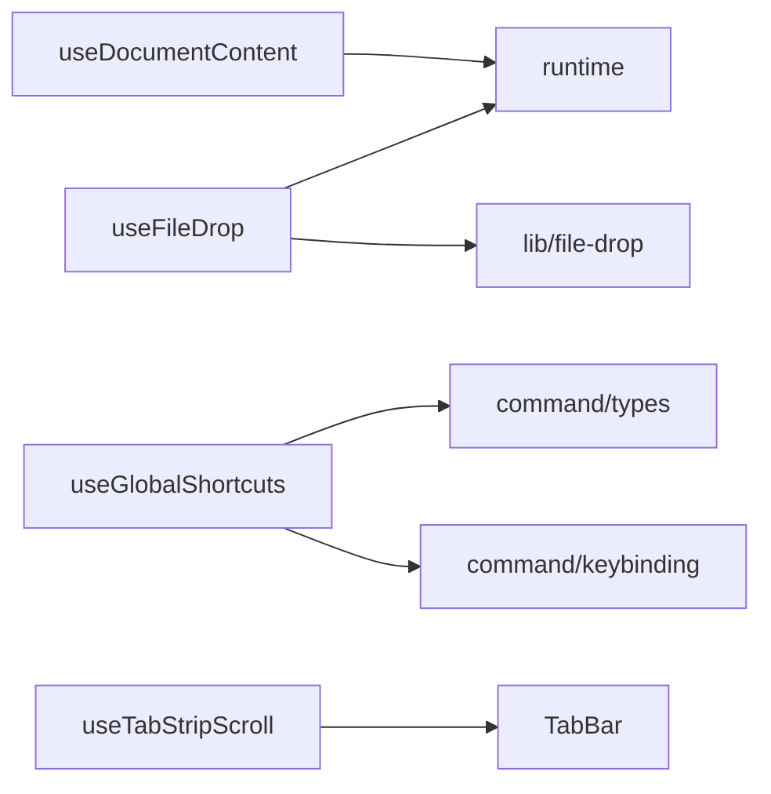

# 自定义Hooks

<cite>
**本文引用的文件**
- [useDocumentContent.ts](file://src/hooks/useDocumentContent.ts)
- [useFileDrop.ts](file://src/hooks/useFileDrop.ts)
- [useShortcuts.ts](file://src/hooks/useShortcuts.ts)
- [useTabStripScroll.ts](file://src/hooks/useTabStripScroll.ts)
- [file-drop.ts](file://src/lib/file-drop.ts)
- [runtime.ts](file://src/core/runtime.ts)
- [types.ts（文档）](file://src/core/document/types.ts)
- [keybinding.ts](file://src/core/command/keybinding.ts)
- [types.ts（命令）](file://src/core/command/types.ts)
- [TabBar.tsx](file://src/components/editor/TabBar.tsx)
- [FileDropOverlay.tsx](file://src/components/editor/FileDropOverlay.tsx)
</cite>

## 目录
1. [简介](#简介)
2. [项目结构](#项目结构)
3. [核心组件](#核心组件)
4. [架构总览](#架构总览)
5. [详细组件分析](#详细组件分析)
6. [依赖分析](#依赖分析)
7. [性能考量](#性能考量)
8. [故障排查指南](#故障排查指南)
9. [结论](#结论)
10. [附录](#附录)

## 简介
本文件系统化梳理 NoteForge 的四个关键自定义 Hooks：文档内容订阅 Hook、文件拖拽处理 Hook、全局快捷键绑定 Hook、标签页滚动控制 Hook。文档从设计模式与实现原理出发，逐项说明各 Hook 的职责、参数、返回值、使用场景与最佳实践，并给出 Hook 间的组合使用方式、可复用性与扩展性设计建议，以及常见问题与性能优化策略。

## 项目结构
- 钩子集中于 src/hooks，分别封装跨组件的状态订阅、事件处理与 UI 行为控制。
- 核心运行时通过 src/core/runtime.ts 提供统一的事件总线、文档服务、命令注册表等能力，被多个 Hook 间接依赖。
- 工具函数位于 src/lib，如文件拖拽分类、打开路径等逻辑，被 useFileDrop 与相关 UI 组件调用。
- UI 层组件（如 TabBar、FileDropOverlay）直接消费 Hook 返回的能力，形成“数据/行为 → 视图”的清晰分层。

图表来源
- [useDocumentContent.ts:1-48](file://src/hooks/useDocumentContent.ts#L1-L48)
- [useFileDrop.ts:1-149](file://src/hooks/useFileDrop.ts#L1-L149)
- [useShortcuts.ts:1-25](file://src/hooks/useShortcuts.ts#L1-L25)
- [useTabStripScroll.ts:1-135](file://src/hooks/useTabStripScroll.ts#L1-L135)
- [runtime.ts:1-191](file://src/core/runtime.ts#L1-L191)
- [types.ts（文档）:1-111](file://src/core/document/types.ts#L1-L111)
- [types.ts（命令）:1-45](file://src/core/command/types.ts#L1-L45)
- [keybinding.ts:1-59](file://src/core/command/keybinding.ts#L1-L59)
- [file-drop.ts:1-192](file://src/lib/file-drop.ts#L1-L192)
- [TabBar.tsx:301-378](file://src/components/editor/TabBar.tsx#L301-L378)
- [FileDropOverlay.tsx:1-24](file://src/components/editor/FileDropOverlay.tsx#L1-L24)

章节来源
- [useDocumentContent.ts:1-48](file://src/hooks/useDocumentContent.ts#L1-L48)
- [useFileDrop.ts:1-149](file://src/hooks/useFileDrop.ts#L1-L149)
- [useShortcuts.ts:1-25](file://src/hooks/useShortcuts.ts#L1-L25)
- [useTabStripScroll.ts:1-135](file://src/hooks/useTabStripScroll.ts#L1-L135)
- [runtime.ts:1-191](file://src/core/runtime.ts#L1-L191)
- [file-drop.ts:1-192](file://src/lib/file-drop.ts#L1-L192)
- [TabBar.tsx:301-378](file://src/components/editor/TabBar.tsx#L301-L378)
- [FileDropOverlay.tsx:1-24](file://src/components/editor/FileDropOverlay.tsx#L1-L24)

## 核心组件
- 文档内容订阅 Hook：基于 useSyncExternalStore 订阅特定文档的内容变化，仅在目标文档变更时触发重渲染，避免无关更新。
- 文件拖拽处理 Hook：全局监听拖拽事件，去抖与锁机制防止重复处理；区分浏览器与 Tauri 平台，支持文件/文件夹打开与错误提示。
- 全局快捷键绑定 Hook：统一拦截组合键，匹配命令注册表并执行对应命令，支持平台差异的修饰键显示。
- 标签页滚动控制 Hook：计算标签条溢出、左右滚动按钮可用性与滚轮横向滚动，提供注册标签元素引用与滚动控制方法。

章节来源
- [useDocumentContent.ts:1-48](file://src/hooks/useDocumentContent.ts#L1-L48)
- [useFileDrop.ts:1-149](file://src/hooks/useFileDrop.ts#L1-L149)
- [useShortcuts.ts:1-25](file://src/hooks/useShortcuts.ts#L1-L25)
- [useTabStripScroll.ts:1-135](file://src/hooks/useTabStripScroll.ts#L1-L135)

## 架构总览
以下序列图展示了“拖拽打开文件/文件夹”在不同平台下的完整流程，体现 Hook 与核心运行时、UI 组件的协作关系。

图表来源
- [useFileDrop.ts:19-145](file://src/hooks/useFileDrop.ts#L19-L145)
- [file-drop.ts:112-191](file://src/lib/file-drop.ts#L112-L191)
- [runtime.ts:124-129](file://src/core/runtime.ts#L124-L129)
- [FileDropOverlay.tsx:7-24](file://src/components/editor/FileDropOverlay.tsx#L7-L24)

## 详细组件分析

### 文档内容订阅 Hook（useDocumentContent）
- 设计模式：基于 useSyncExternalStore 将外部状态（核心运行时中的文档记录）接入 React 订阅模型，确保最小化重渲染。
- 功能职责：
  - useDocumentContent(documentId): 返回指定文档的内容字符串，不存在则返回 null。
  - useDocumentRecord(documentId): 返回完整的 DocumentRecord，不存在则返回 null。
- 参数配置：
  - documentId: 字符串，文档唯一标识。
- 返回值结构：
  - 内容钩子返回 string | null。
  - 记录钩子返回 DocumentRecord 或 null。
- 使用场景：
  - 编辑器区域按需渲染文档内容。
  - 面包屑、标题栏动态显示当前文档信息。
- 性能与最佳实践：
  - 仅当事件总线发出“document:changed”且事件携带的 documentId 匹配时才触发重渲染。
  - 建议在组件中以 memo 化依赖数组传入 documentId，避免不必要的订阅重建。
- 错误与边界：
  - 当文档不存在或未加载时，返回 null，调用方应进行空值检查。

图表来源
- [useDocumentContent.ts:8-25](file://src/hooks/useDocumentContent.ts#L8-L25)
- [runtime.ts:46-55](file://src/core/runtime.ts#L46-L55)

章节来源
- [useDocumentContent.ts:1-48](file://src/hooks/useDocumentContent.ts#L1-L48)
- [runtime.ts:46-55](file://src/core/runtime.ts#L46-L55)
- [types.ts（文档）:49-72](file://src/core/document/types.ts#L49-L72)

### 文件拖拽处理 Hook（useFileDrop）
- 设计模式：全局副作用 Hook，内部维护状态与去抖锁，跨平台适配（浏览器与 Tauri），通过工具函数解耦业务逻辑。
- 功能职责：
  - 全局监听拖拽事件，跟踪进入/离开深度与当前激活状态。
  - 处理去抖与锁，避免重复处理与竞态。
  - 在 Tauri 平台监听 WebView 拖拽事件，合并临时路径列表。
  - 打开文件/文件夹：根据类型分类后调用核心运行时打开。
- 参数配置：
  - enabled: 布尔值，默认启用；用于条件挂载。
- 返回值结构：
  - active: 布尔值，表示当前是否存在有效拖拽悬停。
- 使用场景：
  - 应用根容器接收全局拖拽，配合 FileDropOverlay 显示视觉反馈。
- 性能与最佳实践：
  - 使用去抖时间常量与微任务更新，降低频繁测量与重排成本。
  - 在卸载时清理事件监听与延时器，避免内存泄漏。
- 平台差异：
  - 浏览器：优先尝试从 DataTransferItem 获取原生路径，否则回退到 Blob 打开。
  - Tauri：通过 WebView 事件回调传递路径，支持 enter/over/leave/drop 分阶段状态。
- 常见问题：
  - 路径为空或不可打开：抛出错误并弹窗提示。
  - 无可打开文件：提示用户。

图表来源
- [useFileDrop.ts:60-87](file://src/hooks/useFileDrop.ts#L60-L87)
- [useFileDrop.ts:94-135](file://src/hooks/useFileDrop.ts#L94-L135)
- [file-drop.ts:72-133](file://src/lib/file-drop.ts#L72-L133)

章节来源
- [useFileDrop.ts:1-149](file://src/hooks/useFileDrop.ts#L1-L149)
- [file-drop.ts:1-192](file://src/lib/file-drop.ts#L1-L192)
- [runtime.ts:124-129](file://src/core/runtime.ts#L124-L129)

### 全局快捷键绑定 Hook（useGlobalShortcuts）
- 设计模式：全局键盘事件监听，结合命令注册表进行路由与执行，遵循平台差异的修饰键显示。
- 功能职责：
  - 捕获组合键（Meta/Ctrl）与 F1，匹配命令上下文后执行对应命令。
  - 防止默认行为，避免与浏览器快捷键冲突。
- 参数配置：
  - 无显式参数；内部构建命令上下文并查询命令注册表。
- 返回值结构：
  - 无返回值；副作用在挂载时注册事件，在卸载时移除。
- 使用场景：
  - 为菜单、命令面板、上下文菜单提供统一的快捷键入口。
- 性能与最佳实践：
  - 仅在应用初始化后存在命令注册表时生效。
  - 修饰键标签通过 keybinding 工具按平台动态生成，提升跨平台一致性。
- 常见问题：
  - 未匹配到命令：静默忽略，不阻止默认行为。
  - 仅在按下 Mod 或 F1 时响应，避免干扰非快捷键输入。

图表来源
- [useShortcuts.ts:8-24](file://src/hooks/useShortcuts.ts#L8-L24)
- [keybinding.ts:19-51](file://src/core/command/keybinding.ts#L19-L51)
- [types.ts（命令）:40-45](file://src/core/command/types.ts#L40-L45)

章节来源
- [useShortcuts.ts:1-25](file://src/hooks/useShortcuts.ts#L1-L25)
- [keybinding.ts:1-59](file://src/core/command/keybinding.ts#L1-L59)
- [types.ts（命令）:1-45](file://src/core/command/types.ts#L1-L45)

### 标签页滚动控制 Hook（useTabStripScroll）
- 设计模式：基于 useLayoutEffect 与 ResizeObserver 的布局感知 Hook，计算标签条溢出并提供滚动控制方法。
- 功能职责：
  - 计算标签条预算宽度（减去右侧工具栏）与内容宽度，决定是否需要滚动。
  - 提供 canScrollLeft/canScrollRight/needsScroll 状态与滚动控制方法（平滑滚动、滚轮横向滚动）。
  - 注册/注销标签元素引用，动态测量宽度并更新状态。
- 参数配置：
  - activeTabId: 当前活动标签 ID（可选）。
  - tabCount: 标签数量。
  - barRef: 标签条容器引用。
  - toolbarRef: 右侧工具栏引用。
- 返回值结构：
  - scrollRef: 滚动容器引用。
  - registerTabRef: 注册/注销标签元素引用。
  - canScrollLeft/canScrollRight/needsScroll: 布尔状态。
  - scrollLeft/scrollRight/onWheel/updateScrollState: 控制与事件处理方法。
- 使用场景：
  - TabBar 中的标签条溢出处理与交互。
- 性能与最佳实践：
  - 使用 passive 事件监听与 ResizeObserver，减少主线程阻塞。
  - 滚轮横向滚动仅在检测到主要水平位移时生效，避免误触。
  - 对注册表使用队列微任务更新，降低频繁测量成本。
- 常见问题：
  - 活动标签不在视口：自动平滑滚动至可视区域。
  - 工具栏宽度变化：通过 ResizeObserver 实时观测并更新状态。

图表来源
- [useTabStripScroll.ts:39-94](file://src/hooks/useTabStripScroll.ts#L39-L94)
- [useTabStripScroll.ts:100-121](file://src/hooks/useTabStripScroll.ts#L100-L121)
- [TabBar.tsx:317-326](file://src/components/editor/TabBar.tsx#L317-L326)

章节来源
- [useTabStripScroll.ts:1-135](file://src/hooks/useTabStripScroll.ts#L1-L135)
- [TabBar.tsx:301-378](file://src/components/editor/TabBar.tsx#L301-L378)

## 依赖分析
- useDocumentContent 依赖核心运行时的事件总线与文档服务，读取 DocumentRecord 并通过快照暴露给 React。
- useFileDrop 依赖 lib/file-drop 的路径分类与打开逻辑，并通过 runtime 执行打开操作。
- useShortcuts 依赖命令注册表与命令上下文，结合 keybinding 工具进行修饰键标准化与格式化。
- useTabStripScroll 与 UI 组件（TabBar）强耦合，通过引用与状态驱动滚动行为。

图表来源
- [useDocumentContent.ts:1-48](file://src/hooks/useDocumentContent.ts#L1-L48)
- [useFileDrop.ts:1-149](file://src/hooks/useFileDrop.ts#L1-L149)
- [useShortcuts.ts:1-25](file://src/hooks/useShortcuts.ts#L1-L25)
- [useTabStripScroll.ts:1-135](file://src/hooks/useTabStripScroll.ts#L1-L135)
- [runtime.ts:1-191](file://src/core/runtime.ts#L1-L191)
- [types.ts（命令）:1-45](file://src/core/command/types.ts#L1-L45)
- [keybinding.ts:1-59](file://src/core/command/keybinding.ts#L1-L59)
- [TabBar.tsx:301-378](file://src/components/editor/TabBar.tsx#L301-L378)

章节来源
- [runtime.ts:1-191](file://src/core/runtime.ts#L1-L191)
- [file-drop.ts:1-192](file://src/lib/file-drop.ts#L1-L192)
- [types.ts（命令）:1-45](file://src/core/command/types.ts#L1-L45)
- [keybinding.ts:1-59](file://src/core/command/keybinding.ts#L1-L59)
- [TabBar.tsx:301-378](file://src/components/editor/TabBar.tsx#L301-L378)

## 性能考量
- 去抖与锁：useFileDrop 使用去抖与锁避免重复处理与竞态，降低无效 IO 与 UI 抖动。
- 布局感知：useTabStripScroll 使用 ResizeObserver 与被动事件监听，减少主线程阻塞。
- 最小化重渲染：useDocumentContent 使用 useSyncExternalStore，仅在目标文档变更时触发重渲染。
- 微任务更新：useTabStripScroll 在注册/注销标签引用时使用队列微任务，降低频繁测量成本。
- 平台差异化：useShortcuts 与 keybinding 工具按平台生成修饰键标签，避免额外计算与样式切换。

## 故障排查指南
- 拖拽无反应
  - 检查 enabled 是否为 true，确认事件监听已注册。
  - 查看控制台是否有“Tauri 拖拽监听不可用”的警告。
  - 确认 DataTransfer 是否包含 "Files" 类型。
- 打不开文件/文件夹
  - 确认路径是否为空或已被过滤（二进制扩展名会被排除）。
  - 若为 Tauri，确认 WebView 事件回调是否正确传递路径。
- 快捷键无效
  - 确认是否按下 Mod（Meta/Ctrl）或 F1。
  - 检查命令注册表是否已注册对应命令，上下文是否满足 enabled 条件。
- 标签页无法滚动
  - 确认工具栏宽度与容器宽度测量是否正确。
  - 检查是否处于溢出状态（needsScroll）。
  - 确认注册了标签元素引用，避免宽度为 0 导致误判。

章节来源
- [useFileDrop.ts:41-45](file://src/hooks/useFileDrop.ts#L41-L45)
- [useFileDrop.ts:132-134](file://src/hooks/useFileDrop.ts#L132-L134)
- [file-drop.ts:42-46](file://src/lib/file-drop.ts#L42-L46)
- [useShortcuts.ts:10-19](file://src/hooks/useShortcuts.ts#L10-L19)
- [useTabStripScroll.ts:39-65](file://src/hooks/useTabStripScroll.ts#L39-L65)
- [useTabStripScroll.ts:100-107](file://src/hooks/useTabStripScroll.ts#L100-L107)

## 结论
这四个自定义 Hooks 分别覆盖了“文档内容订阅、文件拖拽、全局快捷键、标签页滚动”四大核心交互面，采用最小副作用与高内聚的设计，通过核心运行时与工具库解耦业务逻辑，具备良好的可复用性与扩展性。在实际使用中，建议结合组件状态与上下文进行组合，遵循去抖、锁与微任务更新等性能优化策略，并在多平台环境下关注事件与路径差异。

## 附录
- 组合使用模式建议
  - 在应用根组件挂载 useGlobalShortcuts，确保全局快捷键可用。
  - 在主容器挂载 useFileDrop，并配合 FileDropOverlay 提示用户。
  - 在编辑器区域使用 useDocumentContent 订阅当前文档内容，避免无关重渲染。
  - 在 TabBar 中使用 useTabStripScroll 管理标签条滚动与可见性。
- 扩展性设计
  - 将平台差异抽象为独立工具（如 keybinding），便于未来新增平台。
  - 将业务逻辑抽离为纯函数（如 file-drop 的路径分类与打开），便于测试与复用。
  - 将 UI 与行为分离，通过 Hook 返回引用与状态，降低耦合度。