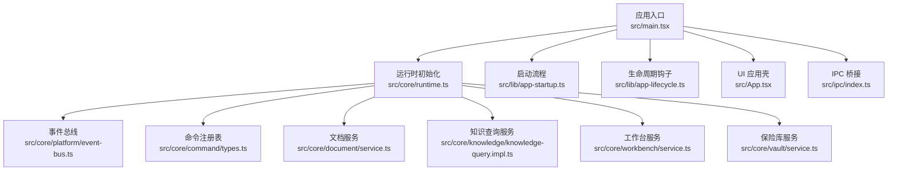
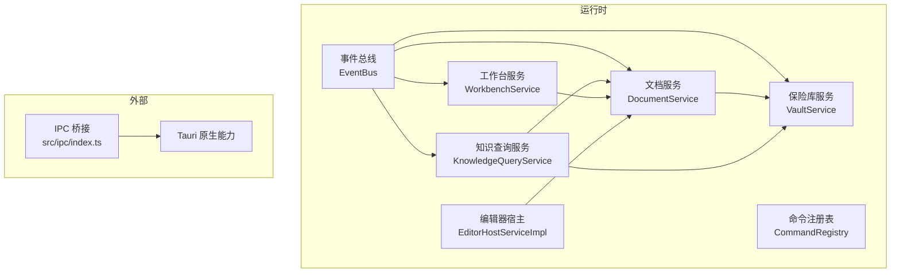
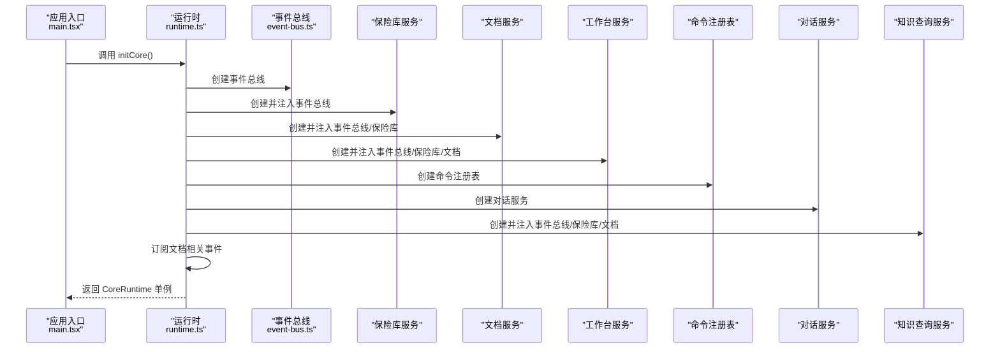
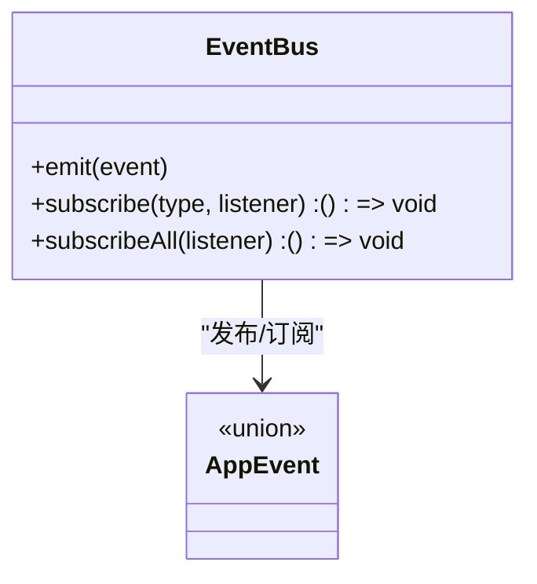
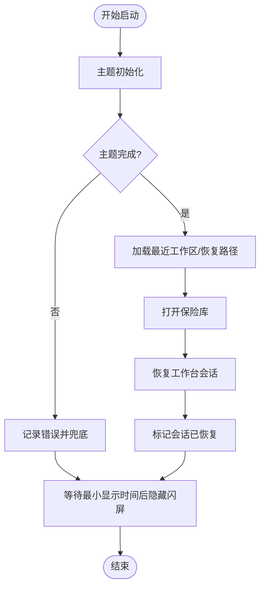
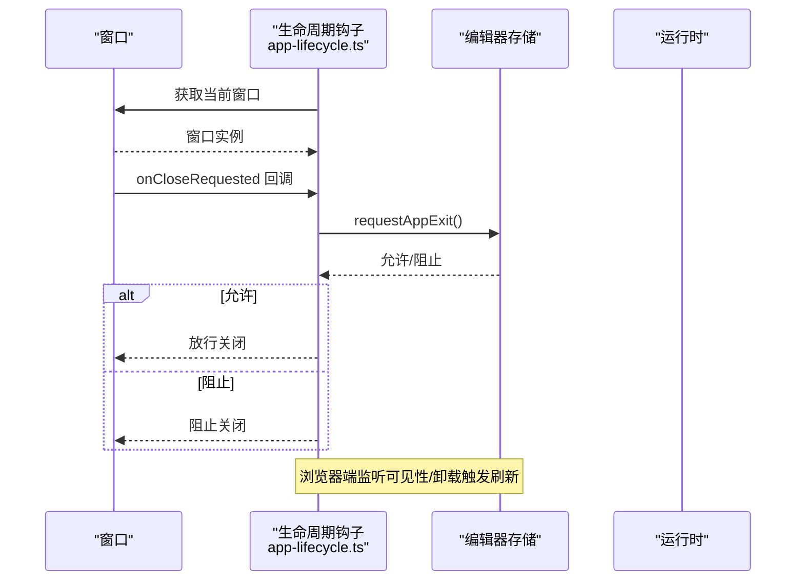
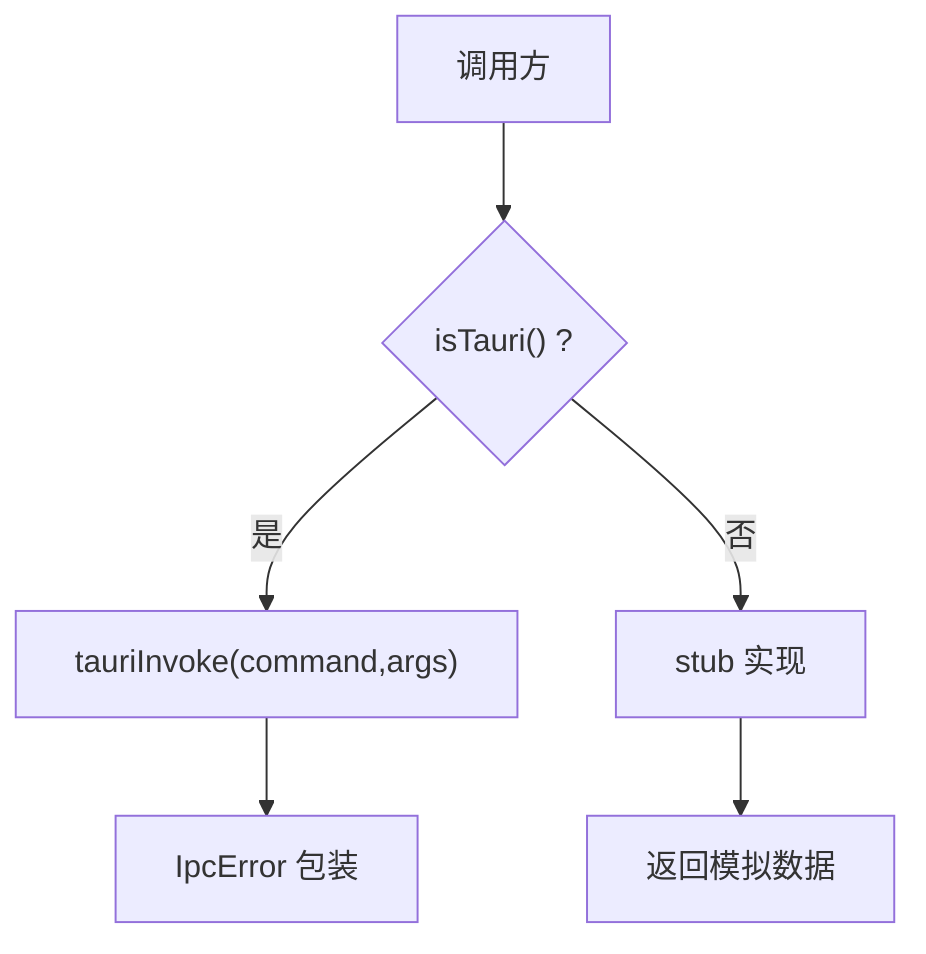
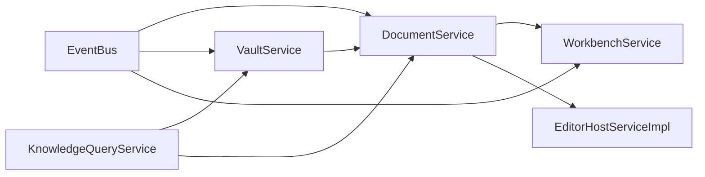

# 运行时系统

<cite>
**本文引用的文件**
- [src/core/runtime.ts](file://src/core/runtime.ts)
- [src/main.tsx](file://src/main.tsx)
- [src/App.tsx](file://src/App.tsx)
- [src/core/platform/event-bus.ts](file://src/core/platform/event-bus.ts)
- [src/core/events.ts](file://src/core/events.ts)
- [src/core/invariants.ts](file://src/core/invariants.ts)
- [src/lib/app-startup.ts](file://src/lib/app-startup.ts)
- [src/lib/app-lifecycle.ts](file://src/lib/app-lifecycle.ts)
- [src/ipc/index.ts](file://src/ipc/index.ts)
- [src/core/command/types.ts](file://src/core/command/types.ts)
- [src/core/vault/service.ts](file://src/core/vault/service.ts)
- [src/core/document/service.ts](file://src/core/document/service.ts)
- [src/core/workbench/service.ts](file://src/core/workbench/service.ts)
- [src/store/startup.ts](file://src/store/startup.ts)
- [src/types.ts](file://src/types.ts)
</cite>

## 目录
1. [简介](#简介)
2. [项目结构](#项目结构)
3. [核心组件](#核心组件)
4. [架构总览](#架构总览)
5. [详细组件分析](#详细组件分析)
6. [依赖分析](#依赖分析)
7. [性能考虑](#性能考虑)
8. [故障排查指南](#故障排查指南)
9. [结论](#结论)
10. [附录](#附录)

## 简介
本文件系统性阐述 NoteForge 运行时系统的设计理念与实现机制，重点覆盖：
- 依赖注入容器的架构（以函数式组合替代传统容器）
- 模块初始化流程与生命周期管理策略
- 运行时如何协调事件总线、IPC 桥接、状态管理器等关键步骤
- 错误处理机制与约束验证体系
- 运行时配置选项与扩展点
- 与其他核心组件的交互模式与依赖关系

## 项目结构
NoteForge 前端采用“按功能域分层”的组织方式：核心运行时位于 src/core，应用入口与生命周期控制位于 src/lib，UI 组件位于 src/components，状态管理使用 Zustand 存储位于 src/store。运行时通过统一入口初始化核心服务，再由启动流程完成主题、工作区与会话恢复。

图表来源
- [src/main.tsx:1-24](file://src/main.tsx#L1-L24)
- [src/core/runtime.ts:43-100](file://src/core/runtime.ts#L43-L100)
- [src/core/platform/event-bus.ts:3-37](file://src/core/platform/event-bus.ts#L3-L37)
- [src/core/command/types.ts:29-45](file://src/core/command/types.ts#L29-L45)
- [src/core/document/service.ts:17-51](file://src/core/document/service.ts#L17-L51)
- [src/core/workbench/service.ts:8-43](file://src/core/workbench/service.ts#L8-L43)
- [src/core/vault/service.ts:13-53](file://src/core/vault/service.ts#L13-L53)
- [src/lib/app-startup.ts:32-74](file://src/lib/app-startup.ts#L32-L74)
- [src/lib/app-lifecycle.ts:13-30](file://src/lib/app-lifecycle.ts#L13-L30)
- [src/App.tsx:25-110](file://src/App.tsx#L25-L110)
- [src/ipc/index.ts:59-83](file://src/ipc/index.ts#L59-L83)

章节来源
- [src/main.tsx:1-24](file://src/main.tsx#L1-L24)
- [src/core/runtime.ts:43-100](file://src/core/runtime.ts#L43-L100)
- [src/lib/app-startup.ts:32-74](file://src/lib/app-startup.ts#L32-L74)
- [src/lib/app-lifecycle.ts:13-30](file://src/lib/app-lifecycle.ts#L13-L30)
- [src/App.tsx:25-110](file://src/App.tsx#L25-L110)
- [src/ipc/index.ts:59-83](file://src/ipc/index.ts#L59-L83)

## 核心组件
- 运行时接口与单例：定义 CoreRuntime 接口，导出 initCore/getCore/isCoreInitialized 等方法，确保全局唯一实例与惰性初始化。
- 事件总线：提供 EventBus 的创建与订阅/发布能力，支持类型化事件与全量事件监听。
- 服务契约：VaultService、DocumentService、WorkbenchService、CommandRegistry、DialogService、KnowledgeQueryService、EditorHostServiceImpl 等，均以接口形式暴露能力边界。
- 启动流程：按主题→工作区→会话三步顺序执行，失败兜底与闪屏过渡。
- 生命周期：桌面端窗口关闭请求拦截与退出前刷新。
- IPC 桥接：统一的 isTauri 判断与调用分发，浏览器环境回退到 stub 实现。
- 约束与不变量：以常量形式声明架构不变量与阶段目标，指导代码评审与演进。

章节来源
- [src/core/runtime.ts:29-107](file://src/core/runtime.ts#L29-L107)
- [src/core/platform/event-bus.ts:3-37](file://src/core/platform/event-bus.ts#L3-L37)
- [src/core/vault/service.ts:13-53](file://src/core/vault/service.ts#L13-L53)
- [src/core/document/service.ts:17-51](file://src/core/document/service.ts#L17-L51)
- [src/core/workbench/service.ts:8-43](file://src/core/workbench/service.ts#L8-L43)
- [src/core/command/types.ts:29-63](file://src/core/command/types.ts#L29-L63)
- [src/lib/app-startup.ts:32-74](file://src/lib/app-startup.ts#L32-L74)
- [src/lib/app-lifecycle.ts:13-30](file://src/lib/app-lifecycle.ts#L13-L30)
- [src/ipc/index.ts:59-83](file://src/ipc/index.ts#L59-L83)
- [src/core/invariants.ts:6-68](file://src/core/invariants.ts#L6-L68)

## 架构总览
运行时系统采用“函数式依赖注入”模式：通过 initCore 将各服务实例以参数形式注入彼此，避免全局可变状态与循环依赖；事件总线作为跨模块通信中枢；启动流程与生命周期钩子负责时序控制；IPC 层抽象平台差异，保证开发与生产一致性。

图表来源
- [src/core/runtime.ts:46-63](file://src/core/runtime.ts#L46-L63)
- [src/core/platform/event-bus.ts:3-37](file://src/core/platform/event-bus.ts#L3-L37)
- [src/ipc/index.ts:59-83](file://src/ipc/index.ts#L59-L83)

## 详细组件分析

### 运行时初始化与模块装配
- 初始化顺序：事件总线 → 保险库 → 文档 → 工作台 → 命令 → 对话 → 知识 → 编辑器宿主；随后注册核心命令并建立事件订阅。
- 事件订阅：
  - 文档冲突：触发冲突对话框。
  - 文档关闭：移除编辑器标签并持久化会话。
  - 文档变更：调度持久化；根据是否为草稿或工作区路径决定自动保存策略。
- 导出便捷 API：打开保险库、打开/新建文档、保存文档、退出前刷新、恢复会话等。

图表来源
- [src/main.tsx:12-15](file://src/main.tsx#L12-L15)
- [src/core/runtime.ts:43-100](file://src/core/runtime.ts#L43-L100)
- [src/core/platform/event-bus.ts:3-37](file://src/core/platform/event-bus.ts#L3-L37)

章节来源
- [src/core/runtime.ts:43-100](file://src/core/runtime.ts#L43-L100)
- [src/core/events.ts:9-23](file://src/core/events.ts#L9-L23)

### 事件总线与事件模型
- 事件模型：AppEvent 聚合了保险库与文档相关的事件类型，如打开/关闭、变更、保存、冲突、视图状态变化、文件系统事件等。
- 总线实现：支持全量订阅与按类型订阅，内部维护监听集合，emit 时遍历所有监听者与对应类型的监听者。

图表来源
- [src/core/platform/event-bus.ts:27-35](file://src/core/platform/event-bus.ts#L27-L35)
- [src/core/events.ts:9-34](file://src/core/events.ts#L9-L34)

章节来源
- [src/core/platform/event-bus.ts:3-37](file://src/core/platform/event-bus.ts#L3-L37)
- [src/core/events.ts:9-34](file://src/core/events.ts#L9-L34)

### 启动流程与会话恢复
- 启动步骤：主题初始化 → 工作区选择与打开 → 会话恢复；每步完成后标记完成并推进下一步。
- 闪屏控制：最小显示时间与淡出动画，保证用户体验一致性。
- 失败兜底：异常时标记所有步骤完成并隐藏闪屏，同时确保编辑器会话标记为已恢复。

图表来源
- [src/lib/app-startup.ts:32-74](file://src/lib/app-startup.ts#L32-L74)
- [src/store/startup.ts:24-50](file://src/store/startup.ts#L24-L50)

章节来源
- [src/lib/app-startup.ts:32-74](file://src/lib/app-startup.ts#L32-L74)
- [src/store/startup.ts:24-50](file://src/store/startup.ts#L24-L50)

### 生命周期与退出处理
- 桌面端窗口关闭拦截：通过 Tauri getCurrentWindow/onCloseRequested 获取窗口句柄，在关闭前向编辑器存储请求退出许可。
- 浏览器端可见性与卸载：在非 Tauri 环境下监听 beforeunload 与 visibilitychange，触发退出前刷新。

图表来源
- [src/lib/app-lifecycle.ts:19-29](file://src/lib/app-lifecycle.ts#L19-L29)
- [src/App.tsx:38-56](file://src/App.tsx#L38-L56)

章节来源
- [src/lib/app-lifecycle.ts:13-30](file://src/lib/app-lifecycle.ts#L13-L30)
- [src/App.tsx:38-56](file://src/App.tsx#L38-L56)

### IPC 桥接与平台适配
- 平台检测：isTauri 通过判断 window.__TAURI_INTERNALS__ 或 window.__TAURI__ 是否存在。
- 统一调用：call 函数在 Tauri 环境调用真实 invoke，在浏览器环境回退到 stub 实现。
- 类型对齐：前端 types.ts 定义与后端命令签名一致的数据结构，便于无缝替换。

图表来源
- [src/ipc/index.ts:59-83](file://src/ipc/index.ts#L59-L83)
- [src/types.ts:378-388](file://src/types.ts#L378-L388)

章节来源
- [src/ipc/index.ts:59-83](file://src/ipc/index.ts#L59-L83)
- [src/types.ts:378-388](file://src/types.ts#L378-L388)

### 错误处理与约束验证
- 错误封装：IpcError 提供统一错误码与详情字段，便于上层捕获与提示。
- 约束与不变量：INVARIANTS 与 PHASE_X_DOD 明确内容单一来源、文档与保险库边界、只读知识查询等原则，作为代码评审门禁。
- 事件驱动的 UI 行为：UI 仅通过事件与服务交互，避免直接写入文件或修改文档，降低耦合与风险。

章节来源
- [src/types.ts:378-388](file://src/types.ts#L378-L388)
- [src/core/invariants.ts:6-68](file://src/core/invariants.ts#L6-L68)
- [src/core/events.ts:1-35](file://src/core/events.ts#L1-L35)

### 扩展点与注册新服务/模块
- 注册命令：通过 CommandRegistry.register 注册命令定义，支持分类、快捷键、启用条件与执行逻辑。
- 注册服务：在运行时 initCore 中创建服务实例并通过构造函数参数注入依赖，然后挂载到 CoreRuntime 接口。
- 示例参考：
  - 命令注册：参见 [src/core/command/types.ts:40-45](file://src/core/command/types.ts#L40-L45) 与 [src/core/command/command-registry.impl.ts](file://src/core/command/command-registry.impl.ts)。
  - 运行时装配：参见 [src/core/runtime.ts:46-63](file://src/core/runtime.ts#L46-L63)。

章节来源
- [src/core/command/types.ts:29-63](file://src/core/command/types.ts#L29-L63)
- [src/core/runtime.ts:46-63](file://src/core/runtime.ts#L46-L63)

## 依赖分析
- 内聚与解耦：运行时通过接口隔离具体实现，事件总线承载跨模块通信，降低耦合度。
- 关键依赖链：
  - DocumentService 依赖 VaultService（读写）与 EventBus（事件通知）。
  - WorkbenchService 依赖 EventBus 与 DocumentService（标签路由与布局）。
  - KnowledgeQueryService 依赖 EventBus、VaultService、DocumentService（索引与查询）。
  - EditorHostServiceImpl 依赖 DocumentService（内容同步）。
- 循环依赖规避：通过 initCore 的顺序装配与接口注入，避免直接互相引用。

图表来源
- [src/core/runtime.ts:46-63](file://src/core/runtime.ts#L46-L63)
- [src/core/platform/event-bus.ts:3-37](file://src/core/platform/event-bus.ts#L3-L37)
- [src/core/vault/service.ts:13-53](file://src/core/vault/service.ts#L13-L53)
- [src/core/document/service.ts:17-51](file://src/core/document/service.ts#L17-L51)
- [src/core/workbench/service.ts:8-43](file://src/core/workbench/service.ts#L8-L43)

章节来源
- [src/core/runtime.ts:46-63](file://src/core/runtime.ts#L46-L63)
- [src/core/platform/event-bus.ts:3-37](file://src/core/platform/event-bus.ts#L3-L37)

## 性能考虑
- 事件去抖与批量刷新：保存文档前对活动表面进行去抖刷新，确保最新内容进入 DocumentService，减少重复渲染与无效写入。
- 自动保存策略：区分草稿与工作区路径，分别调度不同自动保存任务，避免阻塞主线程。
- 启动阶段化：主题→工作区→会话三步走，避免一次性加载造成卡顿。
- IPC 调用最小化：通过统一桥接层合并请求，减少重复网络/进程调用。

章节来源
- [src/core/runtime.ts:138-172](file://src/core/runtime.ts#L138-L172)
- [src/lib/app-startup.ts:32-74](file://src/lib/app-startup.ts#L32-L74)

## 故障排查指南
- 启动失败：检查启动流程中的每一步是否完成，确认闪屏隐藏逻辑是否被触发；查看控制台错误信息。
- 退出前未保存：确认生命周期钩子是否安装，以及编辑器存储的 requestAppExit 是否返回允许。
- IPC 调用异常：确认 isTauri 判断结果，检查 IpcError 的错误码与详情；在浏览器环境确认 stub 实现可用。
- 文档冲突：关注事件总线上的 document:conflict 事件，确保对话框正确弹出并处理冲突。

章节来源
- [src/lib/app-startup.ts:64-71](file://src/lib/app-startup.ts#L64-L71)
- [src/lib/app-lifecycle.ts:19-29](file://src/lib/app-lifecycle.ts#L19-L29)
- [src/types.ts:378-388](file://src/types.ts#L378-L388)
- [src/core/runtime.ts:66-70](file://src/core/runtime.ts#L66-L70)

## 结论
NoteForge 运行时系统通过“函数式依赖注入 + 事件驱动 + 分阶段启动 + IPC 抽象”的设计，实现了高内聚、低耦合且可扩展的前端核心框架。其以不变量与约束为准则，配合严格的事件与命令入口，确保了文档内容一致性与 UI 行为的可预测性。未来可在以下方面持续优化：
- 引入更细粒度的模块化拆分与懒加载
- 增强错误边界与可观测性
- 扩展运行时配置项与插件化扩展点

## 附录
- 运行时配置选项与扩展点
  - 命令注册：通过 CommandRegistry.register 注册命令，支持分类、快捷键、启用条件与执行逻辑。
  - 服务扩展：在 initCore 中新增服务实例并注入依赖，最后挂载到 CoreRuntime。
  - IPC 使用：通过 src/ipc/index.ts 的统一入口调用后端能力，自动适配 Tauri 与 stub。
- 实际示例路径
  - 命令注册：[src/core/command/types.ts:40-45](file://src/core/command/types.ts#L40-L45)
  - 运行时装配：[src/core/runtime.ts:46-63](file://src/core/runtime.ts#L46-L63)
  - IPC 调用：[src/ipc/index.ts:76-83](file://src/ipc/index.ts#L76-L83)