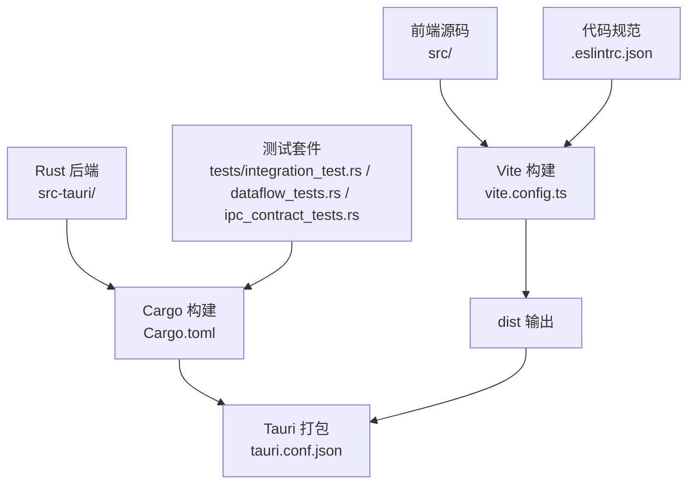
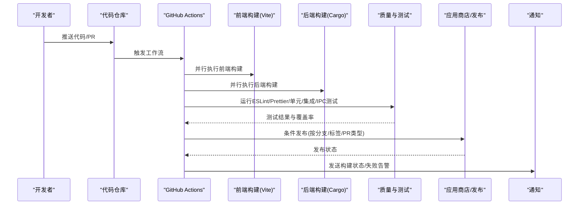
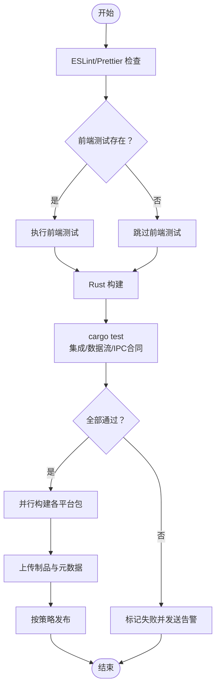
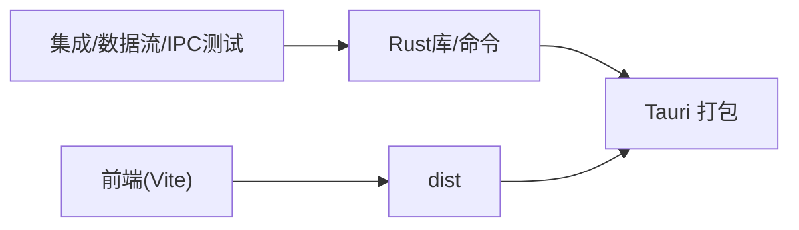

# CI/CD流水线

<cite>
**本文引用的文件**
- [package.json](file://package.json)
- [vite.config.ts](file://vite.config.ts)
- [src-tauri/tauri.conf.json](file://src-tauri/tauri.conf.json)
- [src-tauri/Cargo.toml](file://src-tauri/Cargo.toml)
- [src-tauri/tests/integration_test.rs](file://src-tauri/tests/integration_test.rs)
- [src-tauri/tests/dataflow_tests.rs](file://src-tauri/tests/dataflow_tests.rs)
- [src-tauri/tests/ipc_contract_tests.rs](file://src-tauri/tests/ipc_contract_tests.rs)
- [.eslintrc.json](file://.eslintrc.json)
- [README.md](file://README.md)
</cite>

## 目录
1. [简介](#简介)
2. [项目结构](#项目结构)
3. [核心组件](#核心组件)
4. [架构总览](#架构总览)
5. [详细组件分析](#详细组件分析)
6. [依赖关系分析](#依赖关系分析)
7. [性能考虑](#性能考虑)
8. [故障排查指南](#故障排查指南)
9. [结论](#结论)
10. [附录](#附录)

## 简介
本指南面向NoteForge项目的CI/CD流水线落地，目标是基于现有仓库能力，设计一套覆盖多平台构建、并行任务、条件触发、自动化测试（前端、后端、IPC合同）、版本与标签策略、构建缓存与产物上传、代码质量与安全扫描、发布自动化（应用商店与下载链接更新）、监控与通知的完整DevOps方案。文档同时提供可操作的实施步骤与运维最佳实践。

## 项目结构
NoteForge采用“前端React + Tauri桌面框架 + Rust后端”的混合架构，构建链路由Vite与Tauri CLI驱动，Rust侧通过Cargo管理依赖与测试。关键配置文件如下：
- 前端与构建：package.json、vite.config.ts
- 桌面打包：src-tauri/tauri.conf.json
- 后端依赖与构建：src-tauri/Cargo.toml
- 测试与验证：src-tauri/tests/*.rs
- 规范与格式化：.eslintrc.json、README.md

图表来源
- [vite.config.ts:1-42](file://vite.config.ts#L1-L42)
- [src-tauri/tauri.conf.json:1-40](file://src-tauri/tauri.conf.json#L1-L40)
- [src-tauri/Cargo.toml:1-40](file://src-tauri/Cargo.toml#L1-L40)
- [src-tauri/tests/integration_test.rs:1-183](file://src-tauri/tests/integration_test.rs#L1-L183)
- [src-tauri/tests/dataflow_tests.rs:1-360](file://src-tauri/tests/dataflow_tests.rs#L1-L360)
- [src-tauri/tests/ipc_contract_tests.rs:1-305](file://src-tauri/tests/ipc_contract_tests.rs#L1-L305)
- [.eslintrc.json:1-26](file://.eslintrc.json#L1-L26)

章节来源
- [README.md:75-112](file://README.md#L75-L112)
- [package.json:1-70](file://package.json#L1-L70)
- [vite.config.ts:1-42](file://vite.config.ts#L1-L42)
- [src-tauri/tauri.conf.json:1-40](file://src-tauri/tauri.conf.json#L1-L40)
- [src-tauri/Cargo.toml:1-40](file://src-tauri/Cargo.toml#L1-L40)

## 核心组件
- 前端构建与校验
  - Vite配置定义别名、环境变量前缀、构建目标与分包策略，有助于并行与缓存优化。
  - package.json脚本提供开发、构建、预览、lint、format等命令。
- 桌面打包与分发
  - tauri.conf.json声明产品名称、版本、开发/构建前置命令、前端产物位置、窗口与安全策略、打包目标为all。
- Rust后端与测试
  - Cargo.toml定义依赖与库类型；tests目录包含集成测试、数据流测试、IPC合同测试，覆盖数据库、知识引擎、加密、工作区、笔记、标签、链接、向量索引等关键路径。
- 代码质量与格式化
  - .eslintrc.json启用TypeScript、React、Hooks规则，并忽略部分模式。

章节来源
- [vite.config.ts:1-42](file://vite.config.ts#L1-L42)
- [package.json:7-16](file://package.json#L7-L16)
- [src-tauri/tauri.conf.json:6-11](file://src-tauri/tauri.conf.json#L6-L11)
- [src-tauri/Cargo.toml:1-40](file://src-tauri/Cargo.toml#L1-L40)
- [.eslintrc.json:1-26](file://.eslintrc.json#L1-L26)

## 架构总览
下图展示从代码提交到构建产物与发布的端到端流程，包括多平台矩阵、并行任务、条件触发、测试与质量门禁、产物上传与发布。

## 详细组件分析

### 多平台构建矩阵与并行任务
- 平台矩阵
  - 利用tauri.conf.json的targets=all，可在一次工作流中对Windows、macOS、Linux进行打包。
  - 建议在CI中按平台拆分作业，实现并行构建与缓存复用。
- 并行任务
  - 前端构建与后端构建可并行执行，缩短总时长。
  - 建议将“格式化/静态检查”与“测试”作为独立阶段，失败快速返回。
- 缓存优化
  - pnpm缓存：利用GITHUB_WORKSPACE/.pnpm-store，提升依赖安装速度。
  - Rust缓存：缓存target与Cargo registry/registry index，减少编译时间。
  - Vite缓存：缓存node_modules与构建中间产物，结合增量构建。

章节来源
- [src-tauri/tauri.conf.json:31-38](file://src-tauri/tauri.conf.json#L31-L38)
- [package.json:7-16](file://package.json#L7-L16)
- [vite.config.ts:19-40](file://vite.config.ts#L19-L40)

### 条件触发机制
- 分支策略
  - main/master：触发发布构建与应用商店上传。
  - develop/feature/*：触发全量测试与构建，但不发布。
  - pull_request：触发轻量测试与格式化检查。
- 标签策略
  - 语义化版本：遵循X.Y.Z，主版本号用于破坏性变更，次版本号用于新增功能，修订号用于修复。
  - 标签触发：打tag(vX.Y.Z)后触发发布作业，自动更新下载链接与变更日志。
- PR类型
  - 文档/样式/测试变更：跳过发布相关步骤，仅运行必要测试。

章节来源
- [README.md:126-138](file://README.md#L126-L138)
- [src-tauri/Cargo.toml:1-4](file://src-tauri/Cargo.toml#L1-L4)

### 自动化测试流程集成
- 前端测试
  - 在CI中添加ESLint与Prettier检查，确保代码风格一致。
  - 如有前端测试，建议在并行阶段执行。
- 后端测试
  - Cargo测试：在Rust作业中执行cargo test，覆盖integration_test.rs、dataflow_tests.rs、ipc_contract_tests.rs。
- IPC合同测试
  - 通过ipc_contract_tests.rs验证命令层契约，确保前后端接口一致性。

图表来源
- [src-tauri/tests/integration_test.rs:1-183](file://src-tauri/tests/integration_test.rs#L1-L183)
- [src-tauri/tests/dataflow_tests.rs:1-360](file://src-tauri/tests/dataflow_tests.rs#L1-L360)
- [src-tauri/tests/ipc_contract_tests.rs:1-305](file://src-tauri/tests/ipc_contract_tests.rs#L1-L305)
- [.eslintrc.json:1-26](file://.eslintrc.json#L1-L26)

章节来源
- [.eslintrc.json:1-26](file://.eslintrc.json#L1-L26)
- [src-tauri/tests/integration_test.rs:1-183](file://src-tauri/tests/integration_test.rs#L1-L183)
- [src-tauri/tests/dataflow_tests.rs:1-360](file://src-tauri/tests/dataflow_tests.rs#L1-L360)
- [src-tauri/tests/ipc_contract_tests.rs:1-305](file://src-tauri/tests/ipc_contract_tests.rs#L1-L305)

### 版本管理与标签策略
- 版本来源
  - 前端与Tauri配置均包含version字段，建议统一由CI在发布时注入。
- 语义化版本
  - 主版本：破坏性变更；次版本：新功能；修订：修复。
- 标签与分支
  - develop：集成与测试；main：稳定发布；feature/*：功能开发；hotfix/*：紧急修复。
  - 打tag触发发布，自动更新下载链接与发布说明。

章节来源
- [package.json:4](file://package.json#L4)
- [src-tauri/tauri.conf.json:4](file://src-tauri/tauri.conf.json#L4)
- [src-tauri/Cargo.toml:3](file://src-tauri/Cargo.toml#L3)

### 自动化构建与打包
- 前端构建
  - 使用Vite构建，输出至dist；tauri.conf.json指定frontendDist。
- 后端构建
  - 使用Tauri CLI调用Rust构建，生成跨平台包。
- 产物上传
  - 将dist与各平台安装包上传为Artifacts，供发布阶段使用。

章节来源
- [vite.config.ts:19-40](file://vite.config.ts#L19-L40)
- [src-tauri/tauri.conf.json:6-11](file://src-tauri/tauri.conf.json#L6-L11)

### 代码质量检查与安全扫描
- 代码规范
  - ESLint与Prettier在CI中执行，失败即阻断后续流程。
- 安全扫描
  - 建议在Rust侧增加cargo audit，在前端增加npm audit或类似工具。
  - 对第三方依赖定期扫描，发现高危漏洞及时升级。

章节来源
- [.eslintrc.json:1-26](file://.eslintrc.json#L1-L26)
- [src-tauri/Cargo.toml:1-40](file://src-tauri/Cargo.toml#L1-L40)

### 发布流程自动化
- 应用商店发布
  - 根据平台与签名配置，自动上传Windows/macOS/Linux包。
- 下载链接更新
  - 发布后更新README或站点页面的下载链接，指向最新版本。
- 变更日志
  - 自动生成或合并PR描述中的变更摘要，形成发布说明。

章节来源
- [src-tauri/tauri.conf.json:31-38](file://src-tauri/tauri.conf.json#L31-L38)
- [README.md:126-138](file://README.md#L126-L138)

### 监控与通知机制
- 构建状态通知
  - 成功/失败通过Slack、Teams或邮件通知。
- 失败告警
  - 对测试失败、构建失败、安全扫描告警设置分级告警。
- 日志与Artifacts
  - 保留构建日志与Artifacts，便于回溯与审计。

## 依赖关系分析
- 前端依赖于Vite与React生态；构建产物被Tauri消费。
- Rust后端提供库与命令实现，被Tauri桥接到前端。
- 测试覆盖数据库、知识引擎、加密、工作区、笔记、标签、链接、向量索引等核心模块。

图表来源
- [vite.config.ts:1-42](file://vite.config.ts#L1-L42)
- [src-tauri/Cargo.toml:1-40](file://src-tauri/Cargo.toml#L1-L40)
- [src-tauri/tests/integration_test.rs:1-183](file://src-tauri/tests/integration_test.rs#L1-L183)
- [src-tauri/tests/dataflow_tests.rs:1-360](file://src-tauri/tests/dataflow_tests.rs#L1-L360)
- [src-tauri/tests/ipc_contract_tests.rs:1-305](file://src-tauri/tests/ipc_contract_tests.rs#L1-L305)

章节来源
- [vite.config.ts:1-42](file://vite.config.ts#L1-L42)
- [src-tauri/Cargo.toml:1-40](file://src-tauri/Cargo.toml#L1-L40)
- [src-tauri/tests/integration_test.rs:1-183](file://src-tauri/tests/integration_test.rs#L1-L183)
- [src-tauri/tests/dataflow_tests.rs:1-360](file://src-tauri/tests/dataflow_tests.rs#L1-L360)
- [src-tauri/tests/ipc_contract_tests.rs:1-305](file://src-tauri/tests/ipc_contract_tests.rs#L1-L305)

## 性能考虑
- 并行化
  - 前端与后端构建并行；测试阶段按模块拆分。
- 缓存
  - pnpm、Cargo、Vite分别缓存，显著降低重复构建时间。
- 分包与懒加载
  - Vite manualChunks策略已对Monaco、Milkdown、Radix等大包进行拆分，有利于并行与缓存命中。

章节来源
- [vite.config.ts:24-39](file://vite.config.ts#L24-L39)

## 故障排查指南
- 构建失败
  - 检查Vite与Tauri配置是否匹配；确认dist路径与frontendDist一致。
- 测试失败
  - 查看integration_test.rs、dataflow_tests.rs、ipc_contract_tests.rs的失败用例定位问题。
- 依赖问题
  - 清理pnpm-store与Cargo缓存，重新安装依赖。
- 通知未达
  - 检查通知服务凭据与网络连通性。

章节来源
- [src-tauri/tauri.conf.json:6-11](file://src-tauri/tauri.conf.json#L6-L11)
- [src-tauri/tests/integration_test.rs:1-183](file://src-tauri/tests/integration_test.rs#L1-L183)
- [src-tauri/tests/dataflow_tests.rs:1-360](file://src-tauri/tests/dataflow_tests.rs#L1-L360)
- [src-tauri/tests/ipc_contract_tests.rs:1-305](file://src-tauri/tests/ipc_contract_tests.rs#L1-L305)

## 结论
通过将现有前端构建、后端测试与Tauri打包能力与CI/CD最佳实践结合，NoteForge可实现跨平台并行构建、严格的质量门禁、自动化发布与可观测性。建议尽快落地上述工作流与策略，持续迭代以提升交付效率与质量。

## 附录
- 快速清单
  - 设置平台矩阵与并行作业
  - 配置pnpm与Cargo缓存
  - 添加ESLint/Prettier与cargo audit
  - 基于分支/标签策略触发发布
  - 配置通知与失败告警
  - 上传Artifacts并更新下载链接