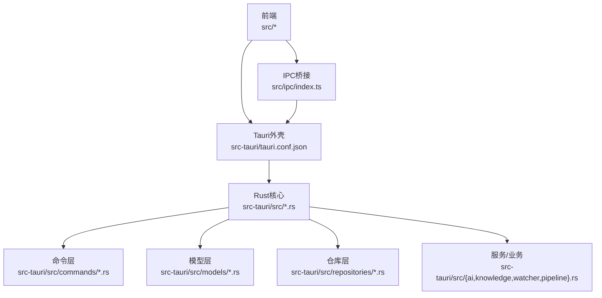
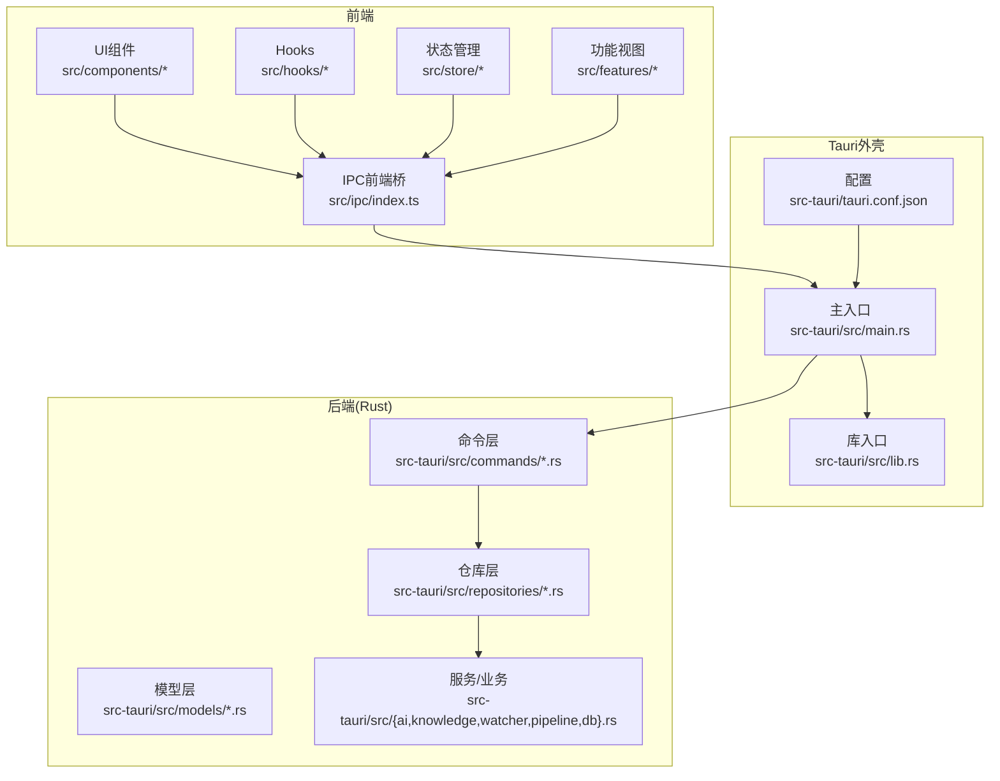
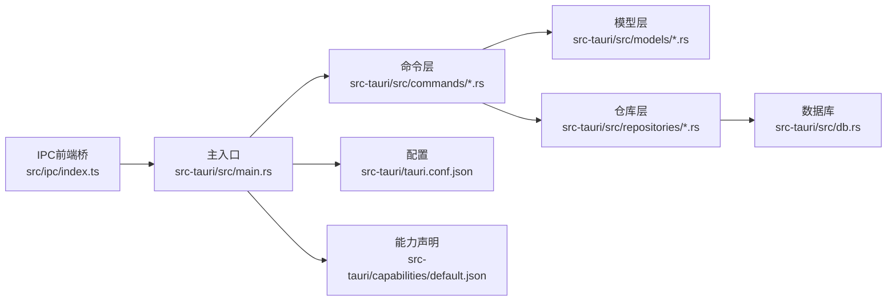

# 平台部署

<cite>
**本文引用的文件**
- [package.json](file://package.json)
- [src-tauri/tauri.conf.json](file://src-tauri/tauri.conf.json)
- [src-tauri/Cargo.toml](file://src-tauri/Cargo.toml)
- [src-tauri/build.rs](file://src-tauri/build.rs)
- [src-tauri/src/main.rs](file://src-tauri/src/main.rs)
- [src-tauri/capabilities/default.json](file://src-tauri/capabilities/default.json)
- [src-tauri/gen/schemas/capabilities.json](file://src-tauri/gen/schemas/capabilities.json)
- [src-tauri/gen/schemas/desktop-schema.json](file://src-tauri/gen/schemas/desktop-schema.json)
- [src-tauri/gen/schemas/macOS-schema.json](file://src-tauri/gen/schemas/macOS-schema.json)
- [src-tauri/src/commands/mod.rs](file://src-tauri/src/commands/mod.rs)
- [src-tauri/src/commands/file.rs](file://src-tauri/src/commands/file.rs)
- [src-tauri/src/commands/workspace.rs](file://src-tauri/src/commands/workspace.rs)
- [src-tauri/src/commands/editor.rs](file://src-tauri/src/commands/editor.rs)
- [src-tauri/src/commands/config.rs](file://src-tauri/src/commands/config.rs)
- [src-tauri/src/models/mod.rs](file://src-tauri/src/models/mod.rs)
- [src-tauri/src/models/file.rs](file://src-tauri/src/models/file.rs)
- [src-tauri/src/models/workspace.rs](file://src-tauri/src/models/workspace.rs)
- [src-tauri/src/models/editor.rs](file://src-tauri/src/models/editor.rs)
- [src-tauri/src/models/config.rs](file://src-tauri/src/models/config.rs)
- [src-tauri/src/repositories/mod.rs](file://src-tauri/src/repositories/mod.rs)
- [src-tauri/src/repositories/note_repo.rs](file://src-tauri/src/repositories/note_repo.rs)
- [src-tauri/src/repositories/tag_repo.rs](file://src-tauri/src/repositories/tag_repo.rs)
- [src-tauri/src/repositories/link_repo.rs](file://src-tauri/src/repositories/link_repo.rs)
- [src-tauri/src/repositories/embedding_repo.rs](file://src-tauri/src/repositories/embedding_repo.rs)
- [src-tauri/src/repositories/workspace_repo.rs](file://src-tauri/src/repositories/workspace_repo.rs)
- [src-tauri/src/watcher.rs](file://src-tauri/src/watcher.rs)
- [src-tauri/src/db.rs](file://src-tauri/src/db.rs)
- [src-tauri/src/lib.rs](file://src-tauri/src/lib.rs)
- [src-tauri/src/config.rs](file://src-tauri/src/config.rs)
- [src-tauri/src/encryption.rs](file://src-tauri/src/encryption.rs)
- [src-tauri/src/vector.rs](file://src-tauri/src/vector.rs)
- [src-tauri/src/pipeline.rs](file://src-tauri/src/pipeline.rs)
- [src-tauri/src/error.rs](file://src-tauri/src/error.rs)
- [src-tauri/src/ai.rs](file://src-tauri/src/ai.rs)
- [src-tauri/src/scratch.rs](file://src-tauri/src/scratch.rs)
- [src-tauri/src/knowledge.rs](file://src-tauri/src/knowledge.rs)
- [src-tauri/src/workbench_session.rs](file://src-tauri/src/workbench_session.rs)
- [src-tauri/src/workspace_draft.rs](file://src-tauri/src/workspace_draft.rs)
- [src-tauri/tests/integration_test.rs](file://src-tauri/tests/integration_test.rs)
- [src-tauri/tests/ipc_contract_tests.rs](file://src-tauri/tests/ipc_contract_tests.rs)
- [src-tauri/tests/dataflow_tests.rs](file://src-tauri/tests/dataflow_tests.rs)
- [src/main.tsx](file://src/main.tsx)
- [src/App.tsx](file://src/App.tsx)
- [src/core/platform/config.ts](file://src/core/platform/config.ts)
- [src/core/platform/event-bus.ts](file://src/core/platform/event-bus.ts)
- [src/core/dialog/dialog-service.impl.ts](file://src/core/dialog/dialog-service.impl.ts)
- [src/components/dialogs/SettingsDialog.tsx](file://src/components/dialogs/SettingsDialog.tsx)
- [src/components/dialogs/ImportWizardDialog.tsx](file://src/components/dialogs/ImportWizardDialog.tsx)
- [src/components/sidebar/FileTree.tsx](file://src/components/sidebar/FileTree.tsx)
- [src/components/editor/MonacoEditor.tsx](file://src/components/editor/MonacoEditor.tsx)
- [src/components/right/RightPanel.tsx](file://src/components/right/RightPanel.tsx)
- [src/hooks/useShortcuts.ts](file://src/hooks/useShortcuts.ts)
- [src/lib/app-startup.ts](file://src/lib/app-startup.ts)
- [src/lib/utils.ts](file://src/lib/utils.ts)
- [src/store/ui.ts](file://src/store/ui.ts)
- [src/store/theme.ts](file://src/store/theme.ts)
- [src/store/workspace.ts](file://src/store/workspace.ts)
- [src/store/editor.ts](file://src/store/editor.ts)
- [src/store/ai.ts](file://src/store/ai.ts)
- [src/store/startup.ts](file://src/store/startup.ts)
- [src/store/theme.ts](file://src/store/theme.ts)
- [src/core/document/service.ts](file://src/core/document/service.ts)
- [src/core/document/types.ts](file://src/core/document/types.ts)
- [src/core/document/utils.ts](file://src/core/document/utils.ts)
- [src/core/vault/service.ts](file://src/core/vault/service.ts)
- [src/core/vault/types.ts](file://src/core/vault/types.ts)
- [src/core/vault/vault-service.impl.ts](file://src/core/vault/vault-service.impl.ts)
- [src/core/vault/vault-watch.ts](file://src/core/vault/vault-watch.ts)
- [src/core/workbench/service.ts](file://src/core/workbench/service.ts)
- [src/core/workbench/types.ts](file://src/core/workbench/types.ts)
- [src/core/workbench/workbench-service.impl.ts](file://src/core/workbench/workbench-service.impl.ts)
- [src/core/session/tab-lifecycle.ts](file://src/core/session/tab-lifecycle.ts)
- [src/core/session/workspace-draft-autosave.ts](file://src/core/session/workspace-draft-autosave.ts)
- [src/core/session/scratch-autosave.ts](file://src/core/session/scratch-autosave.ts)
- [src/core/command/command-registry.impl.ts](file://src/core/command/command-registry.impl.ts)
- [src/core/command/keybinding.ts](file://src/core/command/keybinding.ts)
- [src/core/command/context.ts](file://src/core/command/context.ts)
- [src/core/command/types.ts](file://src/core/command/types.ts)
- [src/core/dialog/dialog-api.ts](file://src/core/dialog/dialog-api.ts)
- [src/core/dialog/dialog-store.ts](file://src/core/dialog/dialog-store.ts)
- [src/core/dialog/draft-prompt.ts](file://src/core/dialog/draft-prompt.ts)
- [src/core/events.ts](file://src/core/events.ts)
- [src/core/runtime.ts](file://src/core/runtime.ts)
- [src/core/invariants.ts](file://src/core/invariants.ts)
- [src/core/index.ts](file://src/core/index.ts)
- [src/features/graph/GraphView.tsx](file://src/features/graph/GraphView.tsx)
- [src/features/json-yaml/TreeView.tsx](file://src/features/json-yaml/TreeView.tsx)
- [src/features/markdown/MarkdownPanel.tsx](file://src/features/markdown/MarkdownPanel.tsx)
- [src/features/welcome/WelcomeView.tsx](file://src/features/welcome/WelcomeView.tsx)
- [src/features/ai/AIPanel.tsx](file://src/features/ai/AIPanel.tsx)
- [src/ipc/index.ts](file://src/ipc/index.ts)
- [src/ipc/stub.ts](file://src/ipc/stub.ts)
- [README.md](file://README.md)
</cite>

## 目录
1. [简介](#简介)
2. [项目结构](#项目结构)
3. [核心组件](#核心组件)
4. [架构总览](#架构总览)
5. [详细组件分析](#详细组件分析)
6. [依赖关系分析](#依赖关系分析)
7. [性能考虑](#性能考虑)
8. [故障排查指南](#故障排查指南)
9. [结论](#结论)
10. [附录](#附录)

## 简介
本指南面向NoteForge的多平台部署与发布，基于当前仓库中的Tauri配置与Rust后端实现，系统梳理Windows（MSI/Store）、macOS（.app/Notarization/Mac App Store）与Linux（DEB/RPM/Snap/Flatpak/AppImage）的部署要点、权限与沙盒配置、安装包优化与用户体验提升、兼容性测试与问题排查，并给出分发渠道选择策略与最佳实践。

## 项目结构
NoteForge采用前端React/Vite与后端Tauri/Rust的混合架构。前端位于src目录，后端位于src-tauri目录；应用通过Tauri配置文件统一管理平台能力、菜单、窗口、安全策略等；Rust模块化组织命令、模型、仓库层与业务逻辑；测试覆盖集成测试、IPC契约测试与数据流测试。

图表来源
- [src-tauri/tauri.conf.json](file://src-tauri/tauri.conf.json)
- [src-tauri/src/main.rs](file://src-tauri/src/main.rs)
- [src-tauri/src/commands/mod.rs](file://src-tauri/src/commands/mod.rs)
- [src-tauri/src/models/mod.rs](file://src-tauri/src/models/mod.rs)
- [src-tauri/src/repositories/mod.rs](file://src-tauri/src/repositories/mod.rs)
- [src/ipc/index.ts](file://src/ipc/index.ts)

章节来源
- [package.json](file://package.json)
- [src-tauri/tauri.conf.json](file://src-tauri/tauri.conf.json)
- [src-tauri/src/main.rs](file://src-tauri/src/main.rs)
- [src-tauri/src/lib.rs](file://src-tauri/src/lib.rs)

## 核心组件
- 应用入口与生命周期：前端入口在src/main.tsx与src/App.tsx，后端入口在src-tauri/src/main.rs；平台配置与事件总线分别在src/core/platform/config.ts与src/core/platform/event-bus.ts中定义。
- 命令与IPC：前端通过src/ipc/index.ts调用后端命令，命令注册在src-tauri/src/commands/mod.rs中，具体命令如文件、工作区、编辑器、配置等。
- 数据与存储：数据库初始化在src-tauri/src/db.rs，文件/笔记/标签/链接/嵌入向量等模型在src-tauri/src/models下，仓库层封装持久化操作。
- 业务服务：AI、知识图谱、文件监听、向量检索、工作台会话与草稿等功能在对应Rust模块中实现。
- 能力与安全：Tauri能力在src-tauri/capabilities/default.json与生成的schemas中声明，用于控制窗口、菜单、对话框、系统托盘等平台能力。

章节来源
- [src/main.tsx](file://src/main.tsx)
- [src/App.tsx](file://src/App.tsx)
- [src-tauri/src/main.rs](file://src-tauri/src/main.rs)
- [src-tauri/src/commands/mod.rs](file://src-tauri/src/commands/mod.rs)
- [src-tauri/src/models/mod.rs](file://src-tauri/src/models/mod.rs)
- [src-tauri/src/repositories/mod.rs](file://src-tauri/src/repositories/mod.rs)
- [src-tauri/src/db.rs](file://src-tauri/src/db.rs)
- [src-tauri/capabilities/default.json](file://src-tauri/capabilities/default.json)
- [src-tauri/gen/schemas/capabilities.json](file://src-tauri/gen/schemas/capabilities.json)

## 架构总览
NoteForge的桌面应用由前端React/Vite与Tauri外壳组成，后端以Rust实现命令、模型与仓库层，通过IPC进行通信。Tauri配置集中管理平台能力、菜单、窗口、系统托盘、安全策略与更新机制。

图表来源
- [src-tauri/tauri.conf.json](file://src-tauri/tauri.conf.json)
- [src-tauri/src/main.rs](file://src-tauri/src/main.rs)
- [src-tauri/src/lib.rs](file://src-tauri/src/lib.rs)
- [src-tauri/src/commands/mod.rs](file://src-tauri/src/commands/mod.rs)
- [src-tauri/src/models/mod.rs](file://src-tauri/src/models/mod.rs)
- [src-tauri/src/repositories/mod.rs](file://src-tauri/src/repositories/mod.rs)
- [src/ipc/index.ts](file://src/ipc/index.ts)

## 详细组件分析

### Windows 部署策略
- 安装包与打包
  - 使用Tauri的Windows打包能力生成MSI安装包。在Tauri配置中启用Windows特定设置，如安装路径、开始菜单快捷方式、卸载项等。
  - 可结合脚本或CI流程自动化打包，确保版本号与构建元数据一致。
- 代码签名
  - 为可执行文件与安装包配置代码签名证书，确保Windows SmartScreen与杀毒软件不过滤应用。
  - 在CI中安全存储证书与密码，使用Tauri签名参数完成签名。
- Windows Store发布
  - 准备应用清单、图标、截图与隐私政策链接。
  - 提交前确保已通过代码签名与合规检查；遵循Microsoft Store审核规范，避免敏感权限滥用。
- 权限与沙盒
  - 默认关闭不必要的系统权限；仅授予文件系统访问、网络访问等最小必要权限。
  - 对于需要管理员权限的操作，提供明确用户引导与权限提示。
- 用户体验
  - 提供静默安装选项与自定义安装路径；支持卸载清理残留文件。
  - 首次启动引导与帮助文档入口，减少用户学习成本。

章节来源
- [src-tauri/tauri.conf.json](file://src-tauri/tauri.conf.json)

### macOS 部署策略
- .app 包构建
  - 使用Tauri生成.app包，配置Info.plist字段（CFBundleIdentifier、CFBundleVersion、NSHumanReadableCopyright等）。
  - 图标资源放置于src-tauri/icons，确保1024x1024 PNG符合Apple要求。
- Notarization 与公证
  - 为.app包与DMG镜像申请Apple Notarization，提交时附带签名后的可执行文件与公证请求。
  - 在CI中配置Apple ID凭据与Notary Tool，自动完成公证与 stapling。
- Mac App Store 审核准备
  - 准备应用描述、截图、隐私标签与数据使用说明。
  - 确保无违禁API使用、无暗中收集用户数据的行为；遵守App Store审核指南。
- 权限与沙盒
  - 启用沙盒模式，按需声明文件系统访问（可选目录选取器）、网络访问与辅助功能权限。
  - 避免请求全磁盘访问；对文档读写使用Security-Scoped Bookmarks或目录选取器。
- 用户体验
  - 支持Dock与Finder集成；提供“打开方式”与关联文档类型。
  - 首次运行欢迎页与导入向导，帮助用户快速上手。

章节来源
- [src-tauri/tauri.conf.json](file://src-tauri/tauri.conf.json)
- [src-tauri/gen/schemas/macOS-schema.json](file://src-tauri/gen/schemas/macOS-schema.json)

### Linux 部署选项
- DEB/RPM 包
  - 使用Tauri的Linux打包能力生成DEB或RPM包；配置依赖、图标、桌面文件与权限。
  - 在发行版仓库中维护包，确保依赖版本与系统兼容。
- Snap/Flatpak 分发
  - Snap：编写snapcraft.yaml，声明接口权限（home、 removable-media等），使用classic或strict沙盒模式。
  - Flatpak：编写org.example.NoteForge.yml，声明Portal权限与文件访问范围。
- AppImage 打包
  - 使用linuxdeploy与插件生成AppImage，内置图标、桌面文件与权限声明。
  - 适合个人发布与便携场景，便于用户直接下载运行。
- 权限与沙盒
  - Snap/Flatpak：严格限制权限，按需申请Portal；避免请求全局系统权限。
  - AppImage：遵循XDG规范，避免写入系统受保护目录。
- 用户体验
  - 提供桌面文件与MIME关联；支持从文件管理器右键打开。
  - 提供更新机制（Snap/Flatpak自动更新，DEB/RPM通过仓库更新）。

章节来源
- [src-tauri/tauri.conf.json](file://src-tauri/tauri.conf.json)
- [src-tauri/gen/schemas/desktop-schema.json](file://src-tauri/gen/schemas/desktop-schema.json)

### 平台特定权限与安全要求
- Windows
  - 最小权限原则；对文件/注册表/设备访问使用UAC提示与明确授权。
  - 安装包与签名证书需有效且与应用标识匹配。
- macOS
  - Sandboxing与公证；隐私敏感权限（麦克风/摄像头/辅助功能）需在Info.plist中声明用途。
  - 不得使用私有API；避免后台常驻与无意义的通知。
- Linux
  - Snap/Flatpak：通过接口与Portal授权；避免硬编码绝对路径。
  - AppImage：遵循XDG用户目录规范，避免写入系统目录。

章节来源
- [src-tauri/capabilities/default.json](file://src-tauri/capabilities/default.json)
- [src-tauri/gen/schemas/capabilities.json](file://src-tauri/gen/schemas/capabilities.json)

### 安装包优化与用户体验
- 启动速度
  - 延迟加载非关键模块；预编译静态资源；减少首屏渲染阻塞。
- 文件体积
  - 移除调试符号与未使用资源；启用压缩与按需加载。
- 更新与回滚
  - 集成Tauri Updater；提供增量更新与失败回滚策略。
- 引导与帮助
  - 首次启动向导、快捷键提示、常见问题入口与反馈渠道。

章节来源
- [src-tauri/tauri.conf.json](file://src-tauri/tauri.conf.json)
- [src/core/platform/config.ts](file://src/core/platform/config.ts)

### 兼容性测试与问题排查
- 测试矩阵
  - Windows：Win10/11、不同语言区域、UAC策略差异。
  - macOS：不同版本（Big Sur/Monterey/ventura等）、Rosetta与原生架构。
  - Linux：Ubuntu/Fedora/opensuse等主流发行版，Snap/Flatpak沙盒隔离。
- 常见问题
  - Windows：SmartScreen拦截、杀软误报、路径过长、权限不足。
  - macOS：未公证导致无法打开、沙盒拒绝访问、隐私权限未授予。
  - Linux：缺少依赖、权限不足、桌面文件未生效、Flatpak/Snap权限不足。
- 排查步骤
  - 检查日志输出与错误弹窗；确认签名与公证状态；验证能力配置与权限声明；在目标平台复现问题并记录环境信息。

章节来源
- [src-tauri/tests/integration_test.rs](file://src-tauri/tests/integration_test.rs)
- [src-tauri/tests/ipc_contract_tests.rs](file://src-tauri/tests/ipc_contract_tests.rs)
- [src-tauri/tests/dataflow_tests.rs](file://src-tauri/tests/dataflow_tests.rs)
- [src-tauri/src/error.rs](file://src-tauri/src/error.rs)

### 分发渠道选择策略
- 自建渠道（官网/镜像）
  - 优点：可控性强、更新及时、无平台限制；缺点：推广与维护成本高。
- 第三方商店
  - Windows：Microsoft Store（审核严格但流量稳定）。
  - macOS：Mac App Store（审核严格、受众广泛）。
  - Linux：Snap Store/Flathub（生态完善、自动更新）。
- 混合策略
  - 主推一个渠道作为官方发布点，同时提供其他渠道以覆盖更多用户群体。

章节来源
- [src-tauri/tauri.conf.json](file://src-tauri/tauri.conf.json)

## 依赖关系分析
NoteForge的依赖关系围绕Tauri配置展开：前端通过IPC调用后端命令，命令层依赖模型与仓库层，仓库层连接数据库与文件系统；能力与安全策略在配置中集中管理。

图表来源
- [src-tauri/tauri.conf.json](file://src-tauri/tauri.conf.json)
- [src-tauri/src/commands/mod.rs](file://src-tauri/src/commands/mod.rs)
- [src-tauri/src/models/mod.rs](file://src-tauri/src/models/mod.rs)
- [src-tauri/src/repositories/mod.rs](file://src-tauri/src/repositories/mod.rs)
- [src-tauri/src/db.rs](file://src-tauri/src/db.rs)
- [src-tauri/capabilities/default.json](file://src-tauri/capabilities/default.json)
- [src/ipc/index.ts](file://src/ipc/index.ts)

章节来源
- [src-tauri/src/commands/mod.rs](file://src-tauri/src/commands/mod.rs)
- [src-tauri/src/models/mod.rs](file://src-tauri/src/models/mod.rs)
- [src-tauri/src/repositories/mod.rs](file://src-tauri/src/repositories/mod.rs)
- [src-tauri/src/db.rs](file://src-tauri/src/db.rs)
- [src-tauri/tauri.conf.json](file://src-tauri/tauri.conf.json)

## 性能考虑
- 启动时间
  - 将非关键模块延迟加载；预热常用资源；避免在主线程执行重IO。
- 内存占用
  - 控制并发任务数量；及时释放未使用的资源；使用对象池与懒加载。
- 磁盘与网络
  - 合理缓存策略；批量写入；压缩传输；断点续传。
- 渲染性能
  - React组件按需渲染；Monaco编辑器启用Web Workers；避免强制同步布局。

章节来源
- [src-tauri/src/watcher.rs](file://src-tauri/src/watcher.rs)
- [src-tauri/src/pipeline.rs](file://src-tauri/src/pipeline.rs)
- [src-tauri/src/vector.rs](file://src-tauri/src/vector.rs)
- [src-tauri/src/db.rs](file://src-tauri/src/db.rs)

## 故障排查指南
- 日志与错误处理
  - 统一错误类型与消息格式；在Rust侧定义错误枚举并在前端展示友好提示。
- IPC契约
  - 前后端约定一致的命令名称、参数与返回值；在测试中校验契约一致性。
- 集成测试
  - 覆盖关键业务流程与边界条件；模拟异常场景与网络中断。
- 平台特定问题
  - Windows：检查UAC与防病毒软件；确认路径与权限。
  - macOS：确认公证与沙盒；检查隐私权限与辅助功能。
  - Linux：确认依赖与权限；检查桌面文件与权限。

章节来源
- [src-tauri/src/error.rs](file://src-tauri/src/error.rs)
- [src-tauri/tests/ipc_contract_tests.rs](file://src-tauri/tests/ipc_contract_tests.rs)
- [src-tauri/tests/integration_test.rs](file://src-tauri/tests/integration_test.rs)
- [src-tauri/tests/dataflow_tests.rs](file://src-tauri/tests/dataflow_tests.rs)

## 结论
NoteForge具备良好的跨平台基础：前端现代化、后端模块化、配置集中化。按照本指南在各平台完成打包、签名、公证与分发，结合严格的权限与沙盒策略、完善的测试与排错流程，可显著提升用户体验与发布成功率。建议优先在目标平台完成本地验证，再进入商店审核或第三方渠道发布。

## 附录
- 快速检查清单
  - Windows：MSI签名、SmartScreen缓解、卸载项、开始菜单快捷方式。
  - macOS：.app签名与公证、沙盒与隐私权限、App Store审核材料。
  - Linux：DEB/RPM依赖、Snap/Flatpak接口、AppImage桌面文件。
- CI/CD建议
  - 分平台流水线分离；密钥与证书安全存储；自动化测试与打包；发布制品归档。