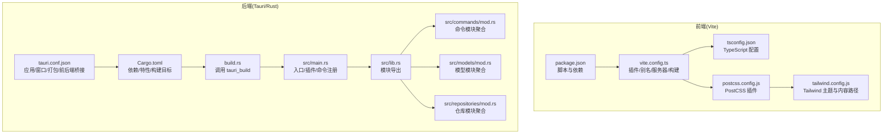
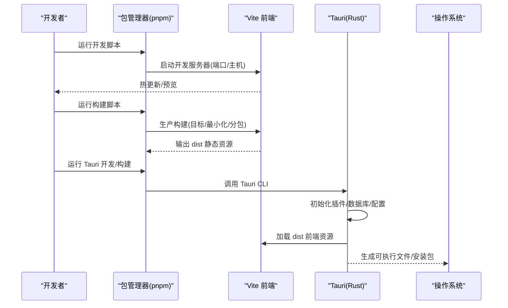
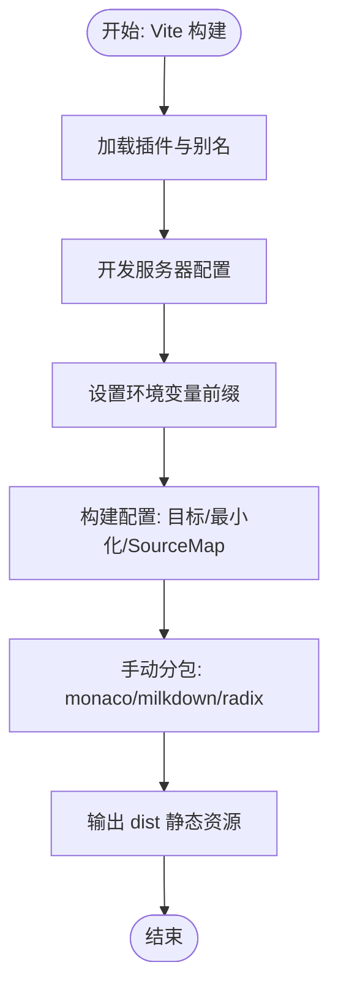
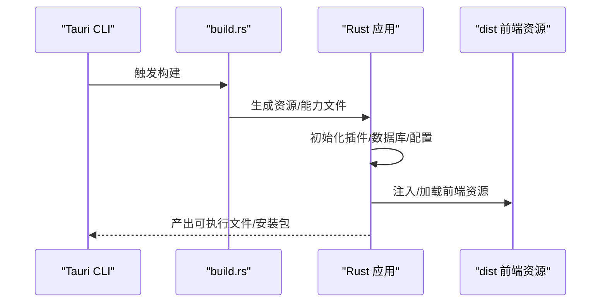
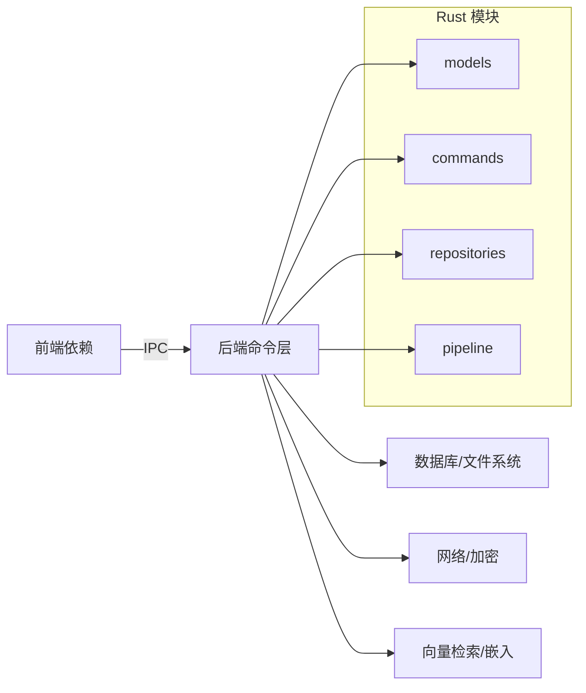

# 构建流程

<cite>
**本文引用的文件**
- [package.json](file://package.json)
- [vite.config.ts](file://vite.config.ts)
- [tsconfig.json](file://tsconfig.json)
- [postcss.config.js](file://postcss.config.js)
- [tailwind.config.js](file://tailwind.config.js)
- [src-tauri/Cargo.toml](file://src-tauri/Cargo.toml)
- [src-tauri/tauri.conf.json](file://src-tauri/tauri.conf.json)
- [src-tauri/build.rs](file://src-tauri/build.rs)
- [src-tauri/src/main.rs](file://src-tauri/src/main.rs)
- [src-tauri/src/lib.rs](file://src-tauri/src/lib.rs)
- [src-tauri/src/commands/mod.rs](file://src-tauri/src/commands/mod.rs)
- [src-tauri/src/models/mod.rs](file://src-tauri/src/models/mod.rs)
- [src-tauri/src/repositories/mod.rs](file://src-tauri/src/repositories/mod.rs)
</cite>

## 目录
1. [简介](#简介)
2. [项目结构](#项目结构)
3. [核心组件](#核心组件)
4. [架构总览](#架构总览)
5. [详细组件分析](#详细组件分析)
6. [依赖关系分析](#依赖关系分析)
7. [性能考量](#性能考量)
8. [故障排除指南](#故障排除指南)
9. [结论](#结论)
10. [附录](#附录)

## 简介
本指南面向开发者，系统讲解 NoteForge 的构建流程与配置，覆盖 Vite 前端构建（开发服务器、生产构建、资源打包与代码分割）、Tauri 后端构建（Rust 编译、Cargo 依赖管理、构建脚本）、构建产物组织、性能优化与缓存策略，并给出不同构建模式（开发、生产、调试）的适用场景与排障建议。

## 项目结构
NoteForge 采用“前端 Vite + 后端 Tauri（Rust）”的混合架构：
- 前端位于根目录，通过 Vite 提供开发服务器与生产构建，输出静态资源到 dist 目录。
- 后端位于 src-tauri，使用 Tauri v2 作为桌面应用壳，Rust 作为业务实现语言。
- 构建时，前端先完成构建，再由 Tauri 将 dist 作为应用前端资源打包进最终可执行文件。

图表来源
- [package.json:1-70](file://package.json#L1-L70)
- [vite.config.ts:1-42](file://vite.config.ts#L1-L42)
- [tsconfig.json:1-28](file://tsconfig.json#L1-L28)
- [postcss.config.js:1-7](file://postcss.config.js#L1-L7)
- [tailwind.config.js:1-105](file://tailwind.config.js#L1-L105)
- [src-tauri/tauri.conf.json:1-40](file://src-tauri/tauri.conf.json#L1-L40)
- [src-tauri/Cargo.toml:1-40](file://src-tauri/Cargo.toml#L1-L40)
- [src-tauri/build.rs:1-4](file://src-tauri/build.rs#L1-L4)
- [src-tauri/src/main.rs:1-101](file://src-tauri/src/main.rs#L1-L101)
- [src-tauri/src/lib.rs:1-16](file://src-tauri/src/lib.rs#L1-L16)
- [src-tauri/src/commands/mod.rs:1-13](file://src-tauri/src/commands/mod.rs#L1-L13)
- [src-tauri/src/models/mod.rs:1-28](file://src-tauri/src/models/mod.rs#L1-L28)
- [src-tauri/src/repositories/mod.rs:1-12](file://src-tauri/src/repositories/mod.rs#L1-L12)

章节来源
- [package.json:1-70](file://package.json#L1-L70)
- [vite.config.ts:1-42](file://vite.config.ts#L1-L42)
- [tsconfig.json:1-28](file://tsconfig.json#L1-L28)
- [postcss.config.js:1-7](file://postcss.config.js#L1-L7)
- [tailwind.config.js:1-105](file://tailwind.config.js#L1-L105)
- [src-tauri/tauri.conf.json:1-40](file://src-tauri/tauri.conf.json#L1-L40)
- [src-tauri/Cargo.toml:1-40](file://src-tauri/Cargo.toml#L1-L40)
- [src-tauri/build.rs:1-4](file://src-tauri/build.rs#L1-L4)
- [src-tauri/src/main.rs:1-101](file://src-tauri/src/main.rs#L1-L101)
- [src-tauri/src/lib.rs:1-16](file://src-tauri/src/lib.rs#L1-L16)
- [src-tauri/src/commands/mod.rs:1-13](file://src-tauri/src/commands/mod.rs#L1-L13)
- [src-tauri/src/models/mod.rs:1-28](file://src-tauri/src/models/mod.rs#L1-L28)
- [src-tauri/src/repositories/mod.rs:1-12](file://src-tauri/src/repositories/mod.rs#L1-L12)

## 核心组件
- 前端构建核心：Vite 配置、React 插件、路径别名、开发服务器端口与主机、环境变量前缀、构建目标与最小化、SourceMap、chunkSize 警告阈值、Rollup 手动分包策略。
- TypeScript 编译：严格模式、模块解析、JSX、路径映射与包含/排除范围。
- CSS 工具链：PostCSS（Tailwind、Autoprefixer）。
- 后端构建核心：Tauri 配置（开发/构建命令、前端产物目录、窗口属性、安全策略、打包目标），Rust 依赖与特性，构建脚本调用 tauri_build。
- 应用入口与命令注册：Rust 入口初始化日志、插件、数据库/配置/草稿等子系统，集中注册 IPC 命令。

章节来源
- [vite.config.ts:1-42](file://vite.config.ts#L1-L42)
- [tsconfig.json:1-28](file://tsconfig.json#L1-L28)
- [postcss.config.js:1-7](file://postcss.config.js#L1-L7)
- [tailwind.config.js:1-105](file://tailwind.config.js#L1-L105)
- [src-tauri/tauri.conf.json:1-40](file://src-tauri/tauri.conf.json#L1-L40)
- [src-tauri/Cargo.toml:1-40](file://src-tauri/Cargo.toml#L1-L40)
- [src-tauri/build.rs:1-4](file://src-tauri/build.rs#L1-L4)
- [src-tauri/src/main.rs:1-101](file://src-tauri/src/main.rs#L1-L101)

## 架构总览
下图展示从开发到生产的整体流程：前端 Vite 开发服务器与生产构建，后端 Tauri 在开发与生产模式下的桥接与打包。

图表来源
- [package.json:7-16](file://package.json#L7-L16)
- [vite.config.ts:13-18](file://vite.config.ts#L13-L18)
- [vite.config.ts:19-40](file://vite.config.ts#L19-L40)
- [src-tauri/tauri.conf.json:6-11](file://src-tauri/tauri.conf.json#L6-L11)
- [src-tauri/src/main.rs:6-18](file://src-tauri/src/main.rs#L6-L18)

## 详细组件分析

### Vite 前端构建配置
- 插件与别名
  - 使用 React 插件以支持 JSX 与热更新。
  - 路径别名 @ 指向 src，便于统一导入。
- 开发服务器
  - 固定端口与主机，避免端口冲突；关闭清屏提升日志可读性。
- 环境变量前缀
  - 明确 VITE_ 与 TAURI_ 前缀，确保在前端可见。
- 构建优化
  - 目标为 ESNext，最小化使用 esbuild，禁用 SourceMap 以加速生产构建。
  - 设置较大的 chunkSize 警告阈值，避免小体积警告干扰。
  - Rollup 手动分包策略：将 monaco、milkdown、radix 等大库拆分为独立 chunk，提升缓存命中与并行加载效率。
- TypeScript 集成
  - 与 Vite 协同工作，TypeScript 编译器选项在 tsconfig 中集中配置。

图表来源
- [vite.config.ts:6-11](file://vite.config.ts#L6-L11)
- [vite.config.ts:13-18](file://vite.config.ts#L13-L18)
- [vite.config.ts:19-40](file://vite.config.ts#L19-L40)
- [tsconfig.json:1-28](file://tsconfig.json#L1-L28)

章节来源
- [vite.config.ts:1-42](file://vite.config.ts#L1-L42)
- [tsconfig.json:1-28](file://tsconfig.json#L1-L28)

### Tauri 后端构建流程
- 应用与窗口配置
  - 开发前命令与构建前命令分别指向前端开发与生产构建。
  - 前端开发地址与 dist 目录明确，保证 Tauri 正确加载前端资源。
  - 窗口尺寸、最小尺寸、背景色等 UI 属性集中配置。
- 安全与打包
  - 安全策略中 CSP 为空，允许灵活的前端资源加载。
  - 打包目标为 all，生成多平台安装包。
- Rust 依赖与特性
  - 核心依赖包括 Tauri、Shell/Dialog 插件、序列化、Tokio、SQLite、加密、网络请求、向量检索、文件监控等。
  - 特性启用如 devtools、bundled SQLite、现代 SQLite 等。
- 构建脚本
  - build.rs 调用 tauri_build，驱动资源与能力文件生成。
- 应用入口与命令注册
  - 初始化日志、插件、数据库/配置/草稿/会话等子系统。
  - 集中注册大量 IPC 命令，覆盖工作区、文件、编辑器、知识图谱、AI、搜索、加密、配置、草稿、会话、文件监听等。

图表来源
- [src-tauri/tauri.conf.json:6-11](file://src-tauri/tauri.conf.json#L6-L11)
- [src-tauri/build.rs:1-4](file://src-tauri/build.rs#L1-L4)
- [src-tauri/src/main.rs:6-18](file://src-tauri/src/main.rs#L6-L18)

章节来源
- [src-tauri/tauri.conf.json:1-40](file://src-tauri/tauri.conf.json#L1-L40)
- [src-tauri/Cargo.toml:1-40](file://src-tauri/Cargo.toml#L1-L40)
- [src-tauri/build.rs:1-4](file://src-tauri/build.rs#L1-L4)
- [src-tauri/src/main.rs:1-101](file://src-tauri/src/main.rs#L1-L101)

### 代码分割、懒加载与资源优化
- 代码分割
  - 通过 Vite 的 manualChunks 将 monaco、milkdown、radix 等大库拆分，降低首屏体积并提升缓存复用。
- 懒加载
  - 建议在路由或功能层面采用动态 import 实现按需加载，结合 Vite 的动态导入特性进一步优化。
- 资源优化
  - 生产构建使用 esbuild 最小化，禁用 SourceMap 以减少体积与构建时间。
  - Tailwind 与 Autoprefixer 组合，确保 CSS 体积可控且兼容目标浏览器。
- 图片与字体
  - 建议使用 WebP/JPEG2000 等现代格式，配合 Vite 的资源处理与 CDN 分发策略。

章节来源
- [vite.config.ts:24-39](file://vite.config.ts#L24-L39)
- [postcss.config.js:1-7](file://postcss.config.js#L1-L7)
- [tailwind.config.js:1-105](file://tailwind.config.js#L1-L105)

### 构建产物结构与打包规则
- 前端产物
  - dist 目录包含 HTML、JS、CSS、媒体资源等，由 Tauri 在开发/生产模式下加载。
- 后端产物
  - 多平台可执行文件与安装包，打包图标、描述信息与分类。
- 配置文件
  - tauri.conf.json 控制窗口、安全、打包与前后端桥接；Cargo.toml 管理 Rust 依赖与构建目标。

章节来源
- [src-tauri/tauri.conf.json:31-39](file://src-tauri/tauri.conf.json#L31-L39)
- [src-tauri/Cargo.toml:34-40](file://src-tauri/Cargo.toml#L34-L40)

### 不同构建模式的特点与适用场景
- 开发模式
  - 前端：Vite 开发服务器，热更新，严格端口与主机，便于联调。
  - 后端：Tauri dev 模式，自动注入前端开发地址，快速迭代。
- 生产模式
  - 前端：ESNext 目标、esbuild 最小化、禁用 SourceMap、手动分包，追求体积与性能。
  - 后端：Tauri build 模式，打包为多平台安装包，包含 dist 资源。
- 调试模式
  - 可开启 SourceMap 与日志级别，便于定位问题；注意调试构建体积与速度。

章节来源
- [vite.config.ts:13-18](file://vite.config.ts#L13-L18)
- [vite.config.ts:19-23](file://vite.config.ts#L19-L23)
- [src-tauri/tauri.conf.json:6-11](file://src-tauri/tauri.conf.json#L6-L11)

## 依赖关系分析
- 前端依赖
  - React、Monaco Editor、Milkdown、Radix UI、Tailwind、Zustand 等，构成编辑器与 UI 基础。
- 后端依赖
  - Tauri、Shell/Dialog 插件、Serde、Tokio、SQLite、加密、网络、向量检索、文件监控等，支撑知识管理与 AI 能力。
- 模块聚合
  - Rust 侧通过 lib.rs 聚合 models/commands/repositories/pipeline 等模块，便于统一导出与注册。

图表来源
- [package.json:17-48](file://package.json#L17-L48)
- [src-tauri/Cargo.toml:7-32](file://src-tauri/Cargo.toml#L7-L32)
- [src-tauri/src/lib.rs:1-16](file://src-tauri/src/lib.rs#L1-L16)
- [src-tauri/src/models/mod.rs:1-28](file://src-tauri/src/models/mod.rs#L1-L28)
- [src-tauri/src/commands/mod.rs:1-13](file://src-tauri/src/commands/mod.rs#L1-L13)
- [src-tauri/src/repositories/mod.rs:1-12](file://src-tauri/src/repositories/mod.rs#L1-L12)

章节来源
- [package.json:17-48](file://package.json#L17-L48)
- [src-tauri/Cargo.toml:7-32](file://src-tauri/Cargo.toml#L7-L32)
- [src-tauri/src/lib.rs:1-16](file://src-tauri/src/lib.rs#L1-L16)
- [src-tauri/src/models/mod.rs:1-28](file://src-tauri/src/models/mod.rs#L1-L28)
- [src-tauri/src/commands/mod.rs:1-13](file://src-tauri/src/commands/mod.rs#L1-L13)
- [src-tauri/src/repositories/mod.rs:1-12](file://src-tauri/src/repositories/mod.rs#L1-L12)

## 性能考量
- 前端性能
  - 使用 manualChunks 对大库进行分包，结合浏览器缓存策略提升二次加载速度。
  - esbuild 最小化与禁用 SourceMap 降低构建与运行开销。
  - Tailwind 内容扫描仅针对实际使用的模板路径，避免无用样式。
- 后端性能
  - SQLite 使用捆绑与现代 SQL 选项，减少外部依赖。
  - Tokio 全特性启用，充分利用异步并发能力。
  - 向量检索与文件监控采用高效算法与事件驱动。
- 并行与增量
  - Vite 开发阶段利用多核并行与缓存，提升热更新速度。
  - Rust 构建可通过 cargo 的并行参数与增量编译优化（在 CI 中建议开启）。

章节来源
- [vite.config.ts:19-40](file://vite.config.ts#L19-L40)
- [postcss.config.js:1-7](file://postcss.config.js#L1-L7)
- [tailwind.config.js:4](file://tailwind.config.js#L4)
- [src-tauri/Cargo.toml:20](file://src-tauri/Cargo.toml#L20)
- [src-tauri/Cargo.toml:13](file://src-tauri/Cargo.toml#L13)
- [src-tauri/Cargo.toml:25](file://src-tauri/Cargo.toml#L25)

## 故障排除指南
- 前端常见问题
  - 端口占用：调整开发服务器端口或释放占用进程。
  - 别名无效：确认路径别名与 tsconfig 路径映射一致。
  - 分包异常：检查 manualChunks 规则是否覆盖到对应包，避免重复拆分。
- 后端常见问题
  - 资源未加载：确认 tauri.conf.json 中 devUrl 与前端端口一致，frontendDist 指向正确 dist 目录。
  - 插件未生效：检查插件初始化顺序与权限配置。
  - 数据库/配置初始化失败：查看日志初始化与错误返回，确认数据目录与权限。
- 构建失败
  - TypeScript 报错：优先修复类型错误，保持 noEmit 状态以便 Vite 快速反馈。
  - 依赖版本冲突：锁定版本或升级不兼容依赖，确保与 Tauri/React/Vite 兼容。
  - 打包体积过大：审查 manualChunks 与 Tailwind 内容扫描范围，移除未使用样式与资源。

章节来源
- [vite.config.ts:13-18](file://vite.config.ts#L13-L18)
- [vite.config.ts:24-39](file://vite.config.ts#L24-L39)
- [src-tauri/tauri.conf.json:6-11](file://src-tauri/tauri.conf.json#L6-L11)
- [src-tauri/src/main.rs:6-18](file://src-tauri/src/main.rs#L6-L18)

## 结论
NoteForge 的构建体系以 Vite 与 Tauri 为核心，通过明确的开发/生产配置、精细的代码分割与资源优化策略，实现了高性能的本地优先知识管理应用。遵循本文档的配置与最佳实践，可在不同环境下稳定地完成从开发到发布的全流程构建。

## 附录
- 关键配置一览
  - 前端：vite.config.ts、tsconfig.json、postcss.config.js、tailwind.config.js
  - 后端：tauri.conf.json、Cargo.toml、build.rs、src/main.rs、src/lib.rs
- 常用脚本
  - 开发：前端开发服务器与 Tauri 开发模式联动。
  - 构建：TypeScript 类型检查 + Vite 生产构建 + Tauri 打包。
  - 预览：Vite 预览生产构建产物。

章节来源
- [package.json:7-16](file://package.json#L7-L16)
- [vite.config.ts:1-42](file://vite.config.ts#L1-L42)
- [tsconfig.json:1-28](file://tsconfig.json#L1-L28)
- [postcss.config.js:1-7](file://postcss.config.js#L1-L7)
- [tailwind.config.js:1-105](file://tailwind.config.js#L1-L105)
- [src-tauri/tauri.conf.json:1-40](file://src-tauri/tauri.conf.json#L1-L40)
- [src-tauri/Cargo.toml:1-40](file://src-tauri/Cargo.toml#L1-L40)
- [src-tauri/build.rs:1-4](file://src-tauri/build.rs#L1-L4)
- [src-tauri/src/main.rs:1-101](file://src-tauri/src/main.rs#L1-L101)
- [src-tauri/src/lib.rs:1-16](file://src-tauri/src/lib.rs#L1-L16)