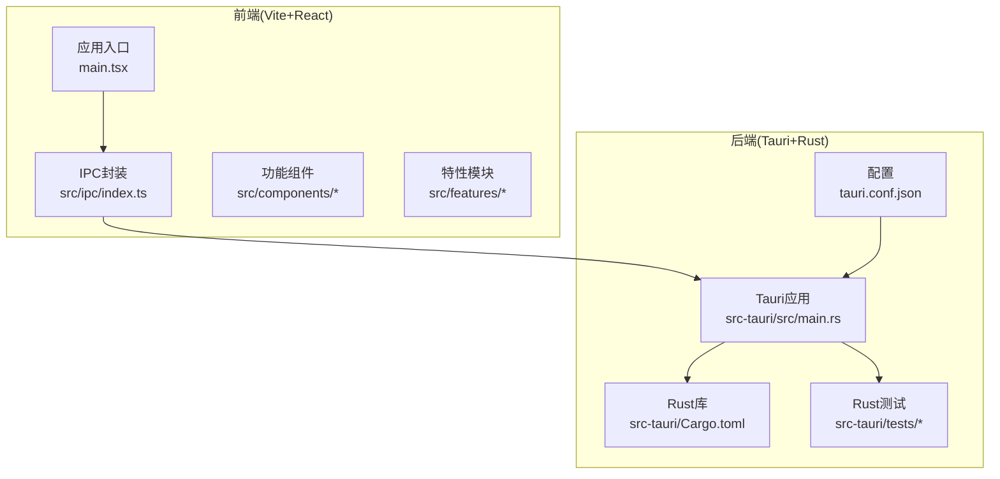
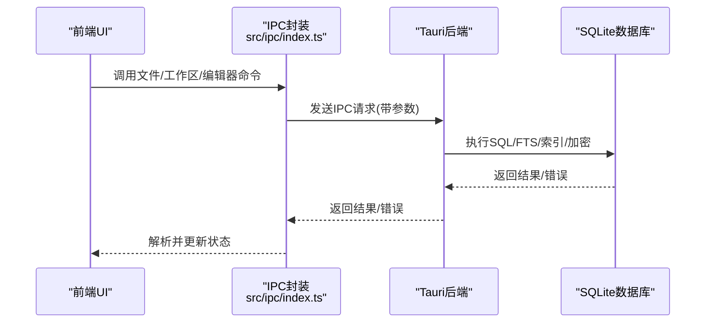
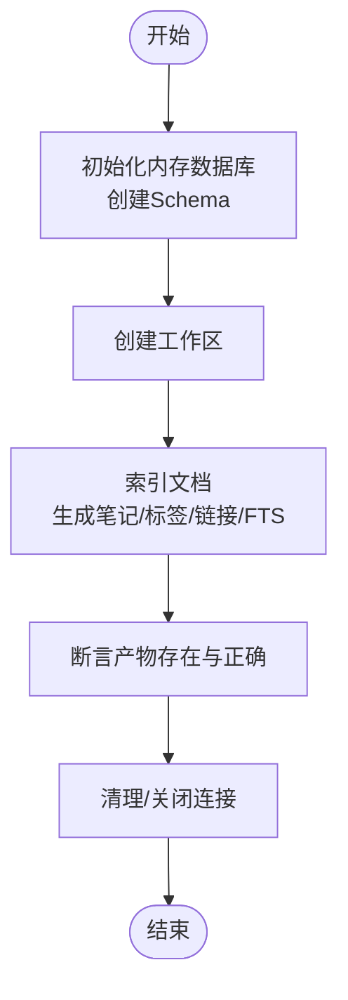
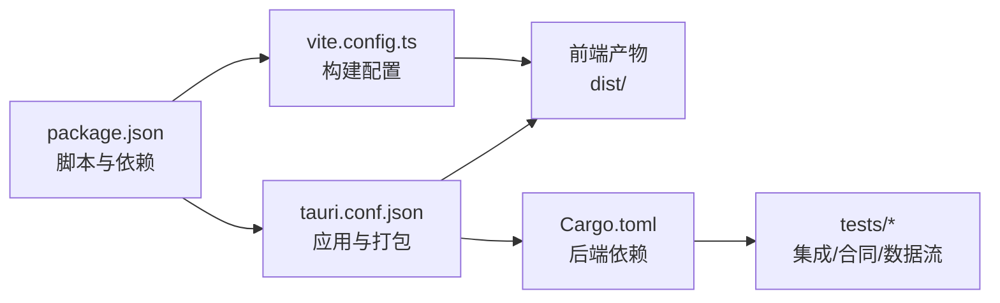

# 测试与部署

<cite>
**本文引用的文件**
- [package.json](file://package.json)
- [vite.config.ts](file://vite.config.ts)
- [tauri.conf.json](file://src-tauri/tauri.conf.json)
- [Cargo.toml](file://src-tauri/Cargo.toml)
- [ipc_contract_tests.rs](file://src-tauri/tests/ipc_contract_tests.rs)
- [integration_test.rs](file://src-tauri/tests/integration_test.rs)
- [dataflow_tests.rs](file://src-tauri/tests/dataflow_tests.rs)
- [index.ts](file://src/ipc/index.ts)
- [types.ts](file://src/types.ts)
- [TreeView.tsx](file://src/features/json-yaml/TreeView.tsx)
- [noteforgeChat.md](file://.tmp/noteforgeChat.md)
</cite>

## 目录
1. [引言](#引言)
2. [项目结构](#项目结构)
3. [核心组件](#核心组件)
4. [架构总览](#架构总览)
5. [详细组件分析](#详细组件分析)
6. [依赖关系分析](#依赖关系分析)
7. [性能考量](#性能考量)
8. [故障排查指南](#故障排查指南)
9. [结论](#结论)
10. [附录](#附录)

## 引言
本指南面向NoteForge的开发者与运维人员，提供从测试策略到生产部署的完整实践路径。内容覆盖前端单元/集成测试、后端Rust测试、IPC合同测试、生产构建与打包、跨平台部署、CI/CD流水线设计、性能与基准测试、安全与签名、以及应用商店发布准备等。

## 项目结构
NoteForge采用前端React/Vite + 后端Tauri/Rust的桌面应用架构。前端通过IPC调用后端命令，后端以SQLite为本地存储，提供全文检索、知识图谱、加密备份等能力。测试覆盖Rust层的集成与合同测试，前端通过IPC桥接进行端到端行为验证。

图表来源
- [vite.config.ts:1-42](file://vite.config.ts#L1-L42)
- [tauri.conf.json:1-40](file://src-tauri/tauri.conf.json#L1-L40)
- [Cargo.toml:1-40](file://src-tauri/Cargo.toml#L1-L40)

章节来源
- [package.json:1-70](file://package.json#L1-L70)
- [vite.config.ts:1-42](file://vite.config.ts#L1-L42)
- [tauri.conf.json:1-40](file://src-tauri/tauri.conf.json#L1-L40)
- [Cargo.toml:1-40](file://src-tauri/Cargo.toml#L1-L40)

## 核心组件
- 前端构建与开发服务器：基于Vite，使用React插件与别名配置，开发端口固定，环境变量前缀限定。
- IPC桥接：前端通过统一的IPC命名空间调用后端命令，涵盖文件系统、草稿、会话、编辑器等。
- 后端打包与窗口配置：Tauri配置定义窗口尺寸、透明度、背景色、安全策略与打包目标。
- Rust依赖与构建：后端使用Tauri、SQLite、加密、网络请求、向量化等依赖，支持多crate类型输出。

章节来源
- [package.json:7-16](file://package.json#L7-L16)
- [vite.config.ts:5-41](file://vite.config.ts#L5-L41)
- [index.ts:215-295](file://src/ipc/index.ts#L215-L295)
- [tauri.conf.json:6-39](file://src-tauri/tauri.conf.json#L6-L39)
- [Cargo.toml:7-39](file://src-tauri/Cargo.toml#L7-L39)

## 架构总览
下图展示从用户操作到后端处理的关键路径，以及IPC调用与数据库交互的关系。

图表来源
- [index.ts:215-295](file://src/ipc/index.ts#L215-L295)
- [tauri.conf.json:6-11](file://src-tauri/tauri.conf.json#L6-L11)
- [Cargo.toml:20-26](file://src-tauri/Cargo.toml#L20-L26)

## 详细组件分析

### 测试策略与实施

#### 前端测试
- 单元测试：针对组件逻辑与工具函数，建议使用React测试库与Jest/Vitest（当前仓库未包含前端测试脚本，建议新增）。
- 集成测试：通过模拟IPC桩函数，验证组件与IPC层的协作，避免真实后端依赖。
- 端到端测试：在开发服务器与Tauri开发模式下，结合用户操作序列验证主流程。

章节来源
- [index.ts:215-295](file://src/ipc/index.ts#L215-L295)
- [types.ts:333-388](file://src/types.ts#L333-L388)

#### 后端Rust测试
- 集成测试：验证数据库初始化、全文检索、配置管理、加解密服务、工作区与笔记CRUD等。
- 数据流测试：覆盖AI精炼、日志记录、差异计算等数据处理链路。
- IPC合同测试：以“契约”方式约束前后端接口一致性，确保参数、返回值与错误码符合约定。

章节来源
- [integration_test.rs:1-183](file://src-tauri/tests/integration_test.rs#L1-L183)
- [dataflow_tests.rs:160-201](file://src-tauri/tests/dataflow_tests.rs#L160-L201)

#### IPC合同测试
IPC合同测试通过在内存中初始化数据库、创建工作区、执行索引与查询，断言各模块的行为与产物满足契约。该测试覆盖工作区、记忆、笔记、标签、链接、索引管道、全文检索、知识图谱、加解密、配置等子域。

图表来源
- [ipc_contract_tests.rs:1-528](file://src-tauri/tests/ipc_contract_tests.rs#L1-L528)

章节来源
- [ipc_contract_tests.rs:34-528](file://src-tauri/tests/ipc_contract_tests.rs#L34-L528)

### 生产构建流程

#### Vite构建优化
- 目标与压缩：ESNext目标、esbuild最小化、禁用SourceMap。
- 分包策略：将monaco-editor、milkdown、Radix UI等大依赖拆分为独立chunk，降低首包体积。
- 别名与端口：统一@别名、固定开发端口与主机绑定，便于Tauri DevURL一致。

章节来源
- [vite.config.ts:19-41](file://vite.config.ts#L19-L41)

#### Tauri打包配置
- 开发与构建命令：devUrl指向Vite开发服务器，构建前执行前端构建。
- 窗口与安全：窗口尺寸、最小尺寸、背景色、装饰与可调整性；安全策略字段留空（需按需配置）。
- 打包目标：全平台打包，设置分类、描述与图标。

章节来源
- [tauri.conf.json:6-39](file://src-tauri/tauri.conf.json#L6-L39)

#### Rust构建与依赖
- 依赖范围：Tauri核心、Shell/Dialog插件、SQLite、加密、HTTP、向量化、日志与追踪等。
- 构建产物：同时生成lib/cdylib/staticlib，适配不同链接场景。

章节来源
- [Cargo.toml:7-39](file://src-tauri/Cargo.toml#L7-L39)

### 跨平台部署策略

#### Windows
- 打包目标：MSI/NSIS安装包（由Tauri默认目标生成），注意签名与防火墙提示。
- 运行时：确保VC++运行库与SQLite动态库可用；必要时启用捆绑选项。
- 安装路径：建议默认目录，避免权限问题。

#### macOS
- 打包目标：DMG/APP，启用公证与沙盒策略（如需上架Mac App Store）。
- 代码签名：使用Apple Developer证书，配置entitlements与签名标识符。
- Gatekeeper：确保签名与notarization通过。

#### Linux
- 打包目标：AppImage/Deb/RPM，按发行版选择合适包格式。
- 依赖：确保系统已安装必要的GTK/WebKit依赖。
- 文件关联：配置MIME类型与文件关联，提升用户体验。

### CI/CD流水线设计
- 触发条件：PR/Merge到主分支触发测试与构建。
- 步骤建议：
  - 依赖安装：pnpm install
  - Lint与格式化：ESLint/Prettier
  - 前端构建：Vite生产构建
  - 后端测试：cargo test（含集成与合同测试）
  - 平台构建：tauri build（多目标）
  - 归档与上传：Artifacts与发布页
- 缓存策略：缓存pnpm store与Cargo registry，加速重复任务。
- 安全：敏感信息使用加密变量，签名证书与notarization凭据安全存储。

### 性能测试与基准测试
- 前端性能：
  - 大文件与单行超长文本：参考优化建议，限制树形视图与校验强度，启用降级模式。
  - Monaco编辑器：减少不必要的特性（minimap、folding、建议等），延迟解析。
- 后端性能：
  - SQLite查询：建立必要索引，避免全表扫描；FTS查询使用合适的limit。
  - 向量化与嵌入：批量处理与缓存，控制并发。
- 基准指标：页面首屏时间、编辑器响应延迟、搜索耗时、打包体积与启动时间。

章节来源
- [noteforgeChat.md:181-223](file://.tmp/noteforgeChat.md#L181-L223)
- [TreeView.tsx:37-78](file://src/features/json-yaml/TreeView.tsx#L37-L78)

### 安全考虑、代码签名与应用商店发布
- 安全策略：
  - CSP：根据需要配置或禁用，避免破坏功能。
  - 权限最小化：仅暴露必要IPC命令与文件系统访问。
- 加密与隐私：
  - 使用后端提供的加解密服务保护备份与密钥。
  - 配置文件持久化与权限控制。
- 代码签名与公证：
  - Windows：使用EV代码签名证书，启用签名与驱动程序策略。
  - macOS：Apple Developer证书，notarization，Gatekeeper放行。
  - Linux：遵循发行版最佳实践，提供软件包签名。
- 应用商店发布：
  - 准备元数据、截图、描述与合规声明。
  - macOS：遵循Mac App Store审核指南，必要时启用沙盒。

章节来源
- [tauri.conf.json:27-29](file://src-tauri/tauri.conf.json#L27-L29)
- [Cargo.toml:23-26](file://src-tauri/Cargo.toml#L23-L26)

## 依赖关系分析

图表来源
- [package.json:7-16](file://package.json#L7-L16)
- [vite.config.ts:5-41](file://vite.config.ts#L5-L41)
- [tauri.conf.json:6-11](file://src-tauri/tauri.conf.json#L6-L11)
- [Cargo.toml:7-39](file://src-tauri/Cargo.toml#L7-L39)

章节来源
- [package.json:17-68](file://package.json#L17-L68)
- [Cargo.toml:1-40](file://src-tauri/Cargo.toml#L1-L40)

## 性能考量
- 前端：合理拆分chunk、延迟加载非关键资源；编辑器特性按需开启；对超大文件与单行JSON采取降级策略。
- 后端：FTS索引与查询优化、批量写入、并发控制；加密与向量化操作批量化。
- 构建：禁用SourceMap、使用更小的chunkSize警告阈值，关注体积变化趋势。

章节来源
- [vite.config.ts:19-41](file://vite.config.ts#L19-L41)
- [noteforgeChat.md:181-223](file://.tmp/noteforgeChat.md#L181-L223)

## 故障排查指南
- IPC错误模型：前端通过统一的错误类型与错误码传递后端异常，便于定位与提示。
- IPC调用失败：检查IPC命名空间是否匹配、参数类型与必填项、后端命令注册与权限。
- 数据库问题：确认Schema初始化成功、事务与锁竞争、FTS虚拟表状态。
- 打包失败：核对Tauri配置、图标路径、平台依赖与签名证书。

章节来源
- [types.ts:333-388](file://src/types.ts#L333-L388)
- [index.ts:215-295](file://src/ipc/index.ts#L215-L295)
- [integration_test.rs:9-14](file://src-tauri/tests/integration_test.rs#L9-L14)

## 结论
本指南提供了NoteForge从测试到部署的全链路实践建议。通过IPC合同测试保障前后端一致性，借助Rust集成测试与数据流测试覆盖核心业务，配合Vite与Tauri的生产构建与跨平台打包，结合CI/CD自动化流水线，可稳定交付高质量版本。同时，安全与签名策略、应用商店发布准备应贯穿整个生命周期。

## 附录
- 建议新增前端测试脚本与配置，补齐单元与端到端测试矩阵。
- 在CI中增加性能回归检查，记录关键指标并告警。
- 对超大文件与单行JSON场景制定明确的降级策略与用户提示。