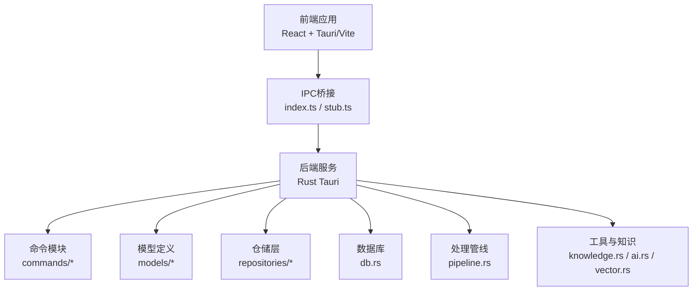
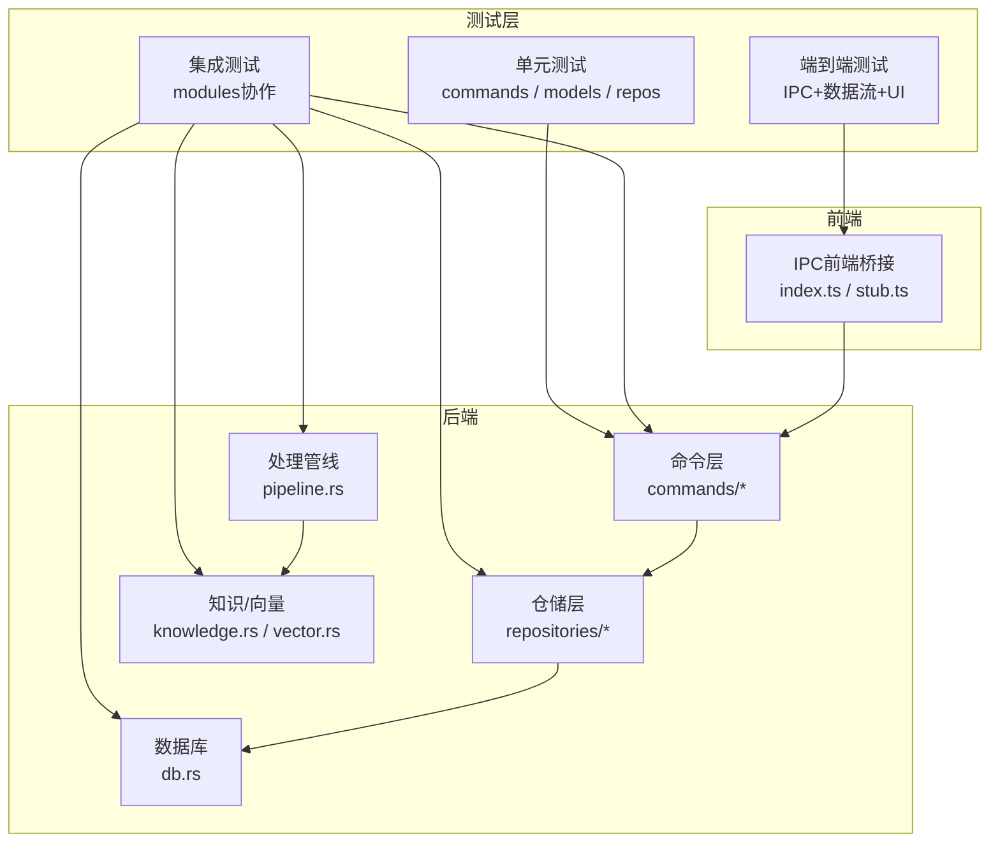
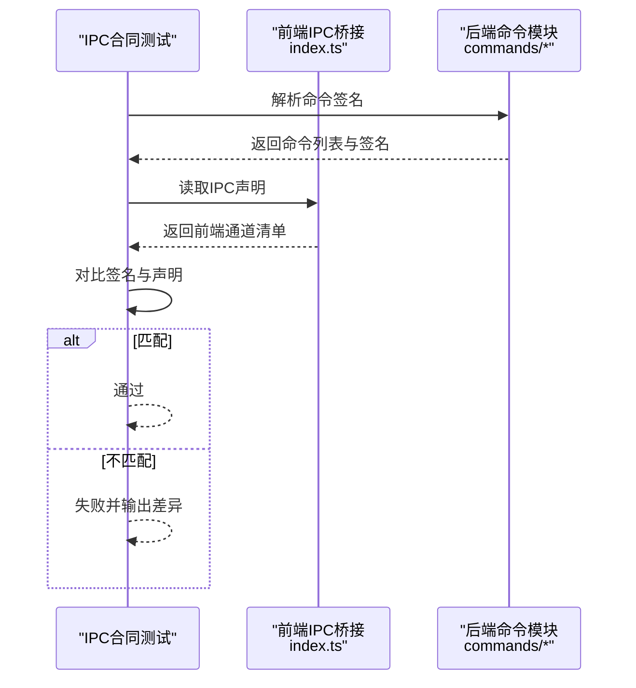
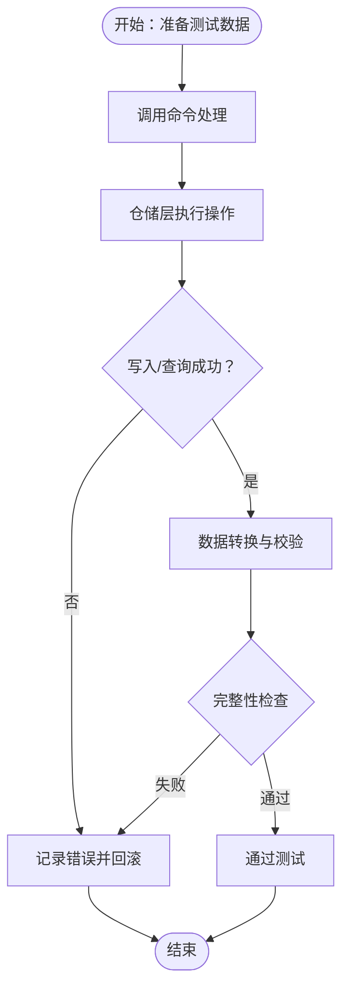
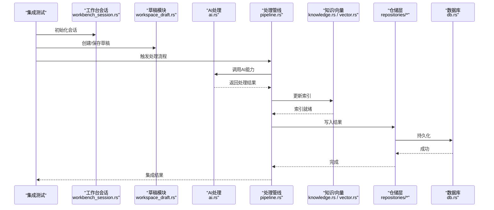
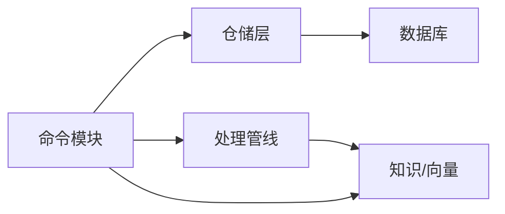

# 测试策略

<cite>
**本文引用的文件**
- [dataflow_tests.rs](file://src-tauri/tests/dataflow_tests.rs)
- [integration_test.rs](file://src-tauri/tests/integration_test.rs)
- [ipc_contract_tests.rs](file://src-tauri/tests/ipc_contract_tests.rs)
- [Cargo.toml](file://src-tauri/Cargo.toml)
- [tauri.conf.json](file://src-tauri/tauri.conf.json)
- [main.rs](file://src-tauri/src/main.rs)
- [commands/mod.rs](file://src-tauri/src/commands/mod.rs)
- [models/mod.rs](file://src-tauri/src/models/mod.rs)
- [repositories/mod.rs](file://src-tauri/src/repositories/mod.rs)
- [db.rs](file://src-tauri/src/db.rs)
- [workbench_session.rs](file://src-tauri/src/workbench_session.rs)
- [workspace_draft.rs](file://src-tauri/src/workspace_draft.rs)
- [vault_watch.rs](file://src-tauri/src/vault_watch.rs)
- [vector.rs](file://src-tauri/src/vector.rs)
- [knowledge.rs](file://src-tauri/src/knowledge.rs)
- [ai.rs](file://src-tauri/src/ai.rs)
- [scratch.rs](file://src-tauri/src/scratch.rs)
- [pipeline.rs](file://src-tauri/src/pipeline.rs)
- [error.rs](file://src-tauri/src/error.rs)
- [index.ts](file://src/ipc/index.ts)
- [stub.ts](file://src/ipc/stub.ts)
- [package.json](file://package.json)
</cite>

## 目录
1. [引言](#引言)
2. [项目结构](#项目结构)
3. [核心组件](#核心组件)
4. [架构总览](#架构总览)
5. [详细组件分析](#详细组件分析)
6. [依赖关系分析](#依赖关系分析)
7. [性能考量](#性能考量)
8. [故障排查指南](#故障排查指南)
9. [结论](#结论)
10. [附录](#附录)

## 引言
本文件系统化梳理NoteForge的测试策略与实施方法，围绕测试金字塔（单元测试、集成测试、端到端测试）展开，并重点阐释IPC合同测试、数据流测试、集成测试执行流程、测试用例编写规范、覆盖率与质量标准、测试环境配置、测试数据管理与结果分析方法，以及面向开发者的完整测试实施指南与调试技巧。

## 项目结构
NoteForge采用前端（Tauri + React/Vite）与后端（Rust）分离的双层架构。测试主要集中在Rust后端（src-tauri），通过独立的测试模块组织不同层次的测试职责；前端通过IPC与后端交互，测试覆盖从IPC契约到数据流再到端到端工作流的全链路。

图表来源
- [main.rs:1-200](file://src-tauri/src/main.rs#L1-L200)
- [commands/mod.rs:1-200](file://src-tauri/src/commands/mod.rs#L1-L200)
- [models/mod.rs:1-200](file://src-tauri/src/models/mod.rs#L1-L200)
- [repositories/mod.rs:1-200](file://src-tauri/src/repositories/mod.rs#L1-L200)
- [db.rs:1-200](file://src-tauri/src/db.rs#L1-L200)
- [pipeline.rs:1-200](file://src-tauri/src/pipeline.rs#L1-L200)
- [index.ts:1-200](file://src/ipc/index.ts#L1-L200)
- [stub.ts:1-200](file://src/ipc/stub.ts#L1-L200)

章节来源
- [Cargo.toml:1-200](file://src-tauri/Cargo.toml#L1-L200)
- [tauri.conf.json:1-200](file://src-tauri/tauri.conf.json#L1-L200)
- [main.rs:1-200](file://src-tauri/src/main.rs#L1-L200)

## 核心组件
- 测试金字塔分层
  - 单元测试：针对命令模块、模型、仓储、工具函数等最小可测单元，强调快速反馈与高覆盖率。
  - 集成测试：跨模块协作测试，验证命令与仓储、数据库、向量索引、知识图谱等子系统的协同行为。
  - 端到端测试：模拟真实用户场景，覆盖IPC契约、数据流、UI交互与持久化全流程。
- IPC合同测试：以契约驱动的方式，确保前端IPC调用与后端命令签名一致，避免接口漂移。
- 数据流测试：验证数据在命令层、仓储层、数据库与外部系统之间的传递、转换与存储一致性。
- 集成测试：聚焦核心功能模块（如工作台会话、草稿、知识检索、AI处理、向量索引）的协同验证。
- 覆盖率与质量标准：建议关键路径覆盖率≥80%，分支覆盖率≥60%，错误路径与边界条件全覆盖。
- 测试环境与数据：使用内存数据库或临时数据库进行隔离测试；测试数据按场景分组管理，支持快照与回滚。
- 结果分析：结合日志、断言失败信息与覆盖率报告，定位问题根因并输出改进建议。

章节来源
- [dataflow_tests.rs:1-200](file://src-tauri/tests/dataflow_tests.rs#L1-L200)
- [integration_test.rs:1-200](file://src-tauri/tests/integration_test.rs#L1-L200)
- [ipc_contract_tests.rs:1-200](file://src-tauri/tests/ipc_contract_tests.rs#L1-L200)

## 架构总览
下图展示测试策略在系统中的位置与交互关系，突出IPC契约、数据流与集成测试的关键节点。

图表来源
- [ipc_contract_tests.rs:1-200](file://src-tauri/tests/ipc_contract_tests.rs#L1-L200)
- [dataflow_tests.rs:1-200](file://src-tauri/tests/dataflow_tests.rs#L1-L200)
- [integration_test.rs:1-200](file://src-tauri/tests/integration_test.rs#L1-L200)
- [commands/mod.rs:1-200](file://src-tauri/src/commands/mod.rs#L1-L200)
- [repositories/mod.rs:1-200](file://src-tauri/src/repositories/mod.rs#L1-L200)
- [db.rs:1-200](file://src-tauri/src/db.rs#L1-L200)
- [pipeline.rs:1-200](file://src-tauri/src/pipeline.rs#L1-L200)
- [knowledge.rs:1-200](file://src-tauri/src/knowledge.rs#L1-L200)
- [vector.rs:1-200](file://src-tauri/src/vector.rs#L1-L200)
- [index.ts:1-200](file://src/ipc/index.ts#L1-L200)
- [stub.ts:1-200](file://src/ipc/stub.ts#L1-L200)

## 详细组件分析

### IPC合同测试
- 设计原理
  - 契约驱动：以命令模块导出的公开API为契约，前端IPC调用必须严格匹配命令签名与参数类型。
  - 自动化校验：通过解析命令模块导出的函数签名，生成契约清单并与前端IPC桥接进行比对。
  - 变更预警：任何命令签名变更都会导致契约不匹配，从而触发测试失败，防止接口漂移。
- 实现方法
  - 前端IPC桥接：统一在index.ts中声明所有IPC通道；当命令新增/删除/重命名时，同步更新此处。
  - 后端命令模块：commands/mod.rs集中导出命令入口，确保每个命令具备稳定的对外签名。
  - 合同对比：测试中读取命令签名与前端声明进行逐项比对，记录差异并输出详细报告。
- 关键流程（序列图）

图表来源
- [ipc_contract_tests.rs:1-200](file://src-tauri/tests/ipc_contract_tests.rs#L1-L200)
- [index.ts:1-200](file://src/ipc/index.ts#L1-L200)
- [commands/mod.rs:1-200](file://src-tauri/src/commands/mod.rs#L1-L200)

章节来源
- [ipc_contract_tests.rs:1-200](file://src-tauri/tests/ipc_contract_tests.rs#L1-L200)
- [index.ts:1-200](file://src/ipc/index.ts#L1-L200)
- [commands/mod.rs:1-200](file://src-tauri/src/commands/mod.rs#L1-L200)

### 数据流测试
- 验证目标
  - 数据传递：命令输入→仓储调用→数据库写入/查询是否一致。
  - 数据转换：模型映射、序列化/反序列化、字段校验与默认值处理。
  - 存储完整性：主键约束、外键关联、索引完整性与事务一致性。
- 关键流程（流程图）

图表来源
- [dataflow_tests.rs:1-200](file://src-tauri/tests/dataflow_tests.rs#L1-L200)
- [commands/mod.rs:1-200](file://src-tauri/src/commands/mod.rs#L1-L200)
- [repositories/mod.rs:1-200](file://src-tauri/src/repositories/mod.rs#L1-L200)
- [db.rs:1-200](file://src-tauri/src/db.rs#L1-L200)

章节来源
- [dataflow_tests.rs:1-200](file://src-tauri/tests/dataflow_tests.rs#L1-L200)
- [commands/mod.rs:1-200](file://src-tauri/src/commands/mod.rs#L1-L200)
- [repositories/mod.rs:1-200](file://src-tauri/src/repositories/mod.rs#L1-L200)
- [db.rs:1-200](file://src-tauri/src/db.rs#L1-L200)

### 集成测试执行流程
- 覆盖范围
  - 工作台会话与草稿：会话生命周期、草稿保存与恢复、并发冲突处理。
  - 知识检索与向量索引：嵌入生成、索引构建、相似度检索与结果排序。
  - AI处理与管道：提示构造、模型调用、响应解析与错误传播。
  - 文件与观察：文件变更监听、增量索引、缓存失效与一致性保证。
- 执行顺序（序列图）

图表来源
- [integration_test.rs:1-200](file://src-tauri/tests/integration_test.rs#L1-L200)
- [workbench_session.rs:1-200](file://src-tauri/src/workbench_session.rs#L1-L200)
- [workspace_draft.rs:1-200](file://src-tauri/src/workspace_draft.rs#L1-L200)
- [ai.rs:1-200](file://src-tauri/src/ai.rs#L1-L200)
- [pipeline.rs:1-200](file://src-tauri/src/pipeline.rs#L1-L200)
- [knowledge.rs:1-200](file://src-tauri/src/knowledge.rs#L1-L200)
- [vector.rs:1-200](file://src-tauri/src/vector.rs#L1-L200)
- [repositories/mod.rs:1-200](file://src-tauri/src/repositories/mod.rs#L1-L200)
- [db.rs:1-200](file://src-tauri/src/db.rs#L1-L200)

章节来源
- [integration_test.rs:1-200](file://src-tauri/tests/integration_test.rs#L1-L200)
- [workbench_session.rs:1-200](file://src-tauri/src/workbench_session.rs#L1-L200)
- [workspace_draft.rs:1-200](file://src-tauri/src/workspace_draft.rs#L1-L200)
- [ai.rs:1-200](file://src-tauri/src/ai.rs#L1-L200)
- [pipeline.rs:1-200](file://src-tauri/src/pipeline.rs#L1-L200)
- [knowledge.rs:1-200](file://src-tauri/src/knowledge.rs#L1-L200)
- [vector.rs:1-200](file://src-tauri/src/vector.rs#L1-L200)
- [repositories/mod.rs:1-200](file://src-tauri/src/repositories/mod.rs#L1-L200)
- [db.rs:1-200](file://src-tauri/src/db.rs#L1-L200)

### 测试用例编写指南
- 最佳实践
  - 单元测试：以“输入→处理→断言”三段式组织；优先覆盖正常路径与边界条件；使用伪随机测试数据。
  - 集成测试：使用内存数据库或临时数据库；前置/后置钩子清理状态；关注并发与竞态条件。
  - 端到端测试：模拟真实用户动作序列；断言最终状态而非中间步骤；对易变数据使用固定种子。
- 常见模式
  - 契约测试：命令签名与前端声明一一对应；新增命令必须同步更新契约。
  - 数据流测试：准备→执行→断言→清理；对关键字段进行等价类划分。
  - 集成测试：按功能域分组；先小后大，逐步合并模块；对共享资源加锁或隔离。
- 调试技巧
  - 使用日志与断点定位问题；对复杂流程绘制调用图；利用快照比较辅助回归。
  - 对IPC问题，分别在前端与后端打印消息与参数；确认序列化格式一致。

章节来源
- [ipc_contract_tests.rs:1-200](file://src-tauri/tests/ipc_contract_tests.rs#L1-L200)
- [dataflow_tests.rs:1-200](file://src-tauri/tests/dataflow_tests.rs#L1-L200)
- [integration_test.rs:1-200](file://src-tauri/tests/integration_test.rs#L1-L200)

### 测试覆盖率与质量标准
- 覆盖率目标
  - 关键路径覆盖率：≥80%
  - 分支覆盖率：≥60%
  - 错误路径与边界条件：100%覆盖
- 质量标准
  - 无阻塞性缺陷：P0级缺陷在发布前清零
  - 回归测试：每次提交运行单元与集成测试
  - 端到端抽样：每日抽样执行关键业务流
- 报告与改进
  - 生成覆盖率报告并输出热点区域；对低覆盖率模块制定补充计划

（本节为通用指导，无需具体文件引用）

## 依赖关系分析
- 组件耦合
  - 命令模块对仓储与数据库存在直接依赖；仓储对数据库抽象层依赖；处理管线与知识/向量模块存在间接耦合。
- 外部依赖
  - 数据库驱动、向量库、AI服务等外部系统通过模块接口接入，测试中以桩或Mock替代以提升稳定性。
- 循环依赖规避
  - 通过模块化拆分与接口抽象避免循环导入；命令层仅暴露稳定API，内部实现可演进。

图表来源
- [commands/mod.rs:1-200](file://src-tauri/src/commands/mod.rs#L1-L200)
- [repositories/mod.rs:1-200](file://src-tauri/src/repositories/mod.rs#L1-L200)
- [db.rs:1-200](file://src-tauri/src/db.rs#L1-L200)
- [pipeline.rs:1-200](file://src-tauri/src/pipeline.rs#L1-L200)
- [knowledge.rs:1-200](file://src-tauri/src/knowledge.rs#L1-L200)
- [vector.rs:1-200](file://src-tauri/src/vector.rs#L1-L200)

章节来源
- [Cargo.toml:1-200](file://src-tauri/Cargo.toml#L1-L200)
- [commands/mod.rs:1-200](file://src-tauri/src/commands/mod.rs#L1-L200)
- [repositories/mod.rs:1-200](file://src-tauri/src/repositories/mod.rs#L1-L200)
- [db.rs:1-200](file://src-tauri/src/db.rs#L1-L200)
- [pipeline.rs:1-200](file://src-tauri/src/pipeline.rs#L1-L200)
- [knowledge.rs:1-200](file://src-tauri/src/knowledge.rs#L1-L200)
- [vector.rs:1-200](file://src-tauri/src/vector.rs#L1-L200)

## 性能考量
- 测试执行效率
  - 将I/O密集型测试（数据库、向量索引）批量执行并复用连接；减少重复初始化成本。
  - 使用并行测试框架时注意共享资源竞争，必要时引入互斥或隔离。
- 覆盖率与性能平衡
  - 在CI中优先运行高价值用例；对低价值或耗时长的测试采用定时任务或按需触发。
- 性能回归监控
  - 记录关键测试的执行时间，建立阈值报警机制，及时发现性能退化。

（本节为通用指导，无需具体文件引用）

## 故障排查指南
- 常见问题
  - IPC契约不匹配：检查命令签名与前端声明是否一致；确认序列化字段名与类型。
  - 数据流异常：核对仓储层SQL与模型映射；检查事务边界与回滚逻辑。
  - 集成测试不稳定：排查共享状态污染；使用临时数据库与隔离策略。
- 排查步骤
  - 启用详细日志；分段执行测试定位失败点；输出上下文变量与中间结果。
  - 对错误路径补充断言，形成最小可复现用例；纳入回归测试集。
- 错误处理与容错
  - 统一错误类型与错误码；在测试中显式断言错误类型与消息；对不可恢复错误抛出明确异常。

章节来源
- [error.rs:1-200](file://src-tauri/src/error.rs#L1-L200)
- [ipc_contract_tests.rs:1-200](file://src-tauri/tests/ipc_contract_tests.rs#L1-L200)
- [dataflow_tests.rs:1-200](file://src-tauri/tests/dataflow_tests.rs#L1-L200)
- [integration_test.rs:1-200](file://src-tauri/tests/integration_test.rs#L1-L200)

## 结论
NoteForge的测试策略以IPC契约为核心，贯穿数据流与集成测试，辅以端到端验证，形成完整的质量保障体系。通过模块化设计与契约驱动的IPC测试，显著降低了前后端接口漂移风险；通过仓储与数据库的集成测试，确保数据一致性与完整性；通过覆盖率与质量标准，持续提升代码可靠性与可维护性。建议在CI中强制执行单元与集成测试，并定期评估覆盖率与性能指标，持续优化测试策略。

## 附录
- 测试环境配置
  - 前端：Vite开发服务器 + Tauri本地调试模式；IPC桥接使用stub.ts进行开发期模拟。
  - 后端：Rust测试通过cargo test执行；数据库使用内存或临时实例；向量与AI服务使用Mock。
- 测试数据管理
  - 按功能域分组管理测试数据；支持快照与回滚；敏感数据脱敏或使用占位符。
- 测试结果分析
  - 生成覆盖率报告与测试日志；对失败用例进行根因分析与修复闭环；定期回顾测试有效性。

章节来源
- [package.json:1-200](file://package.json#L1-L200)
- [index.ts:1-200](file://src/ipc/index.ts#L1-L200)
- [stub.ts:1-200](file://src/ipc/stub.ts#L1-L200)
- [tauri.conf.json:1-200](file://src-tauri/tauri.conf.json#L1-L200)