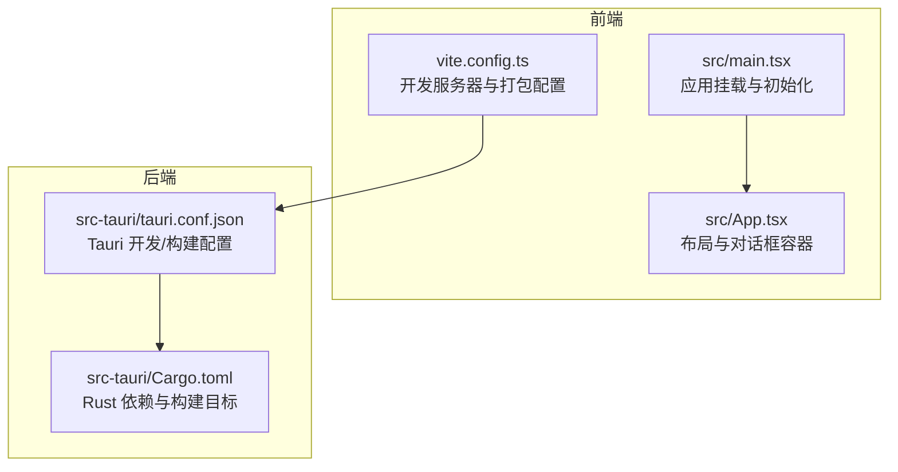
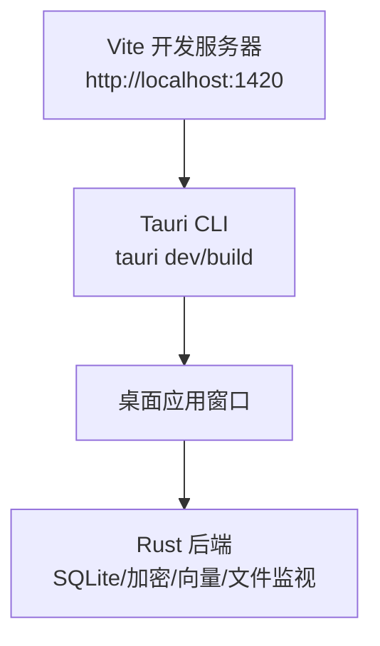
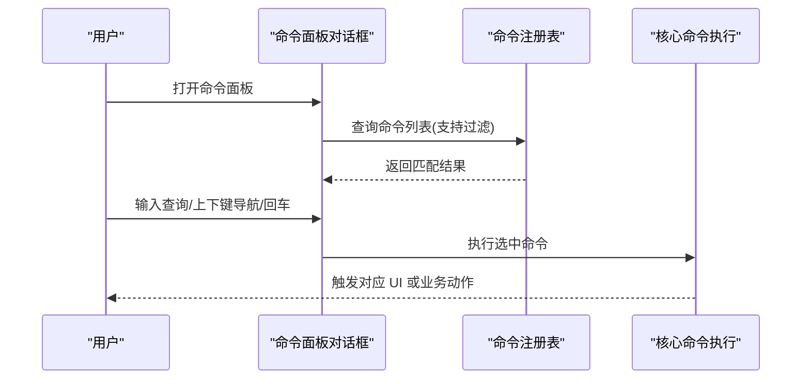
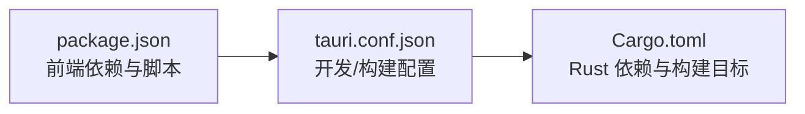

# 快速开始

<cite>
**本文引用的文件**
- [README.md](file://README.md)
- [package.json](file://package.json)
- [vite.config.ts](file://vite.config.ts)
- [src-tauri/tauri.conf.json](file://src-tauri/tauri.conf.json)
- [src-tauri/Cargo.toml](file://src-tauri/Cargo.toml)
- [src/main.tsx](file://src/main.tsx)
- [src/App.tsx](file://src/App.tsx)
- [docs/design/02-workspace.md](file://docs/design/02-workspace.md)
- [docs/design/03-file-browser-editor.md](file://docs/design/03-file-browser-editor.md)
- [src/core/command/types.ts](file://src/core/command/types.ts)
- [src/core/command/command-registry.impl.ts](file://src/core/command/command-registry.impl.ts)
- [src/core/command/register-core-commands.ts](file://src/core/command/register-core-commands.ts)
- [src/components/dialogs/CommandPaletteDialog.tsx](file://src/components/dialogs/CommandPaletteDialog.tsx)
- [src/types.ts](file://src/types.ts)
- [src-tauri/src/error.rs](file://src-tauri/src/error.rs)
- [src/components/editor/ProblemsPanel.tsx](file://src/components/editor/ProblemsPanel.tsx)
</cite>

## 目录
1. [简介](#简介)
2. [项目结构](#项目结构)
3. [核心组件](#核心组件)
4. [架构总览](#架构总览)
5. [详细组件分析](#详细组件分析)
6. [依赖关系分析](#依赖关系分析)
7. [性能考虑](#性能考虑)
8. [故障排除指南](#故障排除指南)
9. [结论](#结论)
10. [附录](#附录)

## 简介
本指南面向首次接触 NoteForge 的开发者，帮助你在最短时间内完成环境准备、项目克隆、依赖安装与开发运行，并掌握基本使用流程（创建工作区、创建笔记、基础编辑操作）。同时覆盖开发模式与生产构建的命令差异及常见问题排查。

NoteForge 是一个本地优先、编辑器与知识库深度融合、内置 AI 协作者的技术知识工作站，采用 Tauri v2 + React 18 + TypeScript + Monaco Editor + Rust 后端的桌面应用。

## 项目结构
- 前端源码位于 src/，包含组件、特性模块、状态管理、工具库与应用入口。
- Rust 后端位于 src-tauri/，包含 Tauri 命令、数据库、加密、向量检索、文件监视等实现。
- 构建与开发由 Vite + Tauri CLI 驱动，前端开发服务器默认端口为 1420。

图表来源
- [src/main.tsx:1-24](file://src/main.tsx#L1-L24)
- [src/App.tsx:1-111](file://src/App.tsx#L1-L111)
- [vite.config.ts:1-42](file://vite.config.ts#L1-L42)
- [src-tauri/tauri.conf.json:1-40](file://src-tauri/tauri.conf.json#L1-L40)
- [src-tauri/Cargo.toml:1-40](file://src-tauri/Cargo.toml#L1-L40)

章节来源
- [README.md:75-112](file://README.md#L75-L112)
- [vite.config.ts:1-42](file://vite.config.ts#L1-L42)
- [src-tauri/tauri.conf.json:1-40](file://src-tauri/tauri.conf.json#L1-L40)

## 核心组件
- 应用入口与启动流程：应用入口负责主题缓存应用、核心初始化、生命周期安装与引导启动。
- 主界面布局：顶部栏、侧边栏、编辑区、右侧面板、状态栏与各类对话框容器。
- 开发服务器：Vite 默认监听 127.0.0.1:1420，严格端口绑定，便于 Tauri Dev 模式联调。
- Tauri 配置：开发模式前置命令指向前端 dev，生产构建指向前端 build，前端产物输出至 dist。

章节来源
- [src/main.tsx:1-24](file://src/main.tsx#L1-L24)
- [src/App.tsx:1-111](file://src/App.tsx#L1-L111)
- [vite.config.ts:13-18](file://vite.config.ts#L13-L18)
- [src-tauri/tauri.conf.json:6-11](file://src-tauri/tauri.conf.json#L6-L11)

## 架构总览
NoteForge 采用“前端 React + 后端 Rust/Tauri”的桌面应用架构。开发模式下，Tauri 通过 devUrl 指向 Vite 开发服务器；生产模式下，前端构建产物 dist 由 Tauri 打包为原生应用。

图表来源
- [src-tauri/tauri.conf.json:7-10](file://src-tauri/tauri.conf.json#L7-L10)
- [vite.config.ts:13-18](file://vite.config.ts#L13-L18)

章节来源
- [README.md:32-59](file://README.md#L32-L59)
- [src-tauri/tauri.conf.json:1-40](file://src-tauri/tauri.conf.json#L1-L40)

## 详细组件分析

### 环境准备与系统要求
- Node.js 版本要求：>= 18
- 包管理：pnpm（前端），Cargo（Rust）
- Rust 工具链：安装 rustup 并启用最新稳定工具链
- Tauri CLI：安装版本 ^2
- 可选：Ollama（用于本地 AI 能力）

平台兼容性
- macOS：11.0+（Big Sur）
- Windows：10 1809+ / Windows 11
- Linux：WebKitGTK 4.1+（Ubuntu 22.04+, Fedora 38+, Arch）

章节来源
- [README.md:24-31](file://README.md#L24-L31)
- [README.md:126-130](file://README.md#L126-L130)

### 项目克隆与依赖安装
- 克隆仓库后，在项目根目录安装前端依赖。
- 安装完成后，即可进入开发模式。

章节来源
- [README.md:34-40](file://README.md#L34-L40)
- [package.json:7-16](file://package.json#L7-L16)

### 启动开发服务器与调试
- 开发模式：启动 Tauri 开发模式，自动启动前端开发服务器并打开桌面窗口。
- 前端独立开发：仅启动 Vite 开发服务器，便于浏览器调试。
- 生产构建：生成打包后的应用。

章节来源
- [README.md:38-59](file://README.md#L38-L59)
- [package.json:7-16](file://package.json#L7-L16)
- [src-tauri/tauri.conf.json:6-11](file://src-tauri/tauri.conf.json#L6-L11)

### 基本使用流程
- 启动后进入引导流程：首次使用会弹出引导对话框，支持选择本地文件夹作为工作空间或导入示例笔记。
- 选择工作空间后进入主界面，左侧为文件树，中间为编辑区，右侧为回链/大纲/图谱/AI 等面板。
- 创建笔记：在文件树右键新建文件，或使用命令面板快速创建。
- 基础编辑：支持编辑、预览、分屏视图，快捷键可通过命令面板查看。

章节来源
- [docs/design/02-workspace.md:17-48](file://docs/design/02-workspace.md#L17-L48)
- [docs/design/03-file-browser-editor.md:26-76](file://docs/design/03-file-browser-editor.md#L26-L76)
- [docs/design/03-file-browser-editor.md:100-127](file://docs/design/03-file-browser-editor.md#L100-L127)
- [docs/design/03-file-browser-editor.md:142-157](file://docs/design/03-file-browser-editor.md#L142-L157)

### 命令与快捷键体系
- 命令注册与分类：命令分为 file/edit/view/note/navigation/workspace/ai 等类别，支持按类别与关键字过滤。
- 快捷键匹配：根据上下文动态匹配可用命令，支持组合键与修饰键。
- 常用命令示例：切换右侧面板、全局搜索、向右分屏、每日笔记、命令面板等。

图表来源
- [src/components/dialogs/CommandPaletteDialog.tsx:1-100](file://src/components/dialogs/CommandPaletteDialog.tsx#L1-L100)
- [src/core/command/command-registry.impl.ts:39-67](file://src/core/command/command-registry.impl.ts#L39-L67)
- [src/core/command/register-core-commands.ts:88-146](file://src/core/command/register-core-commands.ts#L88-L146)
- [src/core/command/types.ts:1-62](file://src/core/command/types.ts#L1-L62)

章节来源
- [src/core/command/types.ts:3-10](file://src/core/command/types.ts#L3-L10)
- [src/core/command/command-registry.impl.ts:39-67](file://src/core/command/command-registry.impl.ts#L39-L67)
- [src/core/command/register-core-commands.ts:88-146](file://src/core/command/register-core-commands.ts#L88-L146)
- [src/components/dialogs/CommandPaletteDialog.tsx:1-100](file://src/components/dialogs/CommandPaletteDialog.tsx#L1-L100)

### Rust 后端命令与构建
- 前端脚本通过 tauri CLI 调用 Rust 构建与测试。
- 推荐在 src-tauri 目录下直接执行 cargo 命令，或使用 --manifest-path 指定路径。

章节来源
- [README.md:61-73](file://README.md#L61-L73)
- [package.json:13-16](file://package.json#L13-L16)
- [src-tauri/Cargo.toml:1-40](file://src-tauri/Cargo.toml#L1-L40)

## 依赖关系分析
- 前端依赖：React、Monaco Editor、Zustand、Radix UI、Tailwind CSS 等。
- 后端依赖：Tauri v2、rusqlite、notify、reqwest、ring/aes-gcm、fastembed 等。
- 构建工具：Vite、Tauri CLI、TypeScript、ESLint、Prettier。

图表来源
- [package.json:17-68](file://package.json#L17-L68)
- [src-tauri/Cargo.toml:7-32](file://src-tauri/Cargo.toml#L7-L32)
- [src-tauri/tauri.conf.json:6-11](file://src-tauri/tauri.conf.json#L6-L11)

章节来源
- [package.json:17-68](file://package.json#L17-L68)
- [src-tauri/Cargo.toml:1-40](file://src-tauri/Cargo.toml#L1-L40)
- [src-tauri/tauri.conf.json:1-40](file://src-tauri/tauri.conf.json#L1-L40)

## 性能考虑
- 前端打包：Rollup 分包策略对 Monaco、Milkdown、Radix UI 进行拆分，减少首包体积。
- 构建目标：esnext，使用 esbuild 压缩，禁用 SourceMap 以提升构建速度。
- 严格端口：开发服务器端口 1420，strictPort=true，避免端口冲突导致的反复重试。

章节来源
- [vite.config.ts:19-41](file://vite.config.ts#L19-L41)

## 故障排除指南
- 端口占用
  - 现象：开发服务器无法启动或端口冲突。
  - 处理：确认 127.0.0.1:1420 未被占用，或调整 Vite 端口配置。
  - 参考：开发服务器 host/port/strictPort 配置。
- Tauri 开发模式无法连接前端
  - 现象：窗口空白或白屏。
  - 处理：检查 tauri.conf.json 中 devUrl 是否与 Vite 端口一致；确保先启动前端再启动 tauri dev。
  - 参考：devUrl 与 beforeDevCommand 配置。
- Rust 依赖/编译失败
  - 现象：cargo build/test 报错。
  - 处理：确认已安装并启用 Rust 工具链；在 src-tauri 目录执行或使用 --manifest-path 指定路径。
  - 参考：Rust 依赖清单与构建目标。
- 常见错误码
  - 文件/路径相关：PATH_INVALID、PATH_NOT_FOUND、FILE_NOT_FOUND、READ_ERROR、WRITE_ERROR、DELETE_ERROR、CREATE_ERROR、RENAME_ERROR、MOVE_ERROR、PERMISSION_DENIED。
  - 工作区相关：WORKSPACE_EXISTS、WORKSPACE_NOT_FOUND、INVALID_WORKSPACE。
  - 搜索/索引相关：SEARCH_ERROR、INDEX_ERROR、INDEX_NOT_READY。
  - 加密相关：ENCRYPT_ERROR、DECRYPT_ERROR、INVALID_PASSWORD、KEY_NOT_FOUND。
  - AI/模型相关：AI_ERROR、MODEL_NOT_FOUND、MODEL_LIST_ERROR、RAG_ERROR、VECTOR_SEARCH_ERROR、EMBEDDING_ERROR。
  - 其他：INTERNAL_ERROR、UNKNOWN。
  - 参考：前端错误类型与后端错误序列化映射。
- 语法校验问题
  - 现象：JSON/YAML 校验失败时，问题面板展示具体文件与行号。
  - 处理：根据面板提示修复语法错误。
  - 参考：问题面板实现与校验逻辑。

章节来源
- [vite.config.ts:13-18](file://vite.config.ts#L13-L18)
- [src-tauri/tauri.conf.json:6-11](file://src-tauri/tauri.conf.json#L6-L11)
- [src/types.ts:335-376](file://src/types.ts#L335-L376)
- [src-tauri/src/error.rs:43-80](file://src-tauri/src/error.rs#L43-L80)
- [src/components/editor/ProblemsPanel.tsx:17-53](file://src/components/editor/ProblemsPanel.tsx#L17-L53)

## 结论
按照本指南完成环境准备与依赖安装后，你可以在几分钟内启动 NoteForge 并完成基本使用。开发模式下，Tauri 与 Vite 协同工作，提供高效的热更新体验；生产构建则将前端产物打包为原生应用。遇到问题时，可依据“故障排除指南”定位并解决常见问题。

## 附录

### 常用命令一览
- 启动前端开发服务器：dev
- TypeScript 检查 + 前端构建：build
- 预览构建产物：preview
- 启动 Tauri 开发模式（前端 + 后端）：tauri:dev
- 生产构建并打包：tauri:build
- Rust 构建/测试（推荐在 src-tauri 目录执行）

章节来源
- [README.md:114-125](file://README.md#L114-L125)
- [package.json:7-16](file://package.json#L7-L16)
- [README.md:61-73](file://README.md#L61-L73)