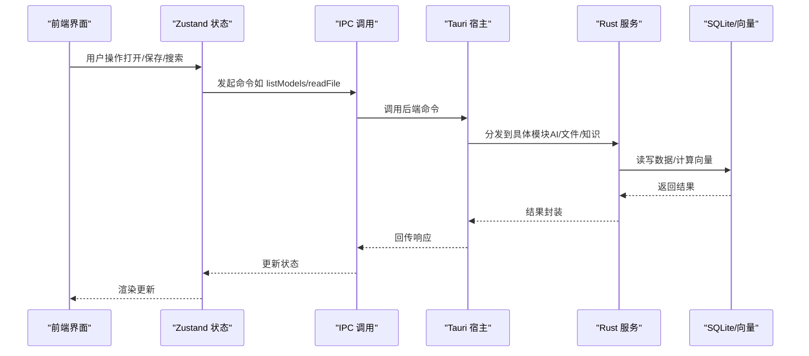
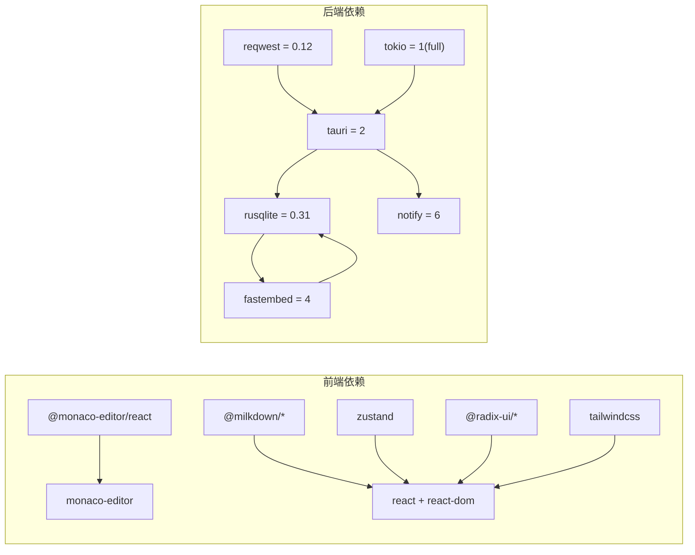

# 技术栈

<cite>
**本文引用的文件**
- [package.json](file://package.json)
- [Cargo.toml](file://src-tauri/Cargo.toml)
- [tsconfig.json](file://tsconfig.json)
- [tailwind.config.js](file://tailwind.config.js)
- [vite.config.ts](file://vite.config.ts)
- [main.tsx](file://src/main.tsx)
- [App.tsx](file://src/App.tsx)
- [main.rs](file://src-tauri/src/main.rs)
- [monaco-setup.ts](file://src/lib/monaco-setup.ts)
- [MonacoEditor.tsx](file://src/components/editor/MonacoEditor.tsx)
- [file-tier.ts](file://src/core/document/file-tier.ts)
- [MilkdownSurface.tsx](file://src/features/markdown/MilkdownSurface.tsx)
- [editor.ts](file://src/store/editor.ts)
- [ai.ts](file://src-tauri/src/ai.rs)
- [vector.rs](file://src-tauri/src/vector.rs)
- [embedding_repo.rs](file://src-tauri/src/repositories/embedding_repo.rs)
- [SettingsDialog.tsx](file://src/components/dialogs/SettingsDialog.tsx)
- [stub.ts](file://src/ipc/stub.ts)
- [ai.ts](file://src/store/ai.ts)
</cite>

## 目录
1. [简介](#简介)
2. [项目结构](#项目结构)
3. [核心组件](#核心组件)
4. [架构总览](#架构总览)
5. [详细组件分析](#详细组件分析)
6. [依赖关系分析](#依赖关系分析)
7. [性能考量](#性能考量)
8. [故障排查指南](#故障排查指南)
9. [结论](#结论)
10. [附录](#附录)

## 简介
本文件系统化梳理 NoteForge 的技术栈与架构设计，覆盖前端（React 18 + TypeScript + Zustand + Radix UI + Tailwind CSS）与后端（Rust + Tauri v2 + SQLite + notify）的选型依据、关键第三方库（Monaco Editor、Milkdown、Ollama、fastembed）的作用与集成方式，并给出版本要求、兼容性信息、学习路径与前置知识建议。

## 项目结构
- 前端采用 Vite + React 18 + TypeScript 构建，Tailwind CSS 提供原子化样式；状态管理使用 Zustand；UI 组件基于 Radix UI。
- 后端使用 Tauri v2 打包桌面应用，Rust 实现业务逻辑与数据持久化（SQLite），文件系统监控由 notify 驱动。
- 关键特性通过 IPC 在前后端之间桥接：Monaco 编辑器、Milkdown Markdown 编辑器、AI 推理（Ollama）、向量检索（fastembed + SQLite）。

```mermaid
graph TB
subgraph "前端"
A["React 18<br/>TypeScript"]
B["Zustand 状态"]
C["Radix UI 组件"]
D["Tailwind CSS 样式"]
E["Vite 构建/分包"]
end
subgraph "后端"
F["Tauri v2 应用壳"]
G["Rust 语言服务"]
H["SQLite 数据库"]
I["notify 文件监控"]
end
subgraph "关键库"
J["Monaco Editor"]
K["Milkdown Markdown"]
L["Ollama 本地推理"]
M["fastembed 向量"]
end
A --> B
A --> C
A --> D
A --> E
F --> G
G --> H
G --> I
A <- --> F
J -.编辑体验.-> A
K -.Markdown.-> A
L -.AI推理.-> G
M -.向量.-> H
```

图示来源
- [main.tsx:1-24](file://src/main.tsx#L1-L24)
- [App.tsx:1-111](file://src/App.tsx#L1-L111)
- [vite.config.ts:1-42](file://vite.config.ts#L1-L42)
- [main.rs:1-101](file://src-tauri/src/main.rs#L1-L101)
- [Cargo.toml:1-40](file://src-tauri/Cargo.toml#L1-L40)

章节来源
- [package.json:1-70](file://package.json#L1-L70)
- [tsconfig.json:1-28](file://tsconfig.json#L1-L28)
- [tailwind.config.js:1-105](file://tailwind.config.js#L1-L105)
- [vite.config.ts:1-42](file://vite.config.ts#L1-L42)
- [main.tsx:1-24](file://src/main.tsx#L1-L24)
- [App.tsx:1-111](file://src/App.tsx#L1-L111)
- [main.rs:1-101](file://src-tauri/src/main.rs#L1-L101)
- [Cargo.toml:1-40](file://src-tauri/Cargo.toml#L1-L40)

## 核心组件
- 前端框架与类型系统
  - React 18 + TypeScript：提供声明式 UI 与强类型保障，便于大型协作与长期演进。
  - Vite：快速开发与构建，支持 ES 模块与按需加载。
  - Tailwind CSS：实用优先的原子化样式，配合暗色主题变量实现统一风格。
- 状态与 UI
  - Zustand：轻量状态管理，避免样板代码，适合中大型单页应用。
  - Radix UI：语义化、无障碍、高可访问性的基础组件库。
- 编辑器生态
  - Monaco Editor：企业级代码编辑体验，支持多语言、语法高亮、智能提示、主题切换。
  - Milkdown：插件化的 Markdown 编辑器，提供所见即所得与源码双模式。
- 后端与系统
  - Tauri v2：将 Web 前端打包为原生桌面应用，提供安全沙箱与系统能力。
  - Rust：高性能、内存安全、零成本抽象，适合作为系统层与业务核心。
  - SQLite：轻量嵌入式数据库，满足知识库索引、向量存储与会话持久化。
  - notify：文件系统事件监听，驱动工作区变更与增量同步。

章节来源
- [package.json:17-48](file://package.json#L17-L48)
- [vite.config.ts:26-39](file://vite.config.ts#L26-L39)
- [tailwind.config.js:5-101](file://tailwind.config.js#L5-L101)
- [main.tsx:4-10](file://src/main.tsx#L4-L10)
- [main.rs:6-99](file://src-tauri/src/main.rs#L6-L99)
- [Cargo.toml:7-32](file://src-tauri/Cargo.toml#L7-L32)

## 架构总览
NoteForge 采用“前端 Web + 后端 Rust/Tauri”的混合架构。前端负责用户交互与编辑体验，后端负责数据持久化、文件系统监控、AI 推理与向量检索。IPC 调用在两者间建立稳定通道，确保功能解耦与性能最优。



图示来源
- [App.tsx:25-110](file://src/App.tsx#L25-L110)
- [editor.ts:281-800](file://src/store/editor.ts#L281-L800)
- [ai.ts:1-111](file://src/store/ai.ts#L1-L111)
- [main.rs:19-97](file://src-tauri/src/main.rs#L19-L97)
- [ai.rs:10-176](file://src-tauri/src/ai.rs#L10-L176)
- [vector.rs:1-151](file://src-tauri/src/vector.rs#L1-L151)

## 详细组件分析

### 前端技术栈：React 18 + TypeScript + Zustand + Radix UI + Tailwind CSS
- React 18
  - 使用严格模式渲染与并发特性，提升首屏与交互体验。
  - 入口初始化顺序：主题缓存应用 → 核心运行时初始化 → 生命周期安装 → 启动引导。
- TypeScript
  - 编译目标 ES2022，启用严格模式与 JSX 转换，路径别名 @/* 指向 src。
- Zustand
  - 编辑器状态集中管理，包含标签页、面板布局、会话恢复、撤销/重做等。
  - AI 面板状态独立 store，负责模型列表、指令、历史与调用结果。
- Radix UI
  - 对话框、菜单、下拉、Tooltip 等组件提供无障碍与可定制性。
- Tailwind CSS
  - 主题变量映射至 CSS 自定义属性，支持明暗主题；字体、阴影、动画统一配置。

章节来源
- [main.tsx:1-24](file://src/main.tsx#L1-L24)
- [tsconfig.json:2-24](file://tsconfig.json#L2-L24)
- [tailwind.config.js:5-101](file://tailwind.config.js#L5-L101)
- [App.tsx:25-110](file://src/App.tsx#L25-L110)
- [editor.ts:281-800](file://src/store/editor.ts#L281-L800)
- [ai.ts:1-111](file://src/store/ai.ts#L1-L111)

### 后端技术栈：Rust + Tauri v2 + SQLite + notify
- Tauri v2
  - 默认构建器、插件注册（shell、dialog），命令导出统一入口，运行上下文初始化。
- Rust
  - 语言服务、错误处理、加密、配置、工作台会话、草稿、向量引擎、知识图谱等模块化组织。
- SQLite
  - 内嵌数据库，结合 rusqlite 访问；向量存储采用 JSON 字段保存嵌入向量。
- notify
  - 文件系统事件监听，驱动工作区变更与增量同步。

章节来源
- [main.rs:1-101](file://src-tauri/src/main.rs#L1-L101)
- [Cargo.toml:7-32](file://src-tauri/Cargo.toml#L7-L32)
- [vector.rs:1-151](file://src-tauri/src/vector.rs#L1-L151)

### 关键第三方库与作用
- Monaco Editor
  - 通过本地 worker 配置避免 CDN 依赖，支持多语言、主题、大文件优化与诊断噪声控制。
  - 针对不同文件尺寸（normal/large/huge）动态调整编辑器选项与功能开关。
- Milkdown
  - 提供 Markdown 双模式（写作/阅读/源码），主题随系统/主题切换。
- Ollama
  - 本地 AI 推理服务，前端设置对话框支持本地模型选择与延迟展示；后端通过 HTTP 调用 Ollama API。
- fastembed
  - 向量嵌入生成与相似度检索，嵌入向量以 JSON 存储于 SQLite，支持按类型过滤与排序。

章节来源
- [monaco-setup.ts:1-23](file://src/lib/monaco-setup.ts#L1-L23)
- [MonacoEditor.tsx:247-390](file://src/components/editor/MonacoEditor.tsx#L247-L390)
- [file-tier.ts:54-95](file://src/core/document/file-tier.ts#L54-L95)
- [MilkdownSurface.tsx:173-183](file://src/features/markdown/MilkdownSurface.tsx#L173-L183)
- [SettingsDialog.tsx:63-92](file://src/components/dialogs/SettingsDialog.tsx#L63-L92)
- [stub.ts:881-924](file://src/ipc/stub.ts#L881-L924)
- [ai.rs:10-176](file://src-tauri/src/ai.rs#L10-L176)
- [vector.rs:1-151](file://src-tauri/src/vector.rs#L1-L151)
- [embedding_repo.rs:1-24](file://src-tauri/src/repositories/embedding_repo.rs#L1-L24)

### 技术选型权衡
- 性能
  - 前端：Vite + ESNext 目标，Rollup 分包策略将 Monaco、Milkdown、Radix UI 单独拆包，减少首包体积与冷启动时间。
  - 后端：Rust 高性能与零拷贝，SQLite 轻量可靠；向量检索采用内存扫描与 JSON 存储，兼顾易用与扩展。
- 安全性
  - Tauri 提供沙箱与权限控制；Monaco 本地 worker 避免外部资源加载风险。
- 可维护性
  - 前端：Zustand 简洁状态模型；组件职责清晰；TypeScript 类型约束降低回归风险。
  - 后端：模块化命令与仓库层分离，错误类型统一，日志与追踪开销可控。
- 跨平台兼容性
  - Tauri v2 支持 Windows/macOS/Linux；Monaco 与 Tailwind 在多平台一致可用。

章节来源
- [vite.config.ts:19-40](file://vite.config.ts#L19-L40)
- [main.rs:6-99](file://src-tauri/src/main.rs#L6-L99)
- [Cargo.toml:20-26](file://src-tauri/Cargo.toml#L20-L26)

### 版本要求与兼容性
- 前端
  - React 18.3.x、TypeScript 5.6.x、Tailwind CSS 3.4.x、Vite 5.4.x、Zustand 5.x、Radix UI 2.x、Monaco Editor 0.52.x、Milkdown 7.x。
- 后端
  - Tauri 2.x、Rust 2021 edition、rusqlite 0.31（带 bundled 与 modern_sqlite 特性）、notify 6、fastembed 4、reqwest 0.12、tokio 1（full）。
- 浏览器与系统
  - 目标浏览器：现代桌面浏览器；操作系统：Windows/macOS/Linux（Tauri v2）。

章节来源
- [package.json:17-67](file://package.json#L17-L67)
- [Cargo.toml:1-40](file://src-tauri/Cargo.toml#L1-L40)
- [vite.config.ts:19-24](file://vite.config.ts#L19-L24)

### 学习路径与前置知识
- 前端
  - React 18 基础与 Hooks、TypeScript 基本类型与编译配置、Tailwind 原子化样式、Zustand 状态管理、Radix UI 组件使用。
- 后端
  - Rust 基础语法与所有权、Tokio 异步运行时、Tauri v2 插件与命令导出、SQLite 访问与事务、文件系统监控（notify）。
- 工程实践
  - Vite 构建与分包策略、Monaco/Milkdown 集成与性能优化、IPC 设计与错误传播、向量检索与相似度计算。

章节来源
- [main.tsx:1-24](file://src/main.tsx#L1-L24)
- [App.tsx:1-111](file://src/App.tsx#L1-L111)
- [main.rs:1-101](file://src-tauri/src/main.rs#L1-L101)
- [Cargo.toml:1-40](file://src-tauri/Cargo.toml#L1-L40)

## 依赖关系分析



图示来源
- [package.json:17-48](file://package.json#L17-L48)
- [Cargo.toml:7-32](file://src-tauri/Cargo.toml#L7-L32)

章节来源
- [package.json:17-48](file://package.json#L17-L48)
- [Cargo.toml:7-32](file://src-tauri/Cargo.toml#L7-L32)

## 性能考量
- 前端
  - 大文件编辑：Monaco 通过 tier 配置关闭不必要的功能（如大纲、问题面板、快速建议），降低渲染与计算开销。
  - 分包策略：将 Monaco、Milkdown、Radix UI 独立拆包，缩短首包体积与加载时间。
  - 主题与样式：Tailwind 原子类减少重复样式，CSS 变量驱动明暗主题切换。
- 后端
  - 向量检索：当前采用内存扫描与 JSON 存储，适合中小规模知识库；生产环境建议引入专用向量数据库或索引优化。
  - 文件监控：notify 事件驱动增量同步，避免轮询带来的 CPU 开销。
  - 异步执行：Tokio 运行时与异步 I/O 提升并发吞吐。

章节来源
- [file-tier.ts:54-95](file://src/core/document/file-tier.ts#L54-L95)
- [vite.config.ts:26-39](file://vite.config.ts#L26-L39)
- [vector.rs:57-118](file://src-tauri/src/vector.rs#L57-L118)
- [Cargo.toml:13,20,21](file://src-tauri/Cargo.toml#L13,L20,L21)

## 故障排查指南
- Monaco 编辑器无法加载或报错
  - 检查本地 worker 配置是否生效，确认未被 CDN 资源阻断。
  - 大文件场景下，确认 tier 配置已正确应用，必要时禁用大纲与问题面板。
- Ollama 连接失败
  - 前端设置中检查本地模型端点与可用性；后端调用链路中确认 HTTP 请求与响应解析。
- 向量检索无结果
  - 确认嵌入模型已初始化且内容已入库；检查 SQLite 表结构与 JSON 字段完整性。
- Tauri 命令调用异常
  - 查看命令导出清单与 invoke_handler 注册项，确认参数与返回值序列化。

章节来源
- [monaco-setup.ts:1-23](file://src/lib/monaco-setup.ts#L1-L23)
- [MonacoEditor.tsx:247-390](file://src/components/editor/MonacoEditor.tsx#L247-L390)
- [SettingsDialog.tsx:63-92](file://src/components/dialogs/SettingsDialog.tsx#L63-L92)
- [stub.ts:881-924](file://src/ipc/stub.ts#L881-L924)
- [ai.rs:111-157](file://src-tauri/src/ai.rs#L111-L157)
- [vector.rs:12-28](file://src-tauri/src/vector.rs#L12-L28)
- [main.rs:19-97](file://src-tauri/src/main.rs#L19-L97)

## 结论
NoteForge 的技术栈围绕“高性能前端 + Rust 后端 + 本地 AI/向量”的理念构建，既保证了跨平台与易用性，又兼顾了隐私与性能。Monaco 与 Milkdown 提供卓越的编辑体验，Ollama 与 fastembed 则为本地化智能提供了坚实基础。未来可在向量检索与数据库层面进一步优化，以支撑更大规模的知识管理场景。

## 附录
- 快速参考
  - 前端入口与初始化顺序：[main.tsx:1-24](file://src/main.tsx#L1-L24)
  - 应用根组件与布局：[App.tsx:25-110](file://src/App.tsx#L25-L110)
  - Tauri 命令导出清单：[main.rs:19-97](file://src-tauri/src/main.rs#L19-L97)
  - Monaco 本地 worker 配置：[monaco-setup.ts:1-23](file://src/lib/monaco-setup.ts#L1-L23)
  - 向量引擎与检索：[vector.rs:1-151](file://src-tauri/src/vector.rs#L1-L151)
  - AI 服务与 Ollama 调用：[ai.rs:10-176](file://src-tauri/src/ai.rs#L10-L176)