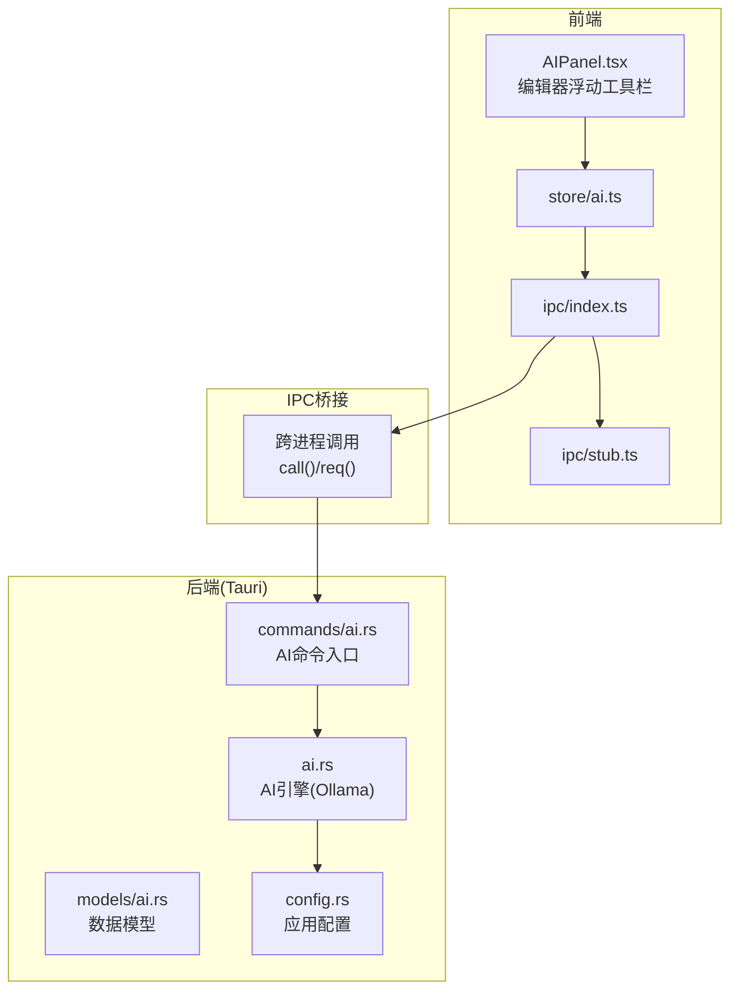
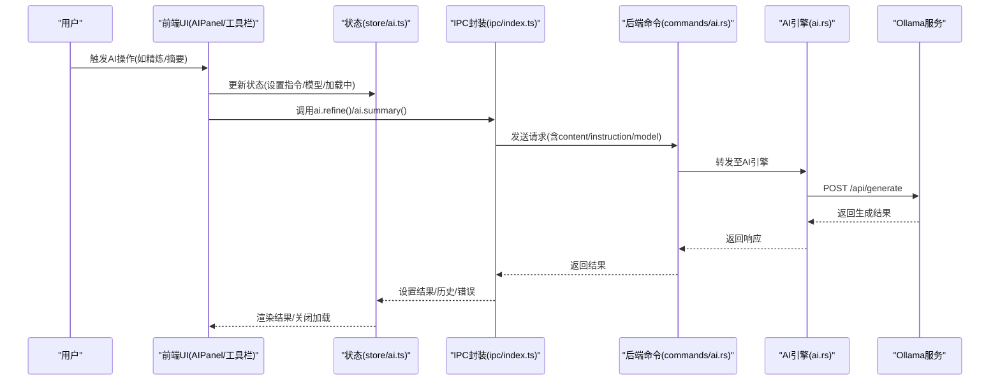
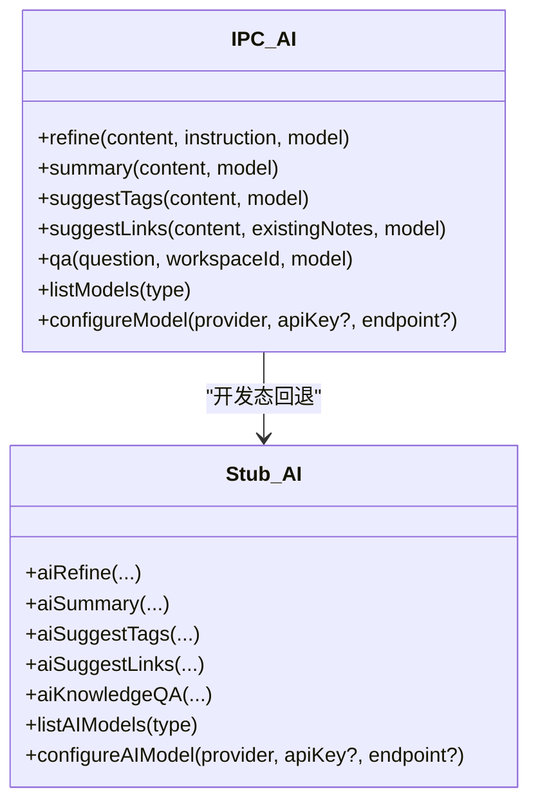
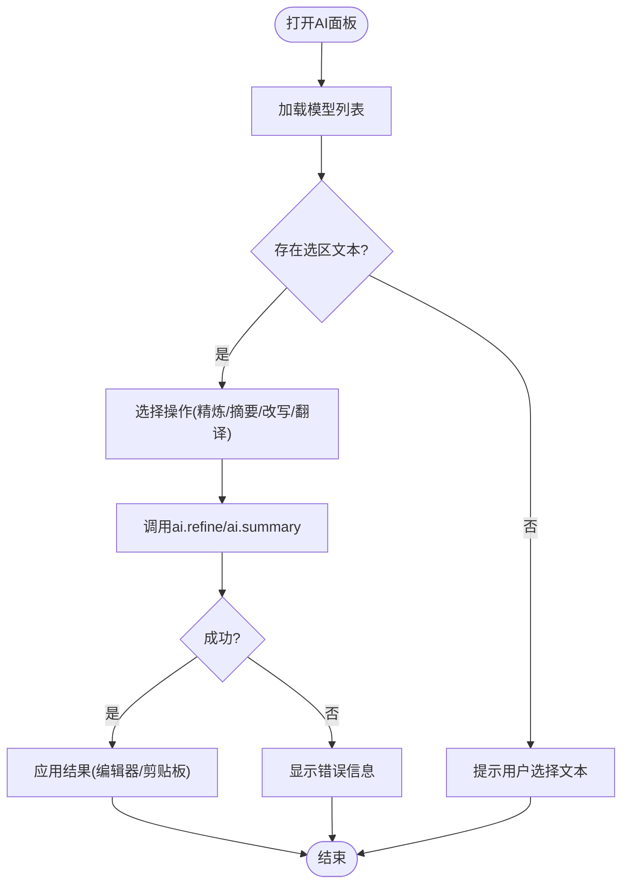
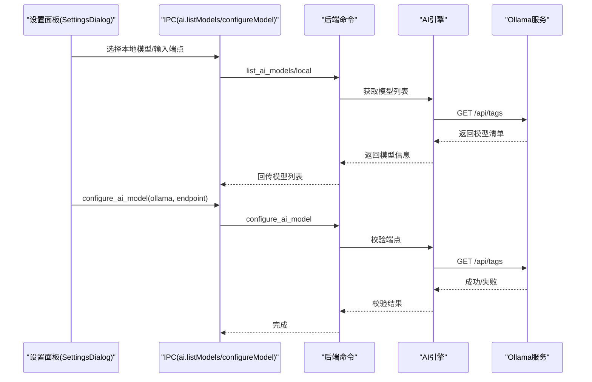
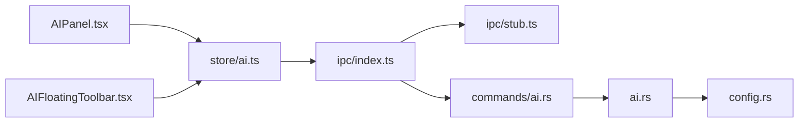

# 内置AI协作者

<cite>
**本文引用的文件**
- [src/ipc/index.ts](file://src/ipc/index.ts)
- [src/ipc/stub.ts](file://src/ipc/stub.ts)
- [src/features/ai/AIPanel.tsx](file://src/features/ai/AIPanel.tsx)
- [src/components/editor/AIFloatingToolbar.tsx](file://src/components/editor/AIFloatingToolbar.tsx)
- [src/store/ai.ts](file://src/store/ai.ts)
- [src/components/dialogs/SettingsDialog.tsx](file://src/components/dialogs/SettingsDialog.tsx)
- [src-tauri/src/ai.rs](file://src-tauri/src/ai.rs)
- [src-tauri/src/commands/ai.rs](file://src-tauri/src/commands/ai.rs)
- [src-tauri/src/models/ai.rs](file://src-tauri/src/models/ai.rs)
- [src-tauri/src/config.rs](file://src-tauri/src/config.rs)
- [src-tauri/src/main.rs](file://src-tauri/src/main.rs)
</cite>

## 目录
1. [简介](#简介)
2. [项目结构](#项目结构)
3. [核心组件](#核心组件)
4. [架构总览](#架构总览)
5. [详细组件分析](#详细组件分析)
6. [依赖关系分析](#依赖关系分析)
7. [性能考虑](#性能考虑)
8. [故障排查指南](#故障排查指南)
9. [结论](#结论)
10. [附录](#附录)

## 简介
本文件系统性阐述NoteForge内置AI协作者的设计与实现，重点覆盖以下方面：
- Ollama本地AI服务集成方案（API调用、模型管理、连接校验）
- 智能写作助手能力（内容生成、风格调整、语言润色、摘要、标签建议、链接建议）
- 批量处理与自动化（模板生成、格式转换、内容整理等思路）
- 提示工程要点（提示词设计、上下文管理、输出控制）
- 配置选项（模型选择、参数调优、资源限制）
- 协作工作流（任务分解、进度跟踪、结果评估）
- 使用示例与最佳实践

## 项目结构
NoteForge采用前端React + Tauri后端的混合架构，AI相关能力通过IPC桥接在前端与Rust后端之间协同：
- 前端层：UI组件、状态管理、IPC封装
- IPC层：统一的AI服务接口定义与桩实现（stub），用于开发态模拟
- 后端层：Tauri命令与AI引擎（Ollama）交互

图表来源
- [src/features/ai/AIPanel.tsx:42-196](file://src/features/ai/AIPanel.tsx#L42-L196)
- [src/components/editor/AIFloatingToolbar.tsx:70-116](file://src/components/editor/AIFloatingToolbar.tsx#L70-L116)
- [src/store/ai.ts:51-110](file://src/store/ai.ts#L51-L110)
- [src/ipc/index.ts:414-448](file://src/ipc/index.ts#L414-L448)
- [src/ipc/stub.ts:819-924](file://src/ipc/stub.ts#L819-L924)
- [src-tauri/src/commands/ai.rs](file://src-tauri/src/commands/ai.rs)
- [src-tauri/src/ai.rs:135-181](file://src-tauri/src/ai.rs#L135-L181)
- [src-tauri/src/models/ai.rs](file://src-tauri/src/models/ai.rs)
- [src-tauri/src/config.rs](file://src-tauri/src/config.rs)

章节来源
- [src/ipc/index.ts:414-448](file://src/ipc/index.ts#L414-L448)
- [src/ipc/stub.ts:819-924](file://src/ipc/stub.ts#L819-L924)
- [src-tauri/src/ai.rs:135-181](file://src-tauri/src/ai.rs#L135-L181)

## 核心组件
- AI服务封装（IPC层）
  - 定义内容精炼、摘要生成、标签建议、链接建议、问答等接口
  - 统一请求构造与错误处理
- 前端面板与工具栏
  - AIPanel提供对话式操作与历史记录
  - 编辑器浮动工具栏提供快捷指令
- 状态管理（Zustand）
  - 维护当前选区文本、指令、模型选择、加载状态、错误信息与历史
- Ollama集成
  - 后端发起HTTP请求至本地Ollama服务，返回生成结果
  - 支持模型可用性检测与端点配置校验

章节来源
- [src/ipc/index.ts:414-448](file://src/ipc/index.ts#L414-L448)
- [src/features/ai/AIPanel.tsx:42-196](file://src/features/ai/AIPanel.tsx#L42-L196)
- [src/components/editor/AIFloatingToolbar.tsx:70-116](file://src/components/editor/AIFloatingToolbar.tsx#L70-L116)
- [src/store/ai.ts:51-110](file://src/store/ai.ts#L51-L110)
- [src-tauri/src/ai.rs:135-181](file://src-tauri/src/ai.rs#L135-L181)

## 架构总览
NoteForge的AI协作者遵循“前端UI + IPC桥接 + 后端命令 + 外部服务”的分层架构。前端通过IPC调用后端命令，后端根据配置访问Ollama服务，最终将结果回传给前端。

图表来源
- [src/features/ai/AIPanel.tsx:42-196](file://src/features/ai/AIPanel.tsx#L42-L196)
- [src/store/ai.ts:51-110](file://src/store/ai.ts#L51-L110)
- [src/ipc/index.ts:414-448](file://src/ipc/index.ts#L414-L448)
- [src-tauri/src/commands/ai.rs](file://src-tauri/src/commands/ai.rs)
- [src-tauri/src/ai.rs:135-181](file://src-tauri/src/ai.rs#L135-L181)

## 详细组件分析

### 组件A：AI服务封装与桩实现
- 职责
  - 定义AI相关RPC方法（内容精炼、摘要、标签、链接、问答、模型列表、模型配置）
  - 在开发态提供stub实现，便于无后端时调试
- 关键点
  - 请求参数标准化（content、instruction、model、workspaceId等）
  - 错误捕获与消息提示
  - 与后端命令严格对齐的方法名与参数

图表来源
- [src/ipc/index.ts:414-448](file://src/ipc/index.ts#L414-L448)
- [src/ipc/stub.ts:819-924](file://src/ipc/stub.ts#L819-L924)

章节来源
- [src/ipc/index.ts:414-448](file://src/ipc/index.ts#L414-L448)
- [src/ipc/stub.ts:819-924](file://src/ipc/stub.ts#L819-L924)

### 组件B：智能写作助手（AIPanel与浮动工具栏）
- 功能
  - 快捷动作：精炼、摘要、改写为专业语气、翻译为英文
  - 结果应用：替换编辑器选区或复制到剪贴板
  - 历史记录：最多10条最近操作
- 交互
  - 从编辑器获取选区文本作为origin
  - 调用状态管理触发IPC请求
  - 展示加载动画与错误信息

图表来源
- [src/features/ai/AIPanel.tsx:42-196](file://src/features/ai/AIPanel.tsx#L42-L196)
- [src/components/editor/AIFloatingToolbar.tsx:70-116](file://src/components/editor/AIFloatingToolbar.tsx#L70-L116)
- [src/store/ai.ts:51-110](file://src/store/ai.ts#L51-L110)

章节来源
- [src/features/ai/AIPanel.tsx:42-196](file://src/features/ai/AIPanel.tsx#L42-L196)
- [src/components/editor/AIFloatingToolbar.tsx:70-116](file://src/components/editor/AIFloatingToolbar.tsx#L70-L116)
- [src/store/ai.ts:51-110](file://src/store/ai.ts#L51-L110)

### 组件C：Ollama集成与模型管理
- 模型列表
  - 支持本地与云端两类模型枚举
  - 本地模型包含名称、ID、提供商、可用性与延迟估算
- 模型配置
  - 通过后端校验Ollama端点连通性
  - 记录当前选中的AI模型ID
- Ollama调用
  - 向本地端点POST /api/generate发送请求
  - 解析响应并返回生成文本

图表来源
- [src/components/dialogs/SettingsDialog.tsx:63-92](file://src/components/dialogs/SettingsDialog.tsx#L63-L92)
- [src/ipc/index.ts:442-448](file://src/ipc/index.ts#L442-L448)
- [src-tauri/src/ai.rs:135-181](file://src-tauri/src/ai.rs#L135-L181)
- [src-tauri/src/commands/ai.rs](file://src-tauri/src/commands/ai.rs)

章节来源
- [src/components/dialogs/SettingsDialog.tsx:63-92](file://src/components/dialogs/SettingsDialog.tsx#L63-L92)
- [src/ipc/stub.ts:881-902](file://src/ipc/stub.ts#L881-L902)
- [src-tauri/src/ai.rs:135-181](file://src-tauri/src/ai.rs#L135-L181)

### 组件D：状态管理与历史记录
- 状态字段
  - open、loading、origin、result、instruction、models、selectedModel、status、errorMessage、history
- 行为
  - refineSelection：设置指令与原文，调用IPC，更新结果与历史
  - summarize：生成摘要并更新历史
  - retry：重试上次指令
  - applyResult：返回当前结果供面板应用

章节来源
- [src/store/ai.ts:51-110](file://src/store/ai.ts#L51-L110)

### 组件E：数据模型与配置
- AI相关模型
  - 包含模型信息、生成结果、链接建议等结构
- 应用配置
  - 记录主题、自动保存、字体大小、标签页宽度、换行、行号、小地图、AI模型ID、Ollama端点等

章节来源
- [src-tauri/src/models/ai.rs](file://src-tauri/src/models/ai.rs)
- [src-tauri/src/config.rs](file://src-tauri/src/config.rs)

## 依赖关系分析
- 前端依赖
  - UI组件依赖状态管理与IPC封装
  - 状态管理依赖IPC封装提供的方法
- IPC依赖
  - IPC封装依赖后端命令与桩实现
- 后端依赖
  - 命令层依赖AI引擎与配置模块
  - AI引擎依赖外部Ollama服务

图表来源
- [src/features/ai/AIPanel.tsx:42-196](file://src/features/ai/AIPanel.tsx#L42-L196)
- [src/components/editor/AIFloatingToolbar.tsx:70-116](file://src/components/editor/AIFloatingToolbar.tsx#L70-L116)
- [src/store/ai.ts:51-110](file://src/store/ai.ts#L51-L110)
- [src/ipc/index.ts:414-448](file://src/ipc/index.ts#L414-L448)
- [src/ipc/stub.ts:819-924](file://src/ipc/stub.ts#L819-L924)
- [src-tauri/src/commands/ai.rs](file://src-tauri/src/commands/ai.rs)
- [src-tauri/src/ai.rs:135-181](file://src-tauri/src/ai.rs#L135-L181)
- [src-tauri/src/config.rs](file://src-tauri/src/config.rs)

章节来源
- [src/ipc/index.ts:414-448](file://src/ipc/index.ts#L414-L448)
- [src-tauri/src/ai.rs:135-181](file://src-tauri/src/ai.rs#L135-L181)

## 性能考虑
- 响应时间
  - 本地模型列表与配置校验应尽量短路，避免阻塞UI
  - 生成类请求建议采用异步非阻塞方式，配合加载指示
- 网络与I/O
  - Ollama端点默认本地回环地址，确保低延迟
  - 对外网请求需考虑超时与重试策略
- UI体验
  - 优先展示摘要与快速动作，减少长耗时操作
  - 历史记录截断至10条，避免状态膨胀

## 故障排查指南
- 无法连接Ollama
  - 检查端点配置是否正确
  - 确认本地Ollama服务已启动且可访问
- 模型不可用
  - 确认模型已下载并可在本地列出
  - 查看模型可用性标记与延迟估算
- 生成结果异常
  - 检查指令是否清晰、上下文是否充分
  - 尝试简化指令或增加上下文长度
- UI无响应
  - 查看loading与errorMessage状态
  - 确认IPC调用链路正常

章节来源
- [src-tauri/src/ai.rs:135-181](file://src-tauri/src/ai.rs#L135-L181)
- [src/store/ai.ts:51-110](file://src/store/ai.ts#L51-L110)

## 结论
NoteForge的内置AI协作者以清晰的分层架构实现了本地化、可扩展的AI增强能力。通过IPC桥接与状态管理，用户可以在编辑器内便捷地进行内容精炼、摘要生成、风格调整与翻译等操作。后续可在以下方向持续演进：
- 引入更多提示工程策略与上下文压缩
- 支持云端模型与多供应商切换
- 增强批量处理与模板化工作流
- 提供更细粒度的性能监控与资源限制

## 附录

### 使用示例与最佳实践
- 快速开始
  - 在设置中选择本地Ollama端点与模型
  - 在编辑器中选中文本，点击浮动工具栏或AI面板执行操作
- 提示词设计
  - 明确目标（精炼/摘要/改写/翻译）
  - 提供必要上下文（领域术语、目标受众）
  - 控制输出长度与风格约束
- 工作流建议
  - 先摘要再精炼，逐步迭代
  - 利用历史记录对比不同指令的效果
  - 对关键段落进行专业语气改写与英文翻译

### API定义（节选）
- ai.refine(content, instruction, model?)
- ai.summary(content, model?)
- ai.suggestTags(content, model?)
- ai.suggestLinks(content, existingNotes, model?)
- ai.qa(question, workspaceId, model?)
- ai.listModels(type)
- ai.configureModel(provider, apiKey?, endpoint?)

章节来源
- [src/ipc/index.ts:414-448](file://src/ipc/index.ts#L414-L448)