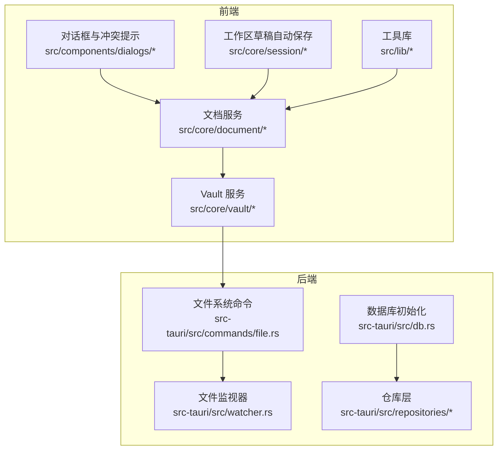
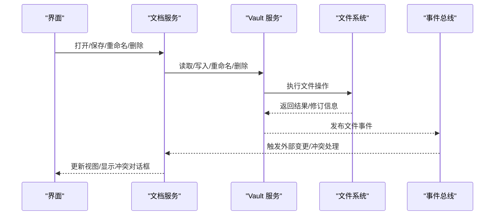
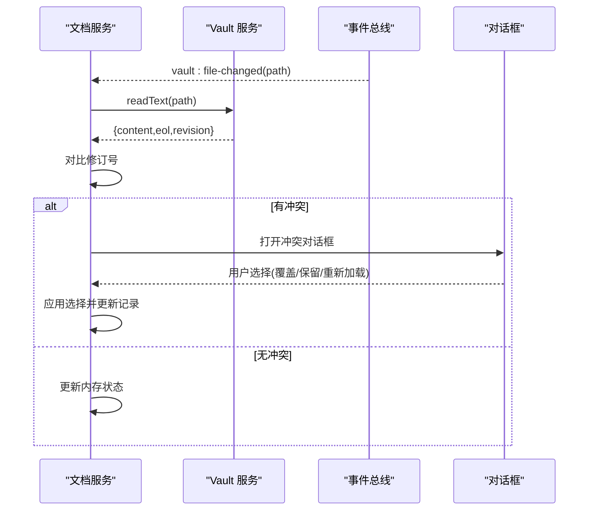
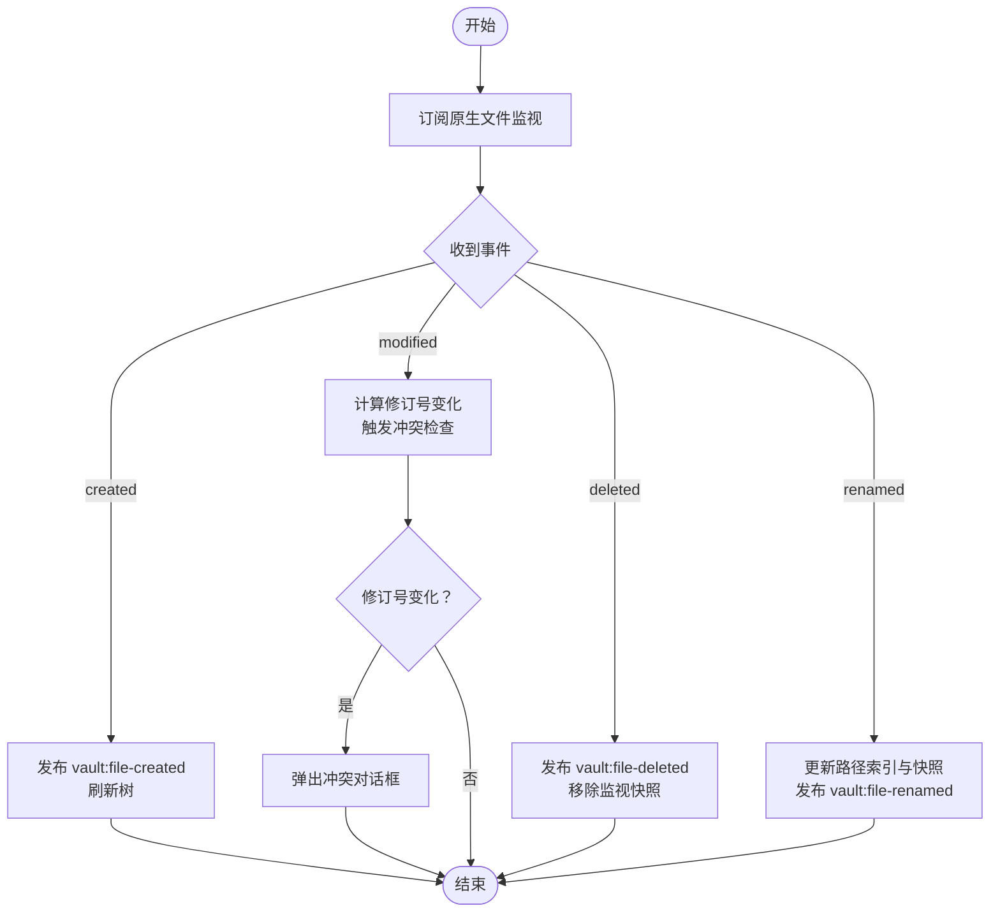
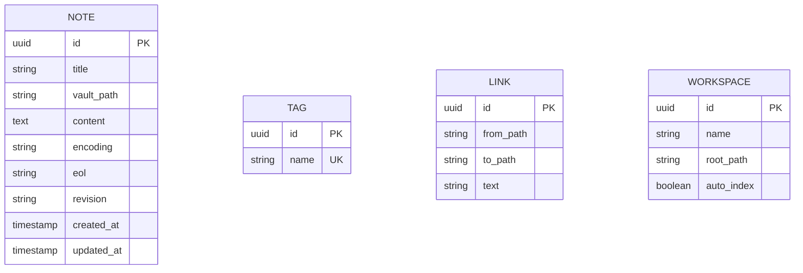
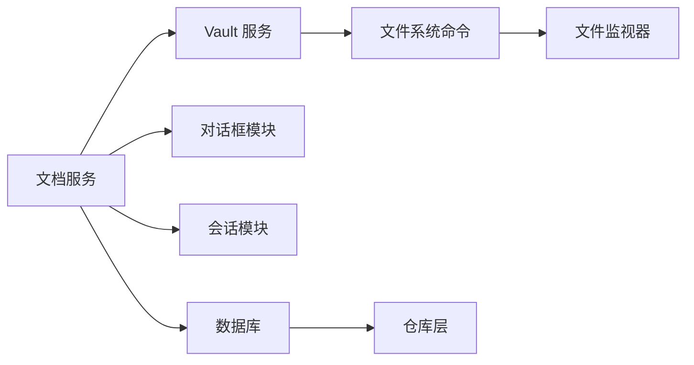

# 本地优先笔记管理

<cite>
**本文引用的文件**
- [src/core/vault/types.ts](file://src/core/vault/types.ts)
- [src/core/vault/service.ts](file://src/core/vault/service.ts)
- [src/core/vault/vault-service.impl.ts](file://src/core/vault/vault-service.impl.ts)
- [src/core/document/document-service.impl.ts](file://src/core/document/document-service.impl.ts)
- [src/core/dialog/draft-prompt.ts](file://src/core/dialog/draft-prompt.ts)
- [src/components/dialogs/DialogHost.tsx](file://src/components/dialogs/DialogHost.tsx)
- [src/core/session/workspace-draft-autosave.ts](file://src/core/session/workspace-draft-autosave.ts)
- [src-tauri/src/db.rs](file://src-tauri/src/db.rs)
- [src-tauri/src/watcher.rs](file://src-tauri/src/watcher.rs)
- [src-tauri/src/commands/vault_watch.rs](file://src-tauri/src/commands/vault_watch.rs)
- [src-tauri/src/models/note.rs](file://src-tauri/src/models/note.rs)
- [src-tauri/src/repositories/note_repo.rs](file://src-tauri/src/repositories/note_repo.rs)
- [src/lib/front-matter.ts](file://src/lib/front-matter.ts)
- [src/lib/markdown-front-matter.ts](file://src/lib/markdown-front-matter.ts)
- [src/core/platform/event-bus.ts](file://src/core/platform/event-bus.ts)
</cite>

## 目录
1. [引言](#引言)
2. [项目结构](#项目结构)
3. [核心组件](#核心组件)
4. [架构总览](#架构总览)
5. [详细组件分析](#详细组件分析)
6. [依赖关系分析](#依赖关系分析)
7. [性能考量](#性能考量)
8. [故障排查指南](#故障排查指南)
9. [结论](#结论)
10. [附录](#附录)

## 引言
本文件面向开发者与高级用户，系统性阐述 NoteForge 的“本地优先”笔记管理能力：以本地文件系统为核心的数据存储、基于 SQLite 的元数据持久化、文件监视与事件驱动的实时同步、以及离线编辑与冲突解决机制。文档重点覆盖以下主题：
- 基于本地文件系统的笔记存储架构（目录结构、命名规范、元数据）
- 离线编辑与冲突解决（本地缓存、冲突提示、增量保存）
- 数据持久化（SQLite 设计、模型映射、事务）
- 文件监视器（变更检测、自动保存、实时同步）
- 导入导出与迁移（格式转换、批量处理、路径索引）

## 项目结构
NoteForge 采用前端（React + Tauri）与后端（Rust）分层设计，核心围绕“资料库（Vault）—文档（Document）—会话（Session）—平台（Platform）”四层协作：
- 前端核心位于 src/，包含 vault、document、session、workbench、editor 等模块
- 后端位于 src-tauri/，负责文件系统命令、数据库初始化与仓库访问、文件监视
- IPC 层通过 Tauri 命令桥接前后端



图表来源
- [src/core/vault/service.ts:13-53](file://src/core/vault/service.ts#L13-L53)
- [src/core/vault/vault-service.impl.ts:1-237](file://src/core/vault/vault-service.impl.ts#L1-L237)
- [src/core/document/document-service.impl.ts:291-465](file://src/core/document/document-service.impl.ts#L291-L465)
- [src-tauri/src/db.rs:171-184](file://src-tauri/src/db.rs#L171-L184)
- [src-tauri/src/watcher.rs](file://src-tauri/src/watcher.rs)

章节来源
- [src/core/vault/service.ts:1-53](file://src/core/vault/service.ts#L1-L53)
- [src/core/vault/types.ts:1-43](file://src/core/vault/types.ts#L1-L43)
- [src/core/vault/vault-service.impl.ts:1-237](file://src/core/vault/vault-service.impl.ts#L1-L237)
- [src-tauri/src/db.rs:171-184](file://src-tauri/src/db.rs#L171-L184)

## 核心组件
- 资料库（Vault）：封装本地文件系统操作与树形浏览，提供打开/关闭、读写、重命名、删除、树懒加载、原生文件监听等能力
- 文档（Document）：统一文档生命周期（新建、打开、保存、持久化）、外部变更检测、冲突提示与解决、草稿与自动保存
- 会话（Session）：工作区草稿自动保存与刷新，支持批量持久化
- 平台（Platform）：事件总线、配置、生命周期管理

章节来源
- [src/core/vault/service.ts:13-53](file://src/core/vault/service.ts#L13-L53)
- [src/core/vault/types.ts:1-43](file://src/core/vault/types.ts#L1-L43)
- [src/core/document/document-service.impl.ts:291-465](file://src/core/document/document-service.impl.ts#L291-L465)
- [src/core/session/workspace-draft-autosave.ts](file://src/core/session/workspace-draft-autosave.ts)

## 架构总览
NoteForge 的“本地优先”由三层协同实现：
- 存储层：本地文件系统作为主存储，Vault 抽象统一文件操作
- 持久化层：SQLite 存放元数据与索引，如笔记、标签、链接、工作区状态
- 同步层：文件监视器捕获系统级变更，结合文档服务的修订号与冲突提示，实现近实时同步



图表来源
- [src/core/vault/vault-service.impl.ts:63-94](file://src/core/vault/vault-service.impl.ts#L63-L94)
- [src/core/document/document-service.impl.ts:439-462](file://src/core/document/document-service.impl.ts#L439-L462)
- [src/core/platform/event-bus.ts](file://src/core/platform/event-bus.ts)

## 详细组件分析

### 本地文件系统与资料库（Vault）
- 资料库描述与树节点
  - 资料库描述包含唯一标识、名称、根路径、是否自动索引、排除模式
  - 树节点包含路径、名称、是否目录、大小、修改时间、子节点列表
- 文件操作接口
  - 读取文本：返回内容、换行符类型、基于内容与修改时间构建的修订号
  - 写入文本：支持创建或覆盖，写入期间忽略自身写入噪声
  - 创建笔记/目录：生成相对路径并触发创建事件
  - 重命名/删除：更新路径索引与监视快照，发布对应事件
- 监视与快照
  - 使用 Map 维护路径到修订号的快照，区分外部变更与内部写入
  - 订阅原生文件监视事件，按事件类型分派处理逻辑

```mermaid
classDiagram
class VaultDescriptor {
+string id
+string name
+VaultPath rootPath
+boolean autoIndex
+string[] excludePatterns
}
class VaultTreeNode {
+VaultPath path
+string name
+boolean isDir
+number size
+string modified
+VaultTreeNode[] children
}
class VaultService {
+getCurrent() VaultDescriptor?
+open(rootPath) Promise~VaultDescriptor~
+close() Promise~void~
+listRecent() Promise~VaultDescriptor[]~
+readText(path) Promise~{content,eol,revision}~
+writeText(path,content,options?) Promise~void~
+createNote(options) Promise~VaultPath~
+createDirectory(parentDir,name) Promise~VaultPath~
+rename(oldPath,options) Promise~VaultPath~
+delete(path) Promise~void~
+getTree() VaultTreeNode?
+loadChildren(dirPath) Promise~VaultTreeNode[]~
+pickVaultRoot() Promise~VaultPath?~
+pickSavePath(defaultName,parentDir?) Promise~VaultPath?~
+startWatching() Promise~void~
+stopWatching() Promise~void~
+trackForWatch(path,revision) void
+untrackForWatch(path) void
}
VaultService --> VaultDescriptor : "管理"
VaultService --> VaultTreeNode : "构建树"
```

图表来源
- [src/core/vault/types.ts:3-43](file://src/core/vault/types.ts#L3-L43)
- [src/core/vault/service.ts:13-53](file://src/core/vault/service.ts#L13-L53)

章节来源
- [src/core/vault/types.ts:1-43](file://src/core/vault/types.ts#L1-L43)
- [src/core/vault/service.ts:1-53](file://src/core/vault/service.ts#L1-L53)
- [src/core/vault/vault-service.impl.ts:63-195](file://src/core/vault/vault-service.impl.ts#L63-L195)

### 文档服务与离线编辑
- 生命周期与持久化
  - 新建/打开：记录 baseline、dirty 标记、savedRevision、disk 修订信息
  - 保存：写入磁盘后更新记录、清理冲突、发出保存事件
  - 保存为：处理路径变更，清理旧路径索引与监视跟踪，删除旧草稿
- 外部变更检测与冲突
  - 监听 vault:file-changed、vault:file-deleted、vault:file-renamed 事件
  - 对比磁盘修订号与内存修订号，触发不同冲突解决策略
- 冲突解决对话框
  - 草稿恢复冲突：选择加载缓存或磁盘版本
  - 保存冲突：选择从磁盘重新加载、覆盖磁盘或取消
  - 一般外部变更：选择从磁盘重新加载或保留本地更改



图表来源
- [src/core/document/document-service.impl.ts:439-462](file://src/core/document/document-service.impl.ts#L439-L462)
- [src/components/dialogs/DialogHost.tsx:289-331](file://src/components/dialogs/DialogHost.tsx#L289-L331)
- [src/core/dialog/draft-prompt.ts:10-40](file://src/core/dialog/draft-prompt.ts#L10-L40)

章节来源
- [src/core/document/document-service.impl.ts:291-465](file://src/core/document/document-service.impl.ts#L291-L465)
- [src/core/dialog/draft-prompt.ts:1-40](file://src/core/dialog/draft-prompt.ts#L1-L40)
- [src/components/dialogs/DialogHost.tsx:218-379](file://src/components/dialogs/DialogHost.tsx#L218-L379)

### 工作区草稿自动保存与增量刷新
- 草稿持久化
  - 在会话结束或应用退出前，将脏草稿批量写入磁盘或数据库
  - 提供 flush 接口，确保离线编辑不会丢失
- 增量刷新
  - 仅对变更的文档执行刷新，减少 IO 压力
  - 结合路径索引与监视快照，避免重复处理

章节来源
- [src/core/session/workspace-draft-autosave.ts](file://src/core/session/workspace-draft-autosave.ts)
- [src/core/document/document-service.impl.ts:431-436](file://src/core/document/document-service.impl.ts#L431-L436)

### 文件监视器与实时同步
- 原生监视
  - 订阅系统级文件事件（创建/修改/删除/重命名），过滤自身写入噪声
  - 将事件转换为 VaultWatchEvent，并分派给 Vault 服务
- 实时同步
  - 监听 vault:* 事件，更新树形结构、路径索引与监视快照
  - 对外部变更进行冲突提示，保证一致性



图表来源
- [src/core/vault/vault-service.impl.ts:63-94](file://src/core/vault/vault-service.impl.ts#L63-L94)
- [src-tauri/src/watcher.rs](file://src-tauri/src/watcher.rs)
- [src-tauri/src/commands/vault_watch.rs](file://src-tauri/src/commands/vault_watch.rs)

章节来源
- [src/core/vault/vault-service.impl.ts:63-94](file://src/core/vault/vault-service.impl.ts#L63-L94)
- [src-tauri/src/watcher.rs](file://src-tauri/src/watcher.rs)
- [src-tauri/src/commands/vault_watch.rs](file://src-tauri/src/commands/vault_watch.rs)

### 数据持久化与 SQLite 设计
- 数据库初始化
  - 在应用数据目录创建数据库文件，初始化表结构
- 模型与仓库
  - 笔记模型定义字段与约束
  - 仓库层提供 CRUD 与查询接口，支持事务与批量操作
- 元数据管理
  - 文档记录与磁盘修订号用于冲突检测
  - 路径索引与监视快照用于快速定位与增量更新



图表来源
- [src-tauri/src/models/note.rs](file://src-tauri/src/models/note.rs)
- [src-tauri/src/repositories/note_repo.rs](file://src-tauri/src/repositories/note_repo.rs)
- [src-tauri/src/db.rs:171-184](file://src-tauri/src/db.rs#L171-L184)

章节来源
- [src-tauri/src/db.rs:171-184](file://src-tauri/src/db.rs#L171-L184)
- [src-tauri/src/models/note.rs](file://src-tauri/src/models/note.rs)
- [src-tauri/src/repositories/note_repo.rs](file://src-tauri/src/repositories/note_repo.rs)

### 导入、导出与迁移
- 导入
  - 支持从外部源批量创建笔记，可指定父目录与文件名
  - 借助 front matter 解析与元数据提取，保持标题、标签、日期等信息
- 导出
  - 支持按路径或筛选条件导出笔记，保留编码与换行风格
- 迁移
  - 重命名事件触发路径索引与监视快照更新，保证后续读写正确
  - 删除事件清理索引与快照，避免悬挂引用

章节来源
- [src/core/vault/vault-service.impl.ts:197-227](file://src/core/vault/vault-service.impl.ts#L197-L227)
- [src/lib/front-matter.ts](file://src/lib/front-matter.ts)
- [src/lib/markdown-front-matter.ts](file://src/lib/markdown-front-matter.ts)

## 依赖关系分析
- 组件耦合
  - 文档服务依赖 Vault 服务进行文件读写与事件订阅
  - 对话框模块依赖文档服务提供的冲突提示与解决流程
  - 会话模块依赖文档服务进行草稿持久化
- 外部依赖
  - Tauri 命令桥接前端与后端，提供文件系统与数据库访问
  - 事件总线贯穿各模块，解耦异步通知



图表来源
- [src/core/vault/service.ts:13-53](file://src/core/vault/service.ts#L13-L53)
- [src/core/document/document-service.impl.ts:291-465](file://src/core/document/document-service.impl.ts#L291-L465)
- [src-tauri/src/db.rs:171-184](file://src-tauri/src/db.rs#L171-L184)

章节来源
- [src/core/vault/service.ts:13-53](file://src/core/vault/service.ts#L13-L53)
- [src/core/document/document-service.impl.ts:291-465](file://src/core/document/document-service.impl.ts#L291-L465)

## 性能考量
- I/O 优化
  - 写入时区分创建与覆盖，减少不必要的错误回退
  - 自身写入期间忽略监视噪声，降低无效刷新
- 冲突检测
  - 基于修订号对比，避免全量内容比较
  - 仅在必要时弹出对话框，减少 UI 阻塞
- 数据库
  - 初始化阶段一次性创建数据库与索引
  - 仓库层提供批量操作接口，降低事务开销

## 故障排查指南
- 无法保存/覆盖磁盘
  - 检查保存冲突对话框的选择，确认是否选择了“覆盖磁盘”
  - 若被外部程序修改，建议先“从磁盘重新加载”，再合并本地更改
- 草稿未恢复
  - 检查是否存在“未保存的编辑缓存”，选择“加载暂存内容”
- 文件监视不生效
  - 确认已调用 startWatching 并订阅 vault:* 事件
  - 检查自身写入集合是否正确清空，避免误判为外部变更
- 数据库异常
  - 确认数据库初始化成功且表结构已创建
  - 如需迁移，检查模型与仓库层的版本兼容性

章节来源
- [src/components/dialogs/DialogHost.tsx:289-331](file://src/components/dialogs/DialogHost.tsx#L289-L331)
- [src/core/dialog/draft-prompt.ts:10-40](file://src/core/dialog/draft-prompt.ts#L10-L40)
- [src/core/vault/vault-service.impl.ts:63-94](file://src/core/vault/vault-service.impl.ts#L63-L94)
- [src-tauri/src/db.rs:171-184](file://src-tauri/src/db.rs#L171-L184)

## 结论
NoteForge 的“本地优先”通过本地文件系统、SQLite 元数据与事件驱动的文件监视实现了高可靠、低延迟的笔记管理体验。其设计强调：
- 以文件为中心的存储与路径索引
- 基于修订号的冲突检测与可视化解决
- 会话级草稿自动保存与增量持久化
- 原生文件监视与事件总线的实时同步

## 附录

### 配置选项与最佳实践
- 资料库配置
  - 自动索引：控制是否启用自动扫描
  - 排除模式：支持通配符，避免监控无关文件
- 编码与换行
  - 默认 UTF-8 编码，LF 或 CRLF 换行
- 监视策略
  - 对大目录建议设置排除模式，减少监视压力
  - 对频繁写入场景，注意自身写入噪声的过滤
- 冲突处理
  - 优先使用对话框进行人工决策，避免自动覆盖导致数据丢失
- 数据库
  - 定期备份应用数据目录，确保数据库安全

章节来源
- [src/core/vault/types.ts:20-32](file://src/core/vault/types.ts#L20-L32)
- [src/core/vault/vault-service.impl.ts:164-195](file://src/core/vault/vault-service.impl.ts#L164-L195)
- [src-tauri/src/db.rs:171-184](file://src-tauri/src/db.rs#L171-L184)