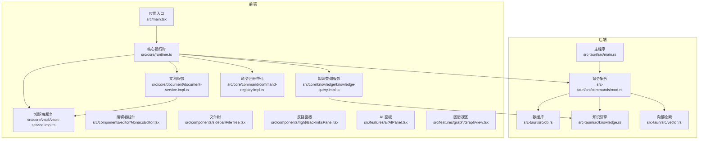
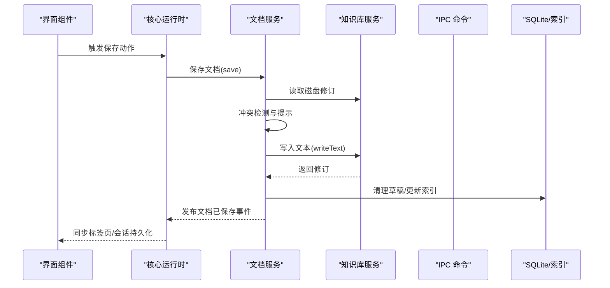
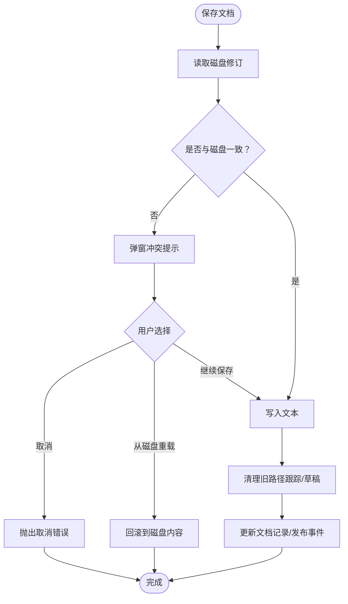
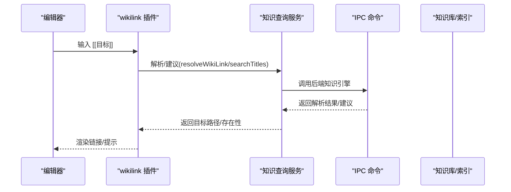
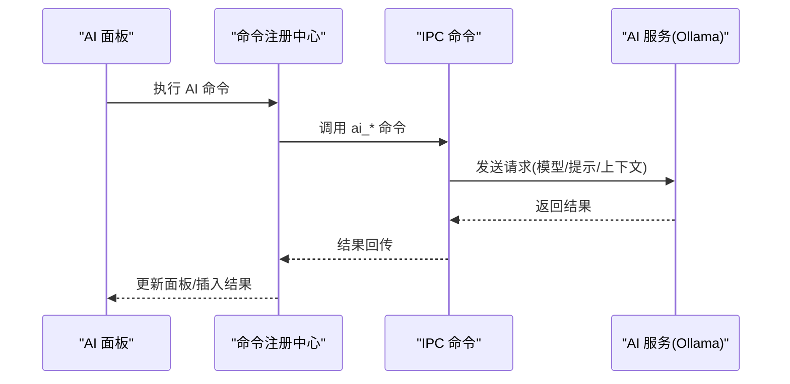
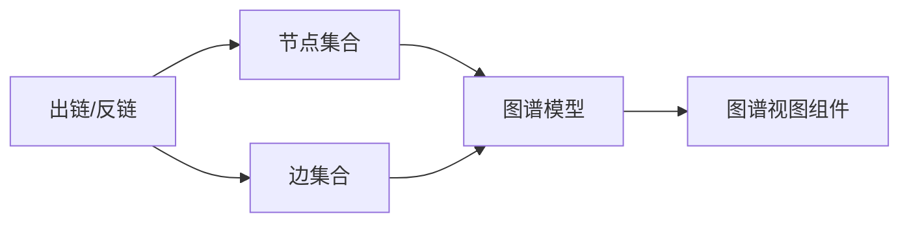
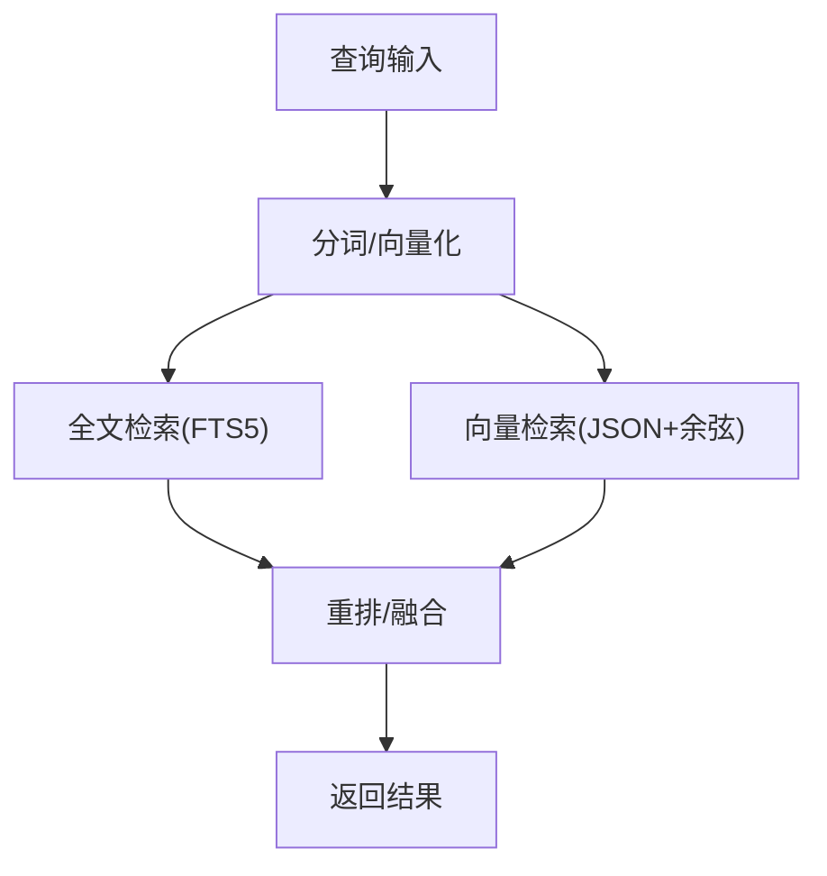
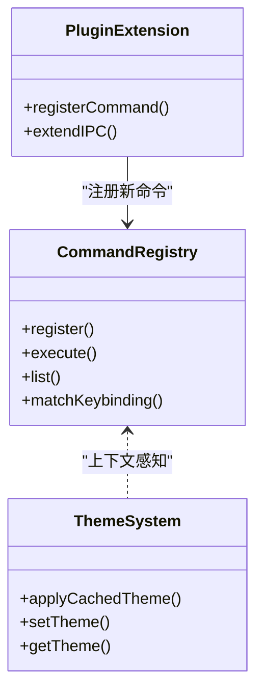
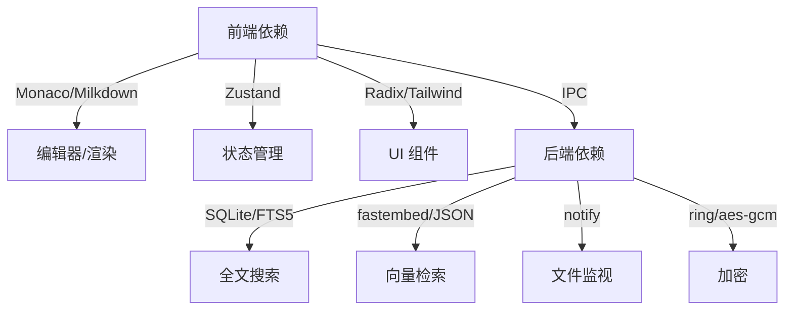

# 核心特性

<cite>
**本文档引用的文件**
- [README.md](file://README.md)
- [package.json](file://package.json)
- [src/main.tsx](file://src/main.tsx)
- [src/core/index.ts](file://src/core/index.ts)
- [src/core/runtime.ts](file://src/core/runtime.ts)
- [src/core/vault/vault-service.impl.ts](file://src/core/vault/vault-service.impl.ts)
- [src/core/document/document-service.impl.ts](file://src/core/document/document-service.impl.ts)
- [src/core/knowledge/knowledge-query.impl.ts](file://src/core/knowledge/knowledge-query.impl.ts)
- [src/core/command/command-registry.impl.ts](file://src/core/command/command-registry.impl.ts)
- [src-tauri/src/main.rs](file://src-tauri/src/main.rs)
- [src-tauri/src/commands/mod.rs](file://src-tauri/src/commands/mod.rs)
- [src-tauri/src/vector.rs](file://src-tauri/src/vector.rs)
- [src-tauri/src/knowledge.rs](file://src-tauri/src/knowledge.rs)
- [src-tauri/src/db.rs](file://src-tauri/src/db.rs)
- [src-tauri/src/models/graph.rs](file://src-tauri/src/models/graph.rs)
- [src/features/markdown/wikilink-plugin.ts](file://src/features/markdown/wikilink-plugin.ts)
- [src/features/graph/GraphView.tsx](file://src/features/graph/GraphView.tsx)
- [src/features/ai/AIPanel.tsx](file://src/features/ai/AIPanel.tsx)
- [src/components/editor/MonacoEditor.tsx](file://src/components/editor/MonacoEditor.tsx)
- [src/components/sidebar/FileTree.tsx](file://src/components/sidebar/FileTree.tsx)
- [src/components/right/BacklinksPanel.tsx](file://src/components/right/BacklinksPanel.tsx)
- [src/components/dialogs/GlobalSearchDialog.tsx](file://src/components/dialogs/GlobalSearchDialog.tsx)
- [src/hooks/useShortcuts.ts](file://src/hooks/useShortcuts.ts)
</cite>

## 目录
1. [引言](#引言)
2. [项目结构](#项目结构)
3. [核心组件](#核心组件)
4. [架构总览](#架构总览)
5. [详细组件分析](#详细组件分析)
6. [依赖分析](#依赖分析)
7. [性能考虑](#性能考虑)
8. [故障排除指南](#故障排除指南)
9. [结论](#结论)
10. [附录](#附录)

## 引言
NoteForge 是一个“本地优先”的技术知识工作站，强调本地文件系统优先、编辑器与知识库深度融合、以及内置 AI 协作者能力。其核心目标是为人类与 AI 代理提供高效、可靠、可离线的知识管理体验。技术上采用 Tauri v2 + React + Monaco Editor 的桌面应用架构，后端由 Rust 实现，结合 SQLite、全文搜索（FTS5 + jieba-rs）、向量搜索（fastembed + JSON）与本地 AI（Ollama）等技术栈。

本章节将围绕以下核心特性进行深入说明：
- 本地优先的笔记管理：文件系统集成、离线编辑、数据持久化
- 编辑器与知识库的深度融合：双向链接、引用关系、内容同步
- 内置 AI 协作者：智能写作助手、内容生成、批量处理
- 知识图谱构建与可视化：原理与使用方法
- 全文搜索与向量搜索的混合检索机制
- 主题系统、快捷键系统、插件扩展等用户体验增强

## 项目结构
NoteForge 采用前后端分离但紧密协作的架构：
- 前端（React + TypeScript）负责 UI、编辑器、对话框、侧边栏、右侧面板等
- 后端（Rust + Tauri）负责文件系统操作、数据库、索引与搜索、向量检索、AI 服务桥接等
- IPC 层通过 Tauri 将前端与后端命令对接，形成统一的服务调用接口

图表来源
- [src/main.tsx:1-24](file://src/main.tsx#L1-L24)
- [src/core/runtime.ts:43-100](file://src/core/runtime.ts#L43-L100)
- [src/core/document/document-service.impl.ts:48-466](file://src/core/document/document-service.impl.ts#L48-L466)
- [src/core/vault/vault-service.impl.ts:31-314](file://src/core/vault/vault-service.impl.ts#L31-L314)
- [src/core/knowledge/knowledge-query.impl.ts:41-148](file://src/core/knowledge/knowledge-query.impl.ts#L41-L148)
- [src-tauri/src/main.rs:1-101](file://src-tauri/src/main.rs#L1-L101)
- [src-tauri/src/db.rs](file://src-tauri/src/db.rs)
- [src-tauri/src/knowledge.rs](file://src-tauri/src/knowledge.rs)
- [src-tauri/src/vector.rs](file://src-tauri/src/vector.rs)
- [src-tauri/src/commands/mod.rs](file://src-tauri/src/commands/mod.rs)

章节来源
- [README.md:75-112](file://README.md#L75-L112)
- [package.json:17-48](file://package.json#L17-L48)
- [src/main.tsx:1-24](file://src/main.tsx#L1-L24)

## 核心组件
本节概述 NoteForge 的核心域模型与服务层，它们共同构成“本地优先”与“知识深度整合”的基础。

- 运行时与事件总线
  - 初始化顺序：事件总线 → 知识库服务 → 文档服务 → 工作台服务 → 命令注册中心 → 对话框服务 → 知识查询服务 → 编辑器宿主
  - 事件驱动：文档变更、冲突、关闭、外部文件变化等事件触发自动保存、会话持久化、UI 同步
- 知识库服务（Vault）
  - 提供打开/关闭知识库、读写文本、创建/删除/重命名、树形目录加载、文件监听（原生与轮询双模式）
- 文档服务（Document）
  - 生命周期：打开/创建/关闭/保存/回滚；冲突检测与解决；草稿与自动保存；视图状态管理
- 知识查询服务（Knowledge）
  - 标题搜索、反链查询、标题解析、出链提取、全文索引重建调度
- 命令注册中心（Command Registry）
  - 命令注册、快捷键匹配、上下文感知执行、分类与命令面板支持

章节来源
- [src/core/runtime.ts:29-100](file://src/core/runtime.ts#L29-L100)
- [src/core/vault/vault-service.impl.ts:31-314](file://src/core/vault/vault-service.impl.ts#L31-L314)
- [src/core/document/document-service.impl.ts:48-466](file://src/core/document/document-service.impl.ts#L48-L466)
- [src/core/knowledge/knowledge-query.impl.ts:41-148](file://src/core/knowledge/knowledge-query.impl.ts#L41-L148)
- [src/core/command/command-registry.impl.ts:10-100](file://src/core/command/command-registry.impl.ts#L10-L100)

## 架构总览
NoteForge 的整体架构遵循“前端服务 + 后端命令”的 IPC 模式。前端通过 Tauri 注册的命令调用后端能力，后端在 Rust 中实现高性能的数据处理、索引与检索，并通过 SQLite 与文件系统交互。

图表来源
- [src/core/runtime.ts:138-172](file://src/core/runtime.ts#L138-L172)
- [src/core/document/document-service.impl.ts:250-312](file://src/core/document/document-service.impl.ts#L250-L312)
- [src/core/vault/vault-service.impl.ts:176-195](file://src/core/vault/vault-service.impl.ts#L176-L195)
- [src-tauri/src/main.rs:19-97](file://src-tauri/src/main.rs#L19-L97)

## 详细组件分析

### 本地优先的笔记管理：文件系统集成、离线编辑、数据持久化
- 文件系统集成
  - 知识库打开：尝试打开现有工作区，不存在则创建；随后启动原生文件监听或轮询监听
  - 文件操作：读取/写入/创建/删除/重命名；树形目录加载与刷新
  - 监听策略：原生监听优先，非 Tauri 平台采用定时轮询，避免重复通知与自写入噪声
- 离线编辑
  - 文档服务支持“无路径临时文档”（草稿），在未指定保存路径前不写入磁盘
  - 外部修改检测：基于内容与修改时间构建磁盘修订号，变化时触发文档更新
- 数据持久化
  - 保存流程：先检查磁盘修订一致性，冲突时弹窗提示；成功写入后清理草稿并更新磁盘记录
  - 自动保存：工作区草稿与临时草稿分别在合适时机刷写，退出时统一刷新

图表来源
- [src/core/document/document-service.impl.ts:250-312](file://src/core/document/document-service.impl.ts#L250-L312)
- [src/core/vault/vault-service.impl.ts:176-195](file://src/core/vault/vault-service.impl.ts#L176-L195)

章节来源
- [src/core/vault/vault-service.impl.ts:106-143](file://src/core/vault/vault-service.impl.ts#L106-L143)
- [src/core/vault/vault-service.impl.ts:262-298](file://src/core/vault/vault-service.impl.ts#L262-L298)
- [src/core/document/document-service.impl.ts:145-189](file://src/core/document/document-service.impl.ts#L145-L189)
- [src/core/document/document-service.impl.ts:250-312](file://src/core/document/document-service.impl.ts#L250-L312)
- [src/core/document/document-service.impl.ts:349-367](file://src/core/document/document-service.impl.ts#L349-L367)

最佳实践
- 在团队协作中，建议开启“冲突提示”，避免覆盖他人修改
- 对大文件建议分拆为多个小文件，提升索引与渲染性能
- 使用“草稿”功能进行实验性编辑，完成后统一提交

### 编辑器与知识库的深度融合：双向链接、引用关系、内容同步
- 双向链接与标题解析
  - 解析 [[wiki 链接]]，支持别名与模糊匹配，提供标题建议
  - 提取文档中的标题，生成层级与锚点，便于导航
- 反链与出链
  - 查询某笔记被哪些笔记引用（反链）
  - 提取当前笔记指向其他笔记的链接（出链）
- 内容同步
  - 知识查询服务基于内存中的文档快照，确保编辑器与知识库视图一致
  - 索引重建按事件节流，避免频繁 IO

图表来源
- [src/features/markdown/wikilink-plugin.ts](file://src/features/markdown/wikilink-plugin.ts)
- [src/core/knowledge/knowledge-query.impl.ts:120-134](file://src/core/knowledge/knowledge-query.impl.ts#L120-L134)
- [src/core/knowledge/knowledge-query.impl.ts:62-75](file://src/core/knowledge/knowledge-query.impl.ts#L62-L75)
- [src/core/knowledge/knowledge-query.impl.ts:96-118](file://src/core/knowledge/knowledge-query.impl.ts#L96-L118)
- [src-tauri/src/main.rs:39-45](file://src-tauri/src/main.rs#L39-L45)

章节来源
- [src/core/knowledge/knowledge-query.impl.ts:41-148](file://src/core/knowledge/knowledge-query.impl.ts#L41-L148)
- [src/features/markdown/wikilink-plugin.ts](file://src/features/markdown/wikilink-plugin.ts)
- [src/components/right/BacklinksPanel.tsx](file://src/components/right/BacklinksPanel.tsx)

最佳实践
- 使用稳定的标题作为 wiki 链接目标，减少重构成本
- 在长文档中合理使用标题层级，提升导航效率
- 利用反链面板快速发现相关笔记与潜在重复

### 内置 AI 协作者：智能写作助手、内容生成、批量处理
- 能力范围
  - 内容优化与润色、摘要生成、标签建议、链接建议、问答检索
  - 支持列出可用模型、配置模型参数
- 调用方式
  - 通过 IPC 命令调用后端 AI 服务（默认对接本地 Ollama）
- 使用场景
  - 快速生成初稿、提炼要点、扩写细节、统一风格
  - 批量为多篇笔记添加标签或建议相关链接

图表来源
- [src/features/ai/AIPanel.tsx](file://src/features/ai/AIPanel.tsx)
- [src-tauri/src/main.rs:58-64](file://src-tauri/src/main.rs#L58-L64)
- [src-tauri/src/commands/ai.rs](file://src-tauri/src/commands/ai.rs)

章节来源
- [src-tauri/src/main.rs:58-64](file://src-tauri/src/main.rs#L58-L64)
- [README.md:19](file://README.md#L19)

最佳实践
- 为 AI 提供清晰的指令与上下文，提高输出质量
- 对批量处理设置合理的上限，避免阻塞 UI
- 使用“草稿”功能预览 AI 输出后再合并到正式笔记

### 知识图谱构建与可视化：原理与使用方法
- 构建原理
  - 基于 wiki 链接与反链，抽取节点与边，形成可查询的图谱
  - 图谱模型包含节点属性与边权重，支持查询与过滤
- 可视化
  - 提供图谱视图组件，支持交互式浏览、缩放与高亮
- 使用方法
  - 在侧边栏或图谱视图中查看节点与邻接关系
  - 通过搜索面板定位节点并跳转

图表来源
- [src-tauri/src/knowledge.rs](file://src-tauri/src/knowledge.rs)
- [src-tauri/src/models/graph.rs](file://src-tauri/src/models/graph.rs)
- [src/features/graph/GraphView.tsx](file://src/features/graph/GraphView.tsx)

章节来源
- [src-tauri/src/knowledge.rs](file://src-tauri/src/knowledge.rs)
- [src-tauri/src/models/graph.rs](file://src-tauri/src/models/graph.rs)
- [src/features/graph/GraphView.tsx](file://src/features/graph/GraphView.tsx)

最佳实践
- 保持 wiki 链接的一致性，避免孤岛节点
- 使用图谱视图识别知识空白与冗余连接
- 结合标签与时间线，对图谱进行多维过滤

### 全文搜索与向量搜索的混合检索机制
- 全文搜索
  - 基于 SQLite FTS5 + unicode61 分词器，中文查询配合 jieba-rs 分词
- 向量搜索
  - 使用 fastembed 生成嵌入，当前以 JSON + 内存余弦相似度实现（待 sqlite-vec 构建稳定后迁移）
- 混合检索
  - 将语义相似度与关键词匹配结果融合，提升召回与排序质量
- 能力暴露
  - 通过 IPC 命令提供全文检索与语义检索接口

图表来源
- [README.md:15-17](file://README.md#L15-L17)
- [src-tauri/src/vector.rs](file://src-tauri/src/vector.rs)
- [src-tauri/src/main.rs:45](file://src-tauri/src/main.rs#L45)

章节来源
- [README.md:15-17](file://README.md#L15-L17)
- [src-tauri/src/vector.rs](file://src-tauri/src/vector.rs)
- [src-tauri/src/main.rs:45](file://src-tauri/src/main.rs#L45)

最佳实践
- 对长文档进行结构化组织，提升全文检索命中率
- 使用向量检索补充语义理解，尤其适合概念检索
- 结合标签与时间线过滤，缩小候选集

### 主题系统、快捷键系统、插件扩展
- 主题系统
  - 通过缓存与切换主题，适配不同视觉偏好
- 快捷键系统
  - 命令注册中心支持键位绑定与上下文判断（输入上下文、编辑器焦点、Markdown 激活态等）
  - 提供命令面板与分类展示，便于学习与记忆
- 插件扩展
  - 通过 IPC 命令扩展后端能力（如新增 AI 模型、搜索策略、加密方案等）

图表来源
- [src/core/command/command-registry.impl.ts:10-100](file://src/core/command/command-registry.impl.ts#L10-L100)
- [src/main.tsx:4](file://src/main.tsx#L4)
- [src-tauri/src/main.rs:19-97](file://src-tauri/src/main.rs#L19-L97)

章节来源
- [src/core/command/command-registry.impl.ts:10-100](file://src/core/command/command-registry.impl.ts#L10-L100)
- [src/main.tsx:4](file://src/main.tsx#L4)
- [src/hooks/useShortcuts.ts](file://src/hooks/useShortcuts.ts)

最佳实践
- 为常用操作绑定快捷键，减少鼠标切换
- 使用命令面板探索功能，逐步掌握快捷键体系
- 通过插件扩展满足特定工作流需求

## 依赖分析
- 前端依赖
  - React + TypeScript + Zustand 状态管理
  - Monaco Editor 与 Milkdown Markdown 渲染
  - Radix UI + Tailwind CSS UI 组件库
- 后端依赖
  - Tauri v2 + Rust 核心
  - SQLite + FTS5 + jieba-rs（全文）
  - fastembed + JSON（向量）
  - notify（文件监视）
  - ring + aes-gcm（加密）
- IPC 命令
  - 命令集中管理所有跨语言调用，涵盖工作区、文件、编辑器、知识、AI、搜索、加密、配置、草稿与会话等

图表来源
- [package.json:17-48](file://package.json#L17-L48)
- [README.md:15-20](file://README.md#L15-L20)
- [src-tauri/src/main.rs:19-97](file://src-tauri/src/main.rs#L19-L97)

章节来源
- [package.json:17-48](file://package.json#L17-L48)
- [README.md:15-20](file://README.md#L15-L20)
- [src-tauri/src/main.rs:19-97](file://src-tauri/src/main.rs#L19-L97)

## 性能考虑
- 索引与监听
  - 知识索引按事件节流重建，避免频繁 IO；文件监听区分自写入路径，降低无效事件
- 搜索
  - 全文与向量双通道检索，建议先做关键词过滤再做语义打分
- 编辑器
  - 使用草稿与自动保存减少主线程压力；大文档建议分屏或延迟加载
- 数据库
  - SQLite 事务批处理写入，避免频繁 fsync

## 故障排除指南
- 冲突提示
  - 当磁盘内容与本地不一致时，文档服务会弹窗提示，支持从磁盘重载或保留本地
- 外部修改
  - 若检测到外部修改且未脏，则自动回填最新内容；若本地已修改则保持本地
- 保存失败
  - 可能因权限或路径无效导致；检查保存路径与权限
- 知识索引异常
  - 索引重建失败时会记录错误日志；可手动触发重新索引

章节来源
- [src/core/document/document-service.impl.ts:265-279](file://src/core/document/document-service.impl.ts#L265-L279)
- [src/core/document/document-service.impl.ts:349-367](file://src/core/document/document-service.impl.ts#L349-L367)
- [src/core/knowledge/knowledge-query.impl.ts:136-144](file://src/core/knowledge/knowledge-query.impl.ts#L136-L144)

## 结论
NoteForge 通过“本地优先”的设计与“编辑器—知识库—AI”的深度融合，提供了从创作、组织到检索的完整闭环。其基于 Rust 的高性能后端与成熟的前端生态相结合，既保证了可靠性与性能，又为扩展与定制留足空间。建议在实际使用中结合最佳实践，持续优化工作流与知识结构。

## 附录
- 快速开始
  - 安装依赖后，使用开发模式启动前端与后端一体化运行
- 常用脚本
  - 前端：dev/build/preview/lint/format
  - Tauri：dev/build
- 技术验证
  - 参考技术验证报告了解性能与兼容性评估

章节来源
- [README.md:32-59](file://README.md#L32-L59)
- [README.md:114-125](file://README.md#L114-L125)