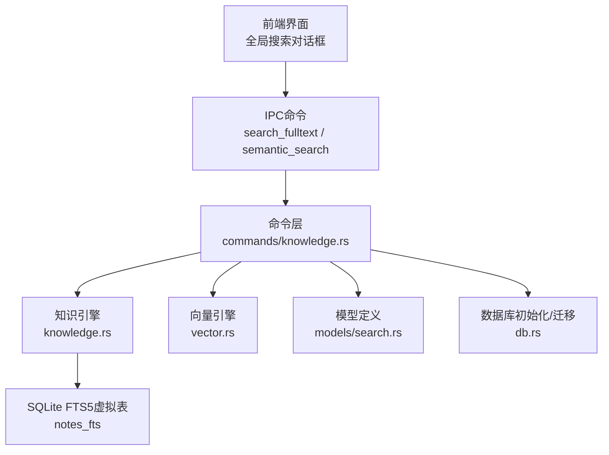
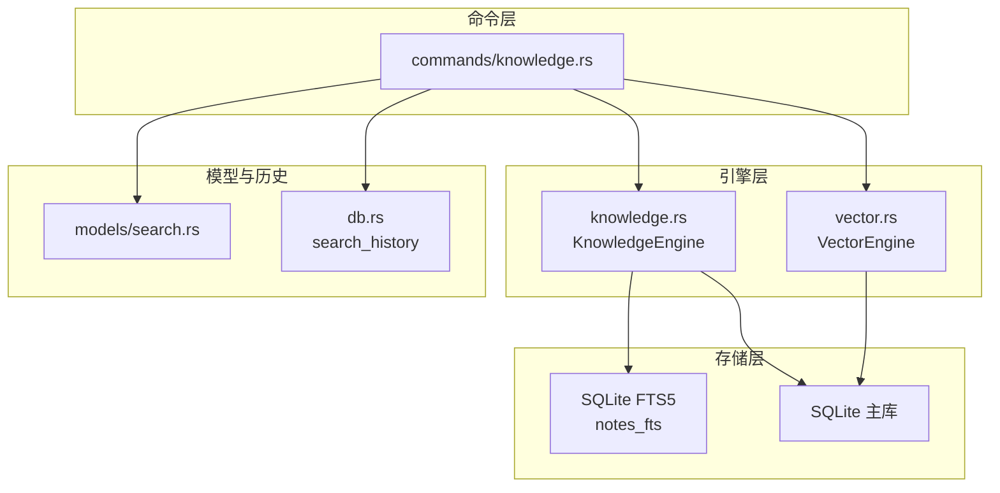
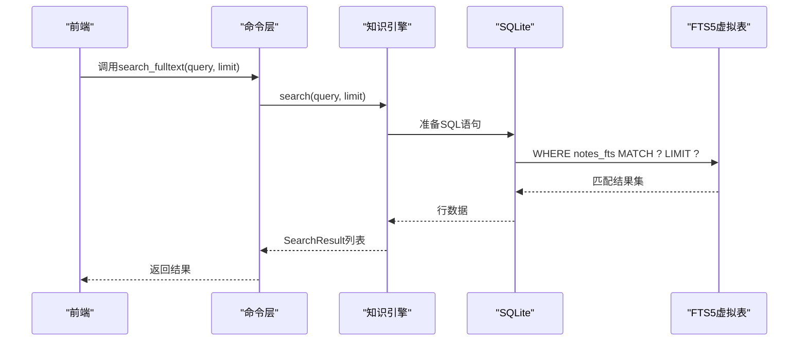
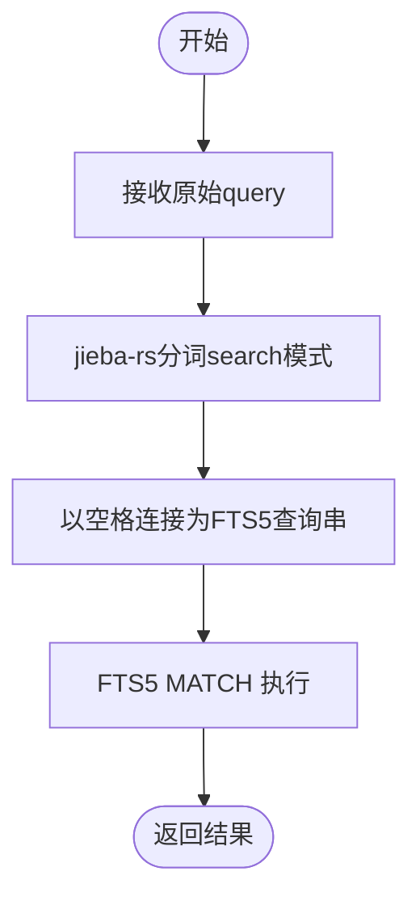
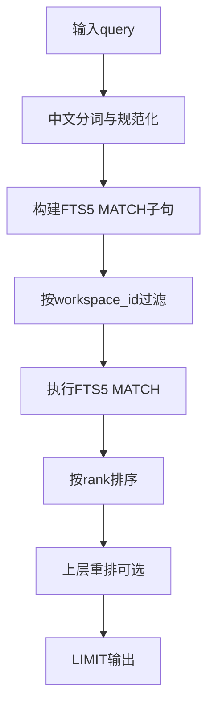
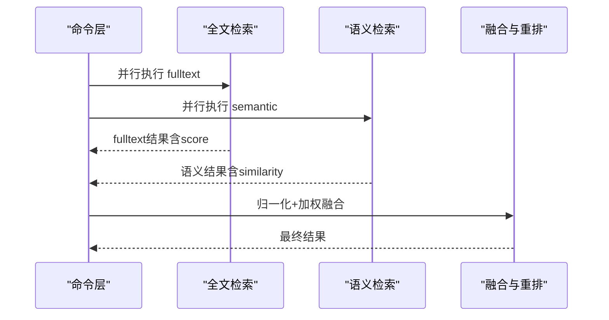
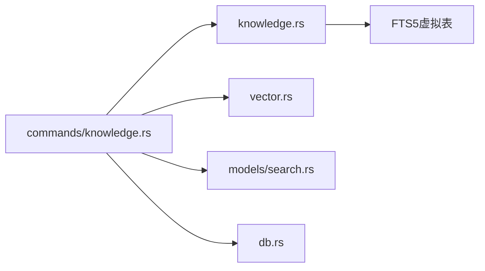

# 全文搜索引擎

<cite>
**本文引用的文件**
- [src-tauri/src/knowledge.rs](file://src-tauri/src/knowledge.rs)
- [src-tauri/src/commands/knowledge.rs](file://src-tauri/src/commands/knowledge.rs)
- [src-tauri/src/models/search.rs](file://src-tauri/src/models/search.rs)
- [src-tauri/src/vector.rs](file://src-tauri/src/vector.rs)
- [src-tauri/src/db.rs](file://src-tauri/src/db.rs)
- [src-tauri/src/main.rs](file://src-tauri/src/main.rs)
- [.tmp/system-architecture-design.md](file://.tmp/system-architecture-design.md)
- [.tmp/noteforge-refactor-plan.md](file://.tmp/noteforge-refactor-plan.md)
- [src-tauri/target/debug/build/libsqlite3-sys-5d817dab2fe27a15/out/bindgen.rs](file://src-tauri/target/debug/build/libsqlite3-sys-5d817dab2fe27a15/out/bindgen.rs)
</cite>

## 目录
1. [简介](#简介)
2. [项目结构](#项目结构)
3. [核心组件](#核心组件)
4. [架构总览](#架构总览)
5. [详细组件分析](#详细组件分析)
6. [依赖关系分析](#依赖关系分析)
7. [性能考量](#性能考量)
8. [故障排查指南](#故障排查指南)
9. [结论](#结论)
10. [附录](#附录)

## 简介
本文件面向NoteForge的全文搜索引擎，系统性梳理SQLite FTS5全文检索引擎的配置与使用、中文分词策略（jieba-rs）、查询优化、相关性评分与混合检索流程，并提供性能监控与调优建议及最佳实践。内容基于仓库中实际实现与设计文档进行归纳总结。

## 项目结构
NoteForge的全文搜索能力由Rust后端提供，前端通过IPC调用后端命令完成搜索。全文检索的核心位于知识引擎模块，配合向量检索与混合检索服务，形成多模态搜索体系。

图示来源
- [src-tauri/src/main.rs:41-46](file://src-tauri/src/main.rs#L41-L46)
- [src-tauri/src/commands/knowledge.rs:70-78](file://src-tauri/src/commands/knowledge.rs#L70-L78)
- [src-tauri/src/knowledge.rs:10-23](file://src-tauri/src/knowledge.rs#L10-L23)
- [src-tauri/src/vector.rs:56-151](file://src-tauri/src/vector.rs#L56-L151)
- [src-tauri/src/models/search.rs:1-40](file://src-tauri/src/models/search.rs#L1-L40)
- [src-tauri/src/db.rs:135-139](file://src-tauri/src/db.rs#L135-L139)

章节来源
- [src-tauri/src/main.rs:41-46](file://src-tauri/src/main.rs#L41-L46)
- [src-tauri/src/commands/knowledge.rs:70-78](file://src-tauri/src/commands/knowledge.rs#L70-L78)
- [src-tauri/src/knowledge.rs:10-23](file://src-tauri/src/knowledge.rs#L10-L23)
- [src-tauri/src/vector.rs:56-151](file://src-tauri/src/vector.rs#L56-L151)
- [src-tauri/src/models/search.rs:1-40](file://src-tauri/src/models/search.rs#L1-L40)
- [src-tauri/src/db.rs:135-139](file://src-tauri/src/db.rs#L135-L139)

## 核心组件
- 知识引擎（KnowledgeEngine）
  - 负责FTS5虚拟表的初始化与全文检索查询。
  - 初始化时创建notes_fts虚拟表并指定分词器参数。
  - 提供search方法执行MATCH查询并返回基础结果。
- 命令层（commands/knowledge.rs）
  - 对外暴露search_fulltext与semantic_search等命令。
  - 调用知识引擎与向量引擎，组装最终搜索结果。
- 模型定义（models/search.rs）
  - 定义SearchResult等结构体，承载搜索结果字段。
- 向量引擎（vector.rs）
  - 提供search_similar接口，用于语义相似度检索。
  - 内置余弦相似度计算。
- 数据库与历史记录（db.rs）
  - 负责数据库初始化、表结构与搜索历史记录表的创建。

章节来源
- [src-tauri/src/knowledge.rs:10-46](file://src-tauri/src/knowledge.rs#L10-L46)
- [src-tauri/src/commands/knowledge.rs:70-78](file://src-tauri/src/commands/knowledge.rs#L70-L78)
- [src-tauri/src/models/search.rs:1-40](file://src-tauri/src/models/search.rs#L1-L40)
- [src-tauri/src/vector.rs:56-151](file://src-tauri/src/vector.rs#L56-L151)
- [src-tauri/src/db.rs:135-139](file://src-tauri/src/db.rs#L135-L139)

## 架构总览
NoteForge采用“命令层-引擎层-存储层”的分层架构。全文检索通过FTS5虚拟表完成，语义检索通过向量相似度完成，二者可并行执行并通过混合检索服务融合。

图示来源
- [src-tauri/src/commands/knowledge.rs:70-78](file://src-tauri/src/commands/knowledge.rs#L70-L78)
- [src-tauri/src/knowledge.rs:10-46](file://src-tauri/src/knowledge.rs#L10-L46)
- [src-tauri/src/vector.rs:56-151](file://src-tauri/src/vector.rs#L56-L151)
- [src-tauri/src/db.rs:135-139](file://src-tauri/src/db.rs#L135-L139)
- [src-tauri/src/models/search.rs:1-40](file://src-tauri/src/models/search.rs#L1-L40)

## 详细组件分析

### SQLite FTS5全文检索引擎
- 虚拟表创建
  - notes_fts使用FTS5，列包含content、title、file_path。
  - 分词器配置为unicode61 remove_diacritics 2，支持CJK字符与去重音符号。
- 查询执行
  - 使用MATCH语法进行全文匹配，LIMIT限制结果数量。
  - 当前返回file_path、title、content与固定score。
- 设计要点
  - 列裁剪：仅返回必要字段，避免大字段传输。
  - 排序：默认按FTS5内部rank排序；后续可在上层按需要重排。

图示来源
- [src-tauri/src/commands/knowledge.rs:70-78](file://src-tauri/src/commands/knowledge.rs#L70-L78)
- [src-tauri/src/knowledge.rs:25-46](file://src-tauri/src/knowledge.rs#L25-L46)

章节来源
- [src-tauri/src/knowledge.rs:10-46](file://src-tauri/src/knowledge.rs#L10-L46)
- [src-tauri/target/debug/build/libsqlite3-sys-5d817dab2fe27a15/out/bindgen.rs:508-510](file://src-tauri/target/debug/build/libsqlite3-sys-5d817dab2fe27a15/out/bindgen.rs#L508-L510)

### 中文分词与查询预处理（jieba-rs）
- 设计目标
  - 在查询阶段对中文query进行分词，空格连接后传入FTS5 MATCH，提升中文检索召回。
  - 索引阶段仍使用FTS5 unicode61分词器，保证索引一致性与CJK兼容。
- 实施路径
  - 在设计文档中明确：索引使用unicode61，查询侧集成jieba-rs进行分词后再MATCH。
  - 建议封装tokenizer模块，统一prepare_fts_query逻辑，便于扩展与测试。

图示来源
- [.tmp/system-architecture-design.md:825-855](file://.tmp/system-architecture-design.md#L825-L855)
- [.tmp/noteforge-refactor-plan.md:308-316](file://.tmp/noteforge-refactor-plan.md#L308-L316)

章节来源
- [.tmp/system-architecture-design.md:825-855](file://.tmp/system-architecture-design.md#L825-L855)
- [.tmp/noteforge-refactor-plan.md:308-316](file://.tmp/noteforge-refactor-plan.md#L308-L316)

### 查询优化机制
- 查询解析与重写
  - 将中文query经jieba-rs分词并规范化为空格连接形式，减少FTS5解析歧义。
- 索引选择
  - notes_fts为单一虚拟表，查询时无需复杂JOIN；可通过WHERE条件与LIMIT控制扫描范围。
- 上游过滤
  - 设计文档提出：先按workspace_id过滤，再进行FTS5 MATCH，确保结果域限定。
- 排序与截断
  - FTS5默认rank排序；可结合上层重排（如混合检索）进行二次排序与截断。

图示来源
- [.tmp/system-architecture-design.md:825-855](file://.tmp/system-architecture-design.md#L825-L855)
- [.tmp/noteforge-refactor-plan.md:308-316](file://.tmp/noteforge-refactor-plan.md#L308-L316)

章节来源
- [.tmp/system-architecture-design.md:825-855](file://.tmp/system-architecture-design.md#L825-L855)
- [.tmp/noteforge-refactor-plan.md:308-316](file://.tmp/noteforge-refactor-plan.md#L308-L316)

### 相关性评分与混合检索
- FTS5评分
  - 当前实现返回固定score，未使用FTS5内置rank或BM25/TD-IDF加权。
- 语义评分
  - 向量引擎提供余弦相似度作为语义分数，可用于与全文检索融合。
- 混合检索（Hybrid）
  - 并行执行fulltext与semantic，归一化分数后加权融合（默认偏向全文），再rerank取top。
- 建议
  - 引入FTS5 rank或自定义BM25/TDF权重，结合语义相似度进行融合。

图示来源
- [.tmp/system-architecture-design.md:857-903](file://.tmp/system-architecture-design.md#L857-L903)
- [src-tauri/src/vector.rs:130-144](file://src-tauri/src/vector.rs#L130-L144)

章节来源
- [.tmp/system-architecture-design.md:857-903](file://.tmp/system-architecture-design.md#L857-L903)
- [src-tauri/src/vector.rs:130-144](file://src-tauri/src/vector.rs#L130-L144)

### 搜索结果模型与历史记录
- SearchResult
  - 字段包含file_path、title、content、score，用于展示与排序。
- 搜索历史
  - 数据库中存在search_history表，记录搜索类型（fulltext/semantic/graph）等信息，便于审计与优化。

章节来源
- [src-tauri/src/models/search.rs:1-40](file://src-tauri/src/models/search.rs#L1-L40)
- [src-tauri/src/db.rs:135-139](file://src-tauri/src/db.rs#L135-L139)

## 依赖关系分析
- 命令层依赖知识引擎与向量引擎，负责编排与结果组装。
- 知识引擎依赖SQLite连接，负责FTS5查询。
- 向量引擎依赖嵌入向量存储与相似度计算。
- 模型与历史记录分别服务于结果结构与审计追踪。

图示来源
- [src-tauri/src/commands/knowledge.rs:70-78](file://src-tauri/src/commands/knowledge.rs#L70-L78)
- [src-tauri/src/knowledge.rs:10-46](file://src-tauri/src/knowledge.rs#L10-L46)
- [src-tauri/src/vector.rs:56-151](file://src-tauri/src/vector.rs#L56-L151)
- [src-tauri/src/models/search.rs:1-40](file://src-tauri/src/models/search.rs#L1-L40)
- [src-tauri/src/db.rs:135-139](file://src-tauri/src/db.rs#L135-L139)

章节来源
- [src-tauri/src/commands/knowledge.rs:70-78](file://src-tauri/src/commands/knowledge.rs#L70-L78)
- [src-tauri/src/knowledge.rs:10-46](file://src-tauri/src/knowledge.rs#L10-L46)
- [src-tauri/src/vector.rs:56-151](file://src-tauri/src/vector.rs#L56-L151)
- [src-tauri/src/models/search.rs:1-40](file://src-tauri/src/models/search.rs#L1-L40)
- [src-tauri/src/db.rs:135-139](file://src-tauri/src/db.rs#L135-L139)

## 性能考量
- 索引与分词
  - FTS5 unicode61适合CJK，remove_diacritics降低拼写变体干扰。
  - 建议在高并发场景下对常用查询词建立前缀索引或缓存热点查询。
- 查询执行
  - 使用LIMIT控制返回规模；必要时在上层做二次截断与去重。
  - 对于长文档，考虑使用snippet截取摘要，减少渲染开销。
- 混合检索
  - 并行执行fulltext与semantic，融合时注意归一化与阈值过滤。
- 监控与调优
  - 通过search_history统计查询分布与耗时，识别慢查询。
  - 定期重建FTS5索引（rebuild）以维持查询性能。
  - 结合业务特征调整权重与阈值，持续迭代评分模型。

[本节为通用指导，不直接分析具体文件]

## 故障排查指南
- FTS5 MATCH语法错误
  - 检查query是否经过中文分词与空格连接；确认FTS5列名与表名正确。
- 查询无结果
  - 确认notes_fts已初始化且有数据；检查workspace_id过滤条件。
- 性能异常
  - 关注LIMIT与排序策略；评估是否需要增加索引或缓存。
- 语义检索异常
  - 检查向量维度与归一化；确认search_similar返回有效相似度。

章节来源
- [src-tauri/src/knowledge.rs:25-46](file://src-tauri/src/knowledge.rs#L25-L46)
- [src-tauri/src/vector.rs:130-144](file://src-tauri/src/vector.rs#L130-L144)
- [src-tauri/src/db.rs:135-139](file://src-tauri/src/db.rs#L135-L139)

## 结论
NoteForge的全文搜索以SQLite FTS5为核心，结合jieba-rs中文分词与向量语义检索，形成可扩展的多模态搜索体系。当前实现聚焦于FTS5基础检索与向量相似度，建议后续引入FTS5 rank/BM25/TDF加权与混合检索融合策略，持续优化中文检索召回与排序质量。

## 附录
- 最佳实践
  - 中文query务必分词后空格连接；索引与查询保持一致的分词策略。
  - 严格按workspace_id过滤，避免跨工作区泄露。
  - 控制单次查询返回量，必要时启用snippet与截断。
  - 建立查询历史与埋点，持续监控与优化。
- 使用技巧
  - 复合关键词建议拆分为短语组合，提升召回。
  - 对高频短词可考虑前缀匹配或同义词扩展。
  - 结合标签过滤与时间线筛选，缩小搜索空间。

[本节为通用指导，不直接分析具体文件]