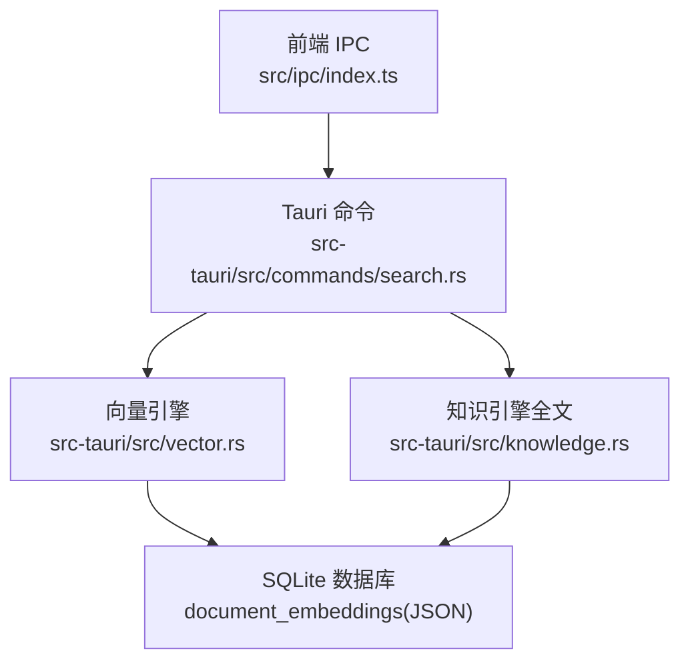
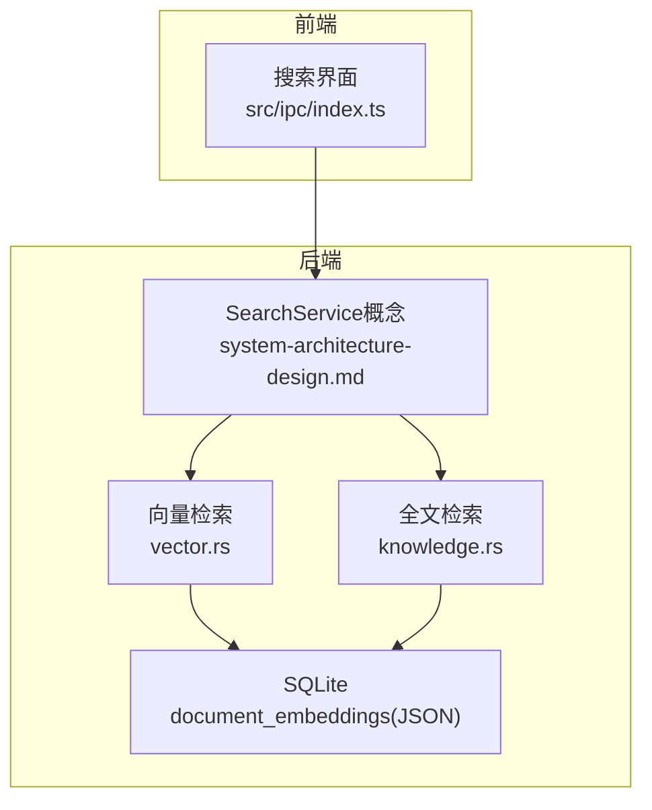
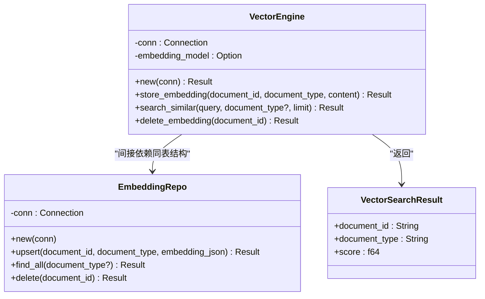
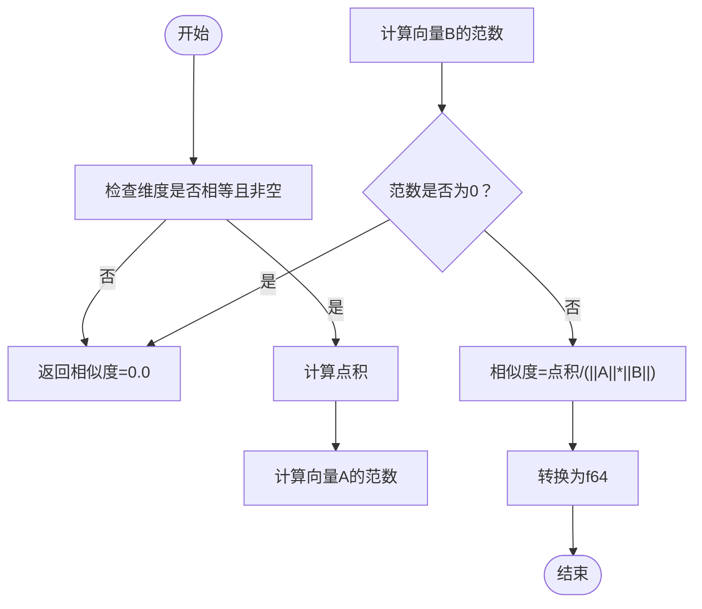
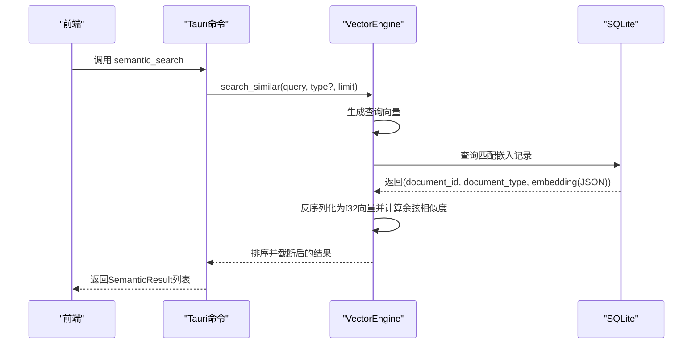
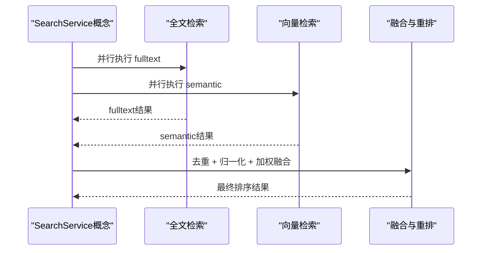
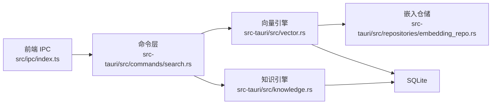

# 向量搜索引擎

<cite>
**本文引用的文件**
- [vector.rs](file://src-tauri/src/vector.rs)
- [embedding_repo.rs](file://src-tauri/src/repositories/embedding_repo.rs)
- [knowledge.rs](file://src-tauri/src/knowledge.rs)
- [search.rs](file://src-tauri/src/commands/search.rs)
- [search.rs（前端）](file://src/ipc/index.ts)
- [search.ts（类型定义）](file://src/types.ts)
- [system-architecture-design.md](file://.tmp/system-architecture-design.md)
</cite>

## 目录
1. [简介](#简介)
2. [项目结构](#项目结构)
3. [核心组件](#核心组件)
4. [架构总览](#架构总览)
5. [详细组件分析](#详细组件分析)
6. [依赖关系分析](#依赖关系分析)
7. [性能考虑](#性能考虑)
8. [故障排查指南](#故障排查指南)
9. [结论](#结论)
10. [附录](#附录)

## 简介
本文件面向NoteForge的向量搜索引擎，聚焦以下目标：  
- fastembed嵌入模型的集成与使用：模型选择、嵌入生成、向量维度等技术参数  
- JSON向量存储机制：向量数据结构、存储格式、索引策略  
- 余弦相似度计算算法：向量运算、相似度阈值、性能优化  
- 向量搜索查询处理流程：查询向量生成、相似度计算、结果排序  
- 向量搜索与全文搜索的协同机制：查询融合、结果合并、权重分配  
- 性能调优指南：批量处理、内存管理、并发控制  
- 实际应用场景与使用案例  

## 项目结构
NoteForge的向量搜索由Rust后端与TypeScript前端协作完成。后端负责：  
- 使用fastembed生成文本嵌入  
- 将向量以JSON形式持久化至SQLite（document_embeddings表）  
- 提供向量相似度检索接口  
- 与全文搜索（FTS5）协同，形成混合检索能力  

前端通过IPC调用后端命令，封装为统一的搜索API。

**图表来源**
- [search.rs（前端）:309-342](file://src/ipc/index.ts#L309-L342)
- [search.rs:1-117](file://src-tauri/src/commands/search.rs#L1-L117)
- [vector.rs:1-151](file://src-tauri/src/vector.rs#L1-L151)
- [knowledge.rs:1-74](file://src-tauri/src/knowledge.rs#L1-L74)

**章节来源**
- [search.rs（前端）:309-342](file://src/ipc/index.ts#L309-L342)
- [search.rs:1-117](file://src-tauri/src/commands/search.rs#L1-L117)
- [vector.rs:1-151](file://src-tauri/src/vector.rs#L1-L151)
- [knowledge.rs:1-74](file://src-tauri/src/knowledge.rs#L1-L74)

## 核心组件
- 向量引擎（VectorEngine）：负责创建向量表、生成嵌入、执行相似度检索、删除嵌入  
- 嵌入仓库（EmbeddingRepo）：提供嵌入的增删改查操作  
- 知识引擎（KnowledgeEngine）：基于SQLite FTS5的全文检索  
- Tauri命令层：对外暴露search_fulltext、semantic_search等命令  
- 前端IPC层：封装调用，转换为统一的SearchResult/SemanticResult类型  

**章节来源**
- [vector.rs:7-128](file://src-tauri/src/vector.rs#L7-L128)
- [embedding_repo.rs:4-71](file://src-tauri/src/repositories/embedding_repo.rs#L4-L71)
- [knowledge.rs:5-74](file://src-tauri/src/knowledge.rs#L5-L74)
- [search.rs:1-117](file://src-tauri/src/commands/search.rs#L1-L117)
- [search.rs（前端）:309-342](file://src/ipc/index.ts#L309-L342)
- [search.ts（类型定义）:139-204](file://src/types.ts#L139-L204)

## 架构总览
NoteForge采用“全文检索 + 语义检索”的混合架构。全文检索基于SQLite FTS5，语义检索基于fastembed嵌入与余弦相似度。二者并行执行，结果按权重融合并重排。

**图表来源**
- [system-architecture-design.md:803-903](file://.tmp/system-architecture-design.md#L803-L903)
- [knowledge.rs:1-74](file://src-tauri/src/knowledge.rs#L1-L74)
- [vector.rs:1-151](file://src-tauri/src/vector.rs#L1-L151)

## 详细组件分析

### 向量引擎（VectorEngine）
- 初始化：自动创建document_embeddings表，字段包含document_id、document_type、embedding(JSON)、created_at  
- 嵌入生成：使用fastembed TextEmbedding生成向量；当前实现为惰性加载模型（embedding_model初始为空），需在实际使用时确保模型可用  
- 存储：将向量序列化为JSON字符串后写入数据库  
- 检索：生成查询向量，遍历匹配的嵌入记录，计算余弦相似度，排序并截断  
- 删除：按document_id删除对应嵌入记录  

**图表来源**
- [vector.rs:7-151](file://src-tauri/src/vector.rs#L7-L151)
- [embedding_repo.rs:4-71](file://src-tauri/src/repositories/embedding_repo.rs#L4-L71)

**章节来源**
- [vector.rs:13-127](file://src-tauri/src/vector.rs#L13-L127)
- [embedding_repo.rs:8-71](file://src-tauri/src/repositories/embedding_repo.rs#L8-L71)

### JSON向量存储机制
- 数据结构：每条记录包含document_id（主键）、document_type、embedding（JSON数组）、created_at  
- 存储格式：向量以f32数组形式序列化为JSON字符串  
- 索引策略：当前未见专用向量索引；检索时在内存中遍历并计算相似度  
- 扩展建议：可引入向量扩展或外部向量数据库以提升大规模检索性能  

**章节来源**
- [vector.rs:15-22](file://src-tauri/src/vector.rs#L15-L22)
- [vector.rs:43-50](file://src-tauri/src/vector.rs#L43-L50)
- [embedding_repo.rs:19-23](file://src-tauri/src/repositories/embedding_repo.rs#L19-L23)

### 余弦相似度计算算法
- 输入：两个等长的f32向量  
- 运算：点积除以各自范数乘积，结果映射为f64  
- 边界处理：长度不一致或任一向量为零向量时返回0.0  
- 性能：O(n)时间复杂度；在大规模数据上建议使用近似最近邻（ANN）或硬件加速  

**图表来源**
- [vector.rs:130-144](file://src-tauri/src/vector.rs#L130-L144)

**章节来源**
- [vector.rs:130-144](file://src-tauri/src/vector.rs#L130-L144)

### 向量搜索查询处理流程
- 步骤1：生成查询向量（fastembed）  
- 步骤2：按document_type过滤或全表扫描，读取embedding(JSON)  
- 步骤3：反序列化为f32向量，计算余弦相似度  
- 步骤4：按分数降序排序，截断limit条结果  
- 注意：当前实现为内存内全表扫描，适合小规模数据；大规模场景建议引入向量索引或外部向量DB  

**图表来源**
- [search.rs（前端）:327-334](file://src/ipc/index.ts#L327-L334)
- [vector.rs:57-118](file://src-tauri/src/vector.rs#L57-L118)

**章节来源**
- [vector.rs:57-118](file://src-tauri/src/vector.rs#L57-L118)
- [search.rs（前端）:327-334](file://src/ipc/index.ts#L327-L334)

### 向量搜索与全文搜索的协同机制
- 并行执行：全文检索与向量检索同时发起  
- 结果融合：以filePath为键去重；将全文检索分数归一化到[0,1]，向量相似度已在[0,1]范围；加权组合：combined_score = α * ft_score + (1-α) * sem_score（默认α≈0.6，偏向全文）  
- 重排：按combined_score降序，取top limit条  
- 适用场景：关键词精确匹配（全文）+ 语义相似性（向量）双保险  

**图表来源**
- [system-architecture-design.md:880-903](file://.tmp/system-architecture-design.md#L880-L903)

**章节来源**
- [system-architecture-design.md:803-903](file://.tmp/system-architecture-design.md#L803-L903)

## 依赖关系分析
- 外部依赖：fastembed（文本嵌入）、rusqlite（SQLite访问）、serde_json（JSON序列化）  
- 内部模块：vector.rs（向量引擎）、embedding_repo.rs（嵌入仓储）、knowledge.rs（全文引擎）、commands/search.rs（Tauri命令）、ipc/index.ts（前端调用）  
- 耦合与内聚：向量引擎与知识引擎分别独立，通过统一的SearchService进行编排；向量引擎与嵌入仓储共享同一张表，耦合度低，内聚度高  

**图表来源**
- [search.rs（前端）:309-342](file://src/ipc/index.ts#L309-L342)
- [search.rs:1-117](file://src-tauri/src/commands/search.rs#L1-L117)
- [vector.rs:1-151](file://src-tauri/src/vector.rs#L1-L151)
- [embedding_repo.rs:1-72](file://src-tauri/src/repositories/embedding_repo.rs#L1-L72)
- [knowledge.rs:1-74](file://src-tauri/src/knowledge.rs#L1-L74)

**章节来源**
- [search.rs（前端）:309-342](file://src/ipc/index.ts#L309-L342)
- [search.rs:1-117](file://src-tauri/src/commands/search.rs#L1-L117)
- [vector.rs:1-151](file://src-tauri/src/vector.rs#L1-L151)
- [embedding_repo.rs:1-72](file://src-tauri/src/repositories/embedding_repo.rs#L1-L72)
- [knowledge.rs:1-74](file://src-tauri/src/knowledge.rs#L1-L74)

## 性能考虑
- 模型加载：当前实现惰性加载，避免启动阻塞；建议在应用启动阶段预热模型，或在后台线程异步初始化  
- 批量处理：嵌入生成支持批量输入（fastembed embed接受Vec<String>），可在入库时批量生成与存储  
- 内存管理：全表扫描+内存计算相似度适合中小规模数据；大规模场景建议：  
  - 引入向量索引（如HNSW、IVF）或外部向量数据库（如Pinecone、Weaviate）  
  - 分页/流式读取嵌入，限制单次相似度计算的数据量  
- 并发控制：在高并发场景下，注意SQLite的写锁竞争；可考虑连接池、读写分离或事务批处理  
- 索引优化：为document_type建立索引以加速过滤；为created_at建立索引以支持时间范围查询  
- 算法优化：  
  - 使用向量化库（如SIMD）加速点积与范数计算  
  - 对高频查询建立缓存（如查询向量+TopK结果）  
  - 余弦相似度可替换为内积归一化（减少一次除法）  

[本节为通用性能指导，无需特定文件引用]

## 故障排查指南
- 嵌入生成失败：检查fastembed模型初始化与网络下载权限；确认输入内容非空  
- JSON序列化失败：检查向量数组是否为空或包含非法值  
- 查询无结果：确认embedding_model已初始化；检查document_type过滤条件；确认数据库中存在匹配记录  
- 性能异常：评估数据规模与相似度计算开销；考虑引入向量索引或外部向量DB  
- 类型不匹配：前端SemanticResult中的similarity字段与后端VectorSearchResult的score字段对应，确保序列化/反序列化一致  

**章节来源**
- [vector.rs:38-50](file://src-tauri/src/vector.rs#L38-L50)
- [vector.rs:65-66](file://src-tauri/src/vector.rs#L65-L66)
- [vector.rs:100-101](file://src-tauri/src/vector.rs#L100-L101)
- [search.ts（类型定义）:161-163](file://src/types.ts#L161-L163)

## 结论
NoteForge的向量搜索引擎以fastembed为核心，结合SQLite JSON存储与余弦相似度，实现了轻量级的语义检索能力。通过与全文检索的并行与融合，兼顾了关键词精确匹配与语义相似性。针对大规模场景，建议引入向量索引或外部向量数据库，并配合批量处理、内存与并发优化，以获得更佳的性能与稳定性。

[本节为总结性内容，无需特定文件引用]

## 附录

### 快速上手与使用示例
- 嵌入生成与存储：调用后端命令将文档内容写入document_embeddings表  
- 向量检索：传入查询文本，返回相似度排序的结果集  
- 混合检索：并行执行全文与向量检索，按权重融合后重排  

**章节来源**
- [vector.rs:30-55](file://src-tauri/src/vector.rs#L30-L55)
- [vector.rs:57-118](file://src-tauri/src/vector.rs#L57-L118)
- [system-architecture-design.md:880-903](file://.tmp/system-architecture-design.md#L880-L903)