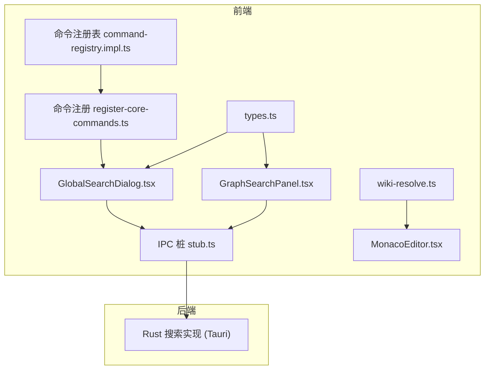
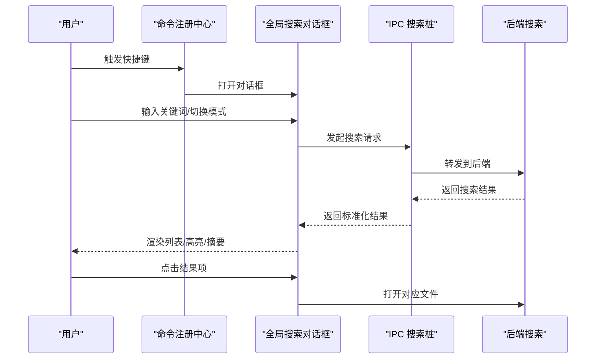
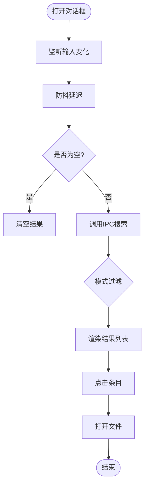
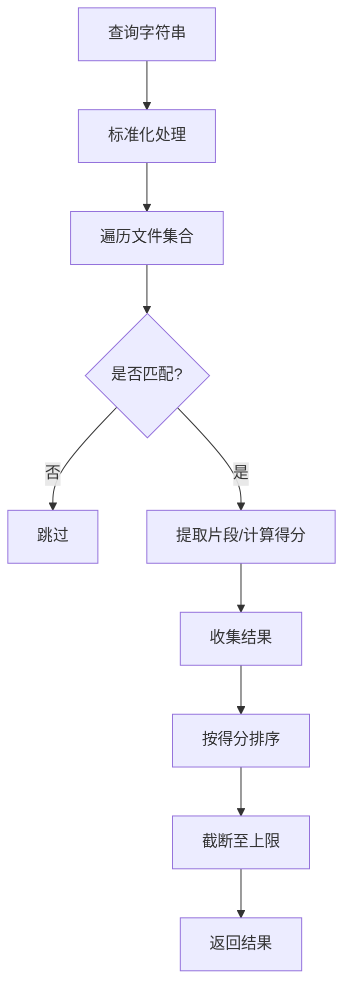
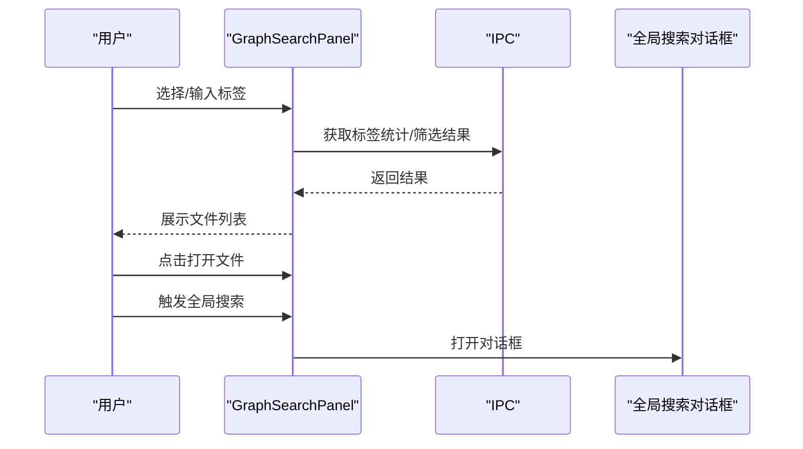
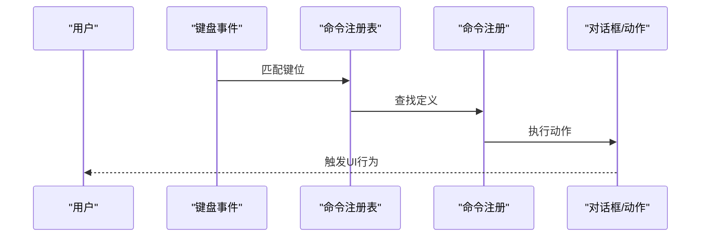
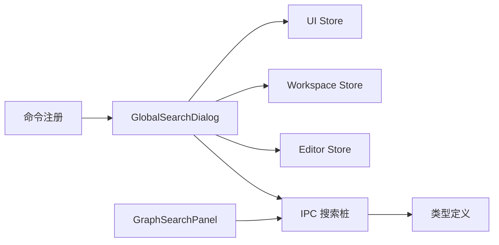

# 搜索界面集成

<cite>
**本文引用的文件**
- [GlobalSearchDialog.tsx](file://src/components/dialogs/GlobalSearchDialog.tsx)
- [stub.ts](file://src/ipc/stub.ts)
- [types.ts](file://src/types.ts)
- [register-core-commands.ts](file://src/core/command/register-core-commands.ts)
- [command-registry.impl.ts](file://src/core/command/command-registry.impl.ts)
- [GraphSearchPanel.tsx](file://src/components/sidebar/GraphSearchPanel.tsx)
- [wiki-resolve.ts](file://src/lib/wiki-resolve.ts)
- [MonacoEditor.tsx](file://src/components/editor/MonacoEditor.tsx)
- [WelcomeView.tsx](file://src/features/welcome/WelcomeView.tsx)
</cite>

## 目录
1. [简介](#简介)
2. [项目结构](#项目结构)
3. [核心组件](#核心组件)
4. [架构总览](#架构总览)
5. [详细组件分析](#详细组件分析)
6. [依赖关系分析](#依赖关系分析)
7. [性能考量](#性能考量)
8. [故障排查指南](#故障排查指南)
9. [结论](#结论)
10. [附录](#附录)

## 简介
本文件面向NoteForge的“全局搜索对话框”实现，提供一套完整的用户界面技术文档。内容涵盖搜索输入与实时预览、快捷键支持、搜索结果展示（列表渲染、高亮、摘要）、过滤与排序、历史与建议系统、交互体验设计、定制化方案以及使用指南与最佳实践。

## 项目结构
- 搜索对话框位于对话框组件层，采用受控输入与状态管理，结合IPC调用后端搜索能力。
- 快捷键通过命令注册中心统一绑定，触发对话框打开。
- 后端搜索逻辑在IPC桩文件中实现，提供全文检索与语义检索入口。
- 标签筛选与图谱搜索在侧边栏组件中实现，与全局搜索形成互补。

图表来源
- [GlobalSearchDialog.tsx:1-161](file://src/components/dialogs/GlobalSearchDialog.tsx#L1-L161)
- [stub.ts:534-575](file://src/ipc/stub.ts#L534-L575)
- [register-core-commands.ts:100-122](file://src/core/command/register-core-commands.ts#L100-L122)
- [command-registry.impl.ts:39-67](file://src/core/command/command-registry.impl.ts#L39-L67)
- [GraphSearchPanel.tsx:1-145](file://src/components/sidebar/GraphSearchPanel.tsx#L1-L145)
- [wiki-resolve.ts:37-62](file://src/lib/wiki-resolve.ts#L37-L62)
- [MonacoEditor.tsx:140-178](file://src/components/editor/MonacoEditor.tsx#L140-L178)
- [types.ts:145-163](file://src/types.ts#L145-L163)

章节来源
- [GlobalSearchDialog.tsx:1-161](file://src/components/dialogs/GlobalSearchDialog.tsx#L1-L161)
- [register-core-commands.ts:100-122](file://src/core/command/register-core-commands.ts#L100-L122)
- [command-registry.impl.ts:39-67](file://src/core/command/command-registry.impl.ts#L39-L67)
- [stub.ts:534-575](file://src/ipc/stub.ts#L534-L575)
- [GraphSearchPanel.tsx:1-145](file://src/components/sidebar/GraphSearchPanel.tsx#L1-L145)
- [wiki-resolve.ts:37-62](file://src/lib/wiki-resolve.ts#L37-L62)
- [MonacoEditor.tsx:140-178](file://src/components/editor/MonacoEditor.tsx#L140-L178)
- [types.ts:145-163](file://src/types.ts#L145-L163)

## 核心组件
- 全局搜索对话框：负责输入、模式切换、结果渲染、高亮与打开文件。
- IPC搜索桩：提供全文检索、语义检索与知识图谱能力的前端模拟实现。
- 命令注册与快捷键：统一绑定“快速打开/搜索”“全局搜索”等快捷键。
- 标签筛选与图谱：侧边栏提供标签云与筛选结果列表。
- 类型定义：统一前后端一致的搜索结果模型。

章节来源
- [GlobalSearchDialog.tsx:12-126](file://src/components/dialogs/GlobalSearchDialog.tsx#L12-L126)
- [stub.ts:534-575](file://src/ipc/stub.ts#L534-L575)
- [register-core-commands.ts:100-122](file://src/core/command/register-core-commands.ts#L100-L122)
- [GraphSearchPanel.tsx:1-145](file://src/components/sidebar/GraphSearchPanel.tsx#L1-L145)
- [types.ts:145-163](file://src/types.ts#L145-L163)

## 架构总览
全局搜索对话框通过命令系统触发，使用受控输入与防抖策略发起搜索请求，结果经由IPC返回并在UI中渲染。标签筛选与图谱搜索提供补充维度。

图表来源
- [register-core-commands.ts:100-122](file://src/core/command/register-core-commands.ts#L100-L122)
- [GlobalSearchDialog.tsx:30-51](file://src/components/dialogs/GlobalSearchDialog.tsx#L30-L51)
- [stub.ts:534-575](file://src/ipc/stub.ts#L534-L575)

## 详细组件分析

### 全局搜索对话框（GlobalSearchDialog）
- 输入与实时预览
  - 使用受控输入框维护查询状态，配合防抖延迟发起搜索请求，避免频繁调用。
  - 支持“全部/按文件名/按全文/按标签”四种模式，前端进行二次过滤。
- 结果展示
  - 列表渲染：每个结果项包含标题、摘要、路径与标签集合。
  - 高亮：对命中词进行简单高亮处理，提升可读性。
  - 打开文件：点击条目关闭对话框并调用编辑器打开对应文件。
- 加载与空态
  - 搜索中显示加载提示；无输入或无结果时分别显示引导文案。
- 快捷键支持
  - 通过命令注册中心绑定“快速打开/搜索”“全局搜索”快捷键，统一触发对话框。

图表来源
- [GlobalSearchDialog.tsx:30-51](file://src/components/dialogs/GlobalSearchDialog.tsx#L30-L51)
- [GlobalSearchDialog.tsx:94-121](file://src/components/dialogs/GlobalSearchDialog.tsx#L94-L121)
- [register-core-commands.ts:100-122](file://src/core/command/register-core-commands.ts#L100-L122)

章节来源
- [GlobalSearchDialog.tsx:12-126](file://src/components/dialogs/GlobalSearchDialog.tsx#L12-L126)
- [register-core-commands.ts:100-122](file://src/core/command/register-core-commands.ts#L100-L122)

### IPC搜索桩（全文/语义检索）
- 全文检索
  - 在内存文件集合中执行关键词匹配，计算片段位置与得分，限制返回数量。
- 语义检索
  - 当前实现复用全文检索，后续可接入嵌入向量相似度。
- 知识图谱
  - 提供节点/边构建与标签统计等能力（用于图谱与标签筛选）。

图表来源
- [stub.ts:534-575](file://src/ipc/stub.ts#L534-L575)

章节来源
- [stub.ts:534-575](file://src/ipc/stub.ts#L534-L575)

### 标签筛选与图谱搜索（GraphSearchPanel）
- 标签云
  - 从工作区获取标签统计，支持过滤与多选标签组合。
- 筛选结果
  - 多标签组合筛选出匹配文件，点击打开。
- 与全局搜索联动
  - 可在侧边栏直接触发全局搜索对话框，便于跨维度检索。

图表来源
- [GraphSearchPanel.tsx:18-139](file://src/components/sidebar/GraphSearchPanel.tsx#L18-L139)
- [stub.ts:534-575](file://src/ipc/stub.ts#L534-L575)

章节来源
- [GraphSearchPanel.tsx:1-145](file://src/components/sidebar/GraphSearchPanel.tsx#L1-L145)

### 快捷键与命令系统
- 命令注册
  - “快速打开/搜索”“全局搜索”“命令面板”等命令统一注册，支持键盘绑定与分类。
- 键位匹配
  - 注册表提供键位匹配与上下文判断，确保快捷键在正确时机生效。

图表来源
- [register-core-commands.ts:100-122](file://src/core/command/register-core-commands.ts#L100-L122)
- [command-registry.impl.ts:39-67](file://src/core/command/command-registry.impl.ts#L39-L67)

章节来源
- [register-core-commands.ts:100-122](file://src/core/command/register-core-commands.ts#L100-L122)
- [command-registry.impl.ts:39-67](file://src/core/command/command-registry.impl.ts#L39-L67)

### 编辑器内智能提示与搜索联动
- 编辑器内Wiki标题自动补全
  - 基于当前工作区笔记集合，按标题相似度生成补全建议。
- 与全局搜索协作
  - 通过侧边栏或命令面板打开全局搜索，实现跨界面一致的检索体验。

章节来源
- [MonacoEditor.tsx:140-178](file://src/components/editor/MonacoEditor.tsx#L140-L178)
- [wiki-resolve.ts:37-62](file://src/lib/wiki-resolve.ts#L37-L62)

## 依赖关系分析
- 组件耦合
  - 全局搜索对话框依赖UI状态、工作区信息与编辑器打开能力。
  - IPC桩提供统一的搜索接口，屏蔽后端差异。
- 数据流
  - 输入状态 → 防抖 → IPC调用 → 结果映射 → UI渲染。
- 外部依赖
  - 命令系统提供快捷键入口；类型定义保证前后端一致性。

图表来源
- [GlobalSearchDialog.tsx:12-126](file://src/components/dialogs/GlobalSearchDialog.tsx#L12-L126)
- [register-core-commands.ts:100-122](file://src/core/command/register-core-commands.ts#L100-L122)
- [GraphSearchPanel.tsx:1-145](file://src/components/sidebar/GraphSearchPanel.tsx#L1-L145)
- [types.ts:145-163](file://src/types.ts#L145-L163)

章节来源
- [GlobalSearchDialog.tsx:12-126](file://src/components/dialogs/GlobalSearchDialog.tsx#L12-L126)
- [register-core-commands.ts:100-122](file://src/core/command/register-core-commands.ts#L100-L122)
- [GraphSearchPanel.tsx:1-145](file://src/components/sidebar/GraphSearchPanel.tsx#L1-L145)
- [types.ts:145-163](file://src/types.ts#L145-L163)

## 性能考量
- 防抖策略
  - 对输入变更进行150ms延迟，降低IPC调用频率，改善交互流畅度。
- 结果限制
  - 默认限制返回数量，避免大结果集带来的渲染压力。
- 前端过滤
  - 模式切换时在前端进行二次过滤，减少不必要的IPC往返。
- 渲染优化
  - 列表项采用基础按钮与最小DOM结构，避免复杂子树。
- 后端优化
  - 文件集合遍历与片段提取应尽量避免重复扫描，必要时引入索引或缓存。

章节来源
- [GlobalSearchDialog.tsx:30-51](file://src/components/dialogs/GlobalSearchDialog.tsx#L30-L51)
- [stub.ts:534-575](file://src/ipc/stub.ts#L534-L575)

## 故障排查指南
- 无法打开搜索对话框
  - 检查命令注册是否正确，确认快捷键未被其他模块拦截。
- 搜索无结果
  - 确认当前工作区存在文件；检查查询是否为空；查看IPC桩是否返回空结果。
- 高亮不生效
  - 确认高亮函数接收的查询与文本非空；检查样式类名是否正确应用。
- 打不开文件
  - 确认返回的文件路径有效；检查编辑器打开流程是否被中断。
- 标签筛选无效
  - 确认工作区标签统计是否成功加载；检查筛选逻辑与IPC调用链路。

章节来源
- [register-core-commands.ts:100-122](file://src/core/command/register-core-commands.ts#L100-L122)
- [GlobalSearchDialog.tsx:94-121](file://src/components/dialogs/GlobalSearchDialog.tsx#L94-L121)
- [GraphSearchPanel.tsx:18-139](file://src/components/sidebar/GraphSearchPanel.tsx#L18-L139)
- [stub.ts:534-575](file://src/ipc/stub.ts#L534-L575)

## 结论
全局搜索对话框以简洁的状态管理与IPC桥接实现了高效的全文检索体验，并通过模式切换、高亮与标签筛选提供了多维检索能力。结合命令系统与侧边栏图谱，形成统一且可扩展的搜索体系。后续可在后端引入向量检索、索引与缓存，进一步提升性能与准确性。

## 附录

### 使用指南与最佳实践
- 快捷键
  - 使用“快速打开/搜索”“全局搜索”等快捷键快速唤起对话框。
- 查询技巧
  - 先用“按文件名”缩小范围，再用“按全文”精准定位。
  - 使用“按标签”快速筛选相关内容。
- 无障碍与响应式
  - 确保键盘导航顺畅，提供清晰的加载与空态提示。
- 定制化建议
  - 主题适配：统一使用UI Store中的颜色变量，保持与整体风格一致。
  - 布局调整：根据屏幕尺寸控制最大高度与滚动区域。
  - 功能扩展：增加热门搜索、搜索历史、时间范围过滤等高级选项。

章节来源
- [register-core-commands.ts:100-122](file://src/core/command/register-core-commands.ts#L100-L122)
- [GlobalSearchDialog.tsx:53-125](file://src/components/dialogs/GlobalSearchDialog.tsx#L53-L125)
- [GraphSearchPanel.tsx:1-145](file://src/components/sidebar/GraphSearchPanel.tsx#L1-L145)
- [WelcomeView.tsx:64-67](file://src/features/welcome/WelcomeView.tsx#L64-L67)