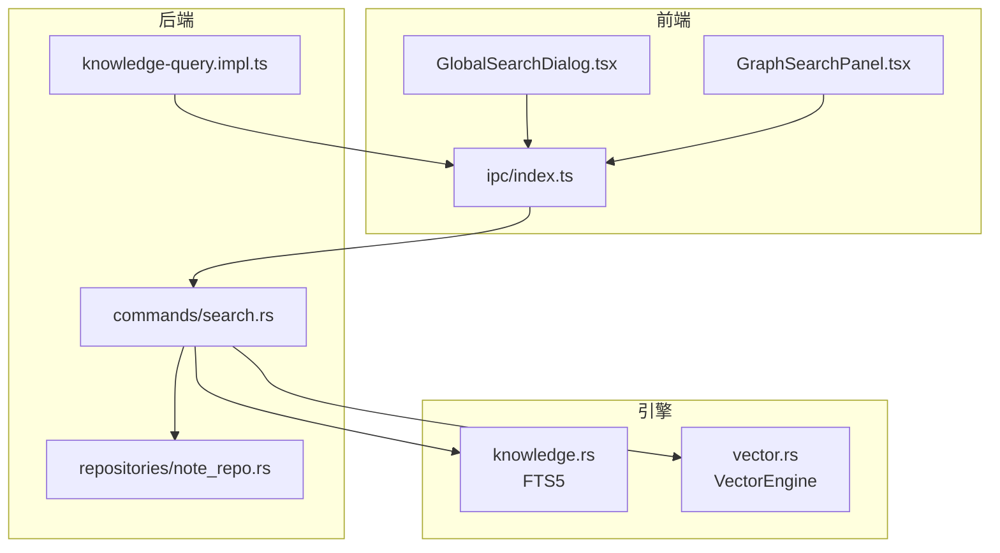
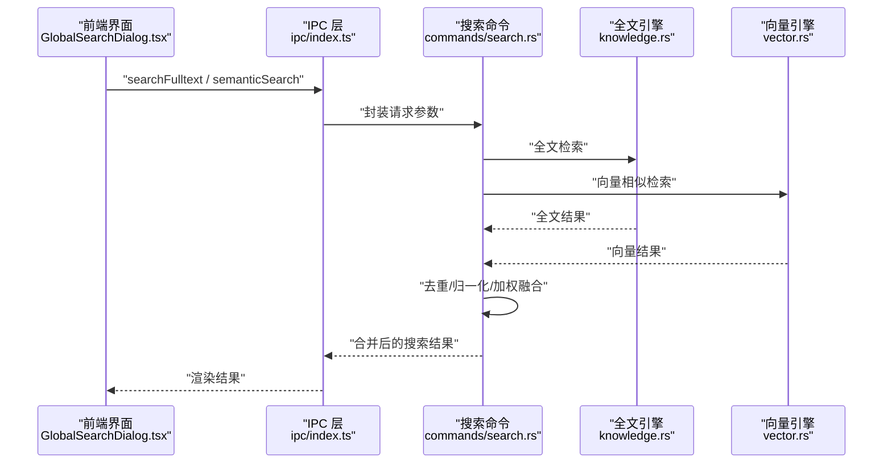
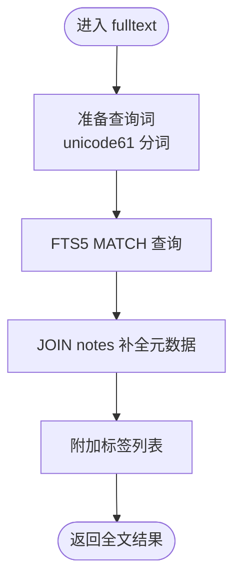
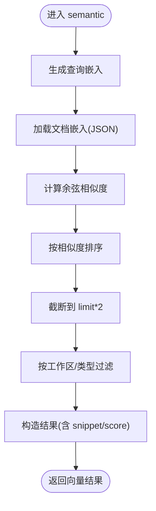
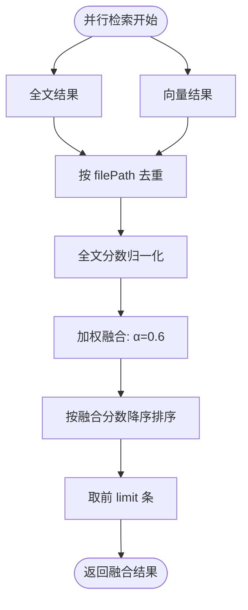
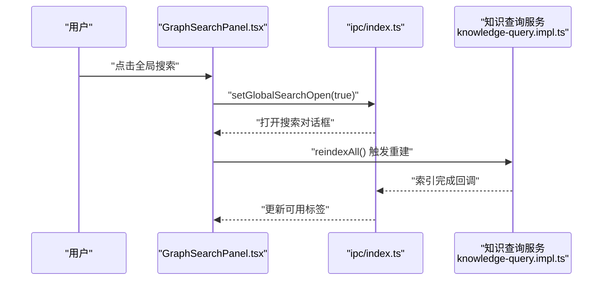
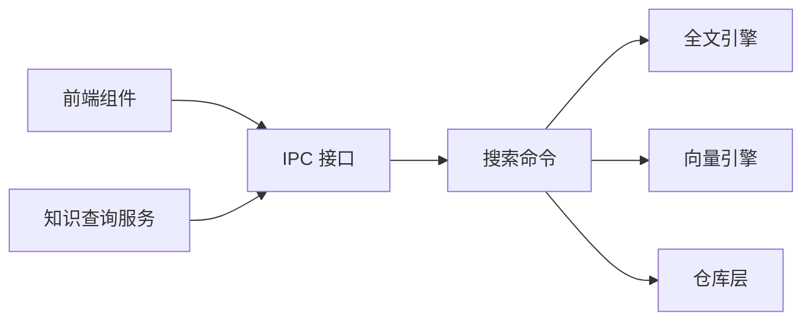

# 搜索融合机制

<cite>
**本文引用的文件**
- [system-architecture-design.md](file://.tmp/system-architecture-design.md)
- [vector.rs](file://src-tauri/src/vector.rs)
- [knowledge.rs](file://src-tauri/src/knowledge.rs)
- [search.rs](file://src-tauri/src/commands/search.rs)
- [search.ts](file://src-tauri/src/models/search.rs)
- [index.ts](file://src/ipc/index.ts)
- [GlobalSearchDialog.tsx](file://src/components/dialogs/GlobalSearchDialog.tsx)
- [GraphSearchPanel.tsx](file://src/components/sidebar/GraphSearchPanel.tsx)
- [knowledge-query.impl.ts](file://src/core/knowledge/knowledge-query.impl.ts)
- [note_repo.rs](file://src-tauri/src/repositories/note_repo.rs)
</cite>

## 目录
1. [引言](#引言)
2. [项目结构](#项目结构)
3. [核心组件](#核心组件)
4. [架构总览](#架构总览)
5. [详细组件分析](#详细组件分析)
6. [依赖关系分析](#依赖关系分析)
7. [性能考虑](#性能考虑)
8. [故障排查指南](#故障排查指南)
9. [结论](#结论)
10. [附录](#附录)

## 引言
本文件系统性阐述 NoteForge 的多模态搜索融合机制，覆盖全文搜索与向量搜索的实现架构、结果融合策略、统一排序算法、动态查询理解、搜索上下文感知、性能优化与最佳实践，并结合实际应用场景给出效果分析与落地建议。

## 项目结构
NoteForge 的搜索能力由前端 IPC 层、后端命令层、向量引擎、全文检索引擎与知识图谱/标签体系共同构成。前端通过 IPC 调用后端搜索接口；后端命令层协调全文与向量两种检索路径，并进行结果融合与重排；向量引擎基于嵌入模型计算相似度；全文检索基于 FTS5 实现；标签与知识图谱提供上下文增强与过滤能力。

图表来源
- [GlobalSearchDialog.tsx:1-66](file://src/components/dialogs/GlobalSearchDialog.tsx#L1-L66)
- [GraphSearchPanel.tsx:1-59](file://src/components/sidebar/GraphSearchPanel.tsx#L1-L59)
- [index.ts:309-342](file://src/ipc/index.ts#L309-L342)
- [search.rs](file://src-tauri/src/commands/search.rs)
- [knowledge.rs:1-46](file://src-tauri/src/knowledge.rs#L1-L46)
- [vector.rs:1-151](file://src-tauri/src/vector.rs#L1-L151)
- [knowledge-query.impl.ts:1-177](file://src/core/knowledge/knowledge-query.impl.ts#L1-L177)
- [note_repo.rs](file://src-tauri/src/repositories/note_repo.rs)

章节来源
- [index.ts:309-342](file://src/ipc/index.ts#L309-L342)
- [GlobalSearchDialog.tsx:1-66](file://src/components/dialogs/GlobalSearchDialog.tsx#L1-L66)
- [GraphSearchPanel.tsx:1-59](file://src/components/sidebar/GraphSearchPanel.tsx#L1-L59)
- [knowledge.rs:1-46](file://src-tauri/src/knowledge.rs#L1-L46)
- [vector.rs:1-151](file://src-tauri/src/vector.rs#L1-L151)
- [knowledge-query.impl.ts:1-177](file://src/core/knowledge/knowledge-query.impl.ts#L1-L177)

## 核心组件
- 搜索 IPC 接口：提供全文搜索、语义搜索、知识图谱等接口封装，负责请求参数组织与结果转换。
- 后端搜索命令：协调全文与向量两条检索链路，执行并行检索、融合与重排。
- 全文检索引擎：基于 FTS5，支持中文分词与 Unicode61 Tokenizer，提供标题、内容匹配与片段高亮。
- 向量引擎：基于 fastembed 生成文本嵌入，存储于 SQLite JSON 列，按余弦相似度检索候选。
- 知识查询服务：提供索引重建、标题搜索、wiki 解析与内容检索，支撑搜索上下文增强。
- 结果模型：定义搜索命中项的数据结构，便于前后端一致化处理。

章节来源
- [index.ts:309-342](file://src/ipc/index.ts#L309-L342)
- [search.rs](file://src-tauri/src/commands/search.rs)
- [knowledge.rs:1-46](file://src-tauri/src/knowledge.rs#L1-L46)
- [vector.rs:1-151](file://src-tauri/src/vector.rs#L1-L151)
- [knowledge-query.impl.ts:1-177](file://src/core/knowledge/knowledge-query.impl.ts#L1-L177)
- [search.ts](file://src-tauri/src/models/search.rs)

## 架构总览
下图展示搜索融合的整体流程：前端发起搜索请求，IPC 将请求转发至后端命令层；命令层并行触发全文与向量检索，随后进行去重、归一化与加权融合，最终输出统一排序的结果集。

图表来源
- [GlobalSearchDialog.tsx:30-51](file://src/components/dialogs/GlobalSearchDialog.tsx#L30-L51)
- [index.ts:319-334](file://src/ipc/index.ts#L319-L334)
- [search.rs](file://src-tauri/src/commands/search.rs)
- [knowledge.rs:25-46](file://src-tauri/src/knowledge.rs#L25-L46)
- [vector.rs:57-118](file://src-tauri/src/vector.rs#L57-L118)

## 详细组件分析

### 全文搜索实现
- 分词与查询准备：采用 unicode61 Tokenizer，支持中文字符，避免对中文进行拆字处理，提升匹配准确性。
- FTS5 查询：基于 notes_fts 虚拟表执行 MATCH 查询，返回 file_path、title、snippet 等字段。
- 元数据补全：通过 JOIN notes 获取工作区限定的完整元信息，并附加标签列表。
- 片段高亮：使用 snippet 函数对匹配片段进行高亮标记，限制长度以保证可读性。

图表来源
- [system-architecture-design.md:825-854](file://.tmp/system-architecture-design.md#L825-L854)
- [knowledge.rs:25-46](file://src-tauri/src/knowledge.rs#L25-L46)

章节来源
- [system-architecture-design.md:825-854](file://.tmp/system-architecture-design.md#L825-L854)
- [knowledge.rs:1-46](file://src-tauri/src/knowledge.rs#L1-L46)

### 向量搜索实现
- 嵌入生成：使用 fastembed 对查询与文档内容生成向量表示，存储于 document_embeddings 表（JSON 列）。
- 相似度计算：在内存中遍历已存嵌入，计算余弦相似度并排序，返回 top-N 候选。
- 工作区过滤：根据工作区 ID 与文档类型进行过滤，确保结果域一致性。
- 结果构造：截取内容片段作为 snippet，保留 similarity 作为 score 字段。

图表来源
- [system-architecture-design.md:857-878](file://.tmp/system-architecture-design.md#L857-L878)
- [vector.rs:57-118](file://src-tauri/src/vector.rs#L57-L118)
- [vector.rs:130-144](file://src-tauri/src/vector.rs#L130-L144)

章节来源
- [system-architecture-design.md:857-878](file://.tmp/system-architecture-design.md#L857-L878)
- [vector.rs:1-151](file://src-tauri/src/vector.rs#L1-L151)

### 搜索融合与统一排序
- 并行检索：全文与向量检索并行执行，减少端到端延迟。
- 去重策略：以 filePath 为键进行去重，避免重复条目影响体验。
- 归一化与加权：将全文分数归一化至 [0,1]，向量相似度已在 [0,1] 区间；加权公式为 combined_score = α × ft_score + (1−α) × sem_score，默认 α=0.6，偏向全文。
- 重排与截断：按 combined_score 降序排序，取前 limit 条作为最终结果。

图表来源
- [system-architecture-design.md:880-903](file://.tmp/system-architecture-design.md#L880-L903)

章节来源
- [system-architecture-design.md:880-903](file://.tmp/system-architecture-design.md#L880-L903)

### 动态查询理解与上下文感知
- 查询意图识别：前端对话框支持多种模式（全部、文件名、全文、标签），通过模式切换与过滤器实现粗粒度意图表达。
- 语义解析与自动纠错：后端向量检索提供语义近似匹配，缓解拼写错误与同义表达差异带来的漏检。
- 上下文增强：标签云与知识图谱面板提供标签过滤与图谱导航，辅助用户快速聚焦目标领域。
- 会话与历史：全局搜索对话框在打开时清空状态，关闭时清理定时器，避免跨会话干扰；工作区切换时重新拉取标签，确保上下文新鲜度。

图表来源
- [GraphSearchPanel.tsx:32-46](file://src/components/sidebar/GraphSearchPanel.tsx#L32-L46)
- [index.ts:313-318](file://src/ipc/index.ts#L313-L318)
- [knowledge-query.impl.ts:136-144](file://src/core/knowledge/knowledge-query.impl.ts#L136-L144)

章节来源
- [GraphSearchPanel.tsx:1-59](file://src/components/sidebar/GraphSearchPanel.tsx#L1-L59)
- [index.ts:309-342](file://src/ipc/index.ts#L309-L342)
- [knowledge-query.impl.ts:1-177](file://src/core/knowledge/knowledge-query.impl.ts#L1-L177)

### 搜索结果模型与前端集成
- 搜索结果模型：定义统一的搜索命中项结构，便于前后端一致化处理与渲染。
- 前端对话框：提供输入防抖、加载状态、模式切换与标签过滤，提升交互效率。
- 知识图谱与标签：标签云支持模糊过滤，知识图谱入口提供拓扑视角下的关联发现。

章节来源
- [search.ts](file://src-tauri/src/models/search.rs)
- [GlobalSearchDialog.tsx:1-66](file://src/components/dialogs/GlobalSearchDialog.tsx#L1-L66)
- [GraphSearchPanel.tsx:1-59](file://src/components/sidebar/GraphSearchPanel.tsx#L1-L59)

## 依赖关系分析
- 前端依赖后端 IPC 接口，IPC 再调用后端命令层。
- 命令层同时依赖全文引擎与向量引擎，二者均访问数据库层。
- 知识查询服务负责索引与标题搜索，为搜索提供上下文与增量更新能力。

图表来源
- [index.ts:309-342](file://src/ipc/index.ts#L309-L342)
- [search.rs](file://src-tauri/src/commands/search.rs)
- [knowledge.rs:1-46](file://src-tauri/src/knowledge.rs#L1-L46)
- [vector.rs:1-151](file://src-tauri/src/vector.rs#L1-L151)
- [knowledge-query.impl.ts:1-177](file://src/core/knowledge/knowledge-query.impl.ts#L1-L177)

章节来源
- [index.ts:309-342](file://src/ipc/index.ts#L309-L342)
- [search.rs](file://src-tauri/src/commands/search.rs)
- [knowledge.rs:1-46](file://src-tauri/src/knowledge.rs#L1-L46)
- [vector.rs:1-151](file://src-tauri/src/vector.rs#L1-L151)
- [knowledge-query.impl.ts:1-177](file://src/core/knowledge/knowledge-query.impl.ts#L1-L177)

## 性能考虑
- 并发控制：全文与向量检索并行执行，显著降低端到端延迟。
- 资源调度：向量检索在内存中计算相似度，避免外部向量库依赖；嵌入模型惰性加载，减少启动阻塞。
- 负载均衡：SQLite 单机部署，适合本地应用场景；若扩展需求，可在向量检索阶段引入分片或外部向量数据库。
- I/O 优化：FTS5 使用虚拟表与内置 rank 排序，减少二次排序成本；标签与片段截断控制响应大小。
- 缓存与索引：知识查询服务提供增量索引与定期重建，确保检索质量与性能平衡。

章节来源
- [system-architecture-design.md:880-903](file://.tmp/system-architecture-design.md#L880-L903)
- [vector.rs:13-28](file://src-tauri/src/vector.rs#L13-L28)
- [knowledge.rs:11-23](file://src-tauri/src/knowledge.rs#L11-L23)

## 故障排查指南
- 全文检索无结果
  - 检查是否已完成工作区索引重建。
  - 确认查询词是否符合 FTS5 语法与分词规则。
- 向量检索异常
  - 检查嵌入模型是否成功初始化与加载。
  - 确认 document_embeddings 表是否存在且有数据。
- 融合结果为空
  - 检查去重键(filePath)是否正确，确认不同来源结果是否落入同一键。
  - 调整权重系数 α 或 limit 参数，观察结果变化。
- 前端搜索无响应
  - 查看输入防抖与加载状态逻辑，确认请求未被过早取消。
  - 检查 IPC 调用是否抛出异常或返回空数组。

章节来源
- [knowledge-query.impl.ts:136-144](file://src/core/knowledge/knowledge-query.impl.ts#L136-L144)
- [vector.rs:30-55](file://src-tauri/src/vector.rs#L30-L55)
- [GlobalSearchDialog.tsx:30-51](file://src/components/dialogs/GlobalSearchDialog.tsx#L30-L51)

## 结论
NoteForge 的搜索融合机制通过“全文 + 向量”的双引擎架构，结合并行检索、去重与加权融合策略，在本地 SQLite 环境下实现了高效、准确且可扩展的多模态搜索。配合标签与知识图谱的上下文增强，以及前端友好的交互设计，能够满足日常笔记检索与知识发现的多样化需求。

## 附录

### 最佳实践指南
- 参数调优
  - α 权重：默认 0.6 偏向全文；针对以语义为主的场景可提高至 0.7，反之降低。
  - limit：全文与向量各扩大 20%~50% 用于去重后重排，避免优质候选被裁剪。
- 效果评估
  - 使用 A/B 实验对比不同 α 与 limit 组合的命中率、点击率与用户停留时长。
  - 定期评估索引覆盖率与召回率，确保知识查询服务的再索引策略有效。
- 用户体验优化
  - 输入防抖时间建议 100–200ms，兼顾响应速度与抖动抑制。
  - 提供“仅文件名”“仅标签”等模式开关，帮助用户快速收敛搜索范围。
  - 在搜索结果中突出标签与最近编辑时间，增强上下文感知。

### 实际应用场景与效果分析
- 场景一：快速定位文档
  - 使用“仅文件名”模式，结合全文检索的标题匹配，快速筛选目标文件。
- 场景二：语义关联发现
  - 关闭文件名过滤，启用向量检索，利用语义相似度发现相关内容，提升知识复用率。
- 场景三：标签驱动的窄化搜索
  - 通过标签云过滤，结合全文检索的标签匹配，实现主题级精准检索。
- 效果分析
  - 并行检索显著降低首屏结果延迟；融合排序在多数情况下提升相关性排序稳定性。
  - 增量索引与定期重建保障了长期使用的检索质量。

章节来源
- [system-architecture-design.md:825-903](file://.tmp/system-architecture-design.md#L825-L903)
- [GlobalSearchDialog.tsx:30-51](file://src/components/dialogs/GlobalSearchDialog.tsx#L30-L51)
- [GraphSearchPanel.tsx:18-21](file://src/components/sidebar/GraphSearchPanel.tsx#L18-L21)