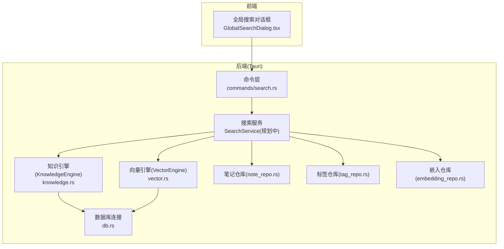
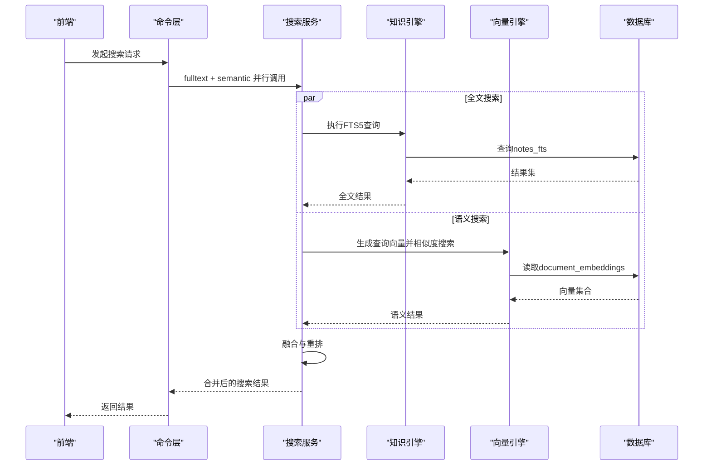
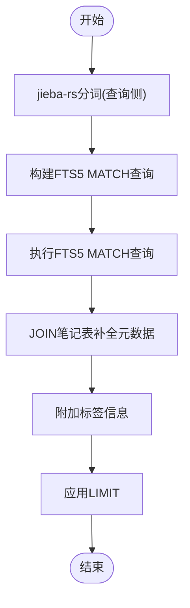
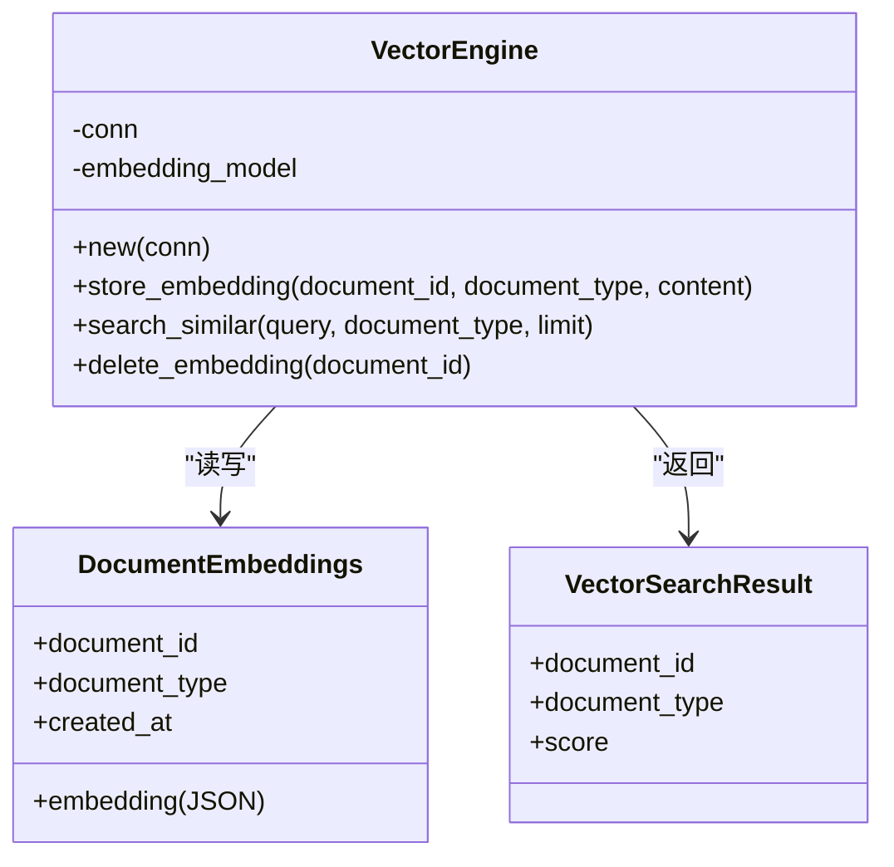
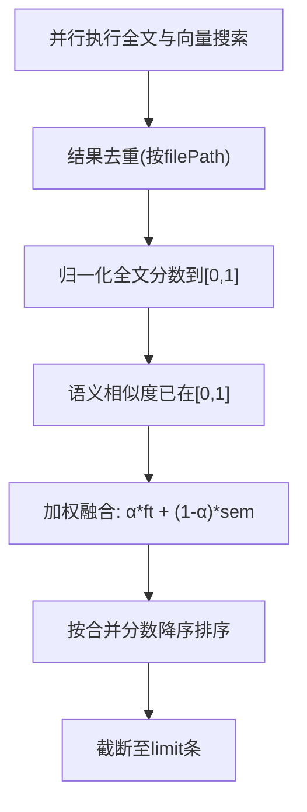
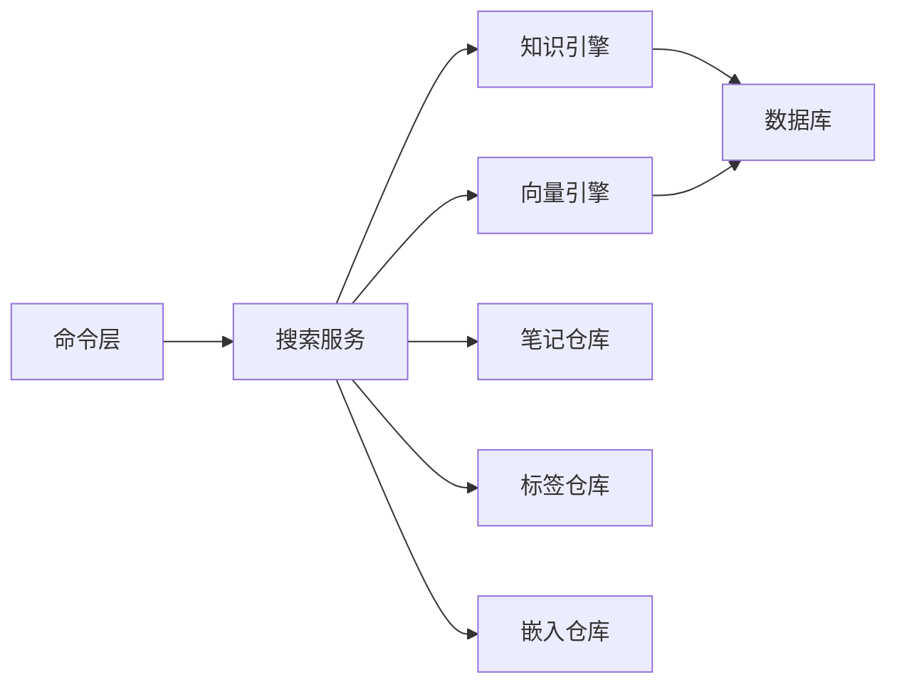

# 混合搜索引擎

<cite>
**本文引用的文件**
- [src-tauri/src/vector.rs](file://src-tauri/src/vector.rs)
- [src-tauri/src/knowledge.rs](file://src-tauri/src/knowledge.rs)
- [.tmp/system-architecture-design.md](file://.tmp/system-architecture-design.md)
- [.tmp/noteforge-refactor-plan.md](file://.tmp/noteforge-refactor-plan.md)
- [src-tauri/src/commands/search.rs](file://src-tauri/src/commands/search.rs)
- [src-tauri/src/models/search.rs](file://src-tauri/src/models/search.rs)
- [src-tauri/src/repositories/embedding_repo.rs](file://src-tauri/src/repositories/embedding_repo.rs)
- [src-tauri/src/repositories/note_repo.rs](file://src-tauri/src/repositories/note_repo.rs)
- [src-tauri/src/repositories/tag_repo.rs](file://src-tauri/src/repositories/tag_repo.rs)
- [src-tauri/src/db.rs](file://src-tauri/src/db.rs)
- [src-tauri/Cargo.toml](file://src-tauri/Cargo.toml)
</cite>

## 目录
1. [简介](#简介)
2. [项目结构](#项目结构)
3. [核心组件](#核心组件)
4. [架构总览](#架构总览)
5. [详细组件分析](#详细组件分析)
6. [依赖关系分析](#依赖关系分析)
7. [性能考量](#性能考量)
8. [故障排查指南](#故障排查指南)
9. [结论](#结论)
10. [附录](#附录)

## 简介
本文件面向NoteForge的混合搜索引擎，系统性阐述全文搜索与向量搜索的实现架构与工作原理，并给出混合检索机制、性能优化、结果展示与过滤、历史与偏好管理以及最佳实践建议。全文搜索基于SQLite FTS5虚拟表与jieba-rs中文分词，向量搜索基于fastembed嵌入生成与余弦相似度计算，混合检索通过并行执行与加权融合实现。

## 项目结构
NoteForge的搜索能力主要由Tauri后端提供，前端通过IPC调用后端命令完成搜索交互。后端包含以下关键模块：
- 知识引擎（全文搜索）：负责FTS5索引与查询
- 向量引擎（语义搜索）：负责嵌入生成、存储与相似度计算
- 搜索服务：协调全文与向量搜索，实现混合检索
- 数据访问层：仓库（repositories）封装SQL访问
- 模型与命令：定义搜索结果模型与后端命令入口

图表来源
- [src-tauri/src/commands/search.rs](file://src-tauri/src/commands/search.rs)
- [src-tauri/src/knowledge.rs](file://src-tauri/src/knowledge.rs)
- [src-tauri/src/vector.rs](file://src-tauri/src/vector.rs)
- [src-tauri/src/repositories/note_repo.rs](file://src-tauri/src/repositories/note_repo.rs)
- [src-tauri/src/repositories/tag_repo.rs](file://src-tauri/src/repositories/tag_repo.rs)
- [src-tauri/src/repositories/embedding_repo.rs](file://src-tauri/src/repositories/embedding_repo.rs)
- [src-tauri/src/db.rs](file://src-tauri/src/db.rs)

章节来源
- [src-tauri/src/commands/search.rs](file://src-tauri/src/commands/search.rs)
- [src-tauri/src/knowledge.rs](file://src-tauri/src/knowledge.rs)
- [src-tauri/src/vector.rs](file://src-tauri/src/vector.rs)
- [src-tauri/src/repositories/note_repo.rs](file://src-tauri/src/repositories/note_repo.rs)
- [src-tauri/src/repositories/tag_repo.rs](file://src-tauri/src/repositories/tag_repo.rs)
- [src-tauri/src/repositories/embedding_repo.rs](file://src-tauri/src/repositories/embedding_repo.rs)
- [src-tauri/src/db.rs](file://src-tauri/src/db.rs)

## 核心组件
- 知识引擎（全文搜索）
  - 使用SQLite FTS5虚拟表，字段包含内容、标题、文件路径，并启用unicode61分词器以支持CJK。
  - 提供基于MATCH的查询接口，返回文件路径、标题、内容及固定分数。
- 向量引擎（语义搜索）
  - 使用fastembed生成文本嵌入，将向量以JSON形式存储于document_embeddings表。
  - 提供相似度搜索接口，按余弦相似度排序并限制返回数量。
- 搜索服务（混合检索）
  - 规划中的统一服务，协调全文与向量搜索，实现并行执行、结果融合与重排。
- 仓库层
  - 笔记仓库用于补充元数据与过滤工作空间
  - 标签仓库用于附加标签信息
  - 嵌入仓库用于嵌入数据的增删改查

章节来源
- [src-tauri/src/knowledge.rs](file://src-tauri/src/knowledge.rs)
- [src-tauri/src/vector.rs](file://src-tauri/src/vector.rs)
- [.tmp/noteforge-refactor-plan.md](file://.tmp/noteforge-refactor-plan.md)
- [.tmp/system-architecture-design.md](file://.tmp/system-architecture-design.md)

## 架构总览
混合检索的整体流程如下：
- 输入查询后，同时执行全文搜索与向量搜索
- 将两个结果集按文件路径去重，归一化分数后进行加权融合
- 最终按合并分数重排并截断至指定数量

图表来源
- [.tmp/system-architecture-design.md](file://.tmp/system-architecture-design.md)
- [src-tauri/src/knowledge.rs](file://src-tauri/src/knowledge.rs)
- [src-tauri/src/vector.rs](file://src-tauri/src/vector.rs)

## 详细组件分析

### 全文搜索：SQLite FTS5与中文分词
- FTS5索引
  - 虚拟表notes_fts包含content、title、file_path三列
  - 分词器采用unicode61，支持去除变音符号，适合CJK搜索
- 查询流程
  - 使用MATCH进行全文匹配，LIMIT限制返回条数
  - 通过JOIN笔记表补全元数据，确保仅返回当前工作空间的结果
  - 可附加标签信息
- 中文分词策略
  - 查询侧使用jieba-rs对查询进行分词，空格连接后传入FTS5
  - 索引侧保持unicode61，避免重复改造

图表来源
- [.tmp/noteforge-refactor-plan.md](file://.tmp/noteforge-refactor-plan.md)
- [src-tauri/src/knowledge.rs](file://src-tauri/src/knowledge.rs)

章节来源
- [src-tauri/src/knowledge.rs](file://src-tauri/src/knowledge.rs)
- [.tmp/noteforge-refactor-plan.md](file://.tmp/noteforge-refactor-plan.md)
- [.tmp/system-architecture-design.md](file://.tmp/system-architecture-design.md)

### 向量搜索：嵌入生成、存储与相似度计算
- 嵌入生成与存储
  - 使用fastembed生成文本向量，将向量序列化为JSON存储于document_embeddings表
  - 表包含document_id、document_type、embedding、created_at字段
- 相似度搜索
  - 生成查询向量，遍历所有已存储向量，计算余弦相似度
  - 在内存中排序并截断，返回前N条结果
- 删除操作
  - 提供按document_id删除嵌入的能力

图表来源
- [src-tauri/src/vector.rs](file://src-tauri/src/vector.rs)

章节来源
- [src-tauri/src/vector.rs](file://src-tauri/src/vector.rs)

### 混合检索：并行执行、结果融合与重排
- 并行执行
  - 同时发起全文与向量搜索，减少总体等待时间
- 融合策略
  - 以文件路径为键去重
  - 将全文分数归一化至[0,1]，语义相似度已在[0,1]区间
  - 加权融合：combined_score = α × ft_score + (1−α) × sem_score，默认偏向全文检索
- 重排与截断
  - 按合并分数降序排序，取前limit条

图表来源
- [.tmp/system-architecture-design.md](file://.tmp/system-architecture-design.md)

章节来源
- [.tmp/system-architecture-design.md](file://.tmp/system-architecture-design.md)

### 搜索结果展示与过滤
- 高亮与摘要
  - 全文搜索可利用FTS5的snippet函数生成高亮片段
  - 语义搜索可从内容截取前若干字符作为摘要
- 分类筛选
  - 通过标签仓库附加标签信息，支持按标签筛选
- 排序策略
  - 混合检索采用加权融合后的分数排序
  - 全文检索使用FTS5的rank排序

章节来源
- [src-tauri/src/knowledge.rs](file://src-tauri/src/knowledge.rs)
- [src-tauri/src/repositories/tag_repo.rs](file://src-tauri/src/repositories/tag_repo.rs)
- [.tmp/system-architecture-design.md](file://.tmp/system-architecture-design.md)

### 搜索历史与偏好管理
- 查询历史
  - 可在前端记录用户查询历史，便于快速回溯
- 个性化推荐
  - 基于历史与偏好调整权重参数（如混合检索中的α），提升相关性
- 使用统计
  - 统计热门关键词、常用标签，辅助界面优化与推荐

章节来源
- [.tmp/system-architecture-design.md](file://.tmp/system-architecture-design.md)

## 依赖关系分析
- 外部依赖
  - fastembed：用于生成文本嵌入
  - jieba-rs：用于中文分词（查询侧）
  - SQLite FTS5：全文检索
- 内部依赖
  - 命令层调用搜索服务
  - 搜索服务依赖知识引擎与向量引擎
  - 仓库层提供元数据与标签信息
  - 数据库连接贯穿全文与向量搜索

图表来源
- [src-tauri/src/commands/search.rs](file://src-tauri/src/commands/search.rs)
- [src-tauri/src/knowledge.rs](file://src-tauri/src/knowledge.rs)
- [src-tauri/src/vector.rs](file://src-tauri/src/vector.rs)
- [src-tauri/src/repositories/note_repo.rs](file://src-tauri/src/repositories/note_repo.rs)
- [src-tauri/src/repositories/tag_repo.rs](file://src-tauri/src/repositories/tag_repo.rs)
- [src-tauri/src/repositories/embedding_repo.rs](file://src-tauri/src/repositories/embedding_repo.rs)
- [src-tauri/src/db.rs](file://src-tauri/src/db.rs)

章节来源
- [src-tauri/src/commands/search.rs](file://src-tauri/src/commands/search.rs)
- [src-tauri/src/knowledge.rs](file://src-tauri/src/knowledge.rs)
- [src-tauri/src/vector.rs](file://src-tauri/src/vector.rs)
- [src-tauri/src/repositories/note_repo.rs](file://src-tauri/src/repositories/note_repo.rs)
- [src-tauri/src/repositories/tag_repo.rs](file://src-tauri/src/repositories/tag_repo.rs)
- [src-tauri/src/repositories/embedding_repo.rs](file://src-tauri/src/repositories/embedding_repo.rs)
- [src-tauri/src/db.rs](file://src-tauri/src/db.rs)

## 性能考量
- 索引策略
  - FTS5使用unicode61分词器，适合CJK语言；对高频查询可考虑建立更细粒度的字段索引
- 嵌入存储与相似度计算
  - 当前在内存中遍历并计算余弦相似度，适用于中小规模数据；大规模场景建议引入专用向量数据库或近似最近邻库
- 并发处理
  - 混合检索采用并行执行，显著降低端到端延迟
- 缓存机制
  - 可缓存热点查询的全文与向量结果，结合LRU策略控制内存占用
- I/O优化
  - 读取向量时尽量批量查询，减少往返次数

章节来源
- [src-tauri/src/vector.rs](file://src-tauri/src/vector.rs)
- [.tmp/system-architecture-design.md](file://.tmp/system-architecture-design.md)

## 故障排查指南
- 全文搜索无结果
  - 检查FTS5虚拟表是否正确创建
  - 确认查询是否经过jieba分词与特殊字符转义
  - 核对工作空间过滤条件是否正确
- 向量搜索异常
  - 检查嵌入模型是否加载成功
  - 确认document_embeddings表存在且字段完整
  - 核对JSON向量序列化/反序列化过程
- 相似度计算问题
  - 检查向量维度一致性与归一化
  - 确认余弦相似度边界条件（零向量）

章节来源
- [src-tauri/src/knowledge.rs](file://src-tauri/src/knowledge.rs)
- [src-tauri/src/vector.rs](file://src-tauri/src/vector.rs)

## 结论
NoteForge的混合搜索引擎以SQLite FTS5与fastembed为核心，结合并行执行与加权融合策略，在保证中文分词质量的同时实现了高效的全文与语义检索。未来可在向量检索层面引入更高效的相似度索引与缓存机制，进一步提升大规模场景下的性能与稳定性。

## 附录
- 最佳实践与技巧
  - 中文查询建议开启jieba分词，提高召回率
  - 混合检索默认偏向全文，可根据场景调整权重
  - 对频繁查询建立缓存，减少重复计算
  - 大规模向量数据建议迁移至专用向量数据库