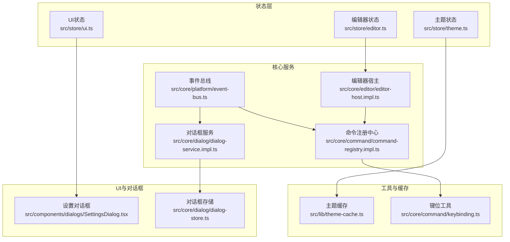
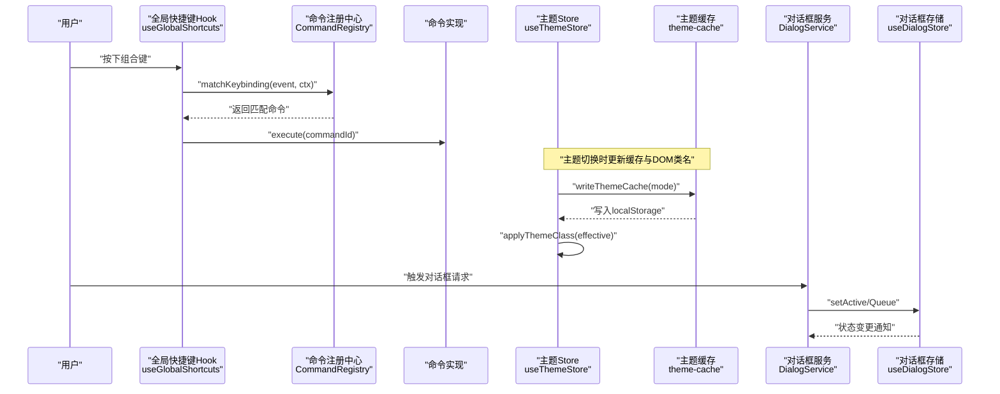
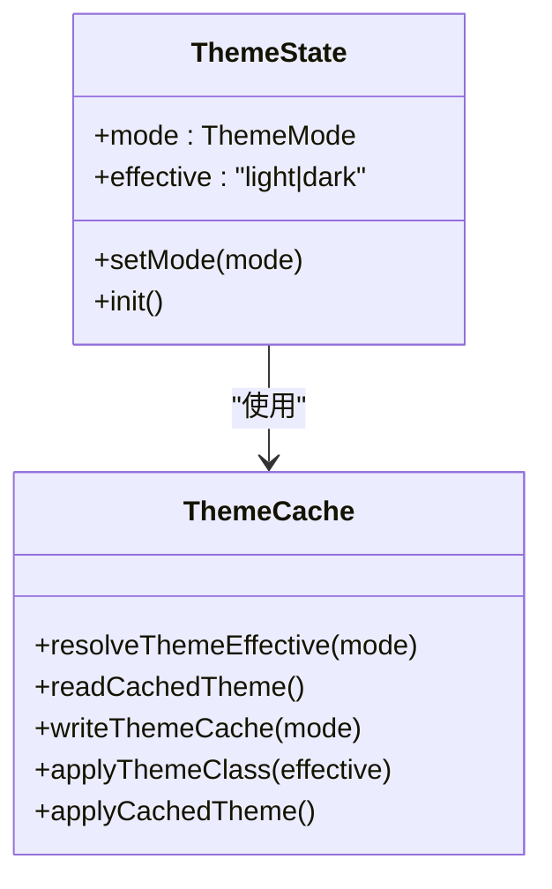
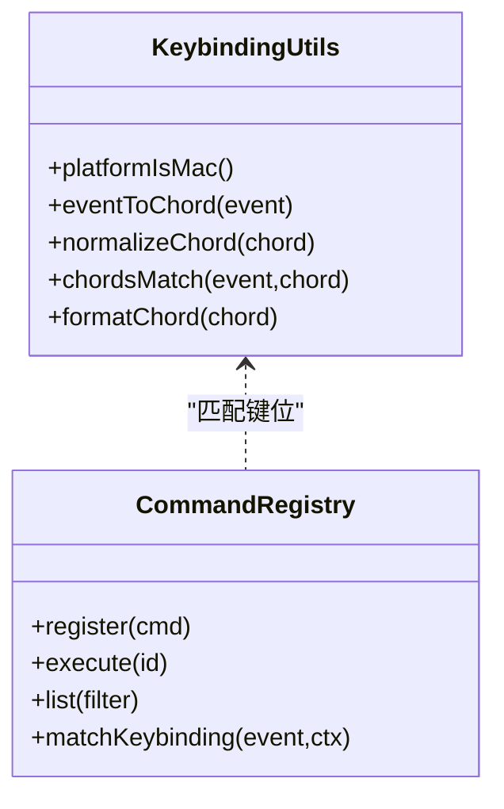
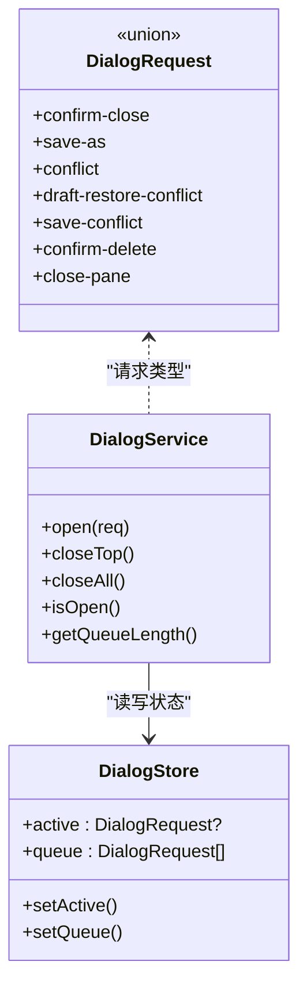
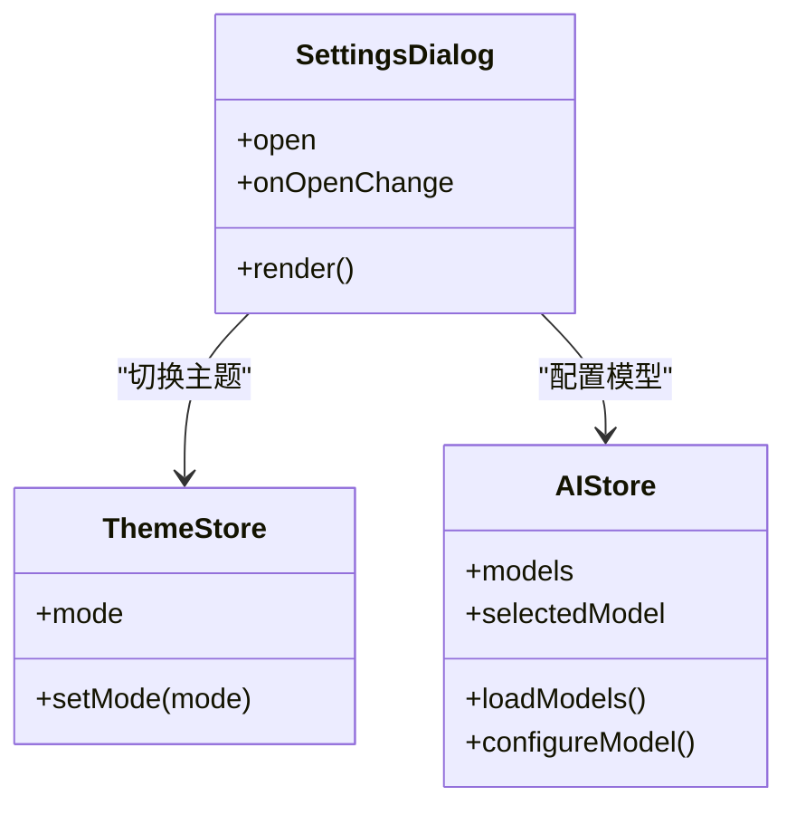
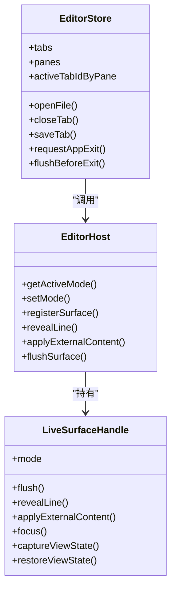
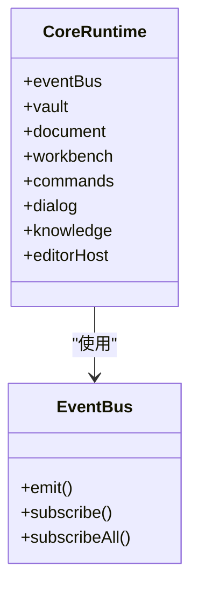
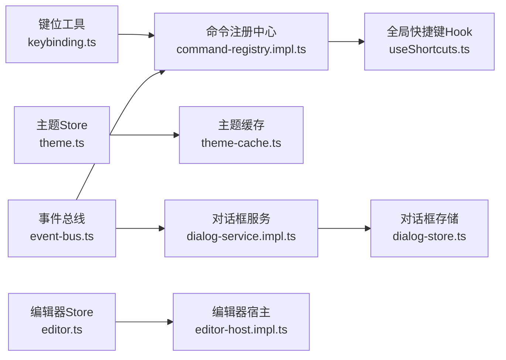

# 用户体验增强功能

<cite>
**本文引用的文件**
- [src/store/theme.ts](file://src/store/theme.ts)
- [src/lib/theme-cache.ts](file://src/lib/theme-cache.ts)
- [src/types.ts](file://src/types.ts)
- [src/hooks/useShortcuts.ts](file://src/hooks/useShortcuts.ts)
- [src/core/command/keybinding.ts](file://src/core/command/keybinding.ts)
- [src/core/command/command-registry.impl.ts](file://src/core/command/command-registry.impl.ts)
- [src/core/command/types.ts](file://src/core/command/types.ts)
- [src/core/dialog/dialog-service.impl.ts](file://src/core/dialog/dialog-service.impl.ts)
- [src/core/dialog/dialog-store.ts](file://src/core/dialog/dialog-store.ts)
- [src/core/dialog/types.ts](file://src/core/dialog/types.ts)
- [src/components/dialogs/SettingsDialog.tsx](file://src/components/dialogs/SettingsDialog.tsx)
- [src/store/ui.ts](file://src/store/ui.ts)
- [src/store/editor.ts](file://src/store/editor.ts)
- [src/core/runtime.ts](file://src/core/runtime.ts)
- [src/core/platform/event-bus.ts](file://src/core/platform/event-bus.ts)
- [src/core/editor/editor-host.impl.ts](file://src/core/editor/editor-host.impl.ts)
- [src/core/editor/surface-handle.ts](file://src/core/editor/surface-handle.ts)
- [src/lib/app-lifecycle.ts](file://src/lib/app-lifecycle.ts)
</cite>

## 目录
1. [简介](#简介)
2. [项目结构](#项目结构)
3. [核心组件](#核心组件)
4. [架构总览](#架构总览)
5. [详细组件分析](#详细组件分析)
6. [依赖关系分析](#依赖关系分析)
7. [性能考量](#性能考量)
8. [故障排查指南](#故障排查指南)
9. [结论](#结论)
10. [附录](#附录)

## 简介
本文件聚焦NoteForge的用户体验增强功能，围绕以下主题展开：
- 主题系统：明暗主题切换、系统跟随、缓存与类名应用、首屏同步应用
- 快捷键系统：键位标准化、跨平台修饰键、命令注册与匹配、上下文感知执行
- 对话框系统：请求队列、关闭策略、状态管理、模态窗口编排
- 状态管理优化：Zustand stores设计、订阅与持久化、性能监控思路
- 无障碍访问：键盘导航、焦点管理、高对比度与颜色方案
- 最佳实践：一致性、可预测性、可访问性与性能平衡

## 项目结构
NoteForge采用分层与模块化组织，前端以Zustand状态管理为核心，配合命令注册中心、对话框服务与主题缓存，形成统一的交互与视觉体验。

**图表来源**
- [src/store/theme.ts:1-62](file://src/store/theme.ts#L1-L62)
- [src/lib/theme-cache.ts:1-46](file://src/lib/theme-cache.ts#L1-L46)
- [src/store/ui.ts:1-86](file://src/store/ui.ts#L1-L86)
- [src/store/editor.ts:1-800](file://src/store/editor.ts#L1-L800)
- [src/core/command/command-registry.impl.ts:1-100](file://src/core/command/command-registry.impl.ts#L1-L100)
- [src/core/dialog/dialog-service.impl.ts:1-58](file://src/core/dialog/dialog-service.impl.ts#L1-L58)
- [src/core/dialog/dialog-store.ts:1-21](file://src/core/dialog/dialog-store.ts#L1-L21)
- [src/core/command/keybinding.ts:1-59](file://src/core/command/keybinding.ts#L1-L59)
- [src/core/platform/event-bus.ts:1-36](file://src/core/platform/event-bus.ts#L1-L36)
- [src/core/editor/editor-host.impl.ts:82-110](file://src/core/editor/editor-host.impl.ts#L82-L110)

**章节来源**
- [src/store/theme.ts:1-62](file://src/store/theme.ts#L1-L62)
- [src/lib/theme-cache.ts:1-46](file://src/lib/theme-cache.ts#L1-L46)
- [src/store/ui.ts:1-86](file://src/store/ui.ts#L1-L86)
- [src/store/editor.ts:1-800](file://src/store/editor.ts#L1-L800)
- [src/core/command/command-registry.impl.ts:1-100](file://src/core/command/command-registry.impl.ts#L1-L100)
- [src/core/dialog/dialog-service.impl.ts:1-58](file://src/core/dialog/dialog-service.impl.ts#L1-L58)
- [src/core/dialog/dialog-store.ts:1-21](file://src/core/dialog/dialog-store.ts#L1-L21)
- [src/core/command/keybinding.ts:1-59](file://src/core/command/keybinding.ts#L1-L59)
- [src/core/platform/event-bus.ts:1-36](file://src/core/platform/event-bus.ts#L1-L36)
- [src/core/editor/editor-host.impl.ts:82-110](file://src/core/editor/editor-host.impl.ts#L82-L110)

## 核心组件
- 主题系统：通过Zustand主题store与主题缓存工具协作，实现系统跟随、明暗切换与首屏同步应用；同时在UI层提供设置入口。
- 快捷键系统：键位工具负责跨平台修饰键与标准化，命令注册中心负责键位索引与上下文匹配，全局Hook集中路由。
- 对话框系统：对话框服务维护活动与队列，对话框存储承载状态，类型约束确保请求安全。
- 编辑器与会话：编辑器store管理标签页、面板、保存与退出流程，结合编辑器宿主与表面句柄实现内容同步与视图状态恢复。
- 运行时与事件：运行时初始化核心服务并注入命令、对话框与知识查询；事件总线提供解耦通信。

**章节来源**
- [src/store/theme.ts:1-62](file://src/store/theme.ts#L1-L62)
- [src/lib/theme-cache.ts:1-46](file://src/lib/theme-cache.ts#L1-L46)
- [src/hooks/useShortcuts.ts:1-25](file://src/hooks/useShortcuts.ts#L1-L25)
- [src/core/command/keybinding.ts:1-59](file://src/core/command/keybinding.ts#L1-L59)
- [src/core/command/command-registry.impl.ts:1-100](file://src/core/command/command-registry.impl.ts#L1-L100)
- [src/core/dialog/dialog-service.impl.ts:1-58](file://src/core/dialog/dialog-service.impl.ts#L1-L58)
- [src/core/dialog/dialog-store.ts:1-21](file://src/core/dialog/dialog-store.ts#L1-L21)
- [src/store/editor.ts:1-800](file://src/store/editor.ts#L1-L800)
- [src/core/runtime.ts:29-70](file://src/core/runtime.ts#L29-L70)
- [src/core/platform/event-bus.ts:1-36](file://src/core/platform/event-bus.ts#L1-L36)

## 架构总览
下图展示从用户输入到系统响应的关键路径，涵盖主题切换、快捷键路由、对话框编排与编辑器会话。

**图表来源**
- [src/hooks/useShortcuts.ts:7-24](file://src/hooks/useShortcuts.ts#L7-L24)
- [src/core/command/command-registry.impl.ts:53-65](file://src/core/command/command-registry.impl.ts#L53-L65)
- [src/store/theme.ts:50-61](file://src/store/theme.ts#L50-L61)
- [src/lib/theme-cache.ts:24-38](file://src/lib/theme-cache.ts#L24-L38)
- [src/core/dialog/dialog-service.impl.ts:10-55](file://src/core/dialog/dialog-service.impl.ts#L10-L55)
- [src/core/dialog/dialog-store.ts:11-16](file://src/core/dialog/dialog-store.ts#L11-L16)

## 详细组件分析

### 主题系统
- 设计要点
  - 主题模式：支持“亮色”“暗色”“系统跟随”，系统跟随基于媒体查询实时生效。
  - 首屏同步：在渲染前应用缓存主题，避免闪烁。
  - 缓存策略：localStorage持久化，读取失败回退默认值。
  - DOM应用：统一移除旧类名，添加当前有效类名，并设置colorScheme与背景色。
- 数据流
  - 初始化：读取缓存 → 查询系统主题 → 应用类名 → 写入缓存 → 更新store。
  - 切换：调用系统接口（忽略stub） → 计算有效主题 → 应用类名 → 写入缓存 → 更新store。
  - 监听：系统主题变化时，若模式为“系统跟随”，重新计算并更新。
- 类图

**图表来源**
- [src/store/theme.ts:11-16](file://src/store/theme.ts#L11-L16)
- [src/store/theme.ts:20-61](file://src/store/theme.ts#L20-L61)
- [src/lib/theme-cache.ts:5-10](file://src/lib/theme-cache.ts#L5-L10)
- [src/lib/theme-cache.ts:12-30](file://src/lib/theme-cache.ts#L12-L30)
- [src/lib/theme-cache.ts:32-45](file://src/lib/theme-cache.ts#L32-L45)

**章节来源**
- [src/store/theme.ts:1-62](file://src/store/theme.ts#L1-L62)
- [src/lib/theme-cache.ts:1-46](file://src/lib/theme-cache.ts#L1-L46)
- [src/types.ts:307-317](file://src/types.ts#L307-L317)

### 快捷键系统
- 键位标准化
  - 自动识别平台（macOS使用⌘/⌥/⇧，其他使用Ctrl/Alt/Shift）。
  - 将KeyboardEvent归一化为“Mod+Shift+p”等组合，便于比较与显示。
  - 支持空格、管道符等特殊键的规范化。
- 命令注册与匹配
  - 注册命令时建立键位索引，支持按when条件过滤（如编辑器焦点、Markdown激活等）。
  - 匹配时先比较键位，再检查上下文与启用条件。
- 全局路由
  - 在window上监听keydown，仅在存在修饰键或F1时参与匹配，阻止默认行为后执行命令。
- 类图

**图表来源**
- [src/core/command/keybinding.ts:14-58](file://src/core/command/keybinding.ts#L14-L58)
- [src/core/command/command-registry.impl.ts:10-67](file://src/core/command/command-registry.impl.ts#L10-L67)

**章节来源**
- [src/core/command/keybinding.ts:1-59](file://src/core/command/keybinding.ts#L1-L59)
- [src/core/command/command-registry.impl.ts:1-100](file://src/core/command/command-registry.impl.ts#L1-L100)
- [src/core/command/types.ts:12-45](file://src/core/command/types.ts#L12-L45)
- [src/hooks/useShortcuts.ts:1-25](file://src/hooks/useShortcuts.ts#L1-L25)

### 对话框系统
- 请求模型
  - 定义多种对话框请求类型（确认关闭、保存另存、冲突、删除、关闭面板等），由对话框宿主统一处理。
- 服务与存储
  - 服务负责打开、关闭顶部、全部关闭、判断是否开启、统计队列长度。
  - 存储持有活动与队列状态，提供订阅能力。
- 关闭策略
  - “关闭类”请求会清理同类型队列并决定是否覆盖当前活动项。
  - 非活动时直接激活，否则入队。
- 类图

**图表来源**
- [src/core/dialog/types.ts:6-13](file://src/core/dialog/types.ts#L6-L13)
- [src/core/dialog/dialog-store.ts:4-9](file://src/core/dialog/dialog-store.ts#L4-L9)
- [src/core/dialog/dialog-store.ts:11-16](file://src/core/dialog/dialog-store.ts#L11-L16)
- [src/core/dialog/dialog-service.impl.ts:10-55](file://src/core/dialog/dialog-service.impl.ts#L10-L55)

**章节来源**
- [src/core/dialog/types.ts:1-22](file://src/core/dialog/types.ts#L1-L22)
- [src/core/dialog/dialog-store.ts:1-21](file://src/core/dialog/dialog-store.ts#L1-L21)
- [src/core/dialog/dialog-service.impl.ts:1-58](file://src/core/dialog/dialog-service.impl.ts#L1-L58)

### 设置对话框与主题联动
- 设置对话框聚合主题模式选择、AI模型配置与连接测试，联动主题store与AI store。
- 主题切换通过store.setMode触发，即时应用并持久化。
- 类图

**图表来源**
- [src/components/dialogs/SettingsDialog.tsx:10-167](file://src/components/dialogs/SettingsDialog.tsx#L10-L167)
- [src/store/theme.ts:14-15](file://src/store/theme.ts#L14-L15)
- [src/store/ui.ts:11-18](file://src/store/ui.ts#L11-L18)

**章节来源**
- [src/components/dialogs/SettingsDialog.tsx:1-167](file://src/components/dialogs/SettingsDialog.tsx#L1-L167)
- [src/store/theme.ts:1-62](file://src/store/theme.ts#L1-L62)
- [src/store/ui.ts:1-86](file://src/store/ui.ts#L1-L86)

### 编辑器与会话状态
- 标签页与面板
  - 管理多面板、标签页集合、活动标签映射、视图状态（光标、滚动锚点）。
  - 支持新建、打开、保存、另存、关闭、合并面板、移动标签等操作。
- 退出流程
  - 捕获视图状态、取消自动保存、刷新核心、刷脏缓冲、持久化会话。
- 表面句柄与宿主
  - 表面句柄抽象编辑器表面的刷新、定位、内容应用与视图状态捕获/恢复。
  - 编辑器宿主负责模式切换、表面注册与外部内容应用。
- 类图

**图表来源**
- [src/store/editor.ts:65-115](file://src/store/editor.ts#L65-L115)
- [src/store/editor.ts:281-440](file://src/store/editor.ts#L281-L440)
- [src/core/editor/surface-handle.ts:5-19](file://src/core/editor/surface-handle.ts#L5-L19)
- [src/core/editor/editor-host.impl.ts:88-110](file://src/core/editor/editor-host.impl.ts#L88-L110)

**章节来源**
- [src/store/editor.ts:1-800](file://src/store/editor.ts#L1-L800)
- [src/core/editor/surface-handle.ts:1-26](file://src/core/editor/surface-handle.ts#L1-L26)
- [src/core/editor/editor-host.impl.ts:82-110](file://src/core/editor/editor-host.impl.ts#L82-L110)

### 运行时与事件总线
- 运行时初始化
  - 创建事件总线、文档服务、工作台、命令注册中心、对话框服务、知识查询服务与编辑器宿主。
  - 注册核心命令，订阅文档冲突事件并弹出对话框。
- 事件总线
  - 提供全量与类型化订阅，支持取消订阅。
- 类图

**图表来源**
- [src/core/runtime.ts:29-70](file://src/core/runtime.ts#L29-L70)
- [src/core/platform/event-bus.ts:3-35](file://src/core/platform/event-bus.ts#L3-L35)

**章节来源**
- [src/core/runtime.ts:29-70](file://src/core/runtime.ts#L29-L70)
- [src/core/platform/event-bus.ts:1-36](file://src/core/platform/event-bus.ts#L1-L36)

## 依赖关系分析
- 组件内聚与耦合
  - 主题系统与缓存工具低耦合，通过函数式接口交互；主题store依赖IPC与缓存工具。
  - 命令注册中心与键位工具强关联，全局Hook作为入口。
  - 对话框服务与存储松耦合，通过状态变更驱动UI。
  - 编辑器store与编辑器宿主、表面句柄形成清晰职责边界。
- 外部依赖
  - IPC用于系统主题与AI配置等系统级能力。
  - localStorage用于主题与引导状态持久化。
- 依赖图

**图表来源**
- [src/core/command/keybinding.ts:1-59](file://src/core/command/keybinding.ts#L1-L59)
- [src/core/command/command-registry.impl.ts:1-100](file://src/core/command/command-registry.impl.ts#L1-L100)
- [src/hooks/useShortcuts.ts:1-25](file://src/hooks/useShortcuts.ts#L1-L25)
- [src/store/theme.ts:1-62](file://src/store/theme.ts#L1-L62)
- [src/lib/theme-cache.ts:1-46](file://src/lib/theme-cache.ts#L1-L46)
- [src/core/dialog/dialog-service.impl.ts:1-58](file://src/core/dialog/dialog-service.impl.ts#L1-L58)
- [src/core/dialog/dialog-store.ts:1-21](file://src/core/dialog/dialog-store.ts#L1-L21)
- [src/store/editor.ts:1-800](file://src/store/editor.ts#L1-L800)
- [src/core/editor/editor-host.impl.ts:82-110](file://src/core/editor/editor-host.impl.ts#L82-L110)
- [src/core/platform/event-bus.ts:1-36](file://src/core/platform/event-bus.ts#L1-L36)

**章节来源**
- [src/core/command/keybinding.ts:1-59](file://src/core/command/keybinding.ts#L1-L59)
- [src/core/command/command-registry.impl.ts:1-100](file://src/core/command/command-registry.impl.ts#L1-L100)
- [src/hooks/useShortcuts.ts:1-25](file://src/hooks/useShortcuts.ts#L1-L25)
- [src/store/theme.ts:1-62](file://src/store/theme.ts#L1-L62)
- [src/lib/theme-cache.ts:1-46](file://src/lib/theme-cache.ts#L1-L46)
- [src/core/dialog/dialog-service.impl.ts:1-58](file://src/core/dialog/dialog-service.impl.ts#L1-L58)
- [src/core/dialog/dialog-store.ts:1-21](file://src/core/dialog/dialog-store.ts#L1-L21)
- [src/store/editor.ts:1-800](file://src/store/editor.ts#L1-L800)
- [src/core/editor/editor-host.impl.ts:82-110](file://src/core/editor/editor-host.impl.ts#L82-L110)
- [src/core/platform/event-bus.ts:1-36](file://src/core/platform/event-bus.ts#L1-L36)

## 性能考量
- 状态粒度与订阅
  - 使用Zustand细粒度订阅，避免不必要的重渲染；UI store包含多个开关与尺寸，建议按需订阅。
- 渲染前主题应用
  - 首屏同步应用主题类名，减少闪烁与重排。
- 键位匹配复杂度
  - 键位索引为数组，匹配时遍历；可通过Map或前缀树优化（在命令数量增长时）。
- 对话框队列
  - 队列长度与关闭策略影响UI响应；建议限制最大队列长度并提供去重逻辑。
- 退出流程
  - 退出前捕获视图状态、刷脏缓冲与持久化，避免数据丢失；注意异步任务的并发与取消。

[本节为通用指导，不直接分析具体文件]

## 故障排查指南
- 主题不生效或闪烁
  - 检查首屏是否调用同步应用主题；确认缓存读取与写入成功；验证DOM类名是否正确切换。
  - 参考：[src/lib/theme-cache.ts:40-45](file://src/lib/theme-cache.ts#L40-L45)，[src/store/theme.ts:24-47](file://src/store/theme.ts#L24-L47)
- 快捷键无效
  - 确认全局Hook已挂载且存在修饰键；检查命令注册与when条件；核对键位标准化结果。
  - 参考：[src/hooks/useShortcuts.ts:8-23](file://src/hooks/useShortcuts.ts#L8-L23)，[src/core/command/command-registry.impl.ts:53-65](file://src/core/command/command-registry.impl.ts#L53-L65)，[src/core/command/keybinding.ts:19-58](file://src/core/command/keybinding.ts#L19-L58)
- 对话框不出现或卡住
  - 检查请求类型是否为“关闭类”导致队列被清空；确认服务状态更新与订阅回调。
  - 参考：[src/core/dialog/dialog-service.impl.ts:10-55](file://src/core/dialog/dialog-service.impl.ts#L10-L55)，[src/core/dialog/dialog-store.ts:11-20](file://src/core/dialog/dialog-store.ts#L11-L20)
- 退出时数据丢失
  - 确认退出流程中的刷脏、持久化与会话捕获步骤是否执行；检查Tauri生命周期钩子。
  - 参考：[src/store/editor.ts:412-440](file://src/store/editor.ts#L412-L440)，[src/lib/app-lifecycle.ts:13-30](file://src/lib/app-lifecycle.ts#L13-L30)

**章节来源**
- [src/lib/theme-cache.ts:40-45](file://src/lib/theme-cache.ts#L40-L45)
- [src/store/theme.ts:24-47](file://src/store/theme.ts#L24-L47)
- [src/hooks/useShortcuts.ts:8-23](file://src/hooks/useShortcuts.ts#L8-L23)
- [src/core/command/command-registry.impl.ts:53-65](file://src/core/command/command-registry.impl.ts#L53-L65)
- [src/core/command/keybinding.ts:19-58](file://src/core/command/keybinding.ts#L19-L58)
- [src/core/dialog/dialog-service.impl.ts:10-55](file://src/core/dialog/dialog-service.impl.ts#L10-L55)
- [src/core/dialog/dialog-store.ts:11-20](file://src/core/dialog/dialog-store.ts#L11-L20)
- [src/store/editor.ts:412-440](file://src/store/editor.ts#L412-L440)
- [src/lib/app-lifecycle.ts:13-30](file://src/lib/app-lifecycle.ts#L13-L30)

## 结论
NoteForge在用户体验方面形成了统一的交互与视觉基础：主题系统提供一致的明暗与系统跟随体验；快捷键系统以命令注册中心为核心，实现跨平台键位标准化与上下文感知；对话框系统通过队列与状态管理保障复杂场景下的可预期行为；编辑器与会话状态管理确保内容与布局的可靠持久化。建议在后续迭代中进一步优化键位匹配性能、增强无障碍能力与提供更丰富的主题定制选项。

[本节为总结性内容，不直接分析具体文件]

## 附录
- 最佳实践清单
  - 主题：首屏同步应用、缓存持久化、系统跟随监听、颜色方案与背景色一致性。
  - 快捷键：跨平台修饰键、键位标准化、上下文when条件、冲突检测与提示。
  - 对话框：请求类型明确、队列长度控制、关闭类策略、状态订阅最小化。
  - 状态管理：Zustand细粒度订阅、必要时拆分store、避免重复渲染。
  - 无障碍：键盘可达、焦点可见、高对比度、语义化标签与屏幕阅读支持。
  - 性能：退出流程异步化、并发控制、内存释放、事件总线订阅去重。

[本节为通用指导，不直接分析具体文件]