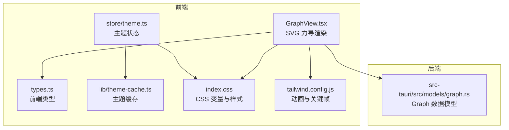
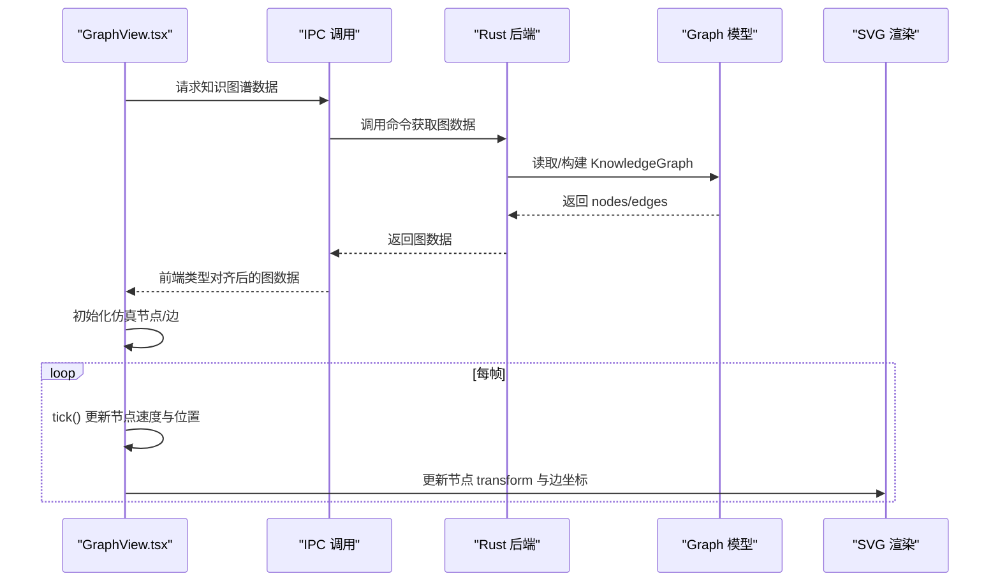
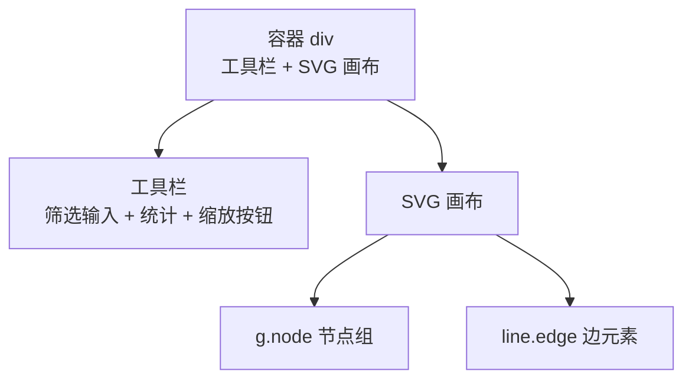
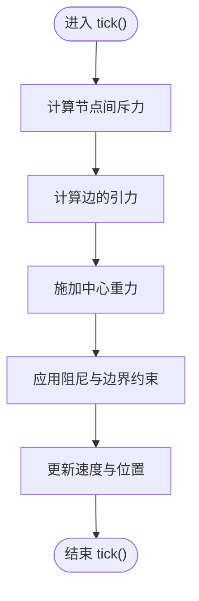
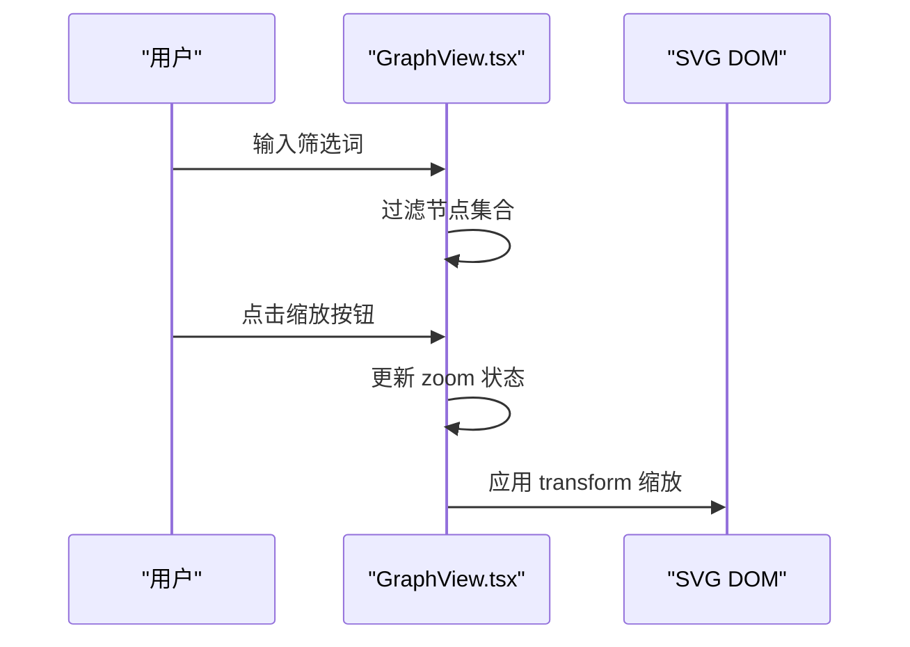
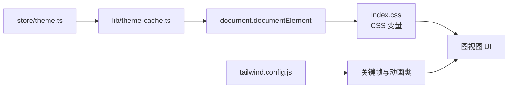
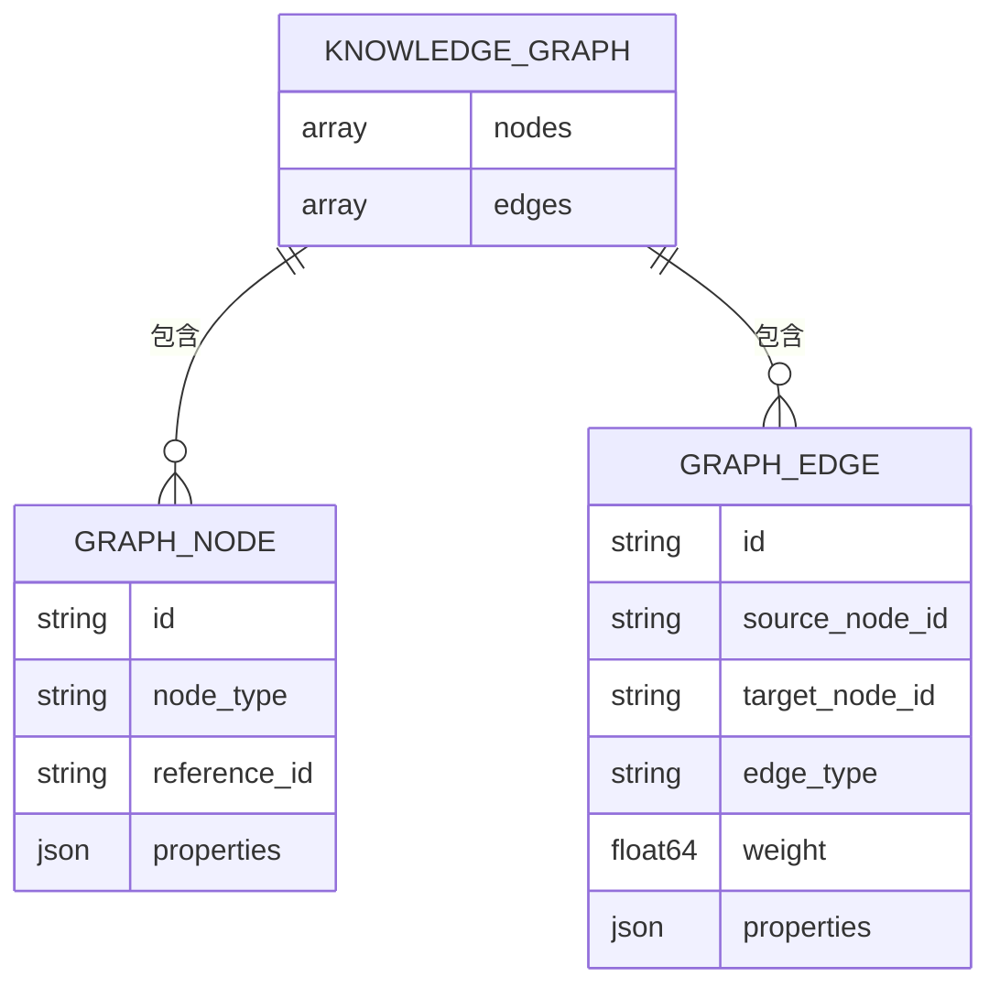
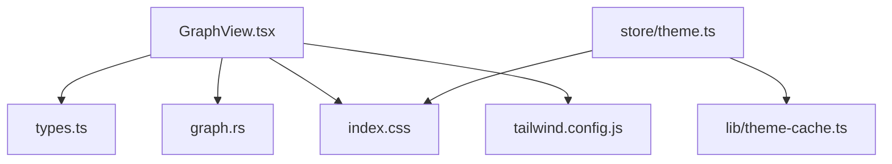

# 图可视化引擎

<cite>
**本文档引用的文件**
- [GraphView.tsx](file://src/features/graph/GraphView.tsx)
- [graph.rs](file://src-tauri/src/models/graph.rs)
- [types.ts](file://src/types.ts)
- [05-knowledge-graph.md](file://docs/design/05-knowledge-graph.md)
- [theme-cache.ts](file://src/lib/theme-cache.ts)
- [theme.ts](file://src/store/theme.ts)
- [index.css](file://src/index.css)
- [tailwind.config.js](file://tailwind.config.js)
</cite>

## 目录
1. [简介](#简介)
2. [项目结构](#项目结构)
3. [核心组件](#核心组件)
4. [架构总览](#架构总览)
5. [详细组件分析](#详细组件分析)
6. [依赖关系分析](#依赖关系分析)
7. [性能考虑](#性能考虑)
8. [故障排查指南](#故障排查指南)
9. [结论](#结论)
10. [附录](#附录)

## 简介
本文件为 NoteForge 的图可视化引擎提供系统性技术文档，聚焦于知识图谱视图的渲染架构、布局算法、交互机制、性能优化与定制化能力。当前实现采用轻量级 SVG 渲染管线，内置力导向布局，并提供基础的节点筛选、缩放与重置等交互。文档同时给出与后端知识图谱模型的对接方式、主题与样式体系、以及未来扩展 WebGL/Canvas 渲染与更多布局算法的建议。

## 项目结构
图可视化引擎位于前端特性模块中，核心文件为 GraphView.tsx；后端知识图谱数据模型由 Rust 定义并通过 IPC 提供给前端。设计文档对视图布局与交互进行约束，主题系统通过 CSS 变量与 Zustand 状态管理实现。

**图表来源**
- [GraphView.tsx:1-178](file://src/features/graph/GraphView.tsx#L1-L178)
- [types.ts:194-255](file://src/types.ts#L194-L255)
- [graph.rs:1-34](file://src-tauri/src/models/graph.rs#L1-L34)
- [theme.ts:1-61](file://src/store/theme.ts#L1-L61)
- [theme-cache.ts:1-45](file://src/lib/theme-cache.ts#L1-L45)
- [index.css:59-173](file://src/index.css#L59-L173)
- [tailwind.config.js:88-104](file://tailwind.config.js#L88-L104)

**章节来源**
- [GraphView.tsx:1-178](file://src/features/graph/GraphView.tsx#L1-L178)
- [graph.rs:1-34](file://src-tauri/src/models/graph.rs#L1-L34)
- [types.ts:194-255](file://src/types.ts#L194-L255)
- [05-knowledge-graph.md:1-29](file://docs/design/05-knowledge-graph.md#L1-L29)
- [theme.ts:1-61](file://src/store/theme.ts#L1-L61)
- [theme-cache.ts:1-45](file://src/lib/theme-cache.ts#L1-L45)
- [index.css:59-173](file://src/index.css#L59-L173)
- [tailwind.config.js:88-104](file://tailwind.config.js#L88-L104)

## 核心组件
- 知识图谱视图容器与工具栏：提供节点筛选输入、统计信息与缩放控制按钮。
- 力导向仿真器：内置节点间库伦斥力、边引力与边界重力，驱动节点位置迭代更新。
- SVG 渲染管线：基于 DOM 的 g/line/circle 元素绘制节点与边，按帧更新 transform 与坐标属性。
- 主题与样式：通过 CSS 变量与 Tailwind 配置实现深浅主题与动画效果。
- 后端模型对接：前端类型与 Rust 模型对齐，经 IPC 获取知识图谱数据。

**章节来源**
- [GraphView.tsx:148-178](file://src/features/graph/GraphView.tsx#L148-L178)
- [GraphView.tsx:28-79](file://src/features/graph/GraphView.tsx#L28-L79)
- [graph.rs:1-34](file://src-tauri/src/models/graph.rs#L1-L34)
- [types.ts:194-255](file://src/types.ts#L194-L255)
- [index.css:59-173](file://src/index.css#L59-L173)
- [tailwind.config.js:88-104](file://tailwind.config.js#L88-L104)

## 架构总览
下图展示从前端视图到后端模型的数据流与渲染流程：

**图表来源**
- [GraphView.tsx:120-146](file://src/features/graph/GraphView.tsx#L120-L146)
- [graph.rs:23-34](file://src-tauri/src/models/graph.rs#L23-L34)
- [types.ts:194-255](file://src/types.ts#L194-L255)

## 详细组件分析

### 渲染管线与组件层次
- 视图容器：包含工具栏与 SVG 画布，负责事件绑定与缩放状态管理。
- 节点与边元素：节点以 g.node 包裹，边以 line.edge 表示；每帧通过查询并设置属性完成更新。
- 事件处理：工具栏按钮触发缩放重置；输入框用于过滤节点名称（当前实现为前端文本过滤）。

**图表来源**
- [GraphView.tsx:148-178](file://src/features/graph/GraphView.tsx#L148-L178)
- [GraphView.tsx:131-142](file://src/features/graph/GraphView.tsx#L131-L142)

**章节来源**
- [GraphView.tsx:148-178](file://src/features/graph/GraphView.tsx#L148-L178)
- [GraphView.tsx:131-142](file://src/features/graph/GraphView.tsx#L131-L142)

### 力导向布局算法
- 库伦斥力：任意两节点间施加斥力，防止重叠。
- 边引力：沿连接方向施加拉力，维持边长。
- 中心重力：将节点缓慢拉回画布中心，增强稳定性。
- 阻尼与边界：限制速度并约束节点在画布范围内。

**图表来源**
- [GraphView.tsx:28-79](file://src/features/graph/GraphView.tsx#L28-L79)

**章节来源**
- [GraphView.tsx:28-79](file://src/features/graph/GraphView.tsx#L28-L79)

### 事件处理机制
- 缩放控制：最小 50%，最大 250%，重置为 100%。
- 节点筛选：输入框实时过滤节点名称（当前为前端字符串匹配）。
- 交互扩展点：可在此基础上增加拖拽、右键菜单、框选等交互。

**图表来源**
- [GraphView.tsx:155-178](file://src/features/graph/GraphView.tsx#L155-L178)
- [GraphView.tsx:131-142](file://src/features/graph/GraphView.tsx#L131-L142)

**章节来源**
- [GraphView.tsx:155-178](file://src/features/graph/GraphView.tsx#L155-L178)
- [GraphView.tsx:131-142](file://src/features/graph/GraphView.tsx#L131-L142)

### 主题与样式体系
- CSS 变量：定义背景、文本、边框、强调色等变量，随主题切换动态生效。
- Tailwind 关键帧：提供淡入、呼吸等动画效果，用于加载态与提示。
- 主题状态：Zustand store 读取系统主题并缓存，变更时应用类名与颜色。

**图表来源**
- [theme.ts:1-61](file://src/store/theme.ts#L1-L61)
- [theme-cache.ts:1-45](file://src/lib/theme-cache.ts#L1-L45)
- [index.css:59-173](file://src/index.css#L59-L173)
- [tailwind.config.js:88-104](file://tailwind.config.js#L88-L104)

**章节来源**
- [theme.ts:1-61](file://src/store/theme.ts#L1-L61)
- [theme-cache.ts:1-45](file://src/lib/theme-cache.ts#L1-L45)
- [index.css:59-173](file://src/index.css#L59-L173)
- [tailwind.config.js:88-104](file://tailwind.config.js#L88-L104)

### 后端模型与 IPC 对接
- Rust 模型：定义节点、边与知识图谱结构，字段采用 camelCase。
- 前端类型：与后端 DTO 对齐，确保 IPC 传输一致性。
- 使用方式：前端通过 IPC 获取图数据，初始化仿真节点与边数组。

**图表来源**
- [graph.rs:1-34](file://src-tauri/src/models/graph.rs#L1-L34)
- [types.ts:194-255](file://src/types.ts#L194-L255)

**章节来源**
- [graph.rs:1-34](file://src-tauri/src/models/graph.rs#L1-L34)
- [types.ts:194-255](file://src/types.ts#L194-L255)

## 依赖关系分析
- 组件耦合：GraphView 依赖前端类型与 IPC 获取数据，渲染依赖 SVG DOM 查询与更新。
- 外部依赖：Tailwind 提供样式与动画；Zustand 管理主题状态；localStorage 缓存主题模式。
- 可能的循环：当前文件间无直接循环依赖，主题与渲染解耦良好。

**图表来源**
- [GraphView.tsx:1-178](file://src/features/graph/GraphView.tsx#L1-L178)
- [types.ts:194-255](file://src/types.ts#L194-L255)
- [graph.rs:1-34](file://src-tauri/src/models/graph.rs#L1-L34)
- [theme.ts:1-61](file://src/store/theme.ts#L1-L61)
- [theme-cache.ts:1-45](file://src/lib/theme-cache.ts#L1-L45)
- [index.css:59-173](file://src/index.css#L59-L173)
- [tailwind.config.js:88-104](file://tailwind.config.js#L88-L104)

**章节来源**
- [GraphView.tsx:1-178](file://src/features/graph/GraphView.tsx#L1-L178)
- [types.ts:194-255](file://src/types.ts#L194-L255)
- [graph.rs:1-34](file://src-tauri/src/models/graph.rs#L1-L34)
- [theme.ts:1-61](file://src/store/theme.ts#L1-L61)
- [theme-cache.ts:1-45](file://src/lib/theme-cache.ts#L1-L45)
- [index.css:59-173](file://src/index.css#L59-L173)
- [tailwind.config.js:88-104](file://tailwind.config.js#L88-L104)

## 性能考虑
- 当前实现为轻量 SVG 渲染，适合中小规模图（≤数百节点）。对于大规模图，建议引入 Canvas/WebGL 渲染与批处理绘制。
- 节点裁剪：在渲染前根据可视区域裁剪节点与边，减少 DOM 更新数量。
- 边简化：对高密度区域采用边聚合或抽样显示，降低连线数量。
- 批量更新：将多帧的 DOM 更新合并为一次查询与属性设置，减少重排重绘。
- 内存管理：及时清理定时器与事件监听；在组件卸载时停止仿真与取消订阅。
- 主题与动画：合理使用 CSS 动画与 GPU 加速属性，避免主线程阻塞。

[本节为通用指导，不直接分析具体文件]

## 故障排查指南
- 图不显示或空白：检查 IPC 是否成功返回图数据；确认容器尺寸与 SVG 尺寸计算。
- 节点不动：检查 tick() 是否被调用；确认节点 fixed 标记与边界约束逻辑。
- 缩放无效：检查 zoom 状态更新与 transform 应用是否同步。
- 主题不生效：确认主题缓存读取与 documentElement 类名应用顺序；检查 CSS 变量覆盖。

**章节来源**
- [GraphView.tsx:120-146](file://src/features/graph/GraphView.tsx#L120-L146)
- [GraphView.tsx:167-178](file://src/features/graph/GraphView.tsx#L167-L178)
- [theme.ts:24-61](file://src/store/theme.ts#L24-L61)
- [theme-cache.ts:32-45](file://src/lib/theme-cache.ts#L32-L45)

## 结论
当前图可视化引擎以轻量 SVG 渲染为核心，内置力导向布局，满足中小规模知识图谱的即时呈现需求。通过主题系统与样式体系，实现了良好的视觉一致性。建议后续引入 Canvas/WebGL 渲染、更多布局算法（如层次布局、圆形布局）、交互增强（拖拽、右键菜单、框选）与性能优化（裁剪、简化、批处理），以支撑更大规模与更丰富的可视化场景。

[本节为总结性内容，不直接分析具体文件]

## 附录

### 配置选项与使用示例
- 缩放范围：最小 50%，最大 250%，重置为 100%。
- 节点筛选：输入框支持前端文本过滤（按节点名称）。
- 主题模式：支持 light/dark/system，自动缓存与系统偏好联动。
- 动画效果：通过 Tailwind 关键帧提供淡入、呼吸等动画类。

**章节来源**
- [GraphView.tsx:155-178](file://src/features/graph/GraphView.tsx#L155-L178)
- [theme.ts:1-61](file://src/store/theme.ts#L1-L61)
- [tailwind.config.js:88-104](file://tailwind.config.js#L88-L104)