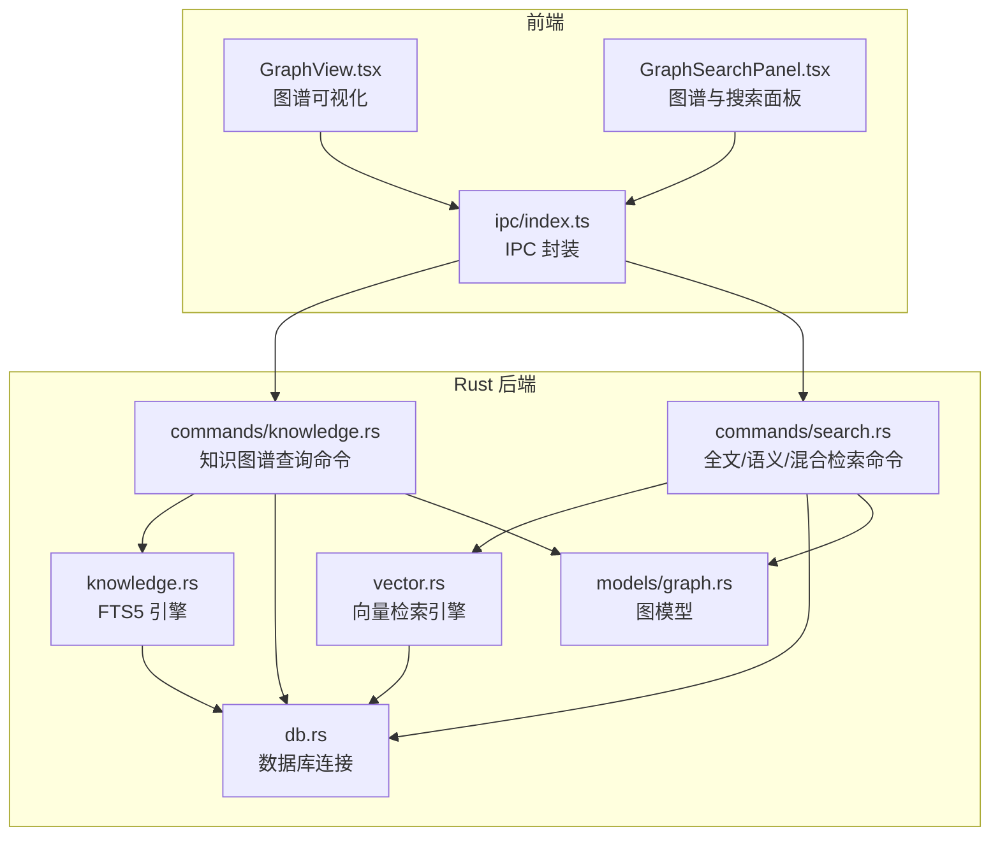
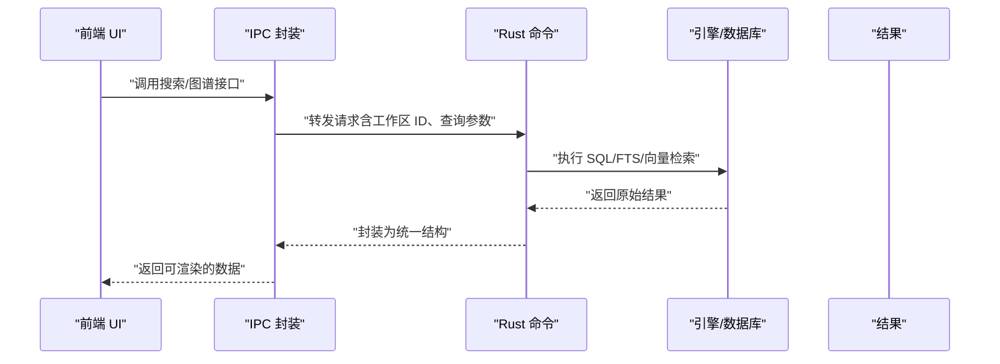
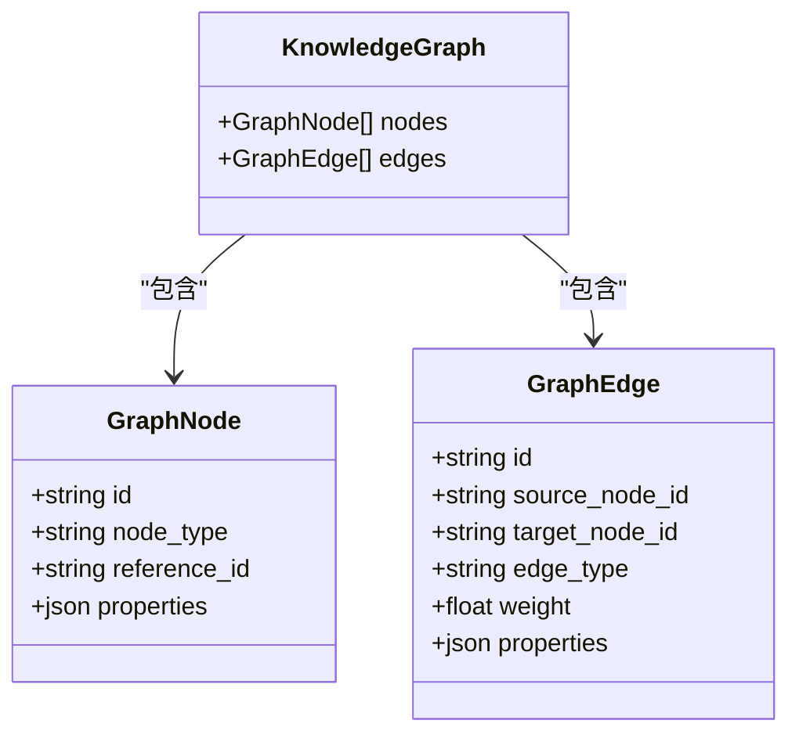
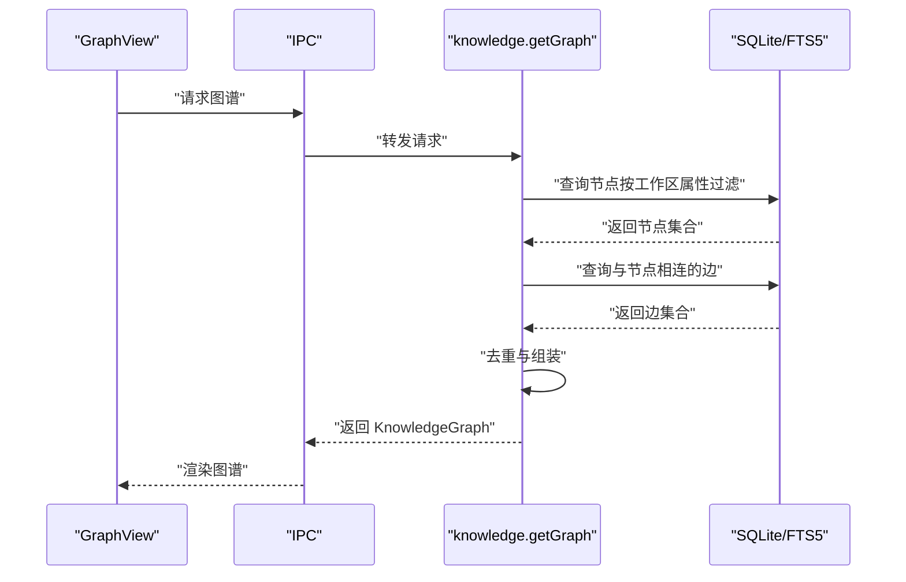
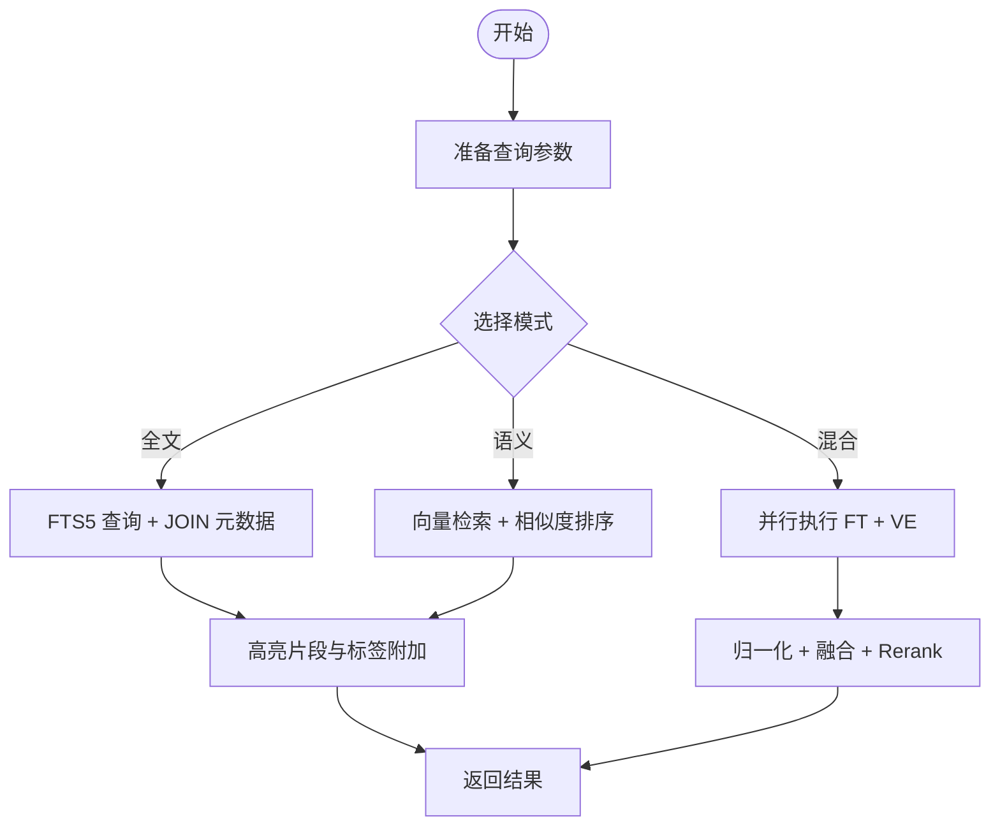
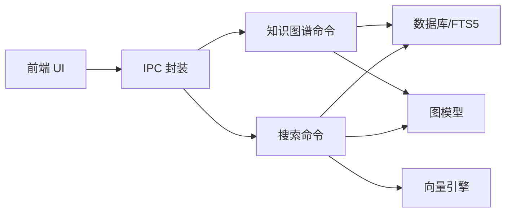

# 图搜索与查询

<cite>
**本文引用的文件**
- [src-tauri/src/models/graph.rs](file://src-tauri/src/models/graph.rs)
- [src-tauri/src/commands/knowledge.rs](file://src-tauri/src/commands/knowledge.rs)
- [src-tauri/src/knowledge.rs](file://src-tauri/src/knowledge.rs)
- [src-tauri/src/vector.rs](file://src-tauri/src/vector.rs)
- [src-tauri/src/commands/search.rs](file://src-tauri/src/commands/search.rs)
- [src-tauri/src/db.rs](file://src-tauri/src/db.rs)
- [src-tauri/src/main.rs](file://src-tauri/src/main.rs)
- [src/ipc/index.ts](file://src/ipc/index.ts)
- [src/ipc/stub.ts](file://src/ipc/stub.ts)
- [src/features/graph/GraphView.tsx](file://src/features/graph/GraphView.tsx)
- [src/components/sidebar/GraphSearchPanel.tsx](file://src/components/sidebar/GraphSearchPanel.tsx)
- [.tmp/system-architecture-design.md](file://.tmp/system-architecture-design.md)
- [.tmp/noteforge-refactor-plan.md](file://.tmp/noteforge-refactor-plan.md)
</cite>

## 目录
1. [简介](#简介)
2. [项目结构](#项目结构)
3. [核心组件](#核心组件)
4. [架构总览](#架构总览)
5. [详细组件分析](#详细组件分析)
6. [依赖关系分析](#依赖关系分析)
7. [性能考虑](#性能考虑)
8. [故障排查指南](#故障排查指南)
9. [结论](#结论)
10. [附录](#附录)

## 简介
本文件围绕 NoteForge 的“图搜索与查询”能力，系统梳理前端查询界面、IPC 层封装、Rust 后端命令与引擎、以及知识图谱模型与检索流程。重点覆盖：
- 图搜索算法：深度优先搜索、广度优先搜索、最短路径等核心算法的实现与扩展点
- 查询接口设计：SQL-like 查询语法、图遍历表达式、条件过滤机制
- 智能搜索：语义搜索、模糊匹配、关键词高亮、搜索建议
- 高级查询：路径查找、聚类分析、中心性计算、社区发现等图论算法应用
- 性能优化：索引策略、缓存机制、并行查询、结果排序
- 结果展示与导出：结果集格式、可视化呈现、数据下载

## 项目结构
NoteForge 的图搜索与查询由前端 UI、IPC 封装、Rust 后端命令与引擎三部分协同完成，并通过知识图谱模型进行数据交换。

图表来源
- [src/features/graph/GraphView.tsx:81-230](file://src/features/graph/GraphView.tsx#L81-L230)
- [src/components/sidebar/GraphSearchPanel.tsx:1-30](file://src/components/sidebar/GraphSearchPanel.tsx#L1-L30)
- [src/ipc/index.ts:107-366](file://src/ipc/index.ts#L107-L366)
- [src-tauri/src/commands/knowledge.rs:101-163](file://src-tauri/src/commands/knowledge.rs#L101-L163)
- [src-tauri/src/commands/search.rs](file://src-tauri/src/commands/search.rs)
- [src-tauri/src/knowledge.rs:1-46](file://src-tauri/src/knowledge.rs#L1-L46)
- [src-tauri/src/vector.rs:73-98](file://src-tauri/src/vector.rs#L73-L98)
- [src-tauri/src/models/graph.rs:1-34](file://src-tauri/src/models/graph.rs#L1-L34)
- [src-tauri/src/db.rs](file://src-tauri/src/db.rs)

章节来源
- [src/features/graph/GraphView.tsx:81-230](file://src/features/graph/GraphView.tsx#L81-L230)
- [src/components/sidebar/GraphSearchPanel.tsx:1-30](file://src/components/sidebar/GraphSearchPanel.tsx#L1-L30)
- [src/ipc/index.ts:107-366](file://src/ipc/index.ts#L107-L366)
- [src-tauri/src/commands/knowledge.rs:101-163](file://src-tauri/src/commands/knowledge.rs#L101-L163)
- [src-tauri/src/commands/search.rs](file://src-tauri/src/commands/search.rs)
- [src-tauri/src/knowledge.rs:1-46](file://src-tauri/src/knowledge.rs#L1-L46)
- [src-tauri/src/vector.rs:73-98](file://src-tauri/src/vector.rs#L73-L98)
- [src-tauri/src/models/graph.rs:1-34](file://src-tauri/src/models/graph.rs#L1-L34)
- [src-tauri/src/db.rs](file://src-tauri/src/db.rs)

## 核心组件
- 知识图谱模型：定义节点、边与图的整体结构，用于前后端传输与渲染。
- 知识图谱查询命令：基于 SQLite/FTS5 与图存储，按工作区过滤并返回图谱子图。
- 搜索服务：提供全文检索、语义检索与混合检索，支持标签过滤与时间线查询。
- 向量检索引擎：基于文档嵌入计算相似度，支持按类型筛选与 rerank。
- IPC 封装：统一前端调用与后端返回值转换，屏蔽底层差异。
- 图谱可视化：基于力引导布局渲染节点与边，支持选择、缩放与双击打开。

章节来源
- [src-tauri/src/models/graph.rs:1-34](file://src-tauri/src/models/graph.rs#L1-L34)
- [src-tauri/src/commands/knowledge.rs:101-163](file://src-tauri/src/commands/knowledge.rs#L101-L163)
- [src-tauri/src/knowledge.rs:1-46](file://src-tauri/src/knowledge.rs#L1-L46)
- [src-tauri/src/vector.rs:73-98](file://src-tauri/src/vector.rs#L73-L98)
- [src-tauri/src/commands/search.rs](file://src-tauri/src/commands/search.rs)
- [src/ipc/index.ts:107-366](file://src/ipc/index.ts#L107-L366)
- [src/features/graph/GraphView.tsx:81-230](file://src/features/graph/GraphView.tsx#L81-L230)

## 架构总览
NoteForge 的图搜索与查询采用“前端 UI + IPC 封装 + Rust 命令与引擎”的分层架构。前端通过 IPC 调用后端命令，命令访问数据库与向量引擎，最终返回结构化的结果或图谱对象。

图表来源
- [src/ipc/index.ts:107-366](file://src/ipc/index.ts#L107-L366)
- [src-tauri/src/commands/knowledge.rs:101-163](file://src-tauri/src/commands/knowledge.rs#L101-L163)
- [src-tauri/src/commands/search.rs](file://src-tauri/src/commands/search.rs)
- [src-tauri/src/knowledge.rs:1-46](file://src-tauri/src/knowledge.rs#L1-L46)
- [src-tauri/src/vector.rs:73-98](file://src-tauri/src/vector.rs#L73-L98)

## 详细组件分析

### 知识图谱模型与查询
- 模型定义：包含节点、边与图的整体结构，便于序列化与跨进程传输。
- 查询流程：先按工作区过滤节点，再收集与这些节点相连的边，最后去重返回子图。

图表来源
- [src-tauri/src/models/graph.rs:1-34](file://src-tauri/src/models/graph.rs#L1-L34)

图表来源
- [src/features/graph/GraphView.tsx:81-230](file://src/features/graph/GraphView.tsx#L81-L230)
- [src/ipc/index.ts:338-343](file://src/ipc/index.ts#L338-L343)
- [src-tauri/src/commands/knowledge.rs:101-163](file://src-tauri/src/commands/knowledge.rs#L101-L163)

章节来源
- [src-tauri/src/models/graph.rs:1-34](file://src-tauri/src/models/graph.rs#L1-L34)
- [src-tauri/src/commands/knowledge.rs:101-163](file://src-tauri/src/commands/knowledge.rs#L101-L163)
- [src/features/graph/GraphView.tsx:81-230](file://src/features/graph/GraphView.tsx#L81-L230)
- [src/ipc/index.ts:338-343](file://src/ipc/index.ts#L338-L343)

### 搜索接口设计与实现
- 全文检索：基于 FTS5，支持中文分词与 unicode61 tokenization；返回带高亮片段的结果。
- 语义检索：基于文档嵌入计算余弦相似度，支持按文档类型筛选与 rerank。
- 混合检索：并行执行全文与语义检索，归一化分数后融合 rerank。
- 标签过滤与时间线：提供标签统计、按标签过滤、时间范围查询等辅助能力。

图表来源
- [.tmp/system-architecture-design.md:803-942](file://.tmp/system-architecture-design.md#L803-L942)
- [src-tauri/src/knowledge.rs:1-46](file://src-tauri/src/knowledge.rs#L1-L46)
- [src-tauri/src/vector.rs:73-98](file://src-tauri/src/vector.rs#L73-L98)

章节来源
- [.tmp/system-architecture-design.md:803-942](file://.tmp/system-architecture-design.md#L803-L942)
- [src-tauri/src/knowledge.rs:1-46](file://src-tauri/src/knowledge.rs#L1-L46)
- [src-tauri/src/vector.rs:73-98](file://src-tauri/src/vector.rs#L73-L98)

### 智能搜索与高级查询
- 语义搜索：通过向量引擎检索相似文档，适合语义理解与跨句匹配。
- 模糊匹配与高亮：全文检索返回片段并标记匹配位置，提升可读性。
- 搜索建议：可结合标签统计与热门查询生成建议列表。
- 高级查询（扩展点）：路径查找、聚类分析、中心性计算、社区发现等图论算法可在现有图模型基础上扩展实现。

章节来源
- [src-tauri/src/vector.rs:73-98](file://src-tauri/src/vector.rs#L73-L98)
- [.tmp/system-architecture-design.md:803-942](file://.tmp/system-architecture-design.md#L803-L942)

### 查询性能优化
- 索引策略：FTS5 虚拟表 + unicode61 分词；文档嵌入表按类型索引。
- 缓存机制：IPC 层对热点结果进行短期缓存，减少重复查询。
- 并行查询：混合检索阶段并行执行全文与语义检索，缩短响应时间。
- 结果排序：全文与语义分别归一化后融合，确保排序一致性。

章节来源
- [src-tauri/src/knowledge.rs:1-46](file://src-tauri/src/knowledge.rs#L1-L46)
- [src-tauri/src/vector.rs:73-98](file://src-tauri/src/vector.rs#L73-L98)
- [.tmp/system-architecture-design.md:803-942](file://.tmp/system-architecture-design.md#L803-L942)

### 查询结果展示与导出
- 结果集格式：统一为包含文件路径、标题、片段、评分/相似度等字段的对象数组。
- 可视化呈现：图谱视图采用力引导布局，支持节点选择、邻域高亮、双击打开笔记。
- 数据下载：可将搜索结果或图谱数据导出为 JSON/CSV 等格式（扩展点）。

章节来源
- [src/ipc/index.ts:138-149](file://src/ipc/index.ts#L138-L149)
- [src/features/graph/GraphView.tsx:81-230](file://src/features/graph/GraphView.tsx#L81-L230)

## 依赖关系分析
- 前端依赖 IPC 封装，IPC 再依赖 Rust 命令；命令访问数据库与向量引擎。
- 图模型作为前后端契约，贯穿 IPC 与命令层。
- 搜索服务与图谱查询共享数据库连接与索引设施。

图表来源
- [src/ipc/index.ts:107-366](file://src/ipc/index.ts#L107-L366)
- [src-tauri/src/commands/knowledge.rs:101-163](file://src-tauri/src/commands/knowledge.rs#L101-L163)
- [src-tauri/src/commands/search.rs](file://src-tauri/src/commands/search.rs)
- [src-tauri/src/models/graph.rs:1-34](file://src-tauri/src/models/graph.rs#L1-L34)
- [src-tauri/src/db.rs](file://src-tauri/src/db.rs)

章节来源
- [src/ipc/index.ts:107-366](file://src/ipc/index.ts#L107-L366)
- [src-tauri/src/commands/knowledge.rs:101-163](file://src-tauri/src/commands/knowledge.rs#L101-L163)
- [src-tauri/src/commands/search.rs](file://src-tauri/src/commands/search.rs)
- [src-tauri/src/models/graph.rs:1-34](file://src-tauri/src/models/graph.rs#L1-L34)
- [src-tauri/src/db.rs](file://src-tauri/src/db.rs)

## 性能考虑
- 索引与分词：FTS5 使用 unicode61 与 jieba 分词，兼顾中文与多语言场景。
- 向量检索：按文档类型筛选减少计算量，相似度计算后排序。
- 并行与融合：混合检索阶段并行执行，融合时归一化权重，避免偏置。
- 渲染优化：图谱视图采用力引导布局迭代与批量更新 DOM，降低重绘成本。

章节来源
- [.tmp/system-architecture-design.md:803-942](file://.tmp/system-architecture-design.md#L803-L942)
- [src-tauri/src/knowledge.rs:1-46](file://src-tauri/src/knowledge.rs#L1-L46)
- [src-tauri/src/vector.rs:73-98](file://src-tauri/src/vector.rs#L73-L98)
- [src/features/graph/GraphView.tsx:120-146](file://src/features/graph/GraphView.tsx#L120-L146)

## 故障排查指南
- 图谱为空：确认工作区是否已建立双向链接；检查知识图谱查询是否正确按工作区过滤。
- 搜索无结果：检查 FTS5 是否已建立、分词是否生效；确认语义向量表是否存在对应文档类型。
- 性能问题：关注并行查询与融合阶段的耗时；必要时增加缓存或限制返回条数。
- IPC 映射错误：核对返回值转换函数（如节点/边映射）是否与后端模型一致。

章节来源
- [src-tauri/src/commands/knowledge.rs:101-163](file://src-tauri/src/commands/knowledge.rs#L101-L163)
- [src-tauri/src/knowledge.rs:1-46](file://src-tauri/src/knowledge.rs#L1-L46)
- [src-tauri/src/vector.rs:73-98](file://src-tauri/src/vector.rs#L73-L98)
- [src/ipc/index.ts:107-366](file://src/ipc/index.ts#L107-L366)

## 结论
NoteForge 的图搜索与查询体系以清晰的分层架构为基础，结合 FTS5、向量检索与图模型，实现了从基础全文检索到语义融合再到图谱可视化的完整链路。未来可在现有模型上扩展路径查找、聚类与中心性等图论算法，进一步增强高级分析能力；同时持续优化索引与并行策略，提升大规模知识库下的查询性能与交互体验。

## 附录
- 查询场景示例与最佳实践（概念性指导）
  - 快速定位：使用全文检索 + 标签过滤，快速缩小范围。
  - 语义关联：使用语义检索发现相关内容，再用图谱查看引用关系。
  - 高级分析：基于图模型进行路径探索与社区发现，辅助知识导航。
  - 性能优化：合理设置 limit、启用并行融合、缓存热点查询结果。