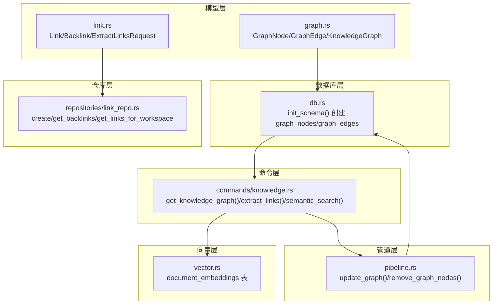
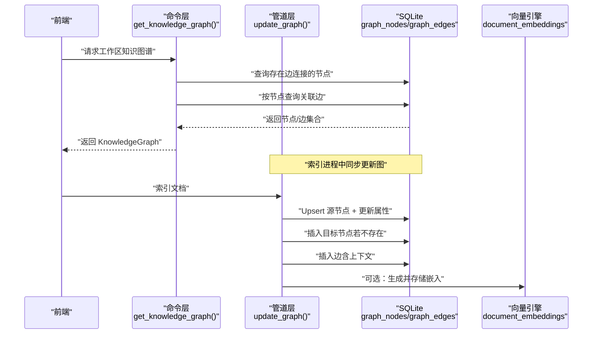
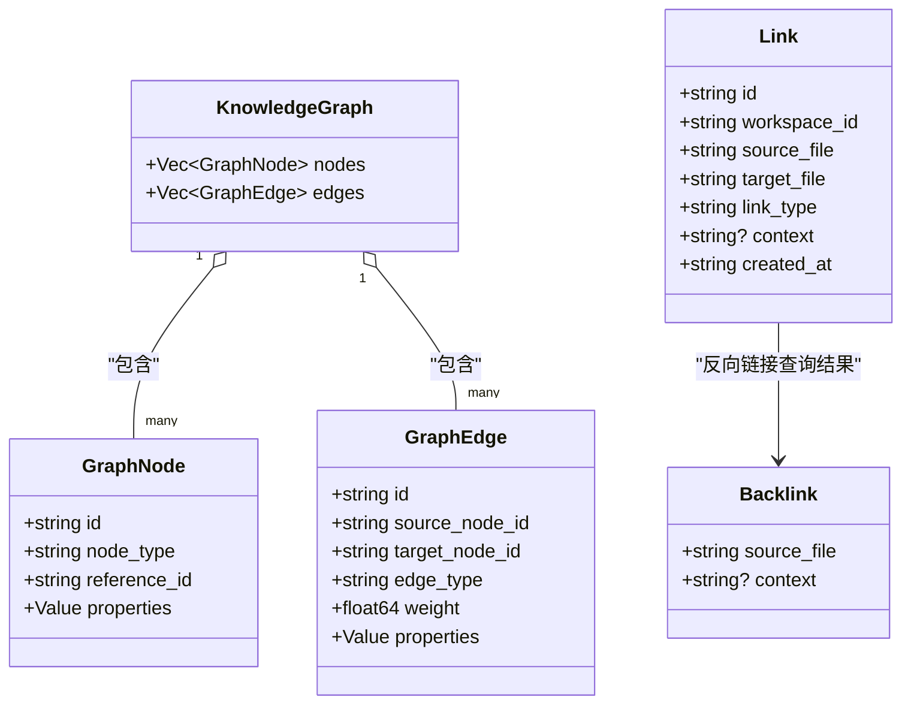
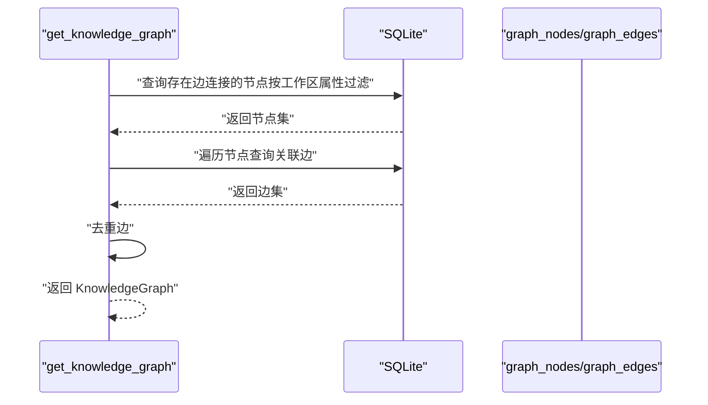
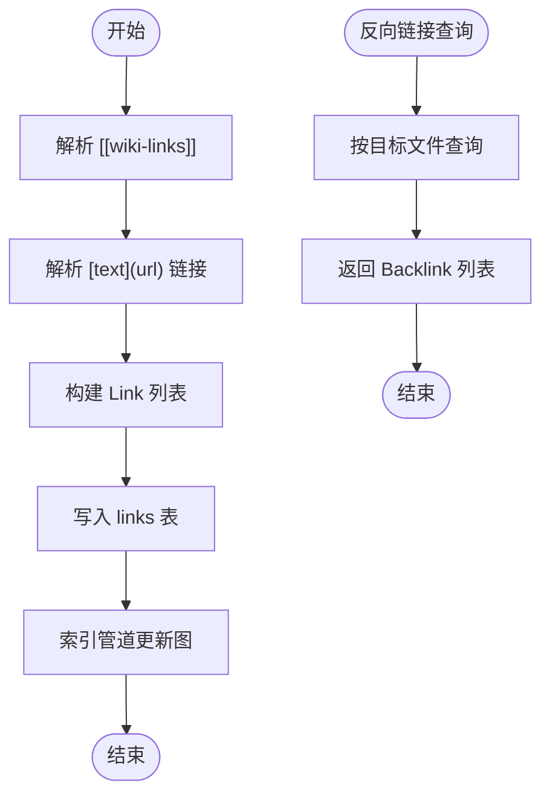
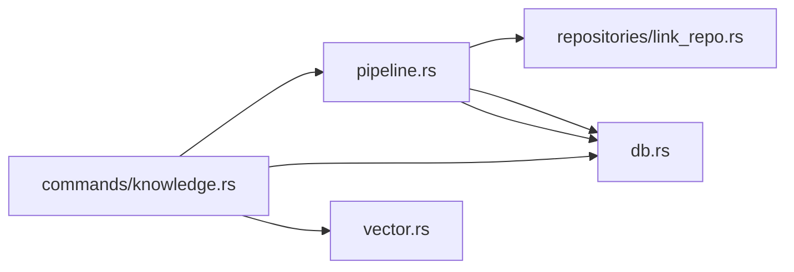

# 图数据模型

<cite>
**本文档引用的文件**   
- [src-tauri/src/models/graph.rs](file://src-tauri/src/models/graph.rs)
- [src-tauri/src/models/link.rs](file://src-tauri/src/models/link.rs)
- [src-tauri/src/db.rs](file://src-tauri/src/db.rs)
- [src-tauri/src/commands/knowledge.rs](file://src-tauri/src/commands/knowledge.rs)
- [src-tauri/src/pipeline.rs](file://src-tauri/src/pipeline.rs)
- [src-tauri/src/repositories/link_repo.rs](file://src-tauri/src/repositories/link_repo.rs)
- [src-tauri/src/vector.rs](file://src-tauri/src/vector.rs)
- [.tmp/system-architecture-design.md](file://.tmp/system-architecture-design.md)
</cite>

## 目录
1. [引言](#引言)
2. [项目结构](#项目结构)
3. [核心组件](#核心组件)
4. [架构总览](#架构总览)
5. [详细组件分析](#详细组件分析)
6. [依赖关系分析](#依赖关系分析)
7. [性能考量](#性能考量)
8. [故障排查指南](#故障排查指南)
9. [结论](#结论)
10. [附录](#附录)

## 引言
本文件系统性梳理 NoteForge 的图数据模型，覆盖节点与边的数据结构、SQLite 模式设计、JSON 序列化、内存模型、扩展性与版本控制、关系映射与约束、以及数据校验与一致性保障。同时给出关键流程的时序与类图，帮助开发者理解并正确使用图数据模型。

## 项目结构
与图数据模型直接相关的代码分布在以下模块：
- 数据模型层：定义图节点、边与请求对象
- 数据库层：初始化 SQLite 模式，包含图节点与边表
- 命令层：对外暴露获取知识图谱、提取链接、语义检索等命令
- 管道层：索引进程中更新图节点与边
- 仓库层：链接的持久化操作
- 向量层：文档嵌入存储（用于语义检索）



图表来源
- [src-tauri/src/models/graph.rs:1-35](file://src-tauri/src/models/graph.rs#L1-L35)
- [src-tauri/src/models/link.rs:1-34](file://src-tauri/src/models/link.rs#L1-L34)
- [src-tauri/src/db.rs:104-126](file://src-tauri/src/db.rs#L104-L126)
- [src-tauri/src/commands/knowledge.rs:95-163](file://src-tauri/src/commands/knowledge.rs#L95-L163)
- [src-tauri/src/pipeline.rs:136-190](file://src-tauri/src/pipeline.rs#L136-L190)
- [src-tauri/src/repositories/link_repo.rs:14-84](file://src-tauri/src/repositories/link_repo.rs#L14-L84)
- [src-tauri/src/vector.rs:12-28](file://src-tauri/src/vector.rs#L12-L28)

章节来源
- [src-tauri/src/models/graph.rs:1-35](file://src-tauri/src/models/graph.rs#L1-L35)
- [src-tauri/src/models/link.rs:1-34](file://src-tauri/src/models/link.rs#L1-L34)
- [src-tauri/src/db.rs:104-126](file://src-tauri/src/db.rs#L104-L126)
- [src-tauri/src/commands/knowledge.rs:95-163](file://src-tauri/src/commands/knowledge.rs#L95-L163)
- [src-tauri/src/pipeline.rs:136-190](file://src-tauri/src/pipeline.rs#L136-L190)
- [src-tauri/src/repositories/link_repo.rs:14-84](file://src-tauri/src/repositories/link_repo.rs#L14-L84)
- [src-tauri/src/vector.rs:12-28](file://src-tauri/src/vector.rs#L12-L28)

## 核心组件
- 图节点（GraphNode）
  - 字段：标识、节点类型、引用 ID、属性 JSON
  - 节点类型枚举：note/memory/concept/agent
  - 属性 JSON 支持任意扩展字段
- 图边（GraphEdge）
  - 字段：标识、源节点、目标节点、边类型、权重、属性 JSON
  - 权重默认 1.0，支持自定义
- 知识图谱（KnowledgeGraph）
  - 节点列表 + 边列表
- 请求模型
  - 获取知识图谱请求：包含工作区 ID
  - 提取链接请求：内容与源文件路径
  - 反向链接请求：目标文件路径

章节来源
- [src-tauri/src/models/graph.rs:3-34](file://src-tauri/src/models/graph.rs#L3-L34)
- [src-tauri/src/models/link.rs:3-33](file://src-tauri/src/models/link.rs#L3-L33)

## 架构总览
图数据模型围绕 SQLite 持久化展开，通过索引管道在文档入库时同步构建图节点与边；查询端通过命令接口返回当前工作区内的可达子图，并结合全文与向量能力实现多模态检索。



图表来源
- [src-tauri/src/commands/knowledge.rs:95-163](file://src-tauri/src/commands/knowledge.rs#L95-L163)
- [src-tauri/src/pipeline.rs:136-190](file://src-tauri/src/pipeline.rs#L136-L190)
- [src-tauri/src/db.rs:104-126](file://src-tauri/src/db.rs#L104-L126)
- [src-tauri/src/vector.rs:12-28](file://src-tauri/src/vector.rs#L12-L28)

## 详细组件分析

### 数据模型类图


图表来源
- [src-tauri/src/models/graph.rs:3-34](file://src-tauri/src/models/graph.rs#L3-L34)
- [src-tauri/src/models/link.rs:3-33](file://src-tauri/src/models/link.rs#L3-L33)

章节来源
- [src-tauri/src/models/graph.rs:3-34](file://src-tauri/src/models/graph.rs#L3-L34)
- [src-tauri/src/models/link.rs:3-33](file://src-tauri/src/models/link.rs#L3-L33)

### SQLite Schema 设计与关系映射
- graph_nodes
  - 主键：id
  - 节点类型检查：note/memory/concept/agent
  - reference_id：指向 notes/memories 等实体的引用
  - properties：JSON 扩展属性
  - created_at：时间戳
- graph_edges
  - 主键：id
  - 外键：source/target 引用 graph_nodes(id)，删除级联
  - 边类型：任意字符串
  - 权重：REAL，默认 1.0
  - properties：JSON 扩展属性
  - created_at：时间戳
- 索引
  - graph_edges 上对 source/target 建有索引，支撑查询性能
- 版本迁移
  - schema_migrations：记录版本号、名称与应用时间

章节来源
- [src-tauri/src/db.rs:104-126](file://src-tauri/src/db.rs#L104-L126)
- [src-tauri/src/db.rs:160-168](file://src-tauri/src/db.rs#L160-L168)
- [.tmp/system-architecture-design.md:568-614](file://.tmp/system-architecture-design.md#L568-L614)

### 图构建与更新流程（时序）
```mermaid
sequenceDiagram
participant IDX as "IndexPipeline"
participant NODE as "graph_nodes"
participant EDGE as "graph_edges"
participant LINK as "links"
IDX->>NODE : "Upsert 源节点note : file_path"
IDX->>NODE : "更新属性标题/路径/工作区"
IDX->>LINK : "读取该源文件的所有链接"
loop 对每个链接
IDX->>NODE : "确保目标节点存在"
IDX->>EDGE : "插入边含上下文"
end
```

图表来源
- [src-tauri/src/pipeline.rs:136-190](file://src-tauri/src/pipeline.rs#L136-L190)

章节来源
- [src-tauri/src/pipeline.rs:136-190](file://src-tauri/src/pipeline.rs#L136-L190)

### 查询知识图谱流程（时序）


图表来源
- [src-tauri/src/commands/knowledge.rs:95-163](file://src-tauri/src/commands/knowledge.rs#L95-L163)

章节来源
- [src-tauri/src/commands/knowledge.rs:95-163](file://src-tauri/src/commands/knowledge.rs#L95-L163)

### 链接抽取与反向链接（流程图）


图表来源
- [src-tauri/src/commands/knowledge.rs:166-230](file://src-tauri/src/commands/knowledge.rs#L166-L230)
- [src-tauri/src/repositories/link_repo.rs:42-60](file://src-tauri/src/repositories/link_repo.rs#L42-L60)
- [src-tauri/src/pipeline.rs:229-267](file://src-tauri/src/pipeline.rs#L229-L267)

章节来源
- [src-tauri/src/commands/knowledge.rs:166-230](file://src-tauri/src/commands/knowledge.rs#L166-L230)
- [src-tauri/src/repositories/link_repo.rs:42-60](file://src-tauri/src/repositories/link_repo.rs#L42-L60)
- [src-tauri/src/pipeline.rs:229-267](file://src-tauri/src/pipeline.rs#L229-L267)

### 嵌入存储与语义检索
- 文档嵌入表：document_embeddings（document_id、document_type、embedding JSON、created_at）
- 向量引擎：延迟加载模型，将文本转为向量并以 JSON 形式存储
- 语义检索：基于相似度搜索返回匹配文档 ID，再回查笔记标题与内容

章节来源
- [src-tauri/src/vector.rs:12-44](file://src-tauri/src/vector.rs#L12-L44)
- [src-tauri/src/commands/knowledge.rs:233-269](file://src-tauri/src/commands/knowledge.rs#L233-L269)

## 依赖关系分析
- 组件耦合
  - 命令层依赖数据库状态与知识引擎/向量引擎
  - 管道层依赖仓库层（链接）、知识引擎与向量引擎
  - 模型层被命令与管道层广泛使用
- 外部依赖
  - SQLite（rusqlite）负责持久化
  - fastembed（延迟初始化）负责向量生成
  - 正则表达式用于链接与标签抽取
- 约束与完整性
  - graph_edges 的源/标外键引用 graph_nodes，删除级联
  - graph_nodes.node_type 使用 CHECK 约束限定枚举值
  - links 表的 link_type 使用 CHECK 约束限定枚举值



图表来源
- [src-tauri/src/commands/knowledge.rs:14-12](file://src-tauri/src/commands/knowledge.rs#L14-L12)
- [src-tauri/src/pipeline.rs:8-10](file://src-tauri/src/pipeline.rs#L8-L10)
- [src-tauri/src/repositories/link_repo.rs:1-7](file://src-tauri/src/repositories/link_repo.rs#L1-L7)
- [src-tauri/src/db.rs:104-126](file://src-tauri/src/db.rs#L104-L126)
- [src-tauri/src/vector.rs:12-28](file://src-tauri/src/vector.rs#L12-L28)

章节来源
- [src-tauri/src/commands/knowledge.rs:14-12](file://src-tauri/src/commands/knowledge.rs#L14-L12)
- [src-tauri/src/pipeline.rs:8-10](file://src-tauri/src/pipeline.rs#L8-L10)
- [src-tauri/src/repositories/link_repo.rs:1-7](file://src-tauri/src/repositories/link_repo.rs#L1-L7)
- [src-tauri/src/db.rs:104-126](file://src-tauri/src/db.rs#L104-L126)
- [src-tauri/src/vector.rs:12-28](file://src-tauri/src/vector.rs#L12-L28)

## 性能考量
- 查询优化
  - graph_edges 对 source/target 建有索引，建议按节点批量查询边
  - 获取知识图谱时先筛选“存在边连接”的节点，减少扫描范围
- 写入优化
  - 管道层使用事务包裹索引步骤，保证原子性与吞吐
  - 插入边前确保目标节点存在，避免重复查找
- 存储优化
  - 属性统一以 JSON 存储，便于扩展但需注意查询性能
  - 嵌入采用 JSON 存储，避免二进制序列化复杂度
- 并发与锁
  - 数据库连接使用互斥锁保护，注意避免长时间持有锁

## 故障排查指南
- 图查询为空
  - 检查是否存在“存在边连接”的节点（按工作区属性过滤）
  - 确认 links 表是否已抽取并写入对应工作区
- 边缺失或重复
  - 确认索引管道是否执行 update_graph
  - 检查去重逻辑（按 id 排序后 dedup）
- 外键约束错误
  - 确保 graph_edges 的源/标节点在 graph_nodes 中存在
  - 删除节点时会级联删除边，确认删除顺序
- 嵌入未生成
  - 确认向量引擎初始化成功且模型可用
  - 检查 document_embeddings 表是否创建

章节来源
- [src-tauri/src/commands/knowledge.rs:95-163](file://src-tauri/src/commands/knowledge.rs#L95-L163)
- [src-tauri/src/pipeline.rs:136-190](file://src-tauri/src/pipeline.rs#L136-L190)
- [src-tauri/src/db.rs:104-126](file://src-tauri/src/db.rs#L104-L126)
- [src-tauri/src/vector.rs:12-44](file://src-tauri/src/vector.rs#L12-L44)

## 结论
NoteForge 的图数据模型以 SQLite 为核心，通过 JSON 承载灵活属性，配合索引管道在文档入库时自动构建知识图谱。命令层提供查询与检索能力，仓库层与管道层分别承担链接持久化与图更新职责。整体设计具备良好的扩展性与一致性保障，适合在多工作区场景下演进。

## 附录

### 数据模型与序列化要点
- 节点与边均以 JSON 存储扩展属性，便于动态添加字段
- 属性 JSON 在查询时反序列化为通用值类型，便于前端渲染
- 边权重默认 1.0，可按业务需要调整

章节来源
- [src-tauri/src/models/graph.rs:3-34](file://src-tauri/src/models/graph.rs#L3-L34)
- [src-tauri/src/db.rs:104-126](file://src-tauri/src/db.rs#L104-L126)

### 工作区隔离与版本控制
- 工作区隔离
  - graph_nodes.properties 中包含 workspace_id 字段，查询时按属性过滤
- 版本控制
  - schema_migrations 记录迁移版本，便于追踪模式变更

章节来源
- [src-tauri/src/commands/knowledge.rs:101-107](file://src-tauri/src/commands/knowledge.rs#L101-L107)
- [.tmp/system-architecture-design.md:605-614](file://.tmp/system-architecture-design.md#L605-L614)