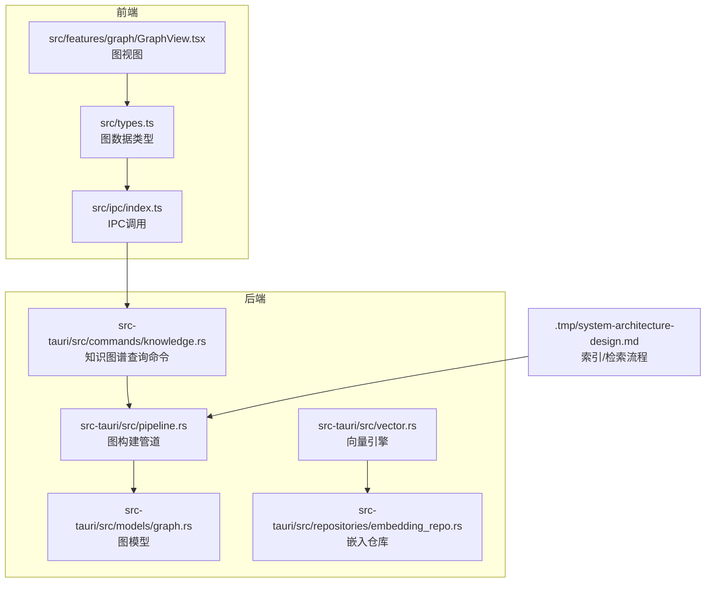
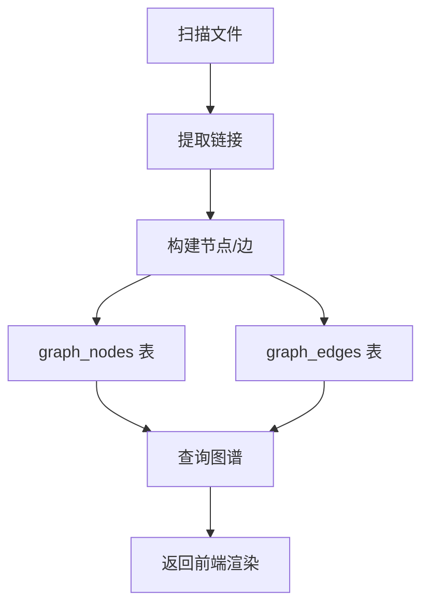
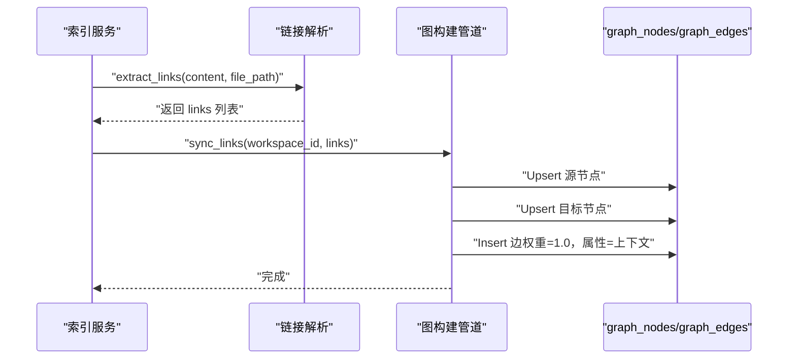
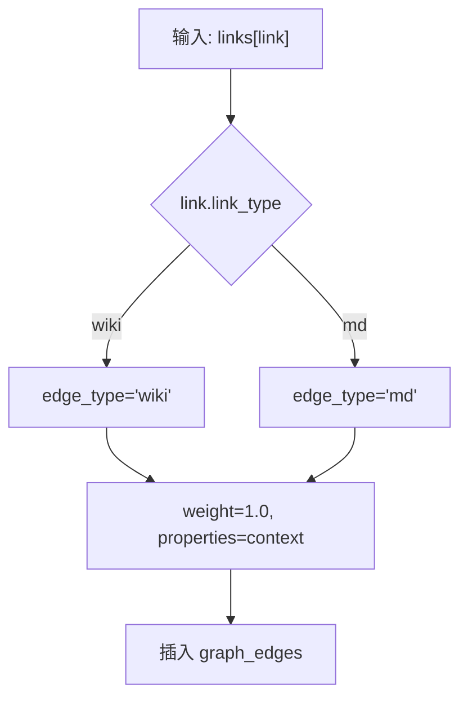
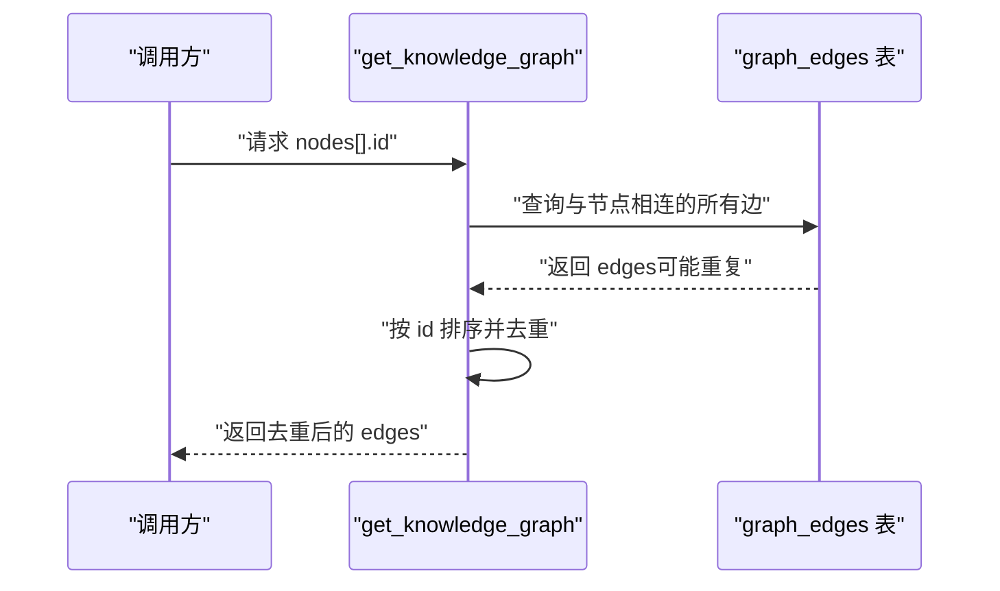
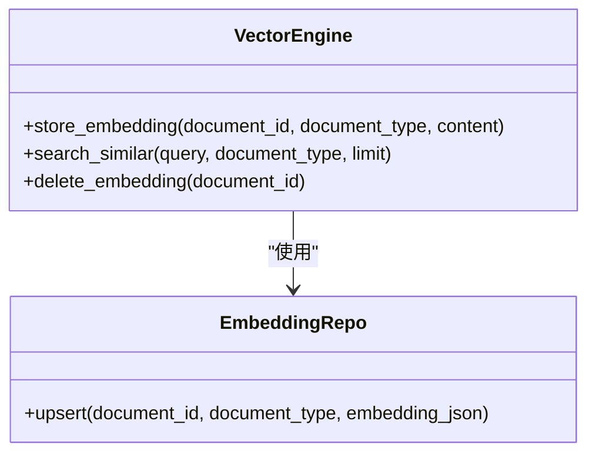
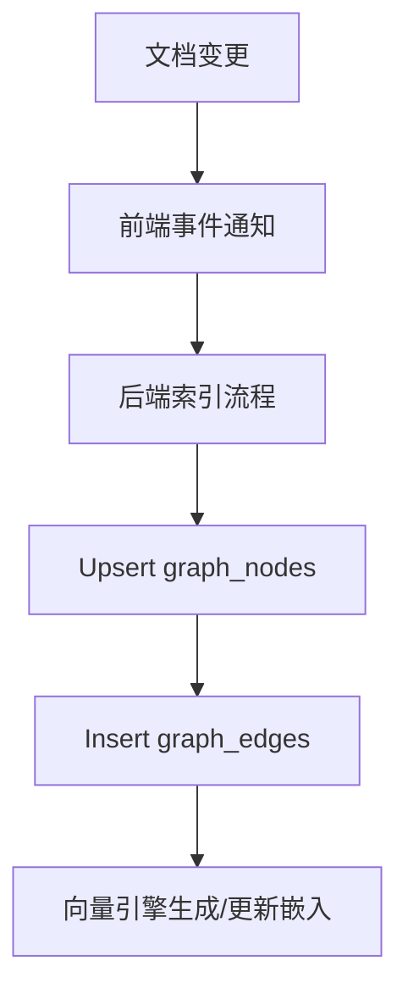
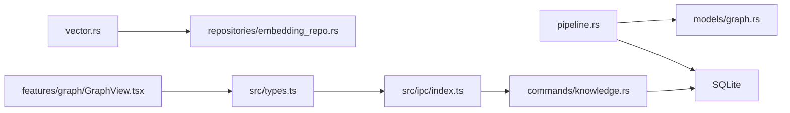

# 图构建算法

<cite>
**本文引用的文件**
- [src-tauri/src/models/graph.rs](file://src-tauri/src/models/graph.rs)
- [src-tauri/src/pipeline.rs](file://src-tauri/src/pipeline.rs)
- [src-tauri/src/commands/knowledge.rs](file://src-tauri/src/commands/knowledge.rs)
- [src-tauri/src/vector.rs](file://src-tauri/src/vector.rs)
- [src-tauri/src/repositories/embedding_repo.rs](file://src-tauri/src/repositories/embedding_repo.rs)
- [src/types.ts](file://src/types.ts)
- [src/ipc/index.ts](file://src/ipc/index.ts)
- [src/features/graph/GraphView.tsx](file://src/features/graph/GraphView.tsx)
- [.tmp/system-architecture-design.md](file://.tmp/system-architecture-design.md)
- [.tmp/system-architecture-design.md](file://.tmp/system-architecture-design.md)
- [src-tauri/tests/dataflow_tests.rs](file://src-tauri/tests/dataflow_tests.rs)
</cite>

## 目录
1. [简介](#简介)
2. [项目结构](#项目结构)
3. [核心组件](#核心组件)
4. [架构总览](#架构总览)
5. [详细组件分析](#详细组件分析)
6. [依赖分析](#依赖分析)
7. [性能考虑](#性能考虑)
8. [故障排查指南](#故障排查指南)
9. [结论](#结论)
10. [附录](#附录)

## 简介
本文件面向NoteForge的知识图谱构建算法，围绕“节点识别、关系抽取、图生成、向量化嵌入、增量构建与实时更新、性能优化”六大主题展开。文档基于仓库中现有的Rust后端与TypeScript前端实现进行技术解读，并通过可视化图表展示实际代码结构与调用流程，帮助开发者快速理解与扩展图构建能力。

## 项目结构
NoteForge的图构建相关代码主要分布在以下位置：
- 后端（Rust）：模型定义、图管道、命令接口、向量化引擎、嵌入存储仓库
- 前端（TypeScript）：图数据类型、IPC调用、图视图渲染
- 设计文档：单文档索引流程、语义检索流程、混合检索流程等，明确了图构建在整体知识管线中的位置

**图表来源**
- [src/types.ts:165-204](file://src/types.ts#L165-L204)
- [src/ipc/index.ts:335-342](file://src/ipc/index.ts#L335-L342)
- [src-tauri/src/commands/knowledge.rs:126-163](file://src-tauri/src/commands/knowledge.rs#L126-L163)
- [src-tauri/src/pipeline.rs:136-191](file://src-tauri/src/pipeline.rs#L136-L191)
- [src-tauri/src/models/graph.rs:1-34](file://src-tauri/src/models/graph.rs#L1-L34)
- [src-tauri/src/vector.rs:1-151](file://src-tauri/src/vector.rs#L1-L151)
- [src-tauri/src/repositories/embedding_repo.rs:1-24](file://src-tauri/src/repositories/embedding_repo.rs#L1-L24)
- [.tmp/system-architecture-design.md](file://.tmp/system-architecture-design.md)

**章节来源**
- [src-tauri/src/models/graph.rs:1-34](file://src-tauri/src/models/graph.rs#L1-L34)
- [src-tauri/src/pipeline.rs:136-191](file://src-tauri/src/pipeline.rs#L136-L191)
- [src-tauri/src/commands/knowledge.rs:126-163](file://src-tauri/src/commands/knowledge.rs#L126-L163)
- [src-tauri/src/vector.rs:1-151](file://src-tauri/src/vector.rs#L1-L151)
- [src-tauri/src/repositories/embedding_repo.rs:1-24](file://src-tauri/src/repositories/embedding_repo.rs#L1-L24)
- [src/types.ts:165-204](file://src/types.ts#L165-L204)
- [src/ipc/index.ts:335-342](file://src/ipc/index.ts#L335-L342)
- [.tmp/system-architecture-design.md](file://.tmp/system-architecture-design.md)

## 核心组件
- 图模型（GraphNode/GraphEdge/KnowledgeGraph）：定义节点、边与图的数据结构，包含标识、类型、权重、属性等字段
- 图构建管道（pipeline.update_graph）：负责将文档链接同步为图节点与边，确保源节点存在并插入边
- 知识图谱查询命令（commands.knowledge.get_knowledge_graph）：根据节点ID集合查询邻接边并去重
- 向量引擎（vector.rs）：封装fastembed生成与相似度计算，支持按类型过滤与Top-N返回
- 嵌入仓库（repositories/embedding_repo.rs）：提供嵌入的增删改查接口
- 前端类型与IPC（src/types.ts、src/ipc/index.ts）：桥接后端图数据与前端渲染

**章节来源**
- [src-tauri/src/models/graph.rs:1-34](file://src-tauri/src/models/graph.rs#L1-L34)
- [src-tauri/src/pipeline.rs:136-191](file://src-tauri/src/pipeline.rs#L136-L191)
- [src-tauri/src/commands/knowledge.rs:126-163](file://src-tauri/src/commands/knowledge.rs#L126-L163)
- [src-tauri/src/vector.rs:1-151](file://src-tauri/src/vector.rs#L1-L151)
- [src-tauri/src/repositories/embedding_repo.rs:1-24](file://src-tauri/src/repositories/embedding_repo.rs#L1-L24)
- [src/types.ts:165-204](file://src/types.ts#L165-L204)
- [src/ipc/index.ts:335-342](file://src/ipc/index.ts#L335-L342)

## 架构总览
下图展示了“单文档索引流程”中与图构建相关的步骤，以及图数据在后端数据库中的持久化位置：

**图表来源**
- [.tmp/system-architecture-design.md](file://.tmp/system-architecture-design.md)

**章节来源**
- [.tmp/system-architecture-design.md](file://.tmp/system-architecture-design.md)

## 详细组件分析

### 节点识别与链接抽取
- 文档解析与链接提取：在单文档索引流程中，链接解析会产出工作区范围内的源文件、目标文件、链接类型与上下文信息
- 链接到节点/边映射：图构建管道将每个唯一文件映射为节点，每条链接映射为边，边权重固定为1.0，属性中保留上下文

**图表来源**
- [.tmp/system-architecture-design.md](file://.tmp/system-architecture-design.md)
- [src-tauri/src/pipeline.rs:136-191](file://src-tauri/src/pipeline.rs#L136-L191)

**章节来源**
- [.tmp/system-architecture-design.md](file://.tmp/system-architecture-design.md)
- [src-tauri/src/pipeline.rs:136-191](file://src-tauri/src/pipeline.rs#L136-L191)

### 关系抽取与分类
- 当前实现采用“链接类型即关系类型”的策略：wiki链接与Markdown链接分别对应不同的edge_type，作为关系分类的依据
- 关系权重：所有边的初始权重为1.0，后续可通过语义相似度或聚类结果进行加权（见“向量化嵌入”）

**图表来源**
- [src-tauri/src/pipeline.rs:160-178](file://src-tauri/src/pipeline.rs#L160-L178)

**章节来源**
- [src-tauri/src/pipeline.rs:160-178](file://src-tauri/src/pipeline.rs#L160-L178)

### 图生成与去重机制
- 节点与边的生成：以“note:文件路径”作为节点ID，确保唯一性；边ID使用UUID
- 去重策略：查询阶段对边ID进行排序与去重，避免重复边
- 循环检测：当前未实现显式的环检测逻辑；如需引入，可在插入边前进行DFS/BFS拓扑检查或维护入度/出度约束

**图表来源**
- [src-tauri/src/commands/knowledge.rs:126-163](file://src-tauri/src/commands/knowledge.rs#L126-L163)

**章节来源**
- [src-tauri/src/commands/knowledge.rs:126-163](file://src-tauri/src/commands/knowledge.rs#L126-L163)

### 向量化嵌入在图构建中的应用
- 嵌入生成：向量引擎封装fastembed，支持按文档内容生成向量并存储于document_embeddings表
- 相似度计算：使用余弦相似度对查询向量与存储向量进行匹配，返回Top-N候选
- 在图构建中的作用：可用于语义边的生成、节点聚类、智能推荐（基于相似度的邻居发现）

**图表来源**
- [src-tauri/src/vector.rs:1-151](file://src-tauri/src/vector.rs#L1-L151)
- [src-tauri/src/repositories/embedding_repo.rs:1-24](file://src-tauri/src/repositories/embedding_repo.rs#L1-L24)

**章节来源**
- [src-tauri/src/vector.rs:1-151](file://src-tauri/src/vector.rs#L1-L151)
- [src-tauri/src/repositories/embedding_repo.rs:1-24](file://src-tauri/src/repositories/embedding_repo.rs#L1-L24)

### 增量构建与实时更新
- 变更检测：前端通过事件总线监听文档变化，后端在索引流程中对文档进行“插入或替换”，确保节点属性更新
- 局部重建：图构建管道以“源文件路径”为键，先Upsert源节点，再插入边，避免级联删除导致的边丢失
- 缓存策略：向量引擎惰性初始化模型，嵌入结果可按文档类型过滤，减少无关遍历

**图表来源**
- [.tmp/system-architecture-design.md](file://.tmp/system-architecture-design.md)
- [src-tauri/src/pipeline.rs:136-191](file://src-tauri/src/pipeline.rs#L136-L191)
- [src-tauri/src/vector.rs:1-151](file://src-tauri/src/vector.rs#L1-L151)

**章节来源**
- [.tmp/system-architecture-design.md](file://.tmp/system-architecture-design.md)
- [src-tauri/src/pipeline.rs:136-191](file://src-tauri/src/pipeline.rs#L136-L191)
- [src-tauri/src/vector.rs:1-151](file://src-tauri/src/vector.rs#L1-L151)

### 性能优化与复杂度控制
- 并行处理：检索流程中全文与语义检索可并行执行，融合后再去重与重排
- 内存管理：向量引擎按需加载模型，相似度计算在内存中进行，建议限制返回数量与维度大小
- 时间复杂度：边查询与去重为O(N log N)，相似度计算为O(N·D)，其中N为候选数，D为向量维度

**章节来源**
- [.tmp/system-architecture-design.md](file://.tmp/system-architecture-design.md)
- [src-tauri/src/vector.rs:57-118](file://src-tauri/src/vector.rs#L57-L118)

### 使用场景与示例
- 场景一：双向链接图谱构建
  - 输入：工作区内多个Markdown文档
  - 步骤：解析链接 → 插入节点/边 → 查询图谱 → 前端渲染
  - 示例参考测试用例中的“图谱构建数据流”
- 场景二：语义相似推荐
  - 输入：查询文本
  - 步骤：生成查询向量 → 计算与文档嵌入的余弦相似度 → 返回Top-N
  - 示例参考“语义检索流程”

**章节来源**
- [src-tauri/tests/dataflow_tests.rs:203-237](file://src-tauri/tests/dataflow_tests.rs#L203-L237)
- [.tmp/system-architecture-design.md](file://.tmp/system-architecture-design.md)

## 依赖分析
- 组件耦合
  - pipeline依赖graph模型与数据库连接，负责节点/边的插入
  - commands依赖数据库查询，负责图谱查询与去重
  - vector与embedding_repo共同构成向量存储与检索链路
  - 前端types与ipc桥接后端图数据
- 外部依赖
  - fastembed用于文本嵌入
  - rusqlite用于SQLite访问
  - serde用于序列化

**图表来源**
- [src-tauri/src/pipeline.rs:136-191](file://src-tauri/src/pipeline.rs#L136-L191)
- [src-tauri/src/commands/knowledge.rs:126-163](file://src-tauri/src/commands/knowledge.rs#L126-L163)
- [src-tauri/src/vector.rs:1-151](file://src-tauri/src/vector.rs#L1-L151)
- [src-tauri/src/repositories/embedding_repo.rs:1-24](file://src-tauri/src/repositories/embedding_repo.rs#L1-L24)
- [src/types.ts:165-204](file://src/types.ts#L165-L204)
- [src/ipc/index.ts:335-342](file://src/ipc/index.ts#L335-L342)
- [src/features/graph/GraphView.tsx:192-230](file://src/features/graph/GraphView.tsx#L192-L230)

**章节来源**
- [src-tauri/src/pipeline.rs:136-191](file://src-tauri/src/pipeline.rs#L136-L191)
- [src-tauri/src/commands/knowledge.rs:126-163](file://src-tauri/src/commands/knowledge.rs#L126-L163)
- [src-tauri/src/vector.rs:1-151](file://src-tauri/src/vector.rs#L1-L151)
- [src-tauri/src/repositories/embedding_repo.rs:1-24](file://src-tauri/src/repositories/embedding_repo.rs#L1-L24)
- [src/types.ts:165-204](file://src/types.ts#L165-L204)
- [src/ipc/index.ts:335-342](file://src/ipc/index.ts#L335-L342)
- [src/features/graph/GraphView.tsx:192-230](file://src/features/graph/GraphView.tsx#L192-L230)

## 性能考虑
- 并行处理：在检索阶段并行执行全文与语义检索，降低端到端延迟
- 内存管理：向量引擎惰性初始化模型，相似度计算在内存中进行，建议限制返回数量
- 时间复杂度：边查询与去重为O(N log N)，相似度计算为O(N·D)
- I/O优化：批量插入节点/边，避免频繁事务提交

[本节为通用性能指导，无需特定文件引用]

## 故障排查指南
- 图为空或边缺失
  - 检查是否正确调用“同步链接”流程，确认节点与边已插入
  - 核对链接解析是否覆盖了wiki与Markdown两种格式
- 查询结果重复
  - 确认查询命令中已执行按ID排序与去重
- 向量检索无结果
  - 确认嵌入是否已生成并存储
  - 检查文档类型过滤参数与返回数量限制

**章节来源**
- [src-tauri/src/pipeline.rs:136-191](file://src-tauri/src/pipeline.rs#L136-L191)
- [src-tauri/src/commands/knowledge.rs:126-163](file://src-tauri/src/commands/knowledge.rs#L126-L163)
- [src-tauri/src/vector.rs:1-151](file://src-tauri/src/vector.rs#L1-L151)

## 结论
NoteForge的图构建算法以“链接驱动”为核心，结合SQLite存储与向量检索，实现了从文档到图谱的自动化构建与查询。当前实现具备良好的扩展性：关系类型可扩展、权重可动态调整、向量相似度可引入语义增强。未来可在环检测、动态权重、分布式向量库等方面进一步优化。

[本节为总结性内容，无需特定文件引用]

## 附录
- 前端图视图要点
  - 节点半径与度数相关，便于直观感知重要性
  - 支持点击/双击打开文档、高亮选中节点及其邻居
- 数据模型对照
  - 前端类型与后端模型保持一致的字段命名与语义

**章节来源**
- [src/features/graph/GraphView.tsx:192-230](file://src/features/graph/GraphView.tsx#L192-L230)
- [src/types.ts:165-204](file://src/types.ts#L165-L204)