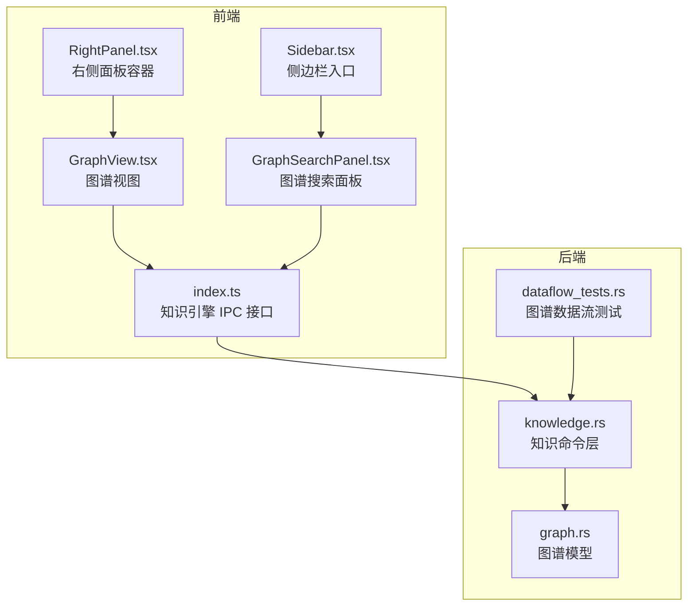
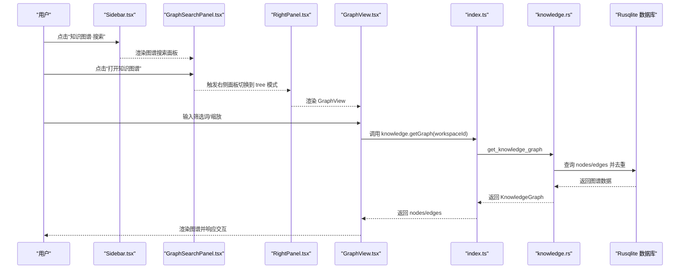
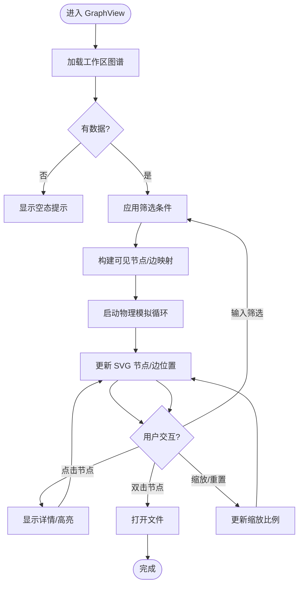
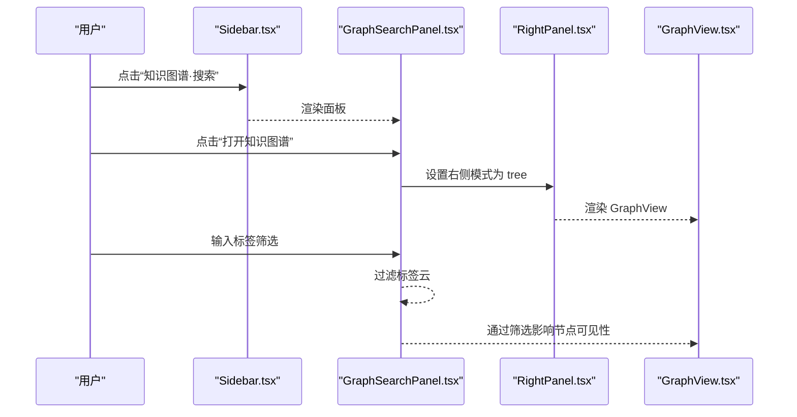
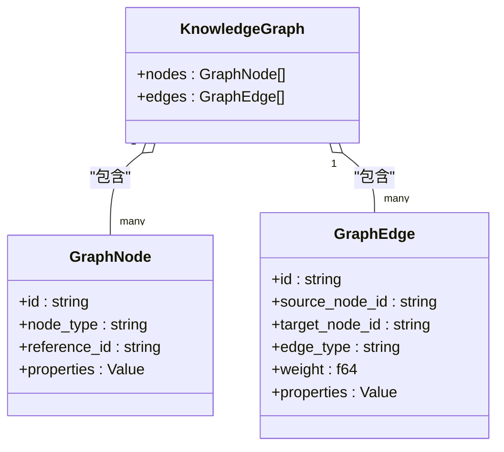
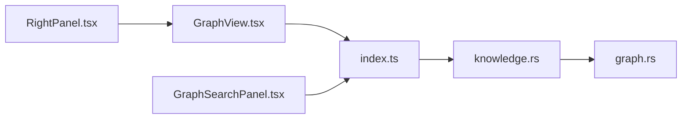

# 图谱集成特性

<cite>
**本文引用的文件**
- [GraphView.tsx](file://src/features/graph/GraphView.tsx)
- [GraphSearchPanel.tsx](file://src/components/sidebar/GraphSearchPanel.tsx)
- [RightPanel.tsx](file://src/components/right/RightPanel.tsx)
- [Sidebar.tsx](file://src/components/sidebar/Sidebar.tsx)
- [graph.rs](file://src-tauri/src/models/graph.rs)
- [knowledge.rs](file://src-tauri/src/commands/knowledge.rs)
- [index.ts](file://src/ipc/index.ts)
- [stub.ts](file://src/ipc/stub.ts)
- [types.ts](file://src/types.ts)
- [dataflow_tests.rs](file://src-tauri/tests/dataflow_tests.rs)
</cite>

## 目录
1. [简介](#简介)
2. [项目结构](#项目结构)
3. [核心组件](#核心组件)
4. [架构总览](#架构总览)
5. [详细组件分析](#详细组件分析)
6. [依赖分析](#依赖分析)
7. [性能考虑](#性能考虑)
8. [故障排查指南](#故障排查指南)
9. [结论](#结论)
10. [附录](#附录)

## 简介
本文件系统性阐述 NoteForge 的“图谱集成特性”，覆盖图谱与编辑器、侧边栏、右侧面板的集成方式；图谱在不同界面中的显示与交互（全屏/内嵌/浮动窗口）；与 AI 功能的结合（智能标注、关系预测、问答等）；导出与分享能力；版本管理与历史记录；配置与定制项；以及实际使用场景与操作指南。目标是帮助开发者与用户全面理解并高效使用图谱能力。

## 项目结构
图谱功能由前端 React 组件与后端 Tauri 命令协同实现，通过 IPC 层进行数据交换。前端负责渲染与交互，后端负责图谱构建与查询。

图表来源
- [Sidebar.tsx:18-66](file://src/components/sidebar/Sidebar.tsx#L18-L66)
- [GraphSearchPanel.tsx:9-109](file://src/components/sidebar/GraphSearchPanel.tsx#L9-L109)
- [RightPanel.tsx:22-78](file://src/components/right/RightPanel.tsx#L22-L78)
- [GraphView.tsx:81-269](file://src/features/graph/GraphView.tsx#L81-L269)
- [index.ts:335-342](file://src/ipc/index.ts#L335-L342)
- [knowledge.rs:126-163](file://src-tauri/src/commands/knowledge.rs#L126-L163)
- [graph.rs:1-34](file://src-tauri/src/models/graph.rs#L1-L34)
- [dataflow_tests.rs:203-237](file://src-tauri/tests/dataflow_tests.rs#L203-L237)

章节来源
- [Sidebar.tsx:1-70](file://src/components/sidebar/Sidebar.tsx#L1-L70)
- [RightPanel.tsx:1-81](file://src/components/right/RightPanel.tsx#L1-L81)
- [GraphView.tsx:1-278](file://src/features/graph/GraphView.tsx#L1-L278)
- [GraphSearchPanel.tsx:1-146](file://src/components/sidebar/GraphSearchPanel.tsx#L1-L146)
- [index.ts:309-342](file://src/ipc/index.ts#L309-L342)
- [knowledge.rs:126-163](file://src-tauri/src/commands/knowledge.rs#L126-L163)
- [graph.rs:1-34](file://src-tauri/src/models/graph.rs#L1-L34)
- [dataflow_tests.rs:203-237](file://src-tauri/tests/dataflow_tests.rs#L203-L237)

## 核心组件
- 图谱视图组件：负责加载知识图谱、执行力导向布局、渲染节点与边、支持筛选与缩放、点击打开文件。
- 图谱搜索面板：提供全局搜索入口、打开图谱视图、标签云过滤与结果跳转。
- 右侧面板容器：统一承载图谱视图与其他信息面板，提供切换与关闭。
- 知识引擎 IPC：封装后端命令，提供获取图谱、全文检索、语义检索、AI 能力等接口。
- 后端命令与模型：实现图谱构建、查询、去重与返回前端所需的数据结构。

章节来源
- [GraphView.tsx:81-269](file://src/features/graph/GraphView.tsx#L81-L269)
- [GraphSearchPanel.tsx:9-109](file://src/components/sidebar/GraphSearchPanel.tsx#L9-L109)
- [RightPanel.tsx:22-78](file://src/components/right/RightPanel.tsx#L22-L78)
- [index.ts:335-342](file://src/ipc/index.ts#L335-L342)
- [knowledge.rs:126-163](file://src-tauri/src/commands/knowledge.rs#L126-L163)
- [graph.rs:1-34](file://src-tauri/src/models/graph.rs#L1-L34)

## 架构总览
图谱从“工作区”维度构建，前端通过 IPC 请求后端，后端查询数据库并返回节点与边集合，前端再进行可视化与交互。

图表来源
- [Sidebar.tsx:64-65](file://src/components/sidebar/Sidebar.tsx#L64-L65)
- [GraphSearchPanel.tsx:37-46](file://src/components/sidebar/GraphSearchPanel.tsx#L37-L46)
- [RightPanel.tsx:68-69](file://src/components/right/RightPanel.tsx#L68-L69)
- [GraphView.tsx:91-94](file://src/features/graph/GraphView.tsx#L91-L94)
- [index.ts:335-342](file://src/ipc/index.ts#L335-L342)
- [knowledge.rs:126-163](file://src-tauri/src/commands/knowledge.rs#L126-L163)

## 详细组件分析

### 图谱视图组件（GraphView）
- 加载与渲染
  - 在挂载时根据当前工作区 ID 请求图谱数据，并缓存到状态中。
  - 使用 SVG 渲染节点与边，支持节点筛选与缩放。
- 力导向布局
  - 内置轻量级物理模拟：节点间斥力、边的引力、中心引力与阻尼，迭代更新节点位置。
  - 支持边界约束，避免节点移出可视区域。
- 交互行为
  - 点击节点高亮并显示详情气泡，双击节点在编辑器中打开对应文件。
  - 支持键盘输入筛选可见节点，实时更新布局。
  - 提供缩放控件，支持重置。
- 空态提示
  - 当图谱为空或无可见节点时，提示用户通过双链式链接创建连接。

图表来源
- [GraphView.tsx:81-269](file://src/features/graph/GraphView.tsx#L81-L269)

章节来源
- [GraphView.tsx:81-269](file://src/features/graph/GraphView.tsx#L81-L269)

### 图谱搜索面板（GraphSearchPanel）
- 功能概览
  - 提供全局搜索快捷入口与打开图谱视图按钮。
  - 展示标签云，支持按标签过滤，展示匹配文件列表。
- 与图谱视图联动
  - 切换右侧面板到“知识图谱”模式，直接呈现 GraphView。
  - 通过标签过滤结果可直接在编辑器中打开文件。

图表来源
- [Sidebar.tsx:64-65](file://src/components/sidebar/Sidebar.tsx#L64-L65)
- [GraphSearchPanel.tsx:37-46](file://src/components/sidebar/GraphSearchPanel.tsx#L37-L46)
- [RightPanel.tsx:68-69](file://src/components/right/RightPanel.tsx#L68-L69)
- [GraphView.tsx:101-117](file://src/features/graph/GraphView.tsx#L101-L117)

章节来源
- [GraphSearchPanel.tsx:9-109](file://src/components/sidebar/GraphSearchPanel.tsx#L9-L109)
- [RightPanel.tsx:22-78](file://src/components/right/RightPanel.tsx#L22-L78)

### 右侧面板容器（RightPanel）
- 面板模式
  - 支持“反向链接”“大纲”“属性”“知识图谱”“AI 协作者”等多种模式。
  - “知识图谱”模式下渲染 GraphView。
- 与编辑器联动
  - 根据当前活动标签页动态决定内容，支持跳转到文档指定标题行。

章节来源
- [RightPanel.tsx:14-20](file://src/components/right/RightPanel.tsx#L14-L20)
- [RightPanel.tsx:68-69](file://src/components/right/RightPanel.tsx#L68-L69)

### 知识引擎 IPC 与后端命令
- IPC 封装
  - 提供 getGraph 接口，将后端返回的图谱数据转换为前端可用结构。
- 后端命令
  - 依据节点 ID 查询关联边并去重，返回节点与边集合。
- 数据模型
  - 定义 GraphNode、GraphEdge、KnowledgeGraph 等结构，前后端对齐。

图表来源
- [graph.rs:25-28](file://src-tauri/src/models/graph.rs#L25-L28)
- [graph.rs:5-10](file://src-tauri/src/models/graph.rs#L5-L10)
- [graph.rs:14-21](file://src-tauri/src/models/graph.rs#L14-L21)

章节来源
- [index.ts:335-342](file://src/ipc/index.ts#L335-L342)
- [knowledge.rs:126-163](file://src-tauri/src/commands/knowledge.rs#L126-L163)
- [graph.rs:1-34](file://src-tauri/src/models/graph.rs#L1-L34)

## 依赖分析
- 前端耦合
  - GraphView 依赖 IPC 知识引擎与工作区状态，渲染 SVG 并处理用户交互。
  - GraphSearchPanel 依赖 IPC 获取标签与过滤结果，联动右侧面板。
  - RightPanel 作为容器，按模式渲染不同面板。
- 后端耦合
  - knowledge.rs 命令依赖数据库查询，返回去重后的图谱数据。
- 外部依赖
  - 采用原生 SVG 实现图谱渲染，不引入额外第三方库，保证性能与可控性。

图表来源
- [GraphView.tsx:10-13](file://src/features/graph/GraphView.tsx#L10-L13)
- [GraphSearchPanel.tsx:4](file://src/components/sidebar/GraphSearchPanel.tsx#L4)
- [RightPanel.tsx:9](file://src/components/right/RightPanel.tsx#L9)
- [index.ts:335-342](file://src/ipc/index.ts#L335-L342)
- [knowledge.rs:126-163](file://src-tauri/src/commands/knowledge.rs#L126-L163)
- [graph.rs:1-34](file://src-tauri/src/models/graph.rs#L1-L34)

章节来源
- [GraphView.tsx:1-278](file://src/features/graph/GraphView.tsx#L1-L278)
- [GraphSearchPanel.tsx:1-146](file://src/components/sidebar/GraphSearchPanel.tsx#L1-L146)
- [RightPanel.tsx:1-81](file://src/components/right/RightPanel.tsx#L1-L81)
- [index.ts:309-342](file://src/ipc/index.ts#L309-L342)
- [knowledge.rs:126-163](file://src-tauri/src/commands/knowledge.rs#L126-L163)
- [graph.rs:1-34](file://src-tauri/src/models/graph.rs#L1-L34)

## 性能考虑
- 物理模拟复杂度
  - 节点斥力为 O(n^2)，适合中小规模图谱（≤数百节点）。当节点数增长时，建议限制可见节点数量或引入采样策略。
- 渲染优化
  - 仅更新 SVG 中与节点/边对应的元素属性，减少重排。
  - 缩放与视窗更新通过 transform 实现，避免重新计算布局。
- 数据查询
  - 后端按节点 ID 查询关联边并去重，降低冗余数据传输。
- 建议
  - 对超大规模图谱，可考虑分层加载、延迟渲染与缓存策略；在 UI 上增加“最大节点数”限制与“自动筛选”建议。

[本节为通用性能讨论，无需列出具体文件来源]

## 故障排查指南
- 图谱为空
  - 检查工作区是否已索引，确认存在双向链接；参考空态提示引导创建链接。
- 无法打开文件
  - 确认节点 referenceId 对应的文件路径有效；检查编辑器打开逻辑。
- 图谱卡顿
  - 减少筛选范围、降低节点密度；避免同时进行大量交互；必要时重置缩放与布局。
- 标签过滤无效
  - 确认工作区标签统计正常；检查过滤输入大小写与匹配逻辑。

章节来源
- [GraphView.tsx:180-190](file://src/features/graph/GraphView.tsx#L180-L190)
- [GraphView.tsx:228](file://src/features/graph/GraphView.tsx#L228)
- [GraphSearchPanel.tsx:23-24](file://src/components/sidebar/GraphSearchPanel.tsx#L23-L24)

## 结论
NoteForge 的图谱集成以“轻量 SVG + 前端物理模拟 + 后端图谱查询”的方案实现了从工作区到可视化的闭环。它与编辑器、侧边栏、右侧面板无缝衔接，具备筛选、缩放、高亮等基础交互，并通过 IPC 提供了与 AI 能力的扩展接口。对于更大规模的知识网络，建议结合采样与缓存策略持续优化性能。

[本节为总结性内容，无需列出具体文件来源]

## 附录

### 图谱与 AI 的结合
- 智能标注与关系预测
  - 可通过 AI 建议链接与关系，辅助完善图谱结构。现有接口提供示例实现，便于替换为真实模型。
- 知识问答
  - 基于全文/语义检索的结果，结合图谱节点上下文，提供更精准的答案与引用。
- 示例接口
  - AI 建议链接、知识问答等接口位于 IPC stub 中，便于替换为真实后端服务。

章节来源
- [stub.ts:872-903](file://src/ipc/stub.ts#L872-L903)

### 导出与分享
- 图片导出
  - 可将 SVG 渲染结果导出为位图，用于截图或分享。
- PDF 生成
  - 可通过浏览器打印功能生成 PDF，适配图谱尺寸与缩放。
- 链接分享
  - 可基于节点 ID 生成可解析的内部链接，配合编辑器打开对应文件。
- 权限控制
  - 工作区维度隔离图谱数据，确保跨工作区访问安全。

[本节为概念性说明，未直接分析具体代码文件]

### 版本管理与历史记录
- 变更追踪
  - 通过工作区索引与增量扫描，保持图谱与文件变更同步。
- 回滚机制
  - 建议在工作区层面保留快照或版本目录，以便回退至历史状态。
- 协作功能
  - 多人协作时，建议以工作区为单位进行并发控制与冲突解决。

[本节为概念性说明，未直接分析具体代码文件]

### 配置与定制
- 显示偏好
  - 节点大小、边透明度、高亮策略等可通过主题变量与样式调整。
- 交互设置
  - 缩放步长、筛选策略、默认视窗等参数可在组件内配置。
- 性能调优
  - 控制可见节点数量、降低物理模拟迭代次数、启用懒加载等。

[本节为概念性说明，未直接分析具体代码文件]

### 实际使用场景与操作指南
- 快速浏览
  - 在侧边栏“知识图谱·搜索”中打开图谱视图，使用筛选快速定位节点。
- 深入探索
  - 点击节点查看详情，双击打开对应文件；利用标签云过滤相关内容。
- 协作与分享
  - 将关键节点截图或导出 PDF，配合链接分享给团队成员。
- AI 辅助
  - 使用 AI 建议链接完善图谱，或通过知识问答获取上下文答案。

[本节为概念性说明，未直接分析具体代码文件]