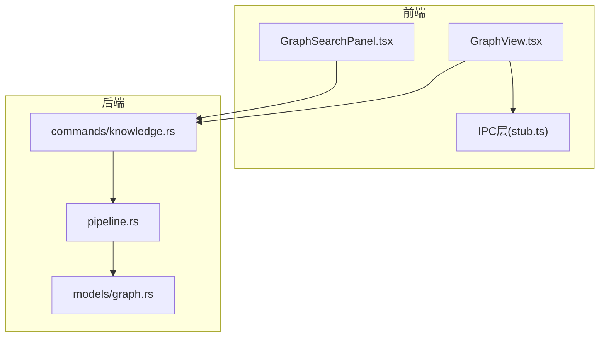
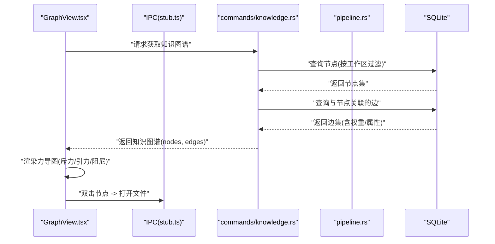
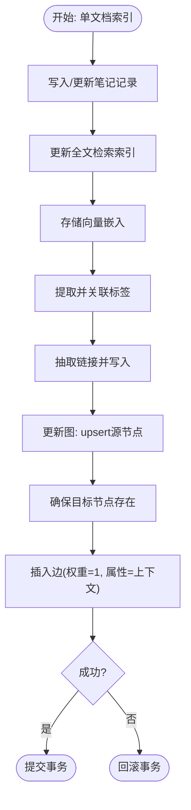
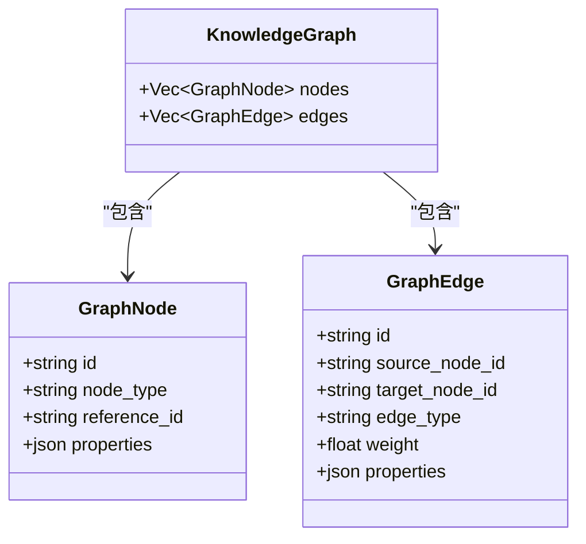
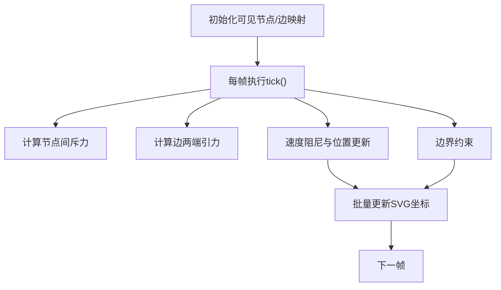
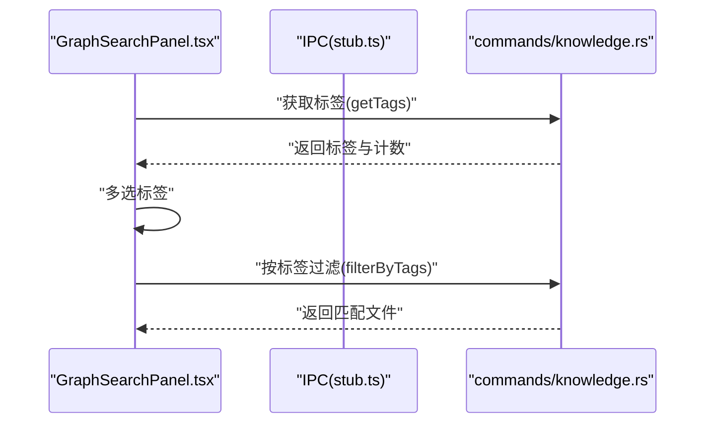
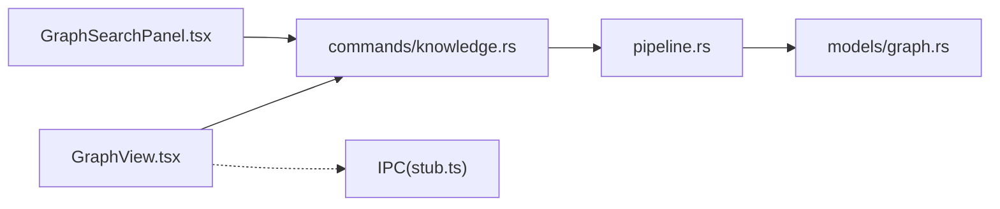

# 知识图谱系统

<cite>
**本文引用的文件**
- [src-tauri/src/models/graph.rs](file://src-tauri/src/models/graph.rs)
- [src-tauri/src/commands/knowledge.rs](file://src-tauri/src/commands/knowledge.rs)
- [src-tauri/src/pipeline.rs](file://src-tauri/src/pipeline.rs)
- [src/features/graph/GraphView.tsx](file://src/features/graph/GraphView.tsx)
- [src/components/sidebar/GraphSearchPanel.tsx](file://src/components/sidebar/GraphSearchPanel.tsx)
- [src/ipc/stub.ts](file://src/ipc/stub.ts)
- [.tmp/system-architecture-design.md](file://.tmp/system-architecture-design.md)
</cite>

## 目录
1. [简介](#简介)
2. [项目结构](#项目结构)
3. [核心组件](#核心组件)
4. [架构总览](#架构总览)
5. [组件详解](#组件详解)
6. [依赖关系分析](#依赖关系分析)
7. [性能考量](#性能考量)
8. [故障排查指南](#故障排查指南)
9. [结论](#结论)
10. [附录](#附录)

## 简介
本文件面向NoteForge的知识图谱系统，围绕“图构建算法”“图数据模型”“可视化渲染引擎”“图搜索与查询”“图数据更新机制”“导出与分享”六个方面，提供从代码到架构的完整技术说明，并辅以流程与序列图，帮助开发者与产品人员理解并扩展该系统。

## 项目结构
- 前端（React + Tauri IPC）
  - 图视图组件：GraphView.tsx
  - 图谱侧栏搜索面板：GraphSearchPanel.tsx
  - IPC桩（开发态模拟）：stub.ts
- 后端（Rust + Tauri）
  - 图数据模型：models/graph.rs
  - 知识图谱命令接口：commands/knowledge.rs
  - 索引流水线与图更新：pipeline.rs
- 设计文档参考
  - system-architecture-design.md（检索路径对比等）

图表来源
- [src/features/graph/GraphView.tsx:1-278](file://src/features/graph/GraphView.tsx#L1-L278)
- [src/components/sidebar/GraphSearchPanel.tsx:1-146](file://src/components/sidebar/GraphSearchPanel.tsx#L1-L146)
- [src/ipc/stub.ts:538-588](file://src/ipc/stub.ts#L538-L588)
- [src-tauri/src/commands/knowledge.rs:94-163](file://src-tauri/src/commands/knowledge.rs#L94-L163)
- [src-tauri/src/pipeline.rs:136-191](file://src-tauri/src/pipeline.rs#L136-L191)
- [src-tauri/src/models/graph.rs:1-35](file://src-tauri/src/models/graph.rs#L1-L35)

章节来源
- [src/features/graph/GraphView.tsx:1-278](file://src/features/graph/GraphView.tsx#L1-L278)
- [src/components/sidebar/GraphSearchPanel.tsx:1-146](file://src/components/sidebar/GraphSearchPanel.tsx#L1-L146)
- [src-tauri/src/commands/knowledge.rs:94-163](file://src-tauri/src/commands/knowledge.rs#L94-L163)
- [src-tauri/src/pipeline.rs:136-191](file://src-tauri/src/pipeline.rs#L136-L191)
- [src-tauri/src/models/graph.rs:1-35](file://src-tauri/src/models/graph.rs#L1-L35)
- [src/ipc/stub.ts:538-588](file://src/ipc/stub.ts#L538-L588)

## 核心组件
- 图数据模型
  - 节点：包含唯一标识、节点类型、引用ID、属性JSON
  - 边：包含唯一标识、源/目标节点ID、边类型、权重、属性JSON
  - 知识图：由节点集合与边集合组成
- 知识图谱命令
  - 获取知识图谱：按工作区过滤、查询节点与邻接边、去重返回
  - 链接抽取：解析wiki与Markdown链接，输出Link列表
  - 标签提取：解析#标签与YAML frontmatter中的tags
  - 反向链接查询：根据目标文件查询来源上下文
  - 语义搜索：基于向量引擎检索相似内容
- 索引流水线与图更新
  - 单文档原子化索引：笔记写入、FTS索引、向量嵌入、标签/链接抽取、图节点/边更新
  - 图更新：插入或更新源节点，为目标节点确保存在，插入边并记录上下文
- 可视化渲染
  - 轻量力导图：纯SVG实现，内置阻尼、斥力、引力与边界约束
  - 交互：节点筛选、缩放、点击/双击打开文件、高亮邻居
- 搜索与标签云
  - 标签云：按出现频次展示，支持多选过滤
  - 全局搜索入口与图谱入口按钮

章节来源
- [src-tauri/src/models/graph.rs:1-35](file://src-tauri/src/models/graph.rs#L1-L35)
- [src-tauri/src/commands/knowledge.rs:94-202](file://src-tauri/src/commands/knowledge.rs#L94-L202)
- [src-tauri/src/pipeline.rs:136-191](file://src-tauri/src/pipeline.rs#L136-L191)
- [src/features/graph/GraphView.tsx:28-146](file://src/features/graph/GraphView.tsx#L28-L146)
- [src/components/sidebar/GraphSearchPanel.tsx:1-146](file://src/components/sidebar/GraphSearchPanel.tsx#L1-L146)

## 架构总览
下图展示了从前端到后端的调用链路与数据流：

图表来源
- [src/features/graph/GraphView.tsx:81-146](file://src/features/graph/GraphView.tsx#L81-L146)
- [src/ipc/stub.ts:547-588](file://src/ipc/stub.ts#L547-L588)
- [src-tauri/src/commands/knowledge.rs:94-163](file://src-tauri/src/commands/knowledge.rs#L94-L163)

## 组件详解

### 图构建算法与数据更新机制
- 节点识别
  - 通过索引流水线在单文档处理中生成节点ID（note:文件路径），并写入属性（标题、文件路径、工作区ID）
- 关系抽取
  - 解析wiki链接与Markdown链接，生成Link对象；边权重固定为1.0，边属性保存上下文
- 图生成与更新
  - 插入或更新源节点，为目标节点确保存在，插入边并记录上下文
  - 删除文档时，级联删除对应边与节点，保证图一致性
- 增量构建与事务
  - 单文档索引采用事务封装，失败回滚，确保原子性
  - 支持对同一文件的重复索引，避免重复边

图表来源
- [src-tauri/src/pipeline.rs:17-90](file://src-tauri/src/pipeline.rs#L17-L90)
- [src-tauri/src/pipeline.rs:136-191](file://src-tauri/src/pipeline.rs#L136-L191)

章节来源
- [src-tauri/src/pipeline.rs:17-90](file://src-tauri/src/pipeline.rs#L17-L90)
- [src-tauri/src/pipeline.rs:136-191](file://src-tauri/src/pipeline.rs#L136-L191)

### 图数据模型设计
- 节点属性
  - id：全局唯一标识
  - node_type：节点类型（如note）
  - reference_id：引用ID（如文件路径）
  - properties：JSON属性，包含标题、文件路径、工作区ID等
- 边属性
  - id：全局唯一标识
  - source_node_id/target_node_id：连接两端节点
  - edge_type：关系类型（如reference）
  - weight：边权重（如1.0）
  - properties：JSON属性（如上下文context）
- 知识图
  - nodes：可见节点集合
  - edges：与节点相连的边集合

图表来源
- [src-tauri/src/models/graph.rs:1-35](file://src-tauri/src/models/graph.rs#L1-L35)

章节来源
- [src-tauri/src/models/graph.rs:1-35](file://src-tauri/src/models/graph.rs#L1-L35)

### 可视化渲染引擎
- 力导算法
  - 斥力：节点间距离越近斥力越大，防止重叠
  - 引力：边两端节点相互吸引，维持边长
  - 阻尼：速度衰减，稳定收敛
  - 边界约束：节点不越界
- 交互设计
  - 节点筛选：输入框模糊匹配节点标签
  - 缩放：+/-/重置
  - 选择高亮：选中节点及其邻居高亮，其他半透明
  - 双击打开：双击节点打开对应文件
- 性能优化
  - 固定迭代上限，避免无限循环
  - 使用Map/集合快速定位节点与可见ID
  - 仅渲染可见子图

图表来源
- [src/features/graph/GraphView.tsx:28-79](file://src/features/graph/GraphView.tsx#L28-L79)
- [src/features/graph/GraphView.tsx:120-146](file://src/features/graph/GraphView.tsx#L120-L146)

章节来源
- [src/features/graph/GraphView.tsx:28-146](file://src/features/graph/GraphView.tsx#L28-L146)

### 图搜索与查询功能
- 标签云与过滤
  - 获取标签与计数，按出现频率调整字号
  - 多选标签组合过滤，展示匹配文件列表
- 全局搜索入口
  - 提供快捷打开全局搜索与图谱视图的按钮
- 语义搜索与混合检索
  - 语义搜索：向量引擎检索相似内容
  - 检索路径对比：全文检索、语义检索、混合检索的适用场景与中文支持

图表来源
- [src/components/sidebar/GraphSearchPanel.tsx:1-146](file://src/components/sidebar/GraphSearchPanel.tsx#L1-L146)
- [src/ipc/stub.ts:538-588](file://src/ipc/stub.ts#L538-L588)
- [.tmp/system-architecture-design.md:905-942](file://.tmp/system-architecture-design.md#L905-L942)

章节来源
- [src/components/sidebar/GraphSearchPanel.tsx:1-146](file://src/components/sidebar/GraphSearchPanel.tsx#L1-L146)
- [src-tauri/src/commands/knowledge.rs:70-92](file://src-tauri/src/commands/knowledge.rs#L70-L92)
- [src-tauri/src/commands/knowledge.rs:232-269](file://src-tauri/src/commands/knowledge.rs#L232-L269)
- [.tmp/system-architecture-design.md:905-942](file://.tmp/system-architecture-design.md#L905-L942)

### 图数据的更新机制
- 增量构建
  - 单文档索引：原子事务内完成笔记、索引、嵌入、标签、链接、图更新
- 实时同步
  - 文件变更触发索引流水线，自动更新图节点与边
- 缓存策略
  - 语义搜索结果可结合前端缓存（未在本仓库显式实现，建议按查询参数缓存）
- 删除清理
  - 删除文档时，级联删除其边与节点，保持图完整性

章节来源
- [src-tauri/src/pipeline.rs:17-90](file://src-tauri/src/pipeline.rs#L17-L90)
- [src-tauri/src/pipeline.rs:92-134](file://src-tauri/src/pipeline.rs#L92-L134)
- [src-tauri/src/pipeline.rs:183-191](file://src-tauri/src/pipeline.rs#L183-L191)

### 导出与分享（概念性说明）
- 格式转换
  - 可将nodes/edges导出为JSON或图数据格式（如GraphML/CSV），用于外部工具分析
- 权限控制
  - 基于工作区隔离，仅导出当前工作区内可见图
- 版本管理
  - 建议在导出包中附带时间戳与索引版本信息，便于回溯

[本节为概念性说明，不直接分析具体文件]

## 依赖关系分析
- 前端依赖后端命令
  - GraphView依赖知识图谱命令获取图数据
  - GraphSearchPanel依赖标签与过滤命令
- 后端内部耦合
  - commands依赖pipeline与models
  - pipeline依赖repositories与向量/知识引擎
- IPC层
  - stub.ts提供开发态模拟，便于前端调试

图表来源
- [src/features/graph/GraphView.tsx:1-278](file://src/features/graph/GraphView.tsx#L1-L278)
- [src/components/sidebar/GraphSearchPanel.tsx:1-146](file://src/components/sidebar/GraphSearchPanel.tsx#L1-L146)
- [src-tauri/src/commands/knowledge.rs:94-163](file://src-tauri/src/commands/knowledge.rs#L94-L163)
- [src-tauri/src/pipeline.rs:136-191](file://src-tauri/src/pipeline.rs#L136-L191)
- [src-tauri/src/models/graph.rs:1-35](file://src-tauri/src/models/graph.rs#L1-L35)
- [src/ipc/stub.ts:538-588](file://src/ipc/stub.ts#L538-L588)

章节来源
- [src-tauri/src/commands/knowledge.rs:94-163](file://src-tauri/src/commands/knowledge.rs#L94-L163)
- [src-tauri/src/pipeline.rs:136-191](file://src-tauri/src/pipeline.rs#L136-L191)
- [src-tauri/src/models/graph.rs:1-35](file://src-tauri/src/models/graph.rs#L1-L35)
- [src/features/graph/GraphView.tsx:1-278](file://src/features/graph/GraphView.tsx#L1-L278)
- [src/components/sidebar/GraphSearchPanel.tsx:1-146](file://src/components/sidebar/GraphSearchPanel.tsx#L1-L146)
- [src/ipc/stub.ts:538-588](file://src/ipc/stub.ts#L538-L588)

## 性能考量
- 图规模
  - 力导渲染适合数百节点规模，超过阈值建议分层/抽样或切换高性能渲染器
- 查询性能
  - 节点过滤使用LIKE匹配工作区属性，建议在属性字段上建立索引
  - 边查询按节点ID集合查询，注意去重与索引覆盖
- 渲染性能
  - 固定迭代上限，减少DOM更新次数
  - 仅渲染可见子图，降低重绘成本

[本节提供通用指导，不直接分析具体文件]

## 故障排查指南
- 知识图谱为空
  - 检查是否已建立双向链接；编辑Markdown使用[[文件名]]创建链接
  - 确认索引流水线已运行且无错误
- 节点无法打开
  - 确认reference_id指向有效文件路径
  - 检查工作区隔离逻辑是否正确
- 标签云无结果
  - 确认文档中存在#标签或YAML frontmatter中的tags
  - 检查过滤条件大小写与空格

章节来源
- [src/features/graph/GraphView.tsx:180-190](file://src/features/graph/GraphView.tsx#L180-L190)
- [src-tauri/src/commands/knowledge.rs:204-207](file://src-tauri/src/commands/knowledge.rs#L204-L207)
- [src-tauri/src/pipeline.rs:193-227](file://src-tauri/src/pipeline.rs#L193-L227)

## 结论
NoteForge的知识图谱系统以轻量的前端力导渲染为核心，配合Rust后端的索引流水线与命令接口，实现了从文档到图的自动化构建与可视化呈现。通过标签云与全局搜索入口，用户可以高效探索知识网络。后续可在大规模图渲染、语义搜索缓存与导出分享等方面进一步优化与扩展。

## 附录
- 场景与案例
  - 学习笔记：通过wikilink建立主题关联，使用图谱查看跨笔记联系
  - 项目管理：以标签云筛选任务，结合图谱发现关键依赖
  - 文献阅读：利用反向链接快速回到引用上下文
- 参考检索路径对比
  - 全文检索（FTS5 + jieba）、语义检索（向量）、混合检索（二者结合）

章节来源
- [.tmp/system-architecture-design.md:905-942](file://.tmp/system-architecture-design.md#L905-L942)