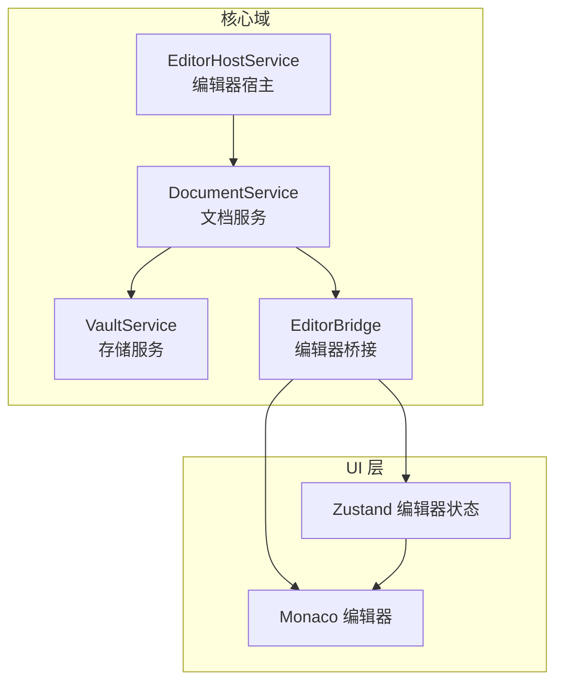
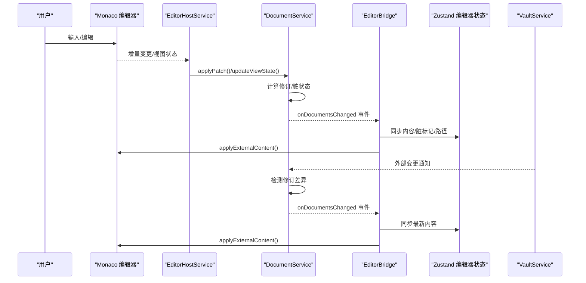
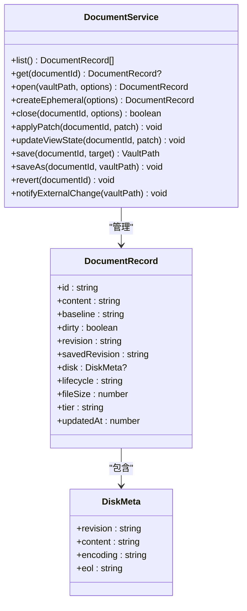
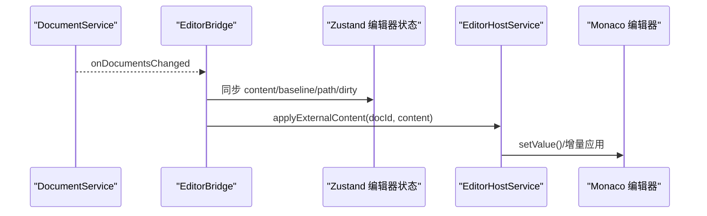
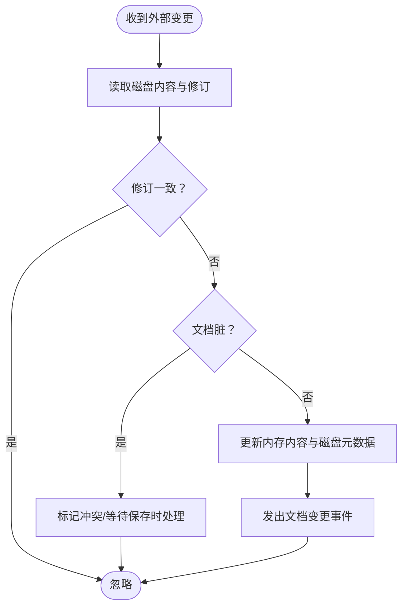
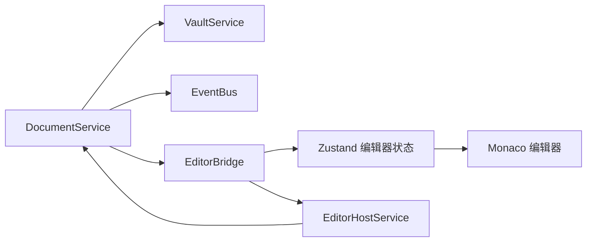

# 内容同步机制

<cite>
**本文引用的文件**
- [src/core/document/document-service.impl.ts](file://src/core/document/document-service.impl.ts)
- [src/core/document/service.ts](file://src/core/document/service.ts)
- [src/core/document/utils.ts](file://src/core/document/utils.ts)
- [src/core/bridge/editor-sync.ts](file://src/core/bridge/editor-sync.ts)
- [src/core/bridge/editor-store-bridge.ts](file://src/core/bridge/editor-store-bridge.ts)
- [src/core/editor/editor-host.impl.ts](file://src/core/editor/editor-host.impl.ts)
- [src/core/vault/service.ts](file://src/core/vault/service.ts)
- [src/core/vault/types.ts](file://src/core/vault/types.ts)
- [src/core/workbench/workbench-service.impl.ts](file://src/core/workbench/workbench-service.impl.ts)
- [src/core/events.ts](file://src/core/events.ts)
- [src/store/editor.ts](file://src/store/editor.ts)
- [src/lib/editor-doc.ts](file://src/lib/editor-doc.ts)
- [src/lib/editor-caret-status.ts](file://src/lib/editor-caret-status.ts)
- [.tmp/noteforgeChat.md](file://.tmp/noteforgeChat.md)
</cite>

## 目录
1. [简介](#简介)
2. [项目结构](#项目结构)
3. [核心组件](#核心组件)
4. [架构总览](#架构总览)
5. [详细组件分析](#详细组件分析)
6. [依赖关系分析](#依赖关系分析)
7. [性能考量](#性能考量)
8. [故障排查指南](#故障排查指南)
9. [结论](#结论)
10. [附录](#附录)

## 简介
本文件系统性梳理 NoteForge 的内容同步机制，覆盖实时同步的实现原理（状态监听、变更检测、冲突解决）、编辑器状态与存储系统的桥接（数据序列化、传输协议、错误处理）、增量更新策略（差异计算、批量处理、性能优化）、版本控制（历史记录、回滚机制、并发控制）、同步状态管理（加载/错误/离线模式）以及同步配置与最佳实践。文档以代码为依据，结合仓库中的设计讨论与现状说明，帮助读者快速理解并安全地扩展同步能力。

## 项目结构
NoteForge 的同步体系围绕“文档服务”“存储服务”“编辑器桥接”三大模块协作构建：
- 文档服务：统一的文档生命周期与状态管理入口，负责打开、编辑、保存、撤销、外部变更通知等。
- 存储服务：抽象文件系统访问，提供读写、修订跟踪、外部变更感知等能力。
- 编辑器桥接：将文档状态与编辑器界面（Monaco）进行双向同步，确保 UI 与核心状态一致。

图表来源
- [src/core/document/document-service.impl.ts:48-407](file://src/core/document/document-service.impl.ts#L48-L407)
- [src/core/editor/editor-host.impl.ts:14-39](file://src/core/editor/editor-host.impl.ts#L14-L39)
- [src/core/bridge/editor-sync.ts:762-772](file://src/core/bridge/editor-sync.ts#L762-L772)
- [src/store/editor.ts:746-754](file://src/store/editor.ts#L746-L754)

章节来源
- [src/core/document/service.ts:17-43](file://src/core/document/service.ts#L17-L43)
- [src/core/vault/service.ts](file://src/core/vault/service.ts)
- [src/core/vault/types.ts](file://src/core/vault/types.ts)
- [src/core/bridge/editor-store-bridge.ts](file://src/core/bridge/editor-store-bridge.ts)
- [src/core/bridge/editor-sync.ts:762-772](file://src/core/bridge/editor-sync.ts#L762-L772)

## 核心组件
- 文档服务（DocumentService）：提供文档的打开、编辑、保存、撤销、外部变更通知等统一接口，并维护文档记录（包含内容、修订、磁盘信息、生命周期、脏状态等）。
- 存储服务（VaultService）：封装文件系统读写、修订号生成、外部变更监听等能力，支撑冲突检测与持久化。
- 编辑器桥接（EditorBridge）：在文档状态与编辑器之间建立镜像同步，确保 UI 与核心状态一致；同时处理视图状态（光标、滚动）的捕获与回放。
- 编辑器宿主（EditorHostService）：将编辑器的增量变更转换为补丁并提交给文档服务，同时捕获视图状态写回文档。

章节来源
- [src/core/document/service.ts:17-43](file://src/core/document/service.ts#L17-L43)
- [src/core/document/document-service.impl.ts:48-407](file://src/core/document/document-service.impl.ts#L48-L407)
- [src/core/bridge/editor-sync.ts:762-772](file://src/core/bridge/editor-sync.ts#L762-L772)
- [src/core/editor/editor-host.impl.ts:14-39](file://src/core/editor/editor-host.impl.ts#L14-L39)

## 架构总览
下面的时序图展示了从用户编辑到持久化的完整链路，以及外部变更的检测与同步：

图表来源
- [src/core/editor/editor-host.impl.ts:26-39](file://src/core/editor/editor-host.impl.ts#L26-L39)
- [src/core/document/document-service.impl.ts:369-407](file://src/core/document/document-service.impl.ts#L369-L407)
- [src/core/bridge/editor-sync.ts:762-772](file://src/core/bridge/editor-sync.ts#L762-L772)
- [src/store/editor.ts:746-754](file://src/store/editor.ts#L746-L754)

## 详细组件分析

### 文档服务与状态模型
- 文档记录（DocumentRecord）包含内容、修订（revision）、磁盘信息（revision/content/eol/encoding）、生命周期（如 persisted）、脏标记、基准（baseline）、文件大小与分层（tier）、最后更新时间等字段。
- 文档服务提供统一入口：打开、创建临时文档、关闭、应用补丁、更新视图状态、保存、另存为、撤销、外部变更通知等。
- 冲突检测：通过轻量修订令牌（基于内容哈希与长度）判断磁盘与内存修订是否一致；当外部变更到来且未处于脏状态时，自动拉取最新内容并更新记录。

图表来源
- [src/core/document/service.ts:17-43](file://src/core/document/service.ts#L17-L43)
- [src/core/document/document-service.impl.ts:48-407](file://src/core/document/document-service.impl.ts#L48-L407)

章节来源
- [src/core/document/service.ts:17-43](file://src/core/document/service.ts#L17-L43)
- [src/core/document/document-service.impl.ts:48-407](file://src/core/document/document-service.impl.ts#L48-L407)
- [src/core/document/utils.ts:1-18](file://src/core/document/utils.ts#L1-L18)

### 编辑器桥接与状态镜像
- 编辑器桥接在文档状态变化时，将文档内容与基准同步至编辑器状态（EditorTab），并调用编辑器宿主应用外部内容，确保 UI 与核心状态一致。
- 当文档集合发生变化时，桥接会遍历所有文档执行同步，保证多标签场景下的状态一致性。
- 现状说明指出：编辑器状态与文档状态存在“镜像同步”，即两者各持一份内容并在变更时互相全量同步，这带来性能与一致性问题，后续应逐步收敛为“单一真相源”。

图表来源
- [src/core/bridge/editor-sync.ts:762-772](file://src/core/bridge/editor-sync.ts#L762-L772)
- [src/core/editor/editor-host.impl.ts:26-39](file://src/core/editor/editor-host.impl.ts#L26-L39)
- [src/store/editor.ts:746-754](file://src/store/editor.ts#L746-L754)

章节来源
- [.tmp/noteforgeChat.md:741-784](file://.tmp/noteforgeChat.md#L741-L784)
- [.tmp/noteforgeChat.md:786-821](file://.tmp/noteforgeChat.md#L786-L821)
- [src/core/bridge/editor-sync.ts:762-772](file://src/core/bridge/editor-sync.ts#L762-L772)
- [src/core/editor/editor-host.impl.ts:26-39](file://src/core/editor/editor-host.impl.ts#L26-L39)

### 外部变更检测与冲突解决
- 外部变更检测：当存储服务监听到文件系统变更时，文档服务根据修订令牌判断是否需要更新；若磁盘修订与内存不一致且文档未处于脏状态，则拉取最新内容并更新记录。
- 冲突解决：当前采用“轻量修订令牌 + 基于内容哈希”的冲突检测；当检测到外部变更且文档未脏时，自动覆盖内存内容并清除冲突状态；对于脏文档，后续保存流程中会触发冲突对话或合并策略（由对话框与保存流程共同实现）。

图表来源
- [src/core/document/document-service.impl.ts:385-407](file://src/core/document/document-service.impl.ts#L385-L407)
- [src/core/document/utils.ts:1-18](file://src/core/document/utils.ts#L1-L18)

章节来源
- [src/core/document/document-service.impl.ts:385-407](file://src/core/document/document-service.impl.ts#L385-L407)
- [src/core/document/utils.ts:1-18](file://src/core/document/utils.ts#L1-L18)

### 增量更新策略与性能优化
- 增量补丁：编辑器宿主将编辑器的增量变更转换为补丁并提交给文档服务，避免全量替换带来的性能损耗。
- 大文件优化：现状文档指出应采用“非受控编辑器 + 增量编辑 + 基于修订的脏标记”，并在大文件模式下减少内容同步，仅同步脏标记、语言、路径等必要信息。
- 草稿与 I/O：建议将草稿层改为“原始文本 + 元数据”，避免 JSON 包装导致的二次序列化；对超阈值文件可跳过草稿或仅记录元信息提示保存。

章节来源
- [.tmp/noteforgeChat.md:225-268](file://.tmp/noteforgeChat.md#L225-L268)
- [src/core/editor/editor-host.impl.ts:26-39](file://src/core/editor/editor-host.impl.ts#L26-L39)

### 版本控制与回滚机制
- 本地历史（Local History）：建议采用“版本时间线”而非细粒度的 keystroke 级 Undo，以降低大文件与多实例冲突的成本；支持跨重启回退。
- Edit Journal：若追求真正跨重启的 keystroke 级回退，需引入编辑日志（WAL）与快照压缩，工程量较大且与外部变更、Git、多实例冲突复杂。
- 并发控制：通过修订令牌与冲突对话框实现基本并发控制；建议在 UI 上区分“撤销栈”与“历史版本”，避免用户误解。

章节来源
- [.tmp/noteforgeChat.md:453-588](file://.tmp/noteforgeChat.md#L453-L588)

### 同步状态管理
- 加载状态：打开大文件时先显示加载态，后台按需读取并注入编辑器，避免主线程阻塞。
- 错误状态：保存失败、外部变更冲突、I/O 错误等均通过事件总线与对话框呈现，确保用户可见。
- 离线模式：当前实现依赖本地文件系统；若需云端同步，需在存储服务层扩展网络层适配与重试策略。

章节来源
- [.tmp/noteforgeChat.md:237-268](file://.tmp/noteforgeChat.md#L237-L268)
- [src/core/events.ts](file://src/core/events.ts)

## 依赖关系分析
- 文档服务依赖存储服务进行文件读写与修订跟踪，依赖事件总线发布文档变更事件。
- 编辑器桥接依赖文档服务提供的变更事件与内容，向编辑器宿主下发内容更新。
- 编辑器宿主依赖文档服务进行补丁提交与视图状态更新。
- 编辑器状态（Zustand）与文档服务之间存在镜像同步，未来应收敛为单一真相源。

图表来源
- [src/core/document/document-service.impl.ts:48-407](file://src/core/document/document-service.impl.ts#L48-L407)
- [src/core/bridge/editor-sync.ts:762-772](file://src/core/bridge/editor-sync.ts#L762-L772)
- [src/core/editor/editor-host.impl.ts:14-39](file://src/core/editor/editor-host.impl.ts#L14-L39)

章节来源
- [src/core/document/document-service.impl.ts:48-407](file://src/core/document/document-service.impl.ts#L48-L407)
- [src/core/bridge/editor-sync.ts:762-772](file://src/core/bridge/editor-sync.ts#L762-L772)
- [src/core/editor/editor-host.impl.ts:14-39](file://src/core/editor/editor-host.impl.ts#L14-L39)

## 性能考量
- 避免全量替换：编辑器应改为非受控模式，使用增量补丁或从模型获取当前值，减少 Zustand 与 UI 的全量同步。
- 大文件降级：对超阈值文件采用“仅同步必要元信息 + 按需读取”，并在 UI 层禁用昂贵功能（如树形视图全量解析）。
- 草稿层优化：将草稿存储为原始文本，减少 JSON 序列化开销；必要时仅记录元信息提示保存。
- I/O 分层：Rust 侧提供按需读取与统计接口，前端配合分层与延迟注入，降低主线程压力。

章节来源
- [.tmp/noteforgeChat.md:225-268](file://.tmp/noteforgeChat.md#L225-L268)
- [.tmp/noteforgeChat.md:453-588](file://.tmp/noteforgeChat.md#L453-L588)

## 故障排查指南
- 保存失败：检查保存目标路径权限与磁盘空间；查看保存流程中的异常分支与错误事件。
- 冲突频繁：确认外部变更来源（如 Git 工作区、其他实例）；评估修订令牌生成策略与冲突对话框交互。
- 编辑卡顿：排查是否存在全量替换与重复同步；确认增量补丁是否正确提交与应用。
- 外部变更未生效：检查存储服务的变更监听与修订令牌比较逻辑；确认文档未处于脏状态。

章节来源
- [src/core/document/document-service.impl.ts:369-407](file://src/core/document/document-service.impl.ts#L369-L407)
- [src/core/document/utils.ts:1-18](file://src/core/document/utils.ts#L1-L18)
- [src/core/vault/service.ts](file://src/core/vault/service.ts)

## 结论
NoteForge 的同步机制以文档服务为核心，通过修订令牌与外部变更检测实现基础的冲突检测与自动同步；编辑器桥接维持 UI 与核心状态的一致性。当前存在“镜像同步”导致的性能与一致性问题，建议逐步收敛为“单一真相源”，并引入增量编辑、大文件降级、本地历史等优化手段，以提升实时同步的稳定性与性能。

## 附录
- 最佳实践建议
  - 使用增量补丁替代全量替换，减少状态抖动与渲染压力。
  - 对大文件采用“按需读取 + 功能降级”，在 UI 层禁用昂贵操作。
  - 将草稿层改为原始文本，避免二次序列化；必要时仅记录元信息。
  - 引入本地历史（Local History）作为跨重启回退方案，UI 上明确区分“撤销栈”与“历史版本”。