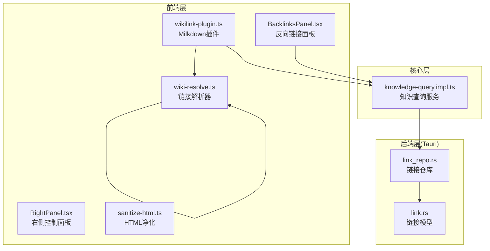
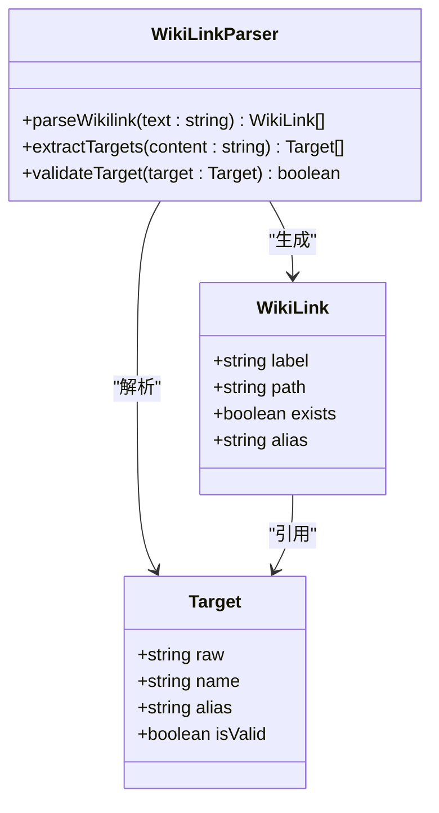
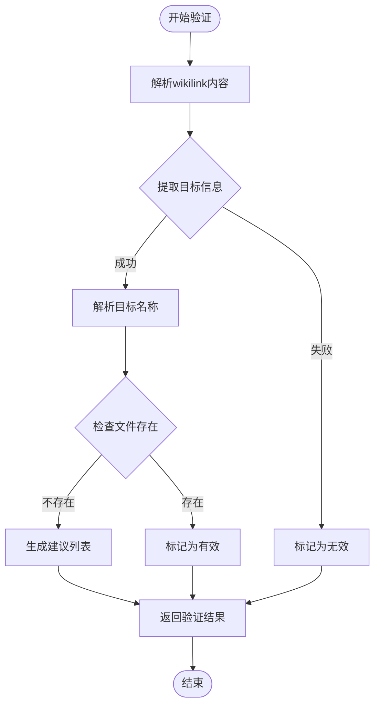
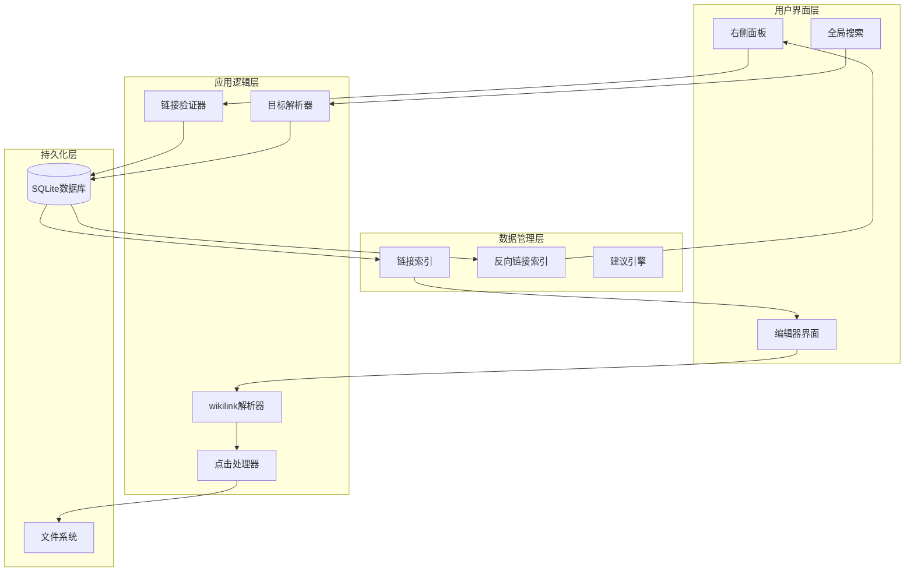
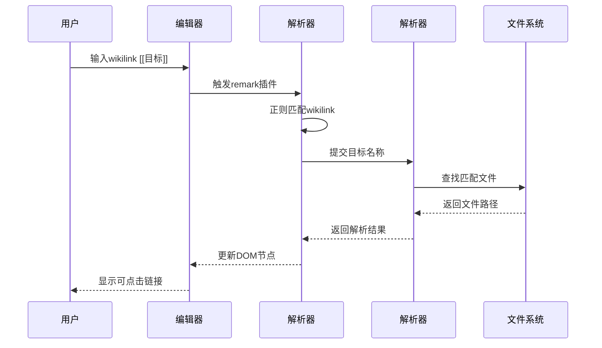
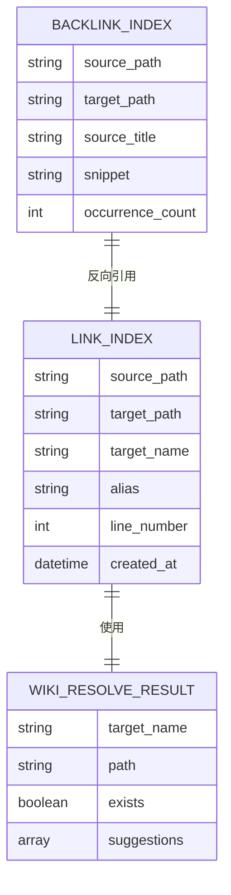
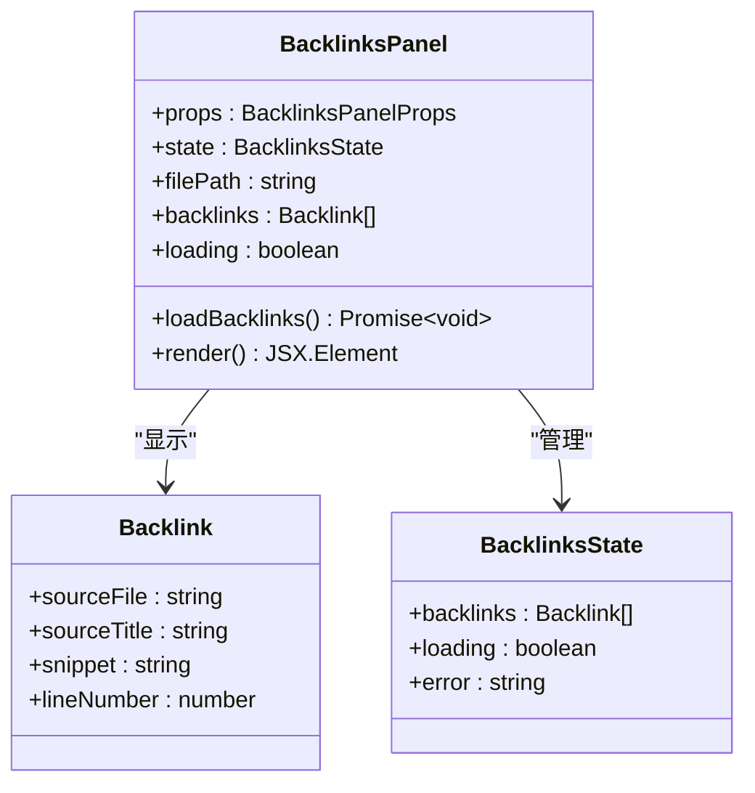
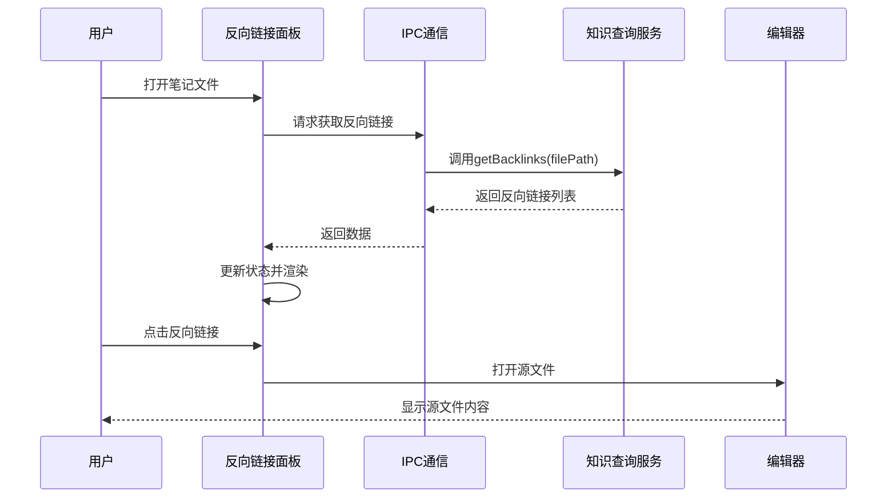
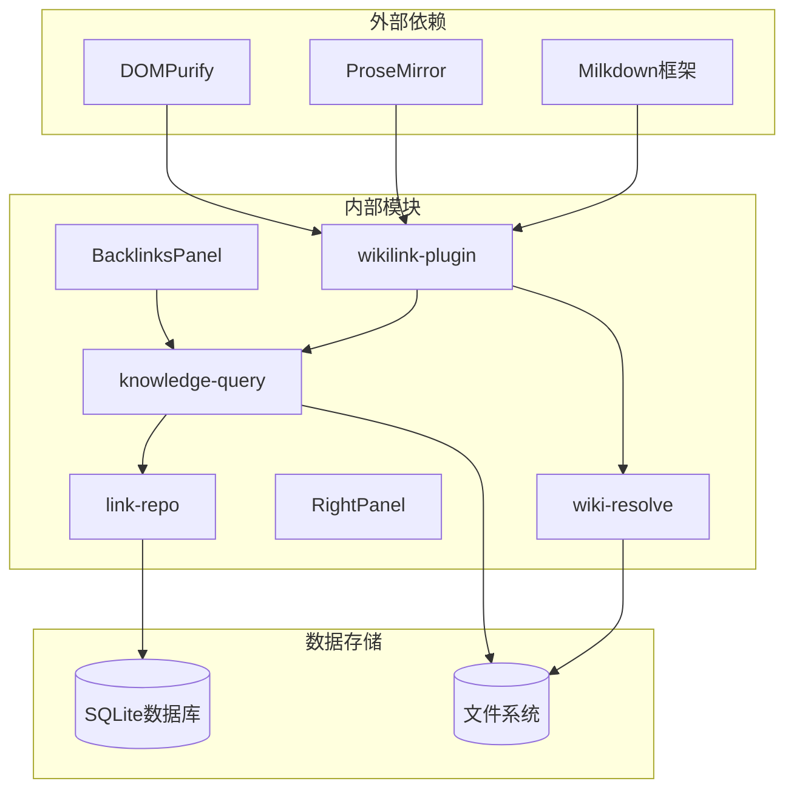

# 双向链接系统

<cite>
**本文档引用的文件**
- [wikilink-plugin.ts](file://src/features/markdown/wikilink-plugin.ts)
- [wiki-resolve.ts](file://src/lib/wiki-resolve.ts)
- [knowledge-query.impl.ts](file://src/core/knowledge/knowledge-query.impl.ts)
- [BacklinksPanel.tsx](file://src/components/right/BacklinksPanel.tsx)
- [RightPanel.tsx](file://src/components/right/RightPanel.tsx)
- [link.rs](file://src-tauri/src/models/link.rs)
- [link_repo.rs](file://src-tauri/src/repositories/link_repo.rs)
- [sanitize-html.ts](file://src/lib/sanitize-html.ts)
</cite>

## 目录
1. [简介](#简介)
2. [项目结构](#项目结构)
3. [核心组件](#核心组件)
4. [架构概览](#架构概览)
5. [详细组件分析](#详细组件分析)
6. [依赖关系分析](#依赖关系分析)
7. [性能考虑](#性能考虑)
8. [故障排除指南](#故障排除指南)
9. [结论](#结论)
10. [附录](#附录)

## 简介

NoteForge的双向链接系统是一个强大的知识管理功能，它允许用户在笔记之间创建智能链接，实现真正的双向链接体验。该系统基于wikilink语法，提供了从解析、验证到渲染的完整解决方案。

双向链接系统的核心价值在于：
- **智能链接解析**：自动识别和解析wikilink格式
- **实时链接验证**：确保链接的有效性和可访问性
- **双向链接追踪**：维护正向和反向链接关系
- **无缝用户交互**：提供直观的点击导航体验
- **知识图谱集成**：支持复杂的链接关系可视化

## 项目结构

双向链接系统的代码分布在多个层次中，形成了清晰的分层架构：



**图表来源**
- [wikilink-plugin.ts:1-106](file://src/features/markdown/wikilink-plugin.ts#L1-L106)
- [knowledge-query.impl.ts:96-134](file://src/core/knowledge/knowledge-query.impl.ts#L96-L134)
- [link_repo.rs](file://src-tauri/src/repositories/link_repo.rs)

**章节来源**
- [wikilink-plugin.ts:1-106](file://src/features/markdown/wikilink-plugin.ts#L1-L106)
- [knowledge-query.impl.ts:96-134](file://src/core/knowledge/knowledge-query.impl.ts#L96-L134)

## 核心组件

### Wikilink解析器

Wikilink解析器是整个系统的核心组件，负责将wikilink语法转换为可操作的链接对象。



**图表来源**
- [wikilink-plugin.ts:14-41](file://src/features/markdown/wikilink-plugin.ts#L14-L41)
- [wiki-resolve.ts](file://src/lib/wiki-resolve.ts)

### 链接验证引擎

链接验证引擎确保所有wikilink都指向有效的目标文件，并提供智能建议功能。



**图表来源**
- [knowledge-query.impl.ts:120-130](file://src/core/knowledge/knowledge-query.impl.ts#L120-L130)

**章节来源**
- [wikilink-plugin.ts:14-41](file://src/features/markdown/wikilink-plugin.ts#L14-L41)
- [knowledge-query.impl.ts:120-130](file://src/core/knowledge/knowledge-query.impl.ts#L120-L130)

## 架构概览

双向链接系统采用分层架构设计，确保了良好的可维护性和扩展性：



**图表来源**
- [wikilink-plugin.ts:85-104](file://src/features/markdown/wikilink-plugin.ts#L85-L104)
- [knowledge-query.impl.ts:96-134](file://src/core/knowledge/knowledge-query.impl.ts#L96-L134)

## 详细组件分析

### Wikilink插件实现

wikilink插件是基于Milkdown框架构建的，提供了完整的wikilink处理能力。

#### 插件架构

```mermaid
classDiagram
class WikiLinkPlugin {
+remarkPlugin : RemarkPlugin
+schema : NodeSchema
+clickPlugin : ProsePlugin
+initialize(ctx : Ctx) void
}
class RemarkWikiLink {
+test(node : Node) boolean
+transform(tree : Root) void
+extractWikilinks(content : string) RegExpMatchArray[]
}
class WikiLinkSchema {
+type : "wiki_link"
+inline : true
+atom : true
+attrs : {label : string}
+parseDOM : ParseRule[]
+toDOM : (node) => DOMOutputSpec
+parseMarkdown : MarkdownParser
+toMarkdown : MarkdownSerializer
}
class WikiLinkClickPlugin {
+handleClickOn(view, pos, node) boolean
+openWikiTarget(label : string) void
}
WikiLinkPlugin --> RemarkWikiLink : "包含"
WikiLinkPlugin --> WikiLinkSchema : "包含"
WikiLinkPlugin --> WikiLinkClickPlugin : "包含"
```

**图表来源**
- [wikilink-plugin.ts:43-104](file://src/features/markdown/wikilink-plugin.ts#L43-L104)

#### 解析流程

wikilink解析采用两阶段处理模式：

1. **语法解析阶段**：使用正则表达式识别wikilink格式
2. **语义解析阶段**：将wikilink转换为目标文件路径



**图表来源**
- [wikilink-plugin.ts:14-41](file://src/features/markdown/wikilink-plugin.ts#L14-L41)
- [wikilink-plugin.ts:85-104](file://src/features/markdown/wikilink-plugin.ts#L85-L104)

**章节来源**
- [wikilink-plugin.ts:43-104](file://src/features/markdown/wikilink-plugin.ts#L43-L104)

### 链接管理系统

链接管理系统负责维护所有wikilink的关系，并提供查询和管理功能。

#### 数据模型



**图表来源**
- [link.rs](file://src-tauri/src/models/link.rs)
- [knowledge-query.impl.ts:96-134](file://src/core/knowledge/knowledge-query.impl.ts#L96-L134)

#### 查询接口

链接管理系统提供了多种查询接口：

| 接口名称 | 功能描述 | 参数 | 返回值 |
|---------|----------|------|--------|
| getOutgoingLinks | 获取指定文件的所有出站链接 | path: string | LinkIndexEntry[] |
| getIncomingLinks | 获取引用指定文件的所有链接 | path: string | Backlink[] |
| resolveWikiLink | 解析wikilink目标 | targetName: string | WikiResolveResult |
| searchTitles | 搜索标题 | query: string, limit?: number | WikiTitle[] |

**章节来源**
- [knowledge-query.impl.ts:96-134](file://src/core/knowledge/knowledge-query.impl.ts#L96-L134)
- [link_repo.rs](file://src-tauri/src/repositories/link_repo.rs)

### 反向链接面板

反向链接面板提供了可视化的反向链接管理界面。

#### 面板架构



**图表来源**
- [BacklinksPanel.tsx:11-60](file://src/components/right/BacklinksPanel.tsx#L11-L60)

#### 交互流程



**图表来源**
- [BacklinksPanel.tsx:16-27](file://src/components/right/BacklinksPanel.tsx#L16-L27)
- [BacklinksPanel.tsx:43-54](file://src/components/right/BacklinksPanel.tsx#L43-L54)

**章节来源**
- [BacklinksPanel.tsx:11-60](file://src/components/right/BacklinksPanel.tsx#L11-L60)

### HTML净化与安全

为了确保系统的安全性，双向链接系统集成了HTML净化功能。

#### 净化配置

| 属性 | 值 | 说明 |
|------|-----|------|
| USE_PROFILES | { html: true } | 启用HTML净化配置文件 |
| ADD_ATTR | ["data-wiki-link"] | 允许的自定义属性 |
| FORBID_TAGS | ["script", "iframe"] | 禁止的危险标签 |

**章节来源**
- [sanitize-html.ts:1-11](file://src/lib/sanitize-html.ts#L1-L11)

## 依赖关系分析

双向链接系统的依赖关系呈现清晰的分层结构：



**图表来源**
- [wikilink-plugin.ts:1-8](file://src/features/markdown/wikilink-plugin.ts#L1-L8)
- [knowledge-query.impl.ts](file://src/core/knowledge/knowledge-query.impl.ts)

### 循环依赖检测

系统通过以下机制防止循环依赖：

1. **单向数据流**：从解析器到渲染器的数据流向单一方向
2. **异步处理**：所有文件系统操作都是异步的
3. **缓存机制**：频繁访问的目标会缓存结果
4. **超时控制**：长时间运行的操作有超时保护

**章节来源**
- [wikilink-plugin.ts:85-104](file://src/features/markdown/wikilink-plugin.ts#L85-L104)
- [knowledge-query.impl.ts:96-134](file://src/core/knowledge/knowledge-query.impl.ts#L96-L134)

## 性能考虑

双向链接系统在设计时充分考虑了性能优化：

### 内存管理

- **懒加载策略**：只在需要时加载链接数据
- **缓存机制**：使用LRU缓存存储常用链接
- **批量处理**：对大量链接进行批处理优化

### 计算优化

- **增量更新**：只更新发生变化的链接
- **并行处理**：利用多核CPU并行解析链接
- **预编译正则**：避免重复编译正则表达式

### 存储优化

- **索引优化**：为常用查询建立索引
- **压缩存储**：对文本内容进行压缩存储
- **分页加载**：大量数据分页加载显示

## 故障排除指南

### 常见问题及解决方案

#### 链接无法解析

**症状**：wikilink显示为普通文本而非可点击链接

**可能原因**：
1. 目标文件不存在
2. 文件名大小写不匹配
3. 路径包含特殊字符

**解决步骤**：
1. 检查目标文件是否存在于文件系统
2. 验证文件名的大小写一致性
3. 使用建议功能查找正确的文件名

#### 反向链接不显示

**症状**：反向链接面板为空或显示不完整

**可能原因**：
1. 链接索引未更新
2. 权限问题
3. 文件编码问题

**解决步骤**：
1. 重新构建链接索引
2. 检查文件权限设置
3. 验证文件编码格式

#### 性能问题

**症状**：编辑器响应缓慢，特别是大文件

**优化建议**：
1. 分割大型文件
2. 清理不必要的wikilink
3. 调整缓存大小设置

**章节来源**
- [knowledge-query.impl.ts:120-130](file://src/core/knowledge/knowledge-query.impl.ts#L120-L130)
- [BacklinksPanel.tsx:16-27](file://src/components/right/BacklinksPanel.tsx#L16-L27)

## 结论

NoteForge的双向链接系统通过精心设计的架构和实现，为用户提供了一个强大而易用的知识管理工具。系统的主要优势包括：

1. **完整的功能覆盖**：从解析到渲染，从验证到管理
2. **优秀的用户体验**：直观的界面和流畅的交互
3. **强大的扩展性**：模块化设计便于功能扩展
4. **可靠的安全性**：多重安全防护机制

未来的发展方向包括：
- 支持更多链接格式和语法
- 增强智能建议功能
- 优化大数据量场景下的性能
- 扩展与其他知识管理工具的集成

## 附录

### Wikilink语法规范

| 语法格式 | 描述 | 示例 | 说明 |
|---------|------|------|------|
| `[[目标]]` | 基本wikilink | `[[Python编程]]` | 最常用的链接格式 |
| `[[目标|别名]]` | 带别名的链接 | `[[Python编程|Python]]` | 自定义显示文本 |
| `[[目录/目标]]` | 相对路径链接 | `[[编程/Python]]` | 在子目录中的文件 |
| `[[../父目录/目标]]` | 上级目录链接 | `[[../基础/入门]]` | 返回上级目录 |

### 使用示例

#### 创建链接
1. 在编辑器中输入 `[[` 开始创建wikilink
2. 输入目标文件名或部分名称
3. 系统会显示智能建议
4. 选择正确的建议完成链接创建

#### 导航链接
1. 在wikilink上点击左键进行常规打开
2. 按住Ctrl键点击进行新标签页打开
3. 右键点击查看上下文菜单选项

#### 管理链接
1. 打开右侧面板查看反向链接
2. 使用全局搜索查找相关链接
3. 通过文件树浏览链接关系

### 集成接口

#### API接口

| 接口 | 方法 | 描述 |
|------|------|------|
| `/api/links/outgoing` | GET | 获取指定文件的出站链接 |
| `/api/links/incoming` | GET | 获取引用指定文件的链接 |
| `/api/links/resolve` | POST | 解析wikilink目标 |
| `/api/links/search` | GET | 搜索标题和链接 |

#### 事件系统

| 事件类型 | 触发时机 | 参数 | 处理函数 |
|----------|----------|------|----------|
| `wikilink:created` | 创建新wikilink | {source, target} | 自动补全建议 |
| `wikilink:updated` | 更新wikilink | {source, oldTarget, newTarget} | 更新索引 |
| `wikilink:deleted` | 删除wikilink | {source, target} | 清理索引 |
| `wikilink:navigation` | 导航wikilink | {target, source} | 打开文件 |