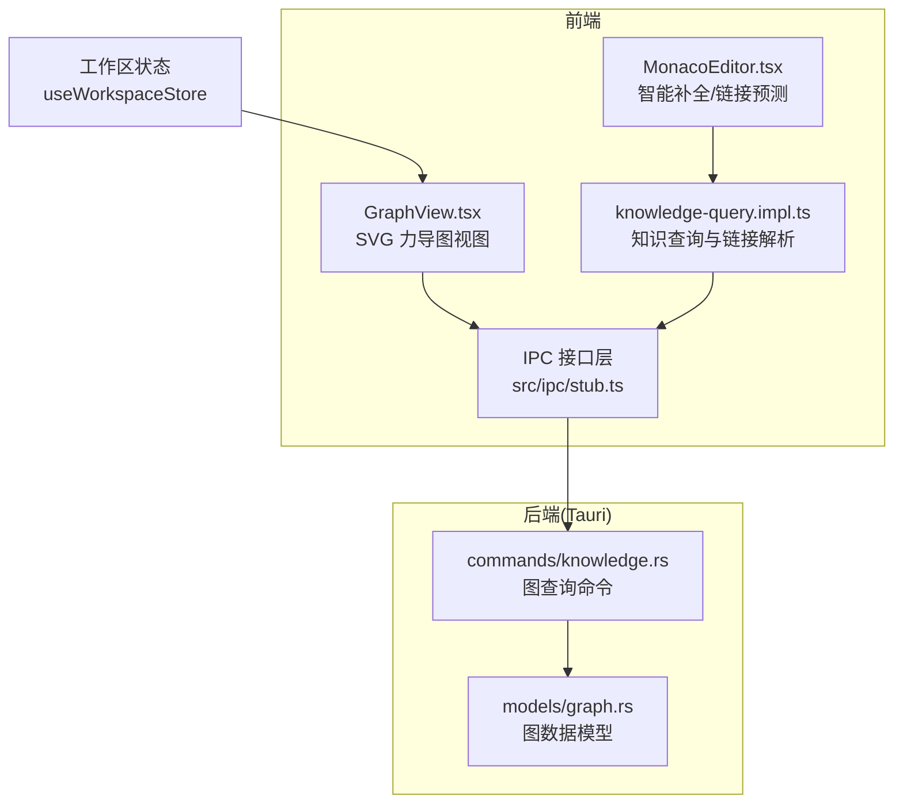
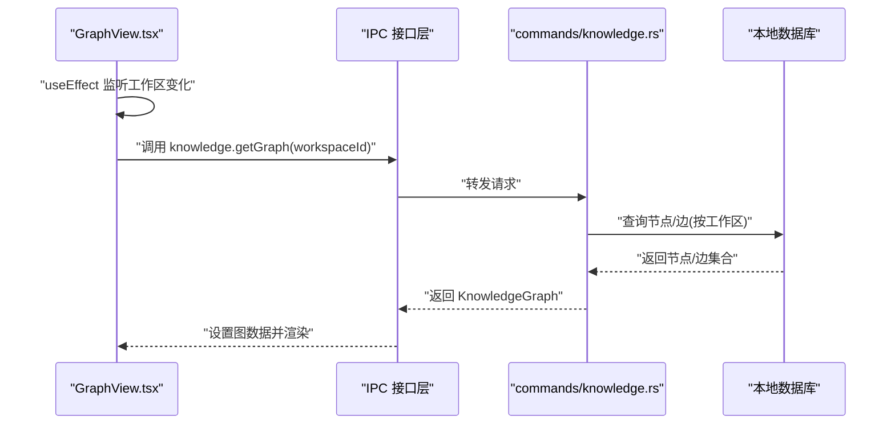
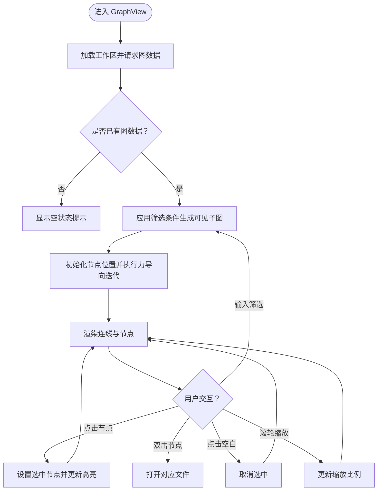
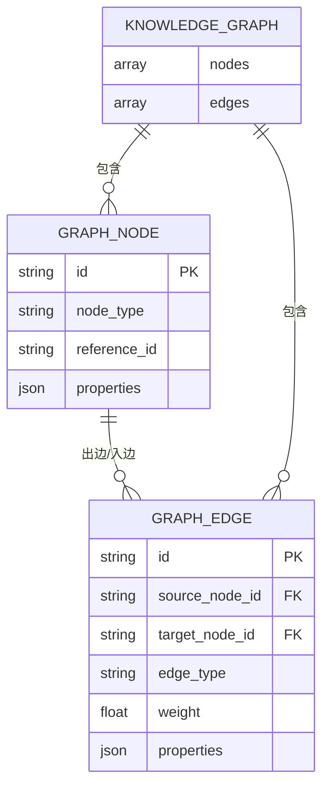
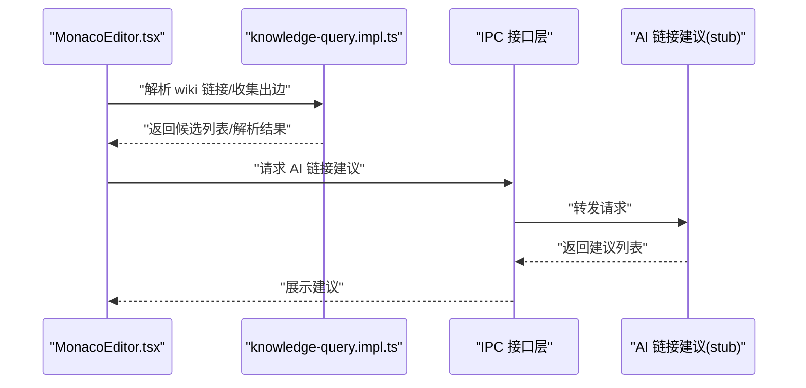
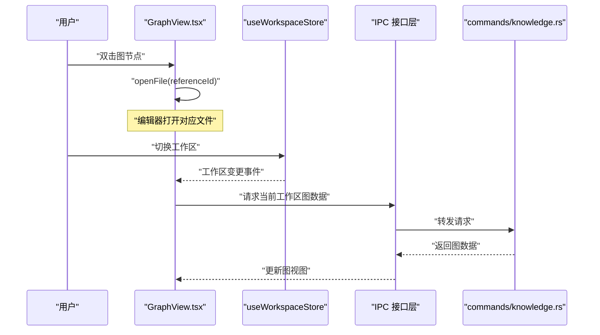
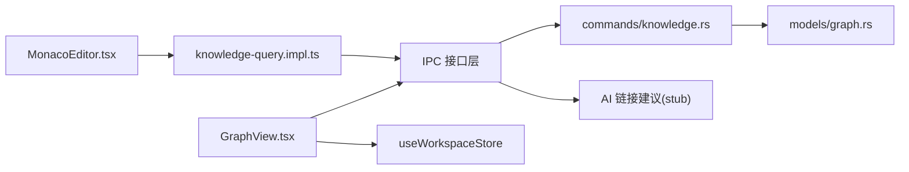

# 知识图谱集成

<cite>
**本文引用的文件**
- [GraphView.tsx](file://src/features/graph/GraphView.tsx)
- [05-knowledge-graph.md](file://docs/design/05-knowledge-graph.md)
- [types.ts](file://src/types.ts)
- [graph.rs](file://src-tauri/src/models/graph.rs)
- [knowledge.rs（命令）](file://src-tauri/src/commands/knowledge.rs)
- [MonacoEditor.tsx](file://src/components/editor/MonacoEditor.tsx)
- [knowledge-query.impl.ts](file://src/core/knowledge/knowledge-query.impl.ts)
- [stub.ts](file://src/ipc/stub.ts)
</cite>

## 目录
1. [简介](#简介)
2. [项目结构](#项目结构)
3. [核心组件](#核心组件)
4. [架构总览](#架构总览)
5. [详细组件分析](#详细组件分析)
6. [依赖分析](#依赖分析)
7. [性能考虑](#性能考虑)
8. [故障排查指南](#故障排查指南)
9. [结论](#结论)
10. [附录](#附录)

## 简介
本文件系统性阐述 NoteForge 的知识图谱集成功能，覆盖以下方面：
- 编辑器中的图谱可视化：节点高亮、关系连线、交互反馈与缩放。
- 图查询接口：节点检索、边关系查询、图遍历等 API 使用方式。
- 智能补全：文档建议、链接预测、上下文感知等特性。
- 编辑器与图谱的双向交互：点击跳转、拖拽行为、实时更新。
- 图谱数据的实时同步机制：增量更新、缓存策略、性能优化。
- 最佳实践与典型使用场景。

## 项目结构
知识图谱相关能力横跨前端 React 视图层、IPC 接口层、Tauri 后端模型与命令实现，并与编辑器智能补全协同工作。

图表来源
- [GraphView.tsx:81-94](file://src/features/graph/GraphView.tsx#L81-L94)
- [MonacoEditor.tsx:140-161](file://src/components/editor/MonacoEditor.tsx#L140-L161)
- [knowledge-query.impl.ts:96-134](file://src/core/knowledge/knowledge-query.impl.ts#L96-L134)
- [graph.rs:1-34](file://src-tauri/src/models/graph.rs#L1-L34)
- [knowledge.rs（命令）:126-163](file://src-tauri/src/commands/knowledge.rs#L126-L163)
- [stub.ts:872-903](file://src/ipc/stub.ts#L872-L903)

章节来源
- [GraphView.tsx:1-230](file://src/features/graph/GraphView.tsx#L1-L230)
- [05-knowledge-graph.md:1-119](file://docs/design/05-knowledge-graph.md#L1-L119)
- [types.ts:165-204](file://src/types.ts#L165-L204)
- [graph.rs:1-34](file://src-tauri/src/models/graph.rs#L1-L34)
- [knowledge.rs（命令）:126-163](file://src-tauri/src/commands/knowledge.rs#L126-L163)
- [MonacoEditor.tsx:140-161](file://src/components/editor/MonacoEditor.tsx#L140-L161)
- [knowledge-query.impl.ts:96-134](file://src/core/knowledge/knowledge-query.impl.ts#L96-L134)
- [stub.ts:872-903](file://src/ipc/stub.ts#L872-L903)

## 核心组件
- 图视图组件：基于 SVG 的轻量力导图，支持节点筛选、缩放、选中态高亮与邻接节点弱化。
- 图数据模型：前端与后端对齐的节点/边/图结构定义。
- IPC 接口：前端通过 IPC 获取图数据；提供 AI 链接建议占位实现。
- 知识查询模块：负责 wiki 链接解析、标题搜索、出边收集等。
- 编辑器智能补全：提供文档建议与链接预测，辅助构建双向链接。

章节来源
- [GraphView.tsx:81-230](file://src/features/graph/GraphView.tsx#L81-L230)
- [types.ts:165-204](file://src/types.ts#L165-L204)
- [graph.rs:1-34](file://src-tauri/src/models/graph.rs#L1-L34)
- [knowledge.rs（命令）:126-163](file://src-tauri/src/commands/knowledge.rs#L126-L163)
- [MonacoEditor.tsx:140-161](file://src/components/editor/MonacoEditor.tsx#L140-L161)
- [knowledge-query.impl.ts:96-134](file://src/core/knowledge/knowledge-query.impl.ts#L96-L134)
- [stub.ts:872-903](file://src/ipc/stub.ts#L872-L903)

## 架构总览
前端通过 IPC 调用后端命令，后端从本地数据库查询图数据并返回给前端渲染。编辑器侧的智能补全与知识查询模块可辅助用户构建图谱。

图表来源
- [GraphView.tsx:91-94](file://src/features/graph/GraphView.tsx#L91-L94)
- [knowledge.rs（命令）:126-163](file://src-tauri/src/commands/knowledge.rs#L126-L163)

## 详细组件分析

### 图视图组件（GraphView）
- 数据来源：监听工作区变化，通过 IPC 获取当前工作区的完整图数据。
- 渲染逻辑：将图数据映射为 SVG 节点与连线，采用力导向算法进行布局迭代。
- 交互反馈：
  - 节点单击：选中高亮，显示详情卡片。
  - 节点双击：触发编辑器打开对应文件。
  - 空白单击：取消选中。
  - 悬停：邻接边高亮。
  - 缩放：支持 0.5x~2.5x 步进 10%。
  - 筛选：按节点 label 实时过滤并重绘。
- 选中态邻接高亮：仅选中节点与邻接节点保持不透明，其他节点弱化以突出焦点。

图表来源
- [GraphView.tsx:81-230](file://src/features/graph/GraphView.tsx#L81-L230)
- [05-knowledge-graph.md:51-89](file://docs/design/05-knowledge-graph.md#L51-L89)

章节来源
- [GraphView.tsx:81-230](file://src/features/graph/GraphView.tsx#L81-L230)
- [05-knowledge-graph.md:31-119](file://docs/design/05-knowledge-graph.md#L31-L119)

### 图数据模型与后端命令
- 前端模型：定义节点、边、图的数据结构，包含类型、权重、度数等字段。
- 后端模型：与前端对齐的 Rust 结构体，序列化传输。
- 查询命令：根据节点 ID 集合查询与其相连的所有边，去重后返回完整的子图。

图表来源
- [types.ts:165-204](file://src/types.ts#L165-L204)
- [graph.rs:1-34](file://src-tauri/src/models/graph.rs#L1-L34)

章节来源
- [types.ts:165-204](file://src/types.ts#L165-L204)
- [graph.rs:1-34](file://src-tauri/src/models/graph.rs#L1-L34)
- [knowledge.rs（命令）:126-163](file://src-tauri/src/commands/knowledge.rs#L126-L163)

### 智能补全与链接预测
- 编辑器内补全：在 wiki 链接语法上下文中提供文档建议，提升链接创建效率。
- 知识查询：解析 wiki 链接目标、收集出边、搜索标题，支撑“已知节点”的图遍历。
- AI 链接建议：提供占位实现，模拟基于内容片段的链接建议与置信度排序。

图表来源
- [MonacoEditor.tsx:140-161](file://src/components/editor/MonacoEditor.tsx#L140-L161)
- [knowledge-query.impl.ts:96-134](file://src/core/knowledge/knowledge-query.impl.ts#L96-L134)
- [stub.ts:872-903](file://src/ipc/stub.ts#L872-L903)

章节来源
- [MonacoEditor.tsx:140-161](file://src/components/editor/MonacoEditor.tsx#L140-L161)
- [knowledge-query.impl.ts:96-134](file://src/core/knowledge/knowledge-query.impl.ts#L96-L134)
- [stub.ts:872-903](file://src/ipc/stub.ts#L872-L903)

### 编辑器与图谱的双向交互
- 点击跳转：图谱中双击节点直接打开对应文件，实现“图到文”的导航。
- 链接预测：编辑器内建议与图谱节点匹配，降低断链风险。
- 实时更新：工作区切换时重新拉取图数据，确保视图与当前上下文一致。

图表来源
- [GraphView.tsx:81-94](file://src/features/graph/GraphView.tsx#L81-L94)
- [GraphView.tsx:224-229](file://src/features/graph/GraphView.tsx#L224-L229)

章节来源
- [GraphView.tsx:81-94](file://src/features/graph/GraphView.tsx#L81-L94)
- [GraphView.tsx:224-229](file://src/features/graph/GraphView.tsx#L224-L229)

## 依赖分析
- 前端耦合：GraphView 依赖工作区状态、IPC 接口与编辑器打开能力；与设计文档的交互规范强耦合。
- IPC 层：提供知识图谱查询与 AI 链接建议的桥接，便于替换真实后端实现。
- 后端命令：围绕节点/边查询与去重，保证返回子图完整性。
- 编辑器补全：与知识查询模块协作，形成“写入即建图”的闭环。

图表来源
- [GraphView.tsx:81-94](file://src/features/graph/GraphView.tsx#L81-L94)
- [MonacoEditor.tsx:140-161](file://src/components/editor/MonacoEditor.tsx#L140-L161)
- [knowledge-query.impl.ts:96-134](file://src/core/knowledge/knowledge-query.impl.ts#L96-L134)
- [knowledge.rs（命令）:126-163](file://src-tauri/src/commands/knowledge.rs#L126-L163)
- [graph.rs:1-34](file://src-tauri/src/models/graph.rs#L1-L34)
- [stub.ts:872-903](file://src/ipc/stub.ts#L872-L903)

章节来源
- [GraphView.tsx:81-94](file://src/features/graph/GraphView.tsx#L81-L94)
- [MonacoEditor.tsx:140-161](file://src/components/editor/MonacoEditor.tsx#L140-L161)
- [knowledge-query.impl.ts:96-134](file://src/core/knowledge/knowledge-query.impl.ts#L96-L134)
- [knowledge.rs（命令）:126-163](file://src-tauri/src/commands/knowledge.rs#L126-L163)
- [graph.rs:1-34](file://src-tauri/src/models/graph.rs#L1-L34)
- [stub.ts:872-903](file://src/ipc/stub.ts#L872-L903)

## 性能考虑
- 力导向布局：斥力、连接约束、中心引力与阻尼参数已在前端实现，适合中小规模图（≤数百节点）。
- 渲染优化：节点筛选与可见子图生成减少重绘开销；连线透明度随选中态动态调整，避免过度绘制。
- 数据查询：后端按节点集合查询相连边并去重，避免重复与冗余边。
- 缓存策略：当前实现按工作区切换重新拉取图数据；可引入前端内存缓存与增量更新以减少重复查询。
- 智能补全：建议限制候选数量并延迟计算，避免频繁重算影响编辑体验。

## 故障排查指南
- 图为空或未显示：确认当前工作区是否存在双向链接；检查 IPC 请求是否成功返回图数据。
- 节点无法点击/跳转：检查节点 referenceId 是否有效；确认编辑器打开文件能力可用。
- 缩放异常：确认缩放比例边界（0.5~2.5）与重置按钮逻辑。
- 智能补全无效：检查编辑器上下文解析与 IPC 调用链路；验证 AI 链接建议占位实现是否被替换为真实实现。
- 查询性能差：关注节点/边数量与筛选范围；必要时启用前端缓存与增量更新。

章节来源
- [GraphView.tsx:81-230](file://src/features/graph/GraphView.tsx#L81-L230)
- [05-knowledge-graph.md:91-119](file://docs/design/05-knowledge-graph.md#L91-L119)
- [stub.ts:872-903](file://src/ipc/stub.ts#L872-L903)

## 结论
NoteForge 的知识图谱集成以“轻量 SVG 力导图 + IPC 查询 + 编辑器智能补全”为核心路径，既满足中小规模图谱的可视化需求，又为后续扩展（如增量更新、缓存与真实 AI 能力接入）预留空间。通过工作区驱动的数据刷新与“图到文”的交互闭环，显著提升知识发现与链接构建效率。

## 附录

### 图查询接口使用方法
- 获取完整图：传入工作区 ID，返回节点与边集合。
- 子图查询：传入节点 ID 列表，返回这些节点及其相连边构成的子图。
- 去重策略：对边 ID 去重，确保返回子图无重复边。

章节来源
- [knowledge.rs（命令）:126-163](file://src-tauri/src/commands/knowledge.rs#L126-L163)
- [types.ts:181-184](file://src/types.ts#L181-L184)

### 智能补全与链接预测要点
- 文档建议：在 wiki 链接语法上下文中提供标题建议。
- 链接解析：解析目标名称、别名、行号等信息。
- 标题搜索：按关键词与限制数量返回候选。
- AI 链接建议：基于内容片段匹配现有文档，输出置信度排序的建议。

章节来源
- [MonacoEditor.tsx:140-161](file://src/components/editor/MonacoEditor.tsx#L140-L161)
- [knowledge-query.impl.ts:96-134](file://src/core/knowledge/knowledge-query.impl.ts#L96-L134)
- [stub.ts:872-903](file://src/ipc/stub.ts#L872-L903)