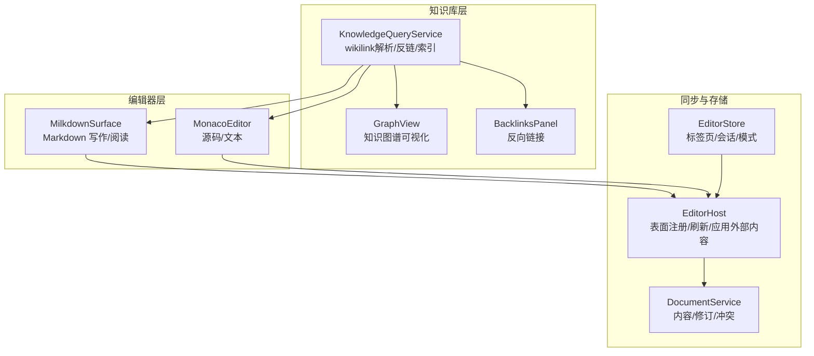
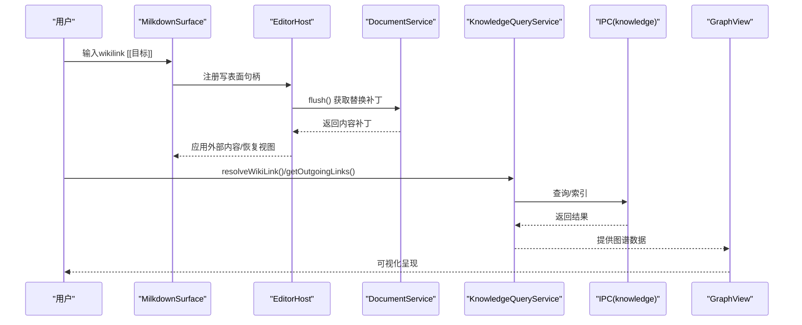
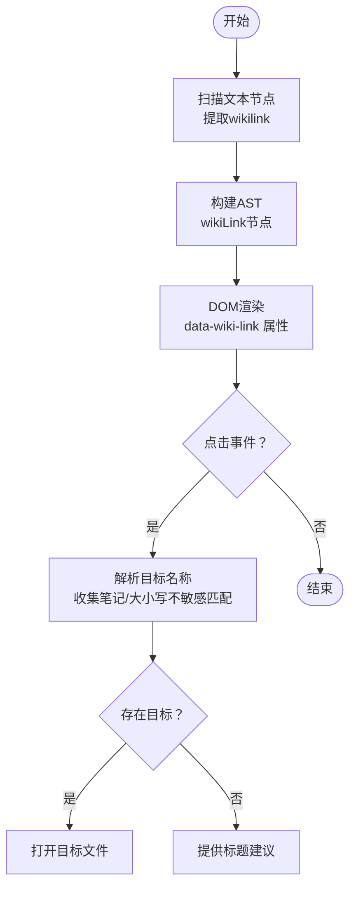
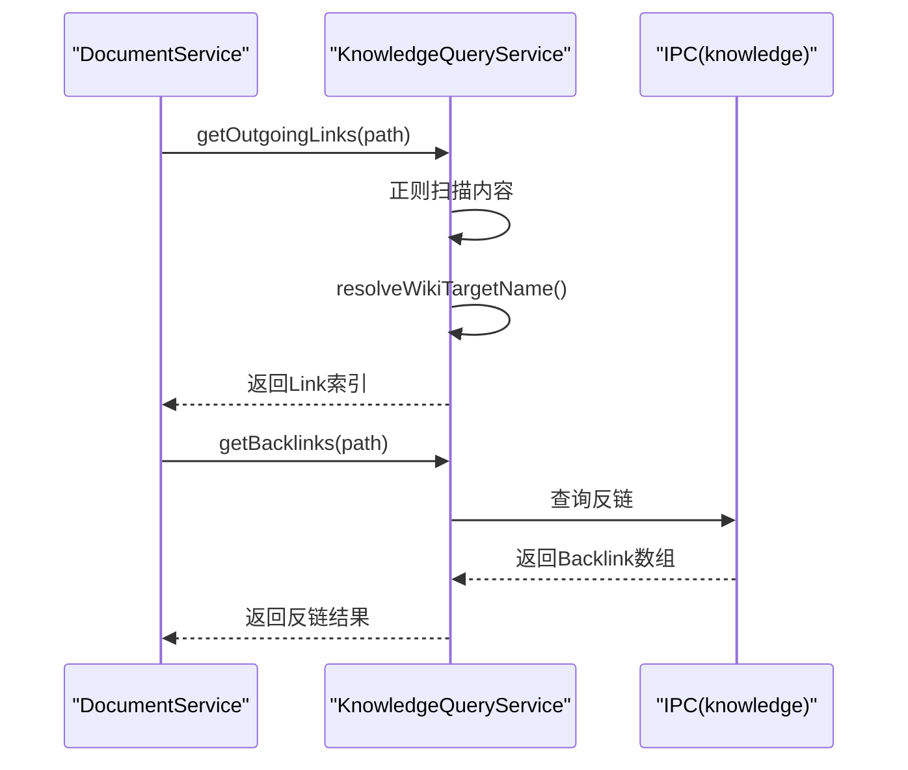
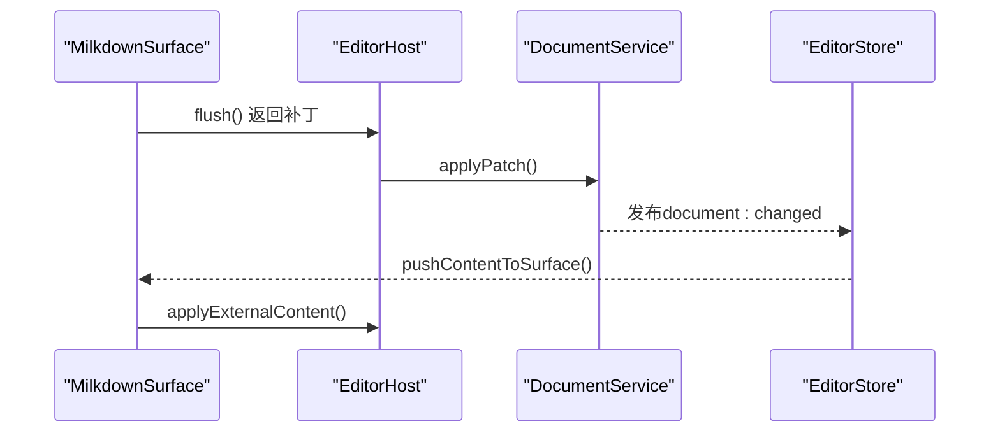
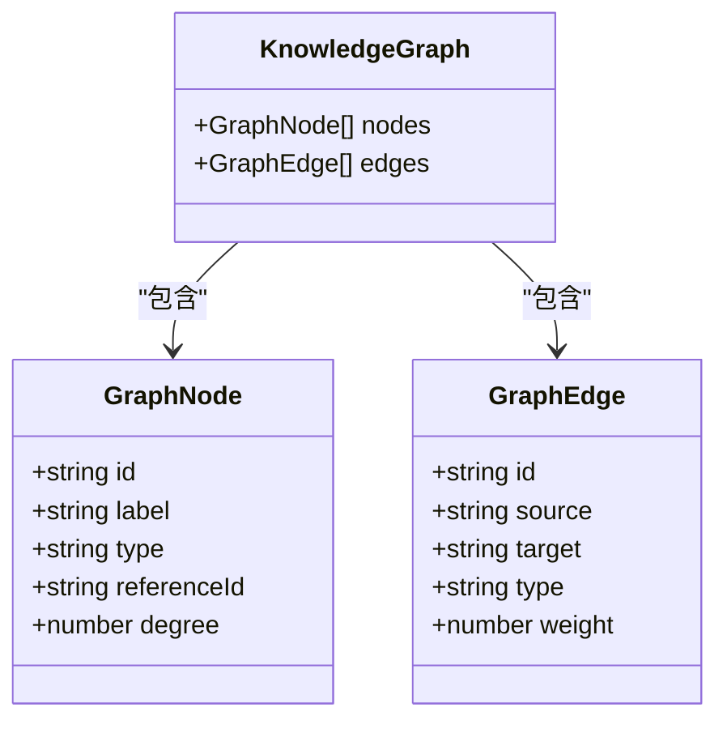
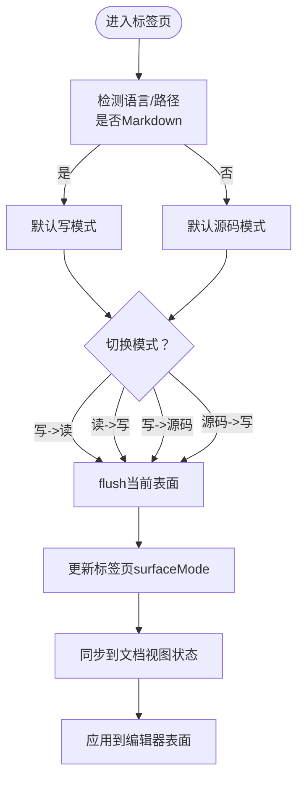
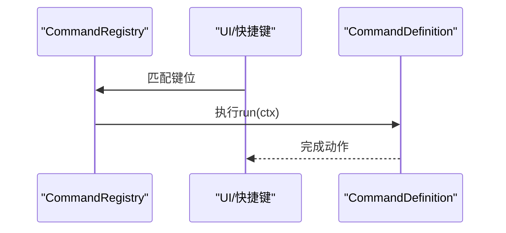
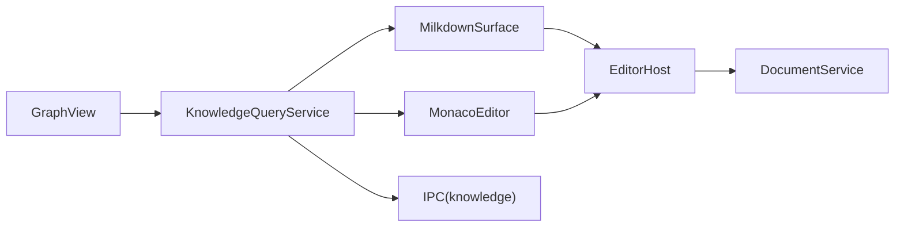

# 编辑器与知识库融合

<cite>
**本文档引用的文件**
- [wikilink-plugin.ts](file://src/features/markdown/wikilink-plugin.ts)
- [wiki-resolve.ts](file://src/lib/wiki-resolve.ts)
- [MonacoEditor.tsx](file://src/components/editor/MonacoEditor.tsx)
- [GraphView.tsx](file://src/features/graph/GraphView.tsx)
- [knowledge-query.impl.ts](file://src/core/knowledge/knowledge-query.impl.ts)
- [editor.ts](file://src/store/editor.ts)
- [editor-sync.ts](file://src/core/bridge/editor-sync.ts)
- [document-service.impl.ts](file://src/core/document/document-service.impl.ts)
- [BacklinksPanel.tsx](file://src/components/right/BacklinksPanel.tsx)
- [editor-doc.ts](file://src/lib/editor-doc.ts)
- [surface-mode.ts](file://src/lib/surface-mode.ts)
- [editor-host.impl.ts](file://src/core/editor/editor-host.impl.ts)
- [MilkdownSurface.tsx](file://src/features/markdown/MilkdownSurface.tsx)
- [command-registry.impl.ts](file://src/core/command/command-registry.impl.ts)
- [types.ts](file://src/types.ts)
</cite>

## 目录
1. [简介](#简介)
2. [项目结构](#项目结构)
3. [核心组件](#核心组件)
4. [架构总览](#架构总览)
5. [详细组件分析](#详细组件分析)
6. [依赖分析](#依赖分析)
7. [性能考虑](#性能考虑)
8. [故障排查指南](#故障排查指南)
9. [结论](#结论)
10. [附录](#附录)

## 简介
本文件面向NoteForge的“编辑器与知识库融合”能力，系统化梳理双向链接（wikilink）解析与导航、引用关系管理（反链、出链）、内容同步机制（实时预览、增量更新、版本控制）、知识图谱可视化与交互、编辑器模式切换（写作/阅读/源码）、以及扩展机制（插件、自定义语法、主题）。文档以代码级事实为基础，辅以架构图与时序图，帮助开发者与使用者高效理解与落地。

## 项目结构
围绕编辑器与知识库融合的关键模块分布如下：
- Markdown编辑与wikilink处理：Milkdown表面与wikilink插件、Monaco编辑器的wikilink智能提示
- 知识查询与索引：知识查询服务、wikilink解析与标题搜索、反链查询
- 内容同步与版本控制：文档服务、编辑器宿主、桥接层
- 可视化与交互：知识图谱视图、右侧面板（反链）
- 模式与扩展：表面模式、命令注册、主题与语言映射

图表来源
- [MilkdownSurface.tsx:173-184](file://src/features/markdown/MilkdownSurface.tsx#L173-L184)
- [MonacoEditor.tsx:36-434](file://src/components/editor/MonacoEditor.tsx#L36-L434)
- [knowledge-query.impl.ts:41-148](file://src/core/knowledge/knowledge-query.impl.ts#L41-L148)
- [GraphView.tsx:81-278](file://src/features/graph/GraphView.tsx#L81-L278)
- [BacklinksPanel.tsx:11-61](file://src/components/right/BacklinksPanel.tsx#L11-L61)
- [document-service.impl.ts:48-466](file://src/core/document/document-service.impl.ts#L48-L466)
- [editor-host.impl.ts:14-111](file://src/core/editor/editor-host.impl.ts#L14-L111)
- [editor.ts:281-842](file://src/store/editor.ts#L281-L842)

章节来源
- [MilkdownSurface.tsx:173-184](file://src/features/markdown/MilkdownSurface.tsx#L173-L184)
- [MonacoEditor.tsx:36-434](file://src/components/editor/MonacoEditor.tsx#L36-L434)
- [knowledge-query.impl.ts:41-148](file://src/core/knowledge/knowledge-query.impl.ts#L41-L148)
- [GraphView.tsx:81-278](file://src/features/graph/GraphView.tsx#L81-L278)
- [BacklinksPanel.tsx:11-61](file://src/components/right/BacklinksPanel.tsx#L11-L61)
- [document-service.impl.ts:48-466](file://src/core/document/document-service.impl.ts#L48-L466)
- [editor-host.impl.ts:14-111](file://src/core/editor/editor-host.impl.ts#L14-L111)
- [editor.ts:281-842](file://src/store/editor.ts#L281-L842)

## 核心组件
- 双向链接（wikilink）解析与渲染
  - 解析：正则识别wikilink，生成AST节点；支持别名与纯标题
  - 渲染：DOM属性标注，点击跳转到目标笔记
  - 智能提示：Monaco触发字符“[[”，基于标题匹配返回候选
- 引用关系管理
  - 出链提取：扫描内容中的wikilink，解析目标并记录行号与别名
  - 反链查询：通过IPC调用后端，返回引用该文件的来源与上下文片段
- 内容同步与版本控制
  - 文档服务：维护内容、修订、脏状态、磁盘一致性、冲突解决
  - 编辑器宿主：统一注册不同表面（写/读/源码），负责flush与应用外部内容
  - 桥接层：将文档变更广播至编辑器标签，确保UI与内容一致
- 知识图谱与可视化
  - 图谱数据：节点（笔记/记忆/概念/代理）、边（引用/嵌入/标签/语义）
  - 力导向布局：轻量实现，支持缩放、过滤、选中高亮与双击打开
- 编辑器模式切换
  - 表面模式：write/read/source，按Markdown/非Markdown自动启用
  - 切换流程：flush当前表面 -> 更新标签态 -> 同步到文档视图状态
- 扩展机制
  - 命令系统：键位绑定、上下文条件、分类组织
  - 主题与语言：编辑器主题随UI主题切换，语言映射覆盖多种格式

章节来源
- [wikilink-plugin.ts:14-107](file://src/features/markdown/wikilink-plugin.ts#L14-L107)
- [wiki-resolve.ts:9-63](file://src/lib/wiki-resolve.ts#L9-L63)
- [MonacoEditor.tsx:131-162](file://src/components/editor/MonacoEditor.tsx#L131-L162)
- [knowledge-query.impl.ts:48-148](file://src/core/knowledge/knowledge-query.impl.ts#L48-L148)
- [BacklinksPanel.tsx:11-61](file://src/components/right/BacklinksPanel.tsx#L11-L61)
- [document-service.impl.ts:136-466](file://src/core/document/document-service.impl.ts#L136-L466)
- [editor-host.impl.ts:26-98](file://src/core/editor/editor-host.impl.ts#L26-L98)
- [editor-sync.ts:66-153](file://src/core/bridge/editor-sync.ts#L66-L153)
- [GraphView.tsx:81-278](file://src/features/graph/GraphView.tsx#L81-L278)
- [surface-mode.ts:9-27](file://src/lib/surface-mode.ts#L9-L27)
- [editor.ts:594-614](file://src/store/editor.ts#L594-L614)
- [command-registry.impl.ts:10-100](file://src/core/command/command-registry.impl.ts#L10-L100)
- [types.ts:161-232](file://src/types.ts#L161-L232)

## 架构总览
下图展示从用户输入到知识图谱可视化的端到端路径，以及编辑器表面与文档服务之间的协作。

图表来源
- [MilkdownSurface.tsx:64-125](file://src/features/markdown/MilkdownSurface.tsx#L64-L125)
- [editor-host.impl.ts:26-53](file://src/core/editor/editor-host.impl.ts#L26-L53)
- [document-service.impl.ts:227-237](file://src/core/document/document-service.impl.ts#L227-L237)
- [knowledge-query.impl.ts:120-144](file://src/core/knowledge/knowledge-query.impl.ts#L120-L144)
- [GraphView.tsx:91-94](file://src/features/graph/GraphView.tsx#L91-L94)

## 详细组件分析

### 双向链接系统（wikilink）
- 解析与AST转换
  - 使用正则扫描文本节点，拆分为普通文本与wikilink节点，保留别名信息
  - 在Milkdown中注册schema，DOM属性包含label，便于渲染与点击处理
- 点击跳转
  - ProseMirror插件拦截点击，读取label并解析目标路径，调用编辑器打开对应文件
- 智能提示
  - Monaco注册markdown语言的补全提供者，触发字符为“[”，根据当前行内容匹配标题集合，返回候选列表

图表来源
- [wikilink-plugin.ts:14-107](file://src/features/markdown/wikilink-plugin.ts#L14-L107)
- [wiki-resolve.ts:23-41](file://src/lib/wiki-resolve.ts#L23-L41)

章节来源
- [wikilink-plugin.ts:14-107](file://src/features/markdown/wikilink-plugin.ts#L14-L107)
- [wiki-resolve.ts:9-63](file://src/lib/wiki-resolve.ts#L9-L63)
- [MonacoEditor.tsx:131-162](file://src/components/editor/MonacoEditor.tsx#L131-L162)

### 引用关系管理（出链/反链）
- 出链提取
  - 遍历文档内容，匹配wikilink，解析目标名称与可选别名，记录行号与来源路径
- 反链查询
  - 通过IPC调用后端，返回引用来源文件、标题与上下文片段
- 标题搜索
  - 支持模糊匹配与评分排序，用于智能提示与图谱节点筛选

图表来源
- [knowledge-query.impl.ts:96-144](file://src/core/knowledge/knowledge-query.impl.ts#L96-L144)
- [BacklinksPanel.tsx:16-26](file://src/components/right/BacklinksPanel.tsx#L16-L26)

章节来源
- [knowledge-query.impl.ts:48-148](file://src/core/knowledge/knowledge-query.impl.ts#L48-L148)
- [BacklinksPanel.tsx:11-61](file://src/components/right/BacklinksPanel.tsx#L11-L61)

### 内容同步机制（实时预览、增量更新、版本控制）
- 实时预览与增量更新
  - Milkdown写表面监听markdown更新事件，去抖后调用编辑器更新函数，写入文档服务
  - Monaco编辑器采用200ms防抖，避免频繁applyPatch
- 外部变更与回滚
  - 订阅document:changed事件，当检测到外部修改或回滚时，应用最新内容并保持滚动/光标位置
- 版本控制与冲突
  - 文档记录包含baseline、savedRevision、dirty标志；保存前对比磁盘修订，必要时弹窗选择策略
  - 自动草稿（workspace draft）在重启或崩溃时恢复未保存内容

图表来源
- [MilkdownSurface.tsx:64-125](file://src/features/markdown/MilkdownSurface.tsx#L64-L125)
- [editor-host.impl.ts:26-53](file://src/core/editor/editor-host.impl.ts#L26-L53)
- [document-service.impl.ts:97-102](file://src/core/document/document-service.impl.ts#L97-L102)
- [editor-sync.ts:104-131](file://src/core/bridge/editor-sync.ts#L104-L131)

章节来源
- [MilkdownSurface.tsx:131-141](file://src/features/markdown/MilkdownSurface.tsx#L131-L141)
- [MonacoEditor.tsx:318-339](file://src/components/editor/MonacoEditor.tsx#L318-L339)
- [document-service.impl.ts:227-312](file://src/core/document/document-service.impl.ts#L227-L312)
- [editor-sync.ts:66-131](file://src/core/bridge/editor-sync.ts#L66-L131)

### 知识图谱集成（节点高亮、关系可视化、智能补全）
- 数据模型
  - 节点：id、label、type、referenceId、度数
  - 边：source、target、type、weight
- 可视化
  - 轻量力导向仿真，支持缩放、过滤、邻域高亮、双击打开
- 与wikilink联动
  - 通过知识查询服务提供节点/边数据，支持在编辑器中直接跳转

图表来源
- [types.ts:161-180](file://src/types.ts#L161-L180)
- [GraphView.tsx:81-278](file://src/features/graph/GraphView.tsx#L81-L278)

章节来源
- [GraphView.tsx:81-278](file://src/features/graph/GraphView.tsx#L81-L278)
- [types.ts:161-180](file://src/types.ts#L161-L180)

### 编辑器模式切换（写作/阅读/源码）
- 模式解析与持久化
  - 从标签页surfaceMode解析为标准化模式，切换时flush当前表面并将模式写回文档视图状态
- 自动启用
  - Markdown或.md路径自动启用写/读模式，否则强制源码模式
- UI反馈
  - 表面模式标签与只读状态在不同模式下生效

图表来源
- [surface-mode.ts:9-27](file://src/lib/surface-mode.ts#L9-L27)
- [editor.ts:594-614](file://src/store/editor.ts#L594-L614)
- [editor-host.impl.ts:41-53](file://src/core/editor/editor-host.impl.ts#L41-L53)
- [editor-doc.ts:184-192](file://src/lib/editor-doc.ts#L184-L192)

章节来源
- [surface-mode.ts:9-27](file://src/lib/surface-mode.ts#L9-L27)
- [editor.ts:594-614](file://src/store/editor.ts#L594-L614)
- [editor-host.impl.ts:41-53](file://src/core/editor/editor-host.impl.ts#L41-L53)
- [editor-doc.ts:184-192](file://src/lib/editor-doc.ts#L184-L192)

### 编辑器扩展机制（插件系统、自定义语法、主题支持）
- 插件系统
  - 命令注册中心：集中注册命令、键位绑定、上下文条件与分类
  - 支持动态启用/禁用与键位匹配
- 自定义语法
  - Milkdown通过插件扩展wikilink渲染与光标状态插件
  - Monaco通过语言服务注册触发字符与补全项
- 主题支持
  - 编辑器主题随UI主题切换；Monaco语言映射覆盖多类文件

图表来源
- [command-registry.impl.ts:53-65](file://src/core/command/command-registry.impl.ts#L53-L65)

章节来源
- [command-registry.impl.ts:10-100](file://src/core/command/command-registry.impl.ts#L10-L100)
- [MilkdownSurface.tsx:44-47](file://src/features/markdown/MilkdownSurface.tsx#L44-L47)
- [MonacoEditor.tsx:131-162](file://src/components/editor/MonacoEditor.tsx#L131-L162)
- [MonacoEditor.tsx:410-434](file://src/components/editor/MonacoEditor.tsx#L410-L434)

## 依赖分析
- 组件耦合
  - 编辑器表面与EditorHost强耦合：通过LiveSurfaceHandle注册与通信
  - 知识查询服务依赖工作区树与IPC；与编辑器通过wikilink插件与智能提示交互
- 外部依赖
  - IPC层提供知识检索、反链查询、图谱构建
  - 第三方库：@milkdown/crepe、Monaco Editor

图表来源
- [editor-host.impl.ts:55-74](file://src/core/editor/editor-host.impl.ts#L55-L74)
- [document-service.impl.ts:48-466](file://src/core/document/document-service.impl.ts#L48-L466)
- [knowledge-query.impl.ts:1-178](file://src/core/knowledge/knowledge-query.impl.ts#L1-L178)
- [GraphView.tsx:81-94](file://src/features/graph/GraphView.tsx#L81-L94)

章节来源
- [editor-host.impl.ts:55-74](file://src/core/editor/editor-host.impl.ts#L55-L74)
- [document-service.impl.ts:48-466](file://src/core/document/document-service.impl.ts#L48-L466)
- [knowledge-query.impl.ts:1-178](file://src/core/knowledge/knowledge-query.impl.ts#L1-L178)
- [GraphView.tsx:81-94](file://src/features/graph/GraphView.tsx#L81-L94)

## 性能考虑
- 大文件优化
  - Monaco分层配置：根据文件层级调整minimap、折叠、括号着色、单词建议、只读等
- 防抖与批处理
  - 编辑器内容更新与wikilink解析均采用防抖，降低频繁写入与重绘
- 轻量图谱仿真
  - 有限迭代次数与边界约束，适合中小规模图谱（≤数百节点）

章节来源
- [MonacoEditor.tsx:247-259](file://src/components/editor/MonacoEditor.tsx#L247-L259)
- [MilkdownSurface.tsx:50-56](file://src/features/markdown/MilkdownSurface.tsx#L50-L56)
- [GraphView.tsx:121-146](file://src/features/graph/GraphView.tsx#L121-L146)

## 故障排查指南
- 无法打开wikilink
  - 检查wikilink解析与目标名称大小写不敏感匹配逻辑
  - 确认工作区树中存在对应.md文件
- 反链为空
  - 确认知识索引已建立，且目标文件存在于索引中
- 编辑器内容未更新
  - 检查document:changed订阅与applyExternalContent调用
  - 确认flushSurface与applyPatch执行顺序正确
- 模式切换无效
  - 检查surfaceMode标准化与EditorHost.setMode流程
  - 确认文档视图状态同步成功

章节来源
- [wiki-resolve.ts:23-41](file://src/lib/wiki-resolve.ts#L23-L41)
- [knowledge-query.impl.ts:136-144](file://src/core/knowledge/knowledge-query.impl.ts#L136-L144)
- [editor-sync.ts:104-131](file://src/core/bridge/editor-sync.ts#L104-L131)
- [editor-host.impl.ts:41-53](file://src/core/editor/editor-host.impl.ts#L41-L53)

## 结论
NoteForge通过Milkdown与Monaco双表面、wikilink解析与智能提示、知识查询与图谱可视化、以及完善的文档服务与编辑器宿主，实现了编辑器与知识库的深度融合。其设计强调：
- 低耦合的插件化扩展（wikilink、命令系统）
- 一致的内容同步与版本控制（文档服务、桥接层）
- 可扩展的可视化与交互（图谱、右侧面板）
- 易用的模式切换与主题适配

这些能力共同支撑了从“写作—链接—发现—可视化”的完整知识工作流。

## 附录
- 实际使用场景与最佳实践
  - 写作模式优先：在Milkdown写表面中使用wikilink快速建立双向链接
  - 智能提示：在Monaco中输入“[[”触发标题建议，提升命名一致性
  - 反链面板：查看引用来源，辅助交叉引用与知识整合
  - 图谱探索：利用图谱视图发现隐性关联，结合标题搜索定位节点
  - 模式切换：根据任务阶段选择写/读/源码模式，提高专注度
  - 版本控制：定期保存，利用冲突解决策略保护内容