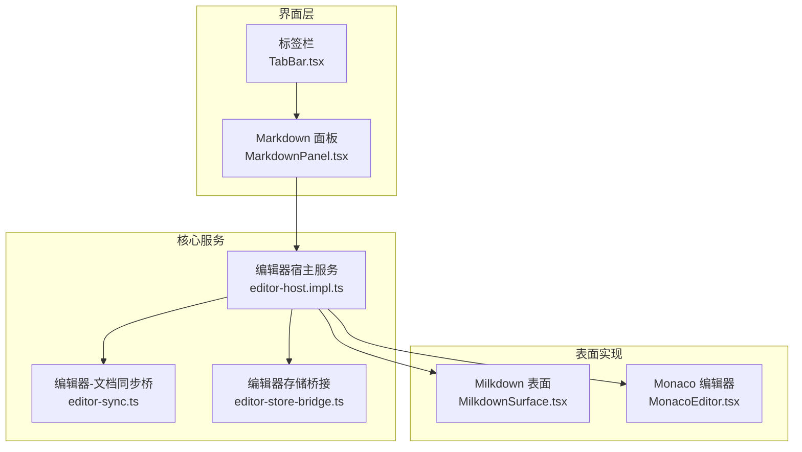
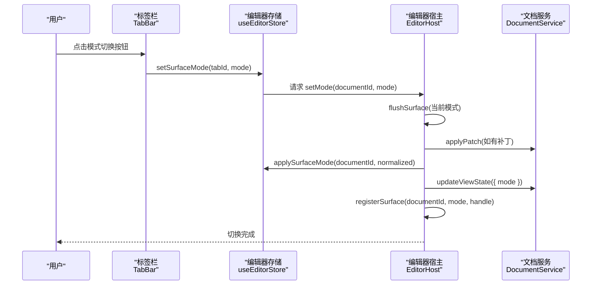
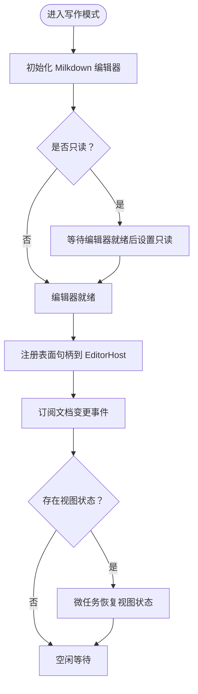
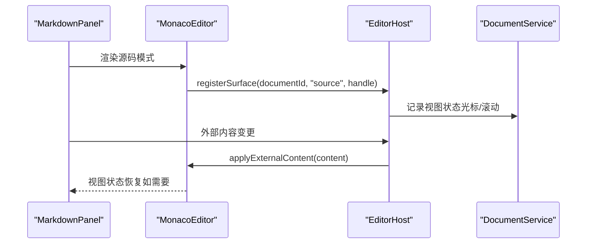
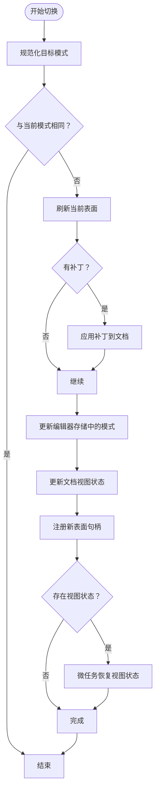
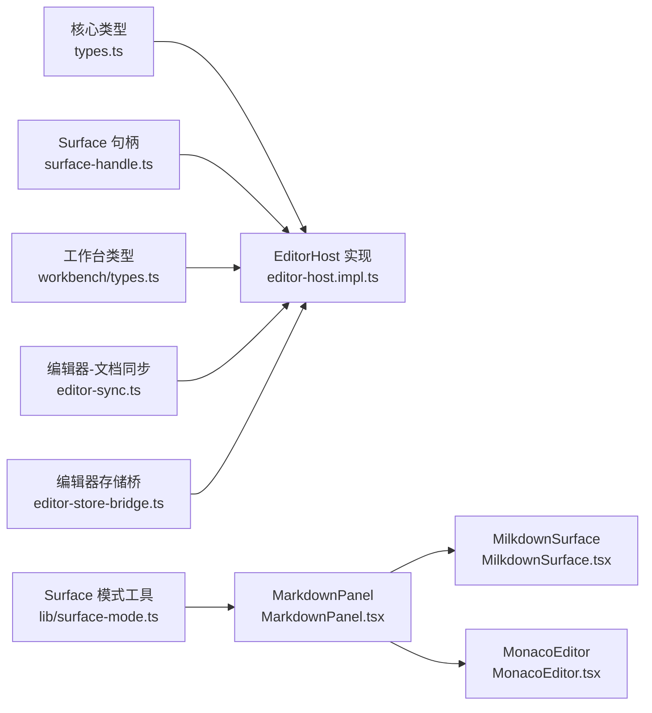

# 编辑器模式系统

<cite>
**本文引用的文件**
- [src/components/editor/TabBar.tsx](file://src/components/editor/TabBar.tsx)
- [src/features/markdown/MarkdownPanel.tsx](file://src/features/markdown/MarkdownPanel.tsx)
- [src/features/markdown/MilkdownSurface.tsx](file://src/features/markdown/MilkdownSurface.tsx)
- [src/components/editor/MonacoEditor.tsx](file://src/components/editor/MonacoEditor.tsx)
- [src/core/editor/types.ts](file://src/core/editor/types.ts)
- [src/core/editor/surface-handle.ts](file://src/core/editor/surface-handle.ts)
- [src/core/editor/editor-host.impl.ts](file://src/core/editor/editor-host.impl.ts)
- [src/core/bridge/editor-sync.ts](file://src/core/bridge/editor-sync.ts)
- [src/core/bridge/editor-store-bridge.ts](file://src/core/bridge/editor-store-bridge.ts)
- [src/lib/surface-mode.ts](file://src/lib/surface-mode.ts)
- [src/core/document/types.ts](file://src/core/document/types.ts)
- [src/core/workbench/types.ts](file://src/core/workbench/types.ts)
- [src/store/editor.ts](file://src/store/editor.ts)
</cite>

## 目录
1. [简介](#简介)
2. [项目结构](#项目结构)
3. [核心组件](#核心组件)
4. [架构总览](#架构总览)
5. [详细组件分析](#详细组件分析)
6. [依赖关系分析](#依赖关系分析)
7. [性能考量](#性能考量)
8. [故障排查指南](#故障排查指南)
9. [结论](#结论)
10. [附录](#附录)

## 简介
本文件系统性阐述 NoteForge 的编辑器模式体系，覆盖三种核心模式：写作模式（实时预览）、阅读模式（纯净显示）、源码模式（原始文本）。文档从架构设计、数据流、处理逻辑、集成点与错误处理等方面进行深入解析，并给出模式切换机制、编辑器表面（Surface）设计理念、自定义模式开发方法及最佳实践建议。

## 项目结构
编辑器模式系统围绕“编辑器宿主服务（EditorHost）—表面适配器（Surface）—UI 面板”的分层组织展开。Markdown 内容通过 Milkdown 表面提供所见即所得（WYSIWYG）编辑体验；源码模式由 Monaco 提供语法高亮与编辑能力；阅读模式复用写作表面但以只读方式呈现。模式切换由 EditorHost 统一调度，确保内容与视图状态在切换时正确持久化。

图表来源
- [src/components/editor/TabBar.tsx:231-260](file://src/components/editor/TabBar.tsx#L231-L260)
- [src/features/markdown/MarkdownPanel.tsx:1-59](file://src/features/markdown/MarkdownPanel.tsx#L1-L59)
- [src/features/markdown/MilkdownSurface.tsx:173-183](file://src/features/markdown/MilkdownSurface.tsx#L173-L183)
- [src/components/editor/MonacoEditor.tsx:302-325](file://src/components/editor/MonacoEditor.tsx#L302-L325)
- [src/core/editor/editor-host.impl.ts:1-110](file://src/core/editor/editor-host.impl.ts#L1-L110)
- [src/core/bridge/editor-sync.ts:146-151](file://src/core/bridge/editor-sync.ts#L146-L151)
- [src/core/bridge/editor-store-bridge.ts:1-27](file://src/core/bridge/editor-store-bridge.ts#L1-L27)

章节来源
- [src/components/editor/TabBar.tsx:231-260](file://src/components/editor/TabBar.tsx#L231-L260)
- [src/features/markdown/MarkdownPanel.tsx:1-59](file://src/features/markdown/MarkdownPanel.tsx#L1-L59)
- [src/core/editor/editor-host.impl.ts:1-110](file://src/core/editor/editor-host.impl.ts#L1-L110)

## 核心组件
- 模式枚举与契约
  - 模式类型：写作为默认模式，阅读模式为只读的写作模式，源码模式为 Monaco 原始编辑。
  - 表面契约：统一的挂载/卸载、刷新补丁、应用外部内容、视图状态捕获/恢复等接口。
- 编辑器宿主服务
  - 负责模式切换协议执行、表面注册与注销、视图状态持久化、外部内容应用。
- 表面句柄
  - 运行时绑定对象，承载各表面的交互能力（聚焦、跳转到行、刷新、应用外部内容、捕获/恢复视图状态）。
- UI 面板
  - MarkdownPanel 根据当前模式选择 Milkdown 或 Monaco；TabBar 提供模式切换按钮。
- 同步与桥接
  - editor-sync 将文档视图状态（含模式）写回文档；editor-store-bridge 为宿主服务提供最小化的编辑器存储访问，避免循环依赖。

章节来源
- [src/core/editor/types.ts:1-65](file://src/core/editor/types.ts#L1-L65)
- [src/core/editor/surface-handle.ts:1-26](file://src/core/editor/surface-handle.ts#L1-L26)
- [src/core/editor/editor-host.impl.ts:1-110](file://src/core/editor/editor-host.impl.ts#L1-L110)
- [src/core/bridge/editor-sync.ts:146-151](file://src/core/bridge/editor-sync.ts#L146-L151)
- [src/core/bridge/editor-store-bridge.ts:1-27](file://src/core/bridge/editor-store-bridge.ts#L1-L27)

## 架构总览
下图展示模式切换的关键流程：用户点击切换 → 宿主服务执行切换协议 → 刷新当前表面 → 应用模式到文档视图状态 → 注册新表面并恢复视图状态。

图表来源
- [src/components/editor/TabBar.tsx:231-260](file://src/components/editor/TabBar.tsx#L231-L260)
- [src/store/editor.ts:600-610](file://src/store/editor.ts#L600-L610)
- [src/core/editor/editor-host.impl.ts:41-53](file://src/core/editor/editor-host.impl.ts#L41-L53)
- [src/core/bridge/editor-sync.ts:146-151](file://src/core/bridge/editor-sync.ts#L146-L151)

## 详细组件分析

### 写作模式（实时预览）
- 技术实现
  - 使用 Milkdown Crepe 提供所见即所得编辑体验，支持插件扩展（如 Wiki 链接、光标状态插件）。
  - 通过 Provider 包裹，按标签页键隔离实例，保证多标签独立状态。
  - 只读状态通过延时轮询直到编辑器就绪后设置，确保一致性。
- 渲染与样式
  - 表面容器根据主题切换根节点类名，内部通过 CSS 类控制只读态样式。
- 交互行为
  - 支持导航同步（跳转到标题）、外部内容更新（文件变更或撤销）、视图状态捕获/恢复。
- 性能要点
  - 使用微任务队列恢复视图状态，避免阻塞主线程。
  - 切换前刷新补丁，减少内容不一致风险。

图表来源
- [src/features/markdown/MilkdownSurface.tsx:1-183](file://src/features/markdown/MilkdownSurface.tsx#L1-L183)

章节来源
- [src/features/markdown/MilkdownSurface.tsx:1-183](file://src/features/markdown/MilkdownSurface.tsx#L1-L183)

### 阅读模式（纯净显示）
- 设计理念
  - 复用写作表面，仅启用只读模式，不引入额外预览栈，降低复杂度与资源占用。
- 实现细节
  - 通过 isReadOnlySurface 判断是否只读，传入 readOnly 属性给 MilkdownSurface。
  - 表面容器在只读状态下添加特定属性与类名，便于样式区分。
- 适用场景
  - 需要专注阅读、不希望编辑干扰的场景；适合长文阅读与知识回顾。

章节来源
- [src/lib/surface-mode.ts:24-26](file://src/lib/surface-mode.ts#L24-L26)
- [src/features/markdown/MarkdownPanel.tsx:22-24](file://src/features/markdown/MarkdownPanel.tsx#L22-L24)
- [src/features/markdown/MilkdownSurface.tsx:163-171](file://src/features/markdown/MilkdownSurface.tsx#L163-L171)

### 源码模式（原始文本）
- 技术实现
  - 使用 Monaco 编辑器提供 Markdown 源码编辑体验，包含语法高亮、滚动位置与光标位置的视图状态管理。
  - 表面句柄暴露 flush、revealLine、applyExternalContent、focus、captureViewState、restoreViewState 等能力。
- 渲染与样式
  - 通过容器类名与主题联动，确保在不同主题下具备一致的视觉表现。
- 交互行为
  - 支持外部内容更新、视图状态恢复、行定位跳转等。
- 适用场景
  - 需要精确控制 Markdown 结构、进行批量编辑或与工具链协作的场景。

图表来源
- [src/features/markdown/MarkdownPanel.tsx:42-59](file://src/features/markdown/MarkdownPanel.tsx#L42-L59)
- [src/components/editor/MonacoEditor.tsx:302-325](file://src/components/editor/MonacoEditor.tsx#L302-L325)
- [src/core/editor/editor-host.impl.ts:55-74](file://src/core/editor/editor-host.impl.ts#L55-L74)

章节来源
- [src/features/markdown/MarkdownPanel.tsx:42-59](file://src/features/markdown/MarkdownPanel.tsx#L42-L59)
- [src/components/editor/MonacoEditor.tsx:302-325](file://src/components/editor/MonacoEditor.tsx#L302-L325)

### 模式切换机制
- 协议与步骤
  - 切换协议由 EditorHost 强制执行：刷新当前表面 → 应用补丁到文档 → 更新存储中的模式 → 更新文档视图状态 → 注册新表面 → 恢复视图状态。
- 状态保持
  - 视图状态（光标、滚动）通过捕获/恢复机制在切换前后保持一致。
- 布局调整
  - MarkdownPanel 根据当前模式动态选择 Milkdown 或 Monaco，实现无额外布局开销的无缝切换。
- 性能优化
  - flush 在切换前执行，避免未提交的编辑丢失；微任务恢复视图状态，减少主线程压力。

图表来源
- [src/core/editor/editor-host.impl.ts:41-53](file://src/core/editor/editor-host.impl.ts#L41-L53)
- [src/core/editor/editor-host.impl.ts:55-74](file://src/core/editor/editor-host.impl.ts#L55-L74)
- [src/core/bridge/editor-sync.ts:146-151](file://src/core/bridge/editor-sync.ts#L146-L151)

章节来源
- [src/core/editor/editor-host.impl.ts:41-53](file://src/core/editor/editor-host.impl.ts#L41-L53)
- [src/core/editor/editor-host.impl.ts:55-74](file://src/core/editor/editor-host.impl.ts#L55-L74)
- [src/core/bridge/editor-sync.ts:146-151](file://src/core/bridge/editor-sync.ts#L146-L151)

### 编辑器表面（Surface）设计理念
- 可扩展性
  - 统一的 Adapter/Surface 接口允许新增表面类型（如未来可能的可视化图编辑器），无需改动宿主协议。
- 模块化
  - 表面职责清晰：仅负责渲染与交互，内容所有权归属文档服务，遵循 ADR-005。
- 主题支持
  - 表面容器随主题切换根类名，内部样式通过 CSS 类控制，确保跨主题一致性。
- 视图状态管理
  - 所有表面均实现视图状态的捕获与恢复，保障切换体验连贯。

章节来源
- [src/core/editor/types.ts:1-65](file://src/core/editor/types.ts#L1-L65)
- [src/features/markdown/MilkdownSurface.tsx:173-183](file://src/features/markdown/MilkdownSurface.tsx#L173-L183)

### 自定义模式的开发方法
- 插件接口
  - 实现 EditorSurfaceAdapter 或注册 LiveSurfaceHandle 至 EditorHost，提供 mount/unmount/flush/applyExternalContent 等能力。
- 配置选项
  - 通过 EditorSurfaceProps 的 mode 字段传递模式信息；必要时扩展属性以支持特定模式的配置。
- 扩展机制
  - 在 MarkdownPanel 中增加条件分支，根据新的模式类型返回对应的表面组件。
  - 在 surface-mode 工具中增加模式标签与只读判断逻辑，确保 UI 与行为一致。

章节来源
- [src/core/editor/types.ts:31-38](file://src/core/editor/types.ts#L31-L38)
- [src/features/markdown/MarkdownPanel.tsx:1-59](file://src/features/markdown/MarkdownPanel.tsx#L1-L59)
- [src/lib/surface-mode.ts:1-26](file://src/lib/surface-mode.ts#L1-L26)

## 依赖关系分析
- 模块耦合
  - EditorHost 依赖 DocumentService 与编辑器存储桥接，确保内容与模式状态的一致性。
  - MarkdownPanel 与 Surface 层解耦，仅依赖模式解析与只读判断。
- 外部依赖
  - Milkdown 提供 WYSIWYG 编辑体验；Monaco 提供源码编辑体验。
- 循环依赖规避
  - editor-store-bridge 以函数访问器形式提供最小化访问，避免运行时与存储之间的循环依赖。

图表来源
- [src/core/editor/types.ts:1-65](file://src/core/editor/types.ts#L1-L65)
- [src/core/editor/surface-handle.ts:1-26](file://src/core/editor/surface-handle.ts#L1-L26)
- [src/core/workbench/types.ts:69-75](file://src/core/workbench/types.ts#L69-L75)
- [src/lib/surface-mode.ts:1-26](file://src/lib/surface-mode.ts#L1-L26)
- [src/features/markdown/MarkdownPanel.tsx:1-59](file://src/features/markdown/MarkdownPanel.tsx#L1-L59)
- [src/features/markdown/MilkdownSurface.tsx:1-183](file://src/features/markdown/MilkdownSurface.tsx#L1-L183)
- [src/components/editor/MonacoEditor.tsx:302-325](file://src/components/editor/MonacoEditor.tsx#L302-L325)
- [src/core/bridge/editor-sync.ts:146-151](file://src/core/bridge/editor-sync.ts#L146-L151)
- [src/core/bridge/editor-store-bridge.ts:1-27](file://src/core/bridge/editor-store-bridge.ts#L1-L27)

章节来源
- [src/core/editor/types.ts:1-65](file://src/core/editor/types.ts#L1-L65)
- [src/core/editor/surface-handle.ts:1-26](file://src/core/editor/surface-handle.ts#L1-L26)
- [src/core/editor/editor-host.impl.ts:1-110](file://src/core/editor/editor-host.impl.ts#L1-L110)
- [src/features/markdown/MarkdownPanel.tsx:1-59](file://src/features/markdown/MarkdownPanel.tsx#L1-L59)

## 性能考量
- 切换路径优化
  - 切换前 flush，避免未提交编辑造成的数据不一致与重绘成本。
- 视图状态恢复
  - 使用微任务恢复视图状态，降低对首帧渲染的影响。
- 表面注册与注销
  - 注销时清理映射，防止内存泄漏与悬挂引用。
- 主题与样式
  - 表面容器类名切换与 CSS 控制，避免重复渲染与样式抖动。

## 故障排查指南
- 模式切换无效
  - 检查是否已注册表面句柄；确认 EditorHost 的 setMode 是否被调用且未提前返回。
  - 确认文档视图状态更新是否成功。
- 切换后视图错乱
  - 确认 surface.handle.restoreViewState 是否在微任务中执行；检查捕获/恢复的 cursor 与 scroll 是否完整。
- 只读模式仍可编辑
  - 检查 MilkdownSurface 的只读设置是否在编辑器就绪后生效；确认轮询逻辑是否正常。
- 外部内容未更新
  - 确认 EditorHost.applyExternalContent 是否被调用；检查文档变更事件订阅是否有效。

章节来源
- [src/core/editor/editor-host.impl.ts:55-74](file://src/core/editor/editor-host.impl.ts#L55-L74)
- [src/features/markdown/MilkdownSurface.tsx:147-161](file://src/features/markdown/MilkdownSurface.tsx#L147-L161)

## 结论
NoteForge 的编辑器模式系统以统一的表面契约与宿主服务为核心，实现了写作、阅读与源码三种模式的高效切换与状态保持。通过严格的协议约束与视图状态管理，系统在可扩展性、模块化与用户体验之间取得平衡。未来可通过扩展 Surface 接口与 MarkdownPanel 分支，平滑接入新的编辑形态。

## 附录
- 使用场景与最佳实践
  - 写作模式：日常创作、快速迭代；建议开启自动保存与草稿归档。
  - 阅读模式：长文阅读、知识回顾；建议关闭自动保存，避免误触修改。
  - 源码模式：结构化编辑、批量操作、与工具链协作；建议启用语法高亮与行号显示。
- 关键类型与职责
  - EditorSurfaceMode：模式枚举（write/source/read）。
  - EditorSurfaceAdapter/LiveSurfaceHandle：表面契约与运行时句柄。
  - EditorHostService：模式切换与表面生命周期管理。
  - surface-mode 工具：模式解析、标签与只读判断。

章节来源
- [src/core/document/types.ts:6-30](file://src/core/document/types.ts#L6-L30)
- [src/core/editor/types.ts:1-65](file://src/core/editor/types.ts#L1-L65)
- [src/lib/surface-mode.ts:1-26](file://src/lib/surface-mode.ts#L1-L26)
- [src/core/workbench/types.ts:69-75](file://src/core/workbench/types.ts#L69-L75)