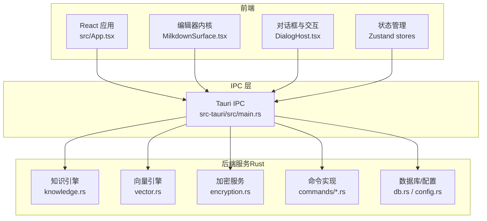
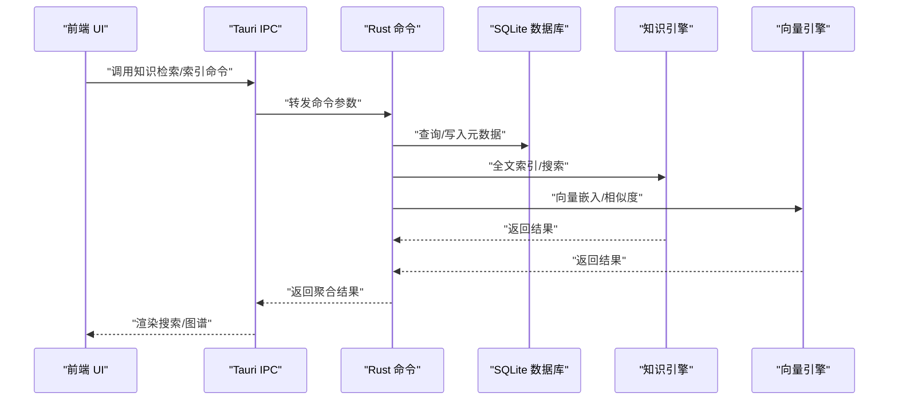
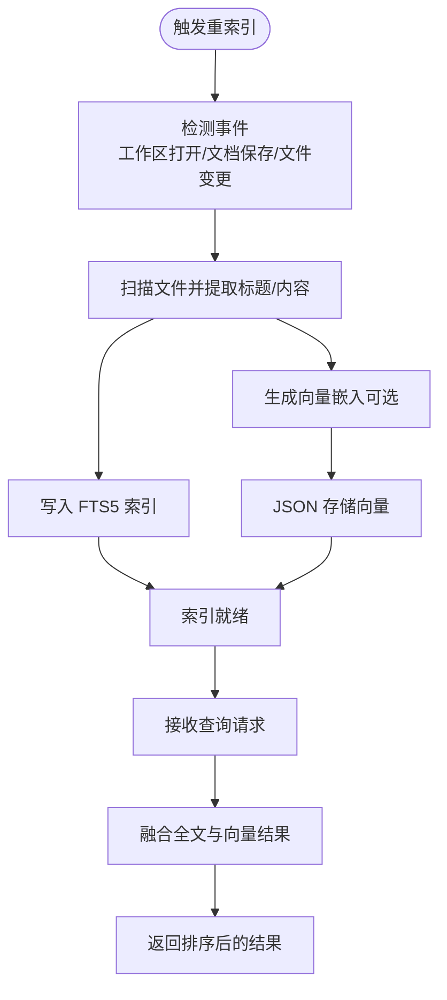
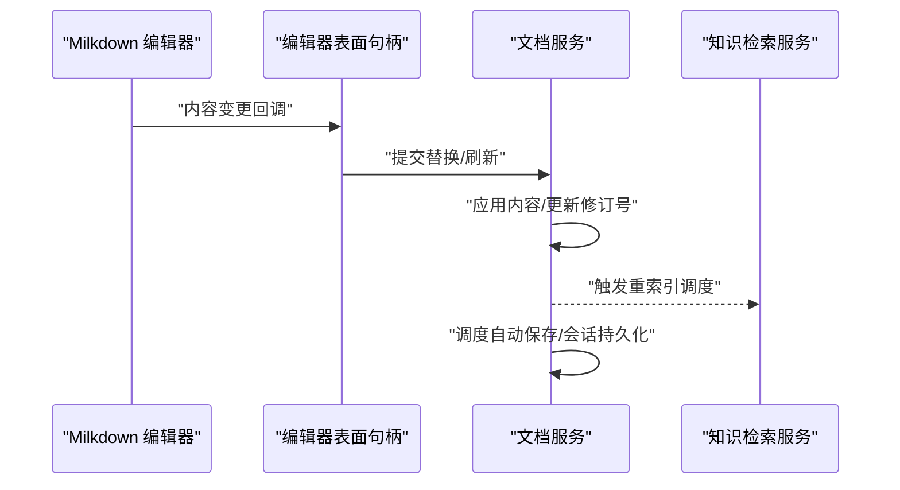
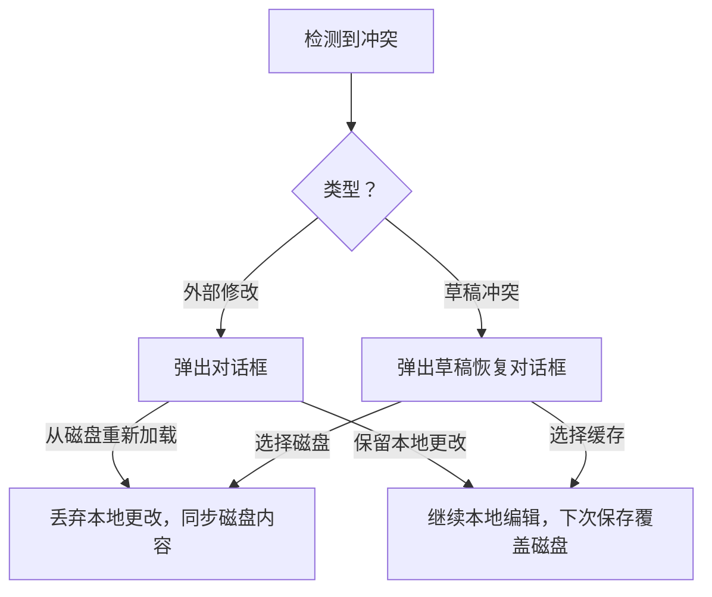
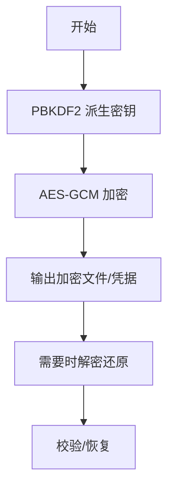
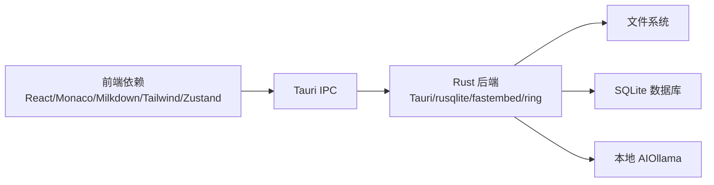

# 项目介绍

<cite>
**本文引用的文件**
- [README.md](file://README.md)
- [package.json](file://package.json)
- [src/main.tsx](file://src/main.tsx)
- [src/App.tsx](file://src/App.tsx)
- [src/core/runtime.ts](file://src/core/runtime.ts)
- [src-tauri/src/main.rs](file://src-tauri/src/main.rs)
- [src-tauri/src/lib.rs](file://src-tauri/src/lib.rs)
- [src-tauri/src/knowledge.rs](file://src-tauri/src/knowledge.rs)
- [src-tauri/src/vector.rs](file://src-tauri/src/vector.rs)
- [src-tauri/src/encryption.rs](file://src-tauri/src/encryption.rs)
- [src-tauri/src/commands/encryption.rs](file://src-tauri/src/commands/encryption.rs)
- [src/core/knowledge/knowledge-query.impl.ts](file://src/core/knowledge/knowledge-query.impl.ts)
- [src/features/markdown/MilkdownSurface.tsx](file://src/features/markdown/MilkdownSurface.tsx)
- [src/components/dialogs/DialogHost.tsx](file://src/components/dialogs/DialogHost.tsx)
- [src/core/dialog/draft-prompt.ts](file://src/core/dialog/draft-prompt.ts)
- [src-tauri/tests/dataflow_tests.rs](file://src-tauri/tests/dataflow_tests.rs)
- [src-tauri/tests/ipc_contract_tests.rs](file://src-tauri/tests/ipc_contract_tests.rs)
- [.tmp/noteforgeChat.md](file://.tmp/noteforgeChat.md)
</cite>

## 目录
1. [简介](#简介)
2. [项目结构](#项目结构)
3. [核心组件](#核心组件)
4. [架构总览](#架构总览)
5. [详细组件分析](#详细组件分析)
6. [依赖关系分析](#依赖关系分析)
7. [性能考量](#性能考量)
8. [故障排查指南](#故障排查指南)
9. [结论](#结论)
10. [附录](#附录)

## 简介
NoteForge 是一款“本地优先”的技术知识工作站，将编辑器与知识库深度融合，强调本地数据主权与离线可用性，并原生集成 AI 协作者能力。它面向对隐私与效率有高要求的研究人员、作家、开发者与知识工作者，提供从创作、索引、检索到智能增强的一体化体验。

- 本地优先：所有数据与处理均在本地完成，支持离线工作，保障隐私与可控性。
- 编辑器与知识库融合：以强大的 Markdown 编辑内核为核心，文档即知识单元，实时索引与检索无缝衔接。
- 本地 AI：通过本地 Ollama 提供推理与生成能力，避免云端传输敏感数据。
- 多层持久化：采用“草稿层/会话层”设计，确保编辑过程中的安全与恢复能力。
- 可扩展后端：Rust 实现的高性能后端，提供文件系统操作、全文/向量检索、加密备份、AI 服务桥接等能力。

## 项目结构
项目采用前后端分离但紧密协作的桌面应用架构：
- 前端（React + TypeScript）：负责 UI、编辑器、对话框、状态管理与 IPC 调用。
- 后端（Rust + Tauri v2）：提供命令接口、数据库、文件监控、知识引擎与加密服务。
- 设计与文档：位于 docs/design，沉淀产品设计理念与交互规范。

图表来源
- [src/App.tsx:1-111](file://src/App.tsx#L1-L111)
- [src-tauri/src/main.rs:1-101](file://src-tauri/src/main.rs#L1-L101)
- [src-tauri/src/knowledge.rs:1-75](file://src-tauri/src/knowledge.rs#L1-L75)
- [src-tauri/src/vector.rs:1-151](file://src-tauri/src/vector.rs#L1-L151)
- [src-tauri/src/encryption.rs:1-126](file://src-tauri/src/encryption.rs#L1-L126)

章节来源
- [README.md:75-112](file://README.md#L75-L112)
- [package.json:1-70](file://package.json#L1-L70)

## 核心组件
- 应用入口与生命周期
  - 前端入口初始化主题、编辑器设置、核心运行时与启动流程。
  - 应用主容器组织顶部栏、侧边栏、编辑区、右侧面板与状态栏。
- 核心运行时（Core Runtime）
  - 统一事件总线、文档服务、工作区会话、命令注册、对话框服务、知识检索与编辑器宿主。
  - 自动触发知识库重索引，监听文档变更并调度自动保存。
- 知识引擎
  - 基于 SQLite FTS5 的全文检索，支持中文分词；同时提供向量检索（JSON 存储 + 内存余弦相似度），未来可平滑迁移到 sqlite-vec。
- 加密与备份
  - 基于 PBKDF2 + AES-GCM 的密钥派生与加解密，支持工作区加密备份与 API Key 安全存储。
- 编辑器内核
  - 基于 Milkdown 的富文本编辑体验，支持只读模式、滚动状态捕获/恢复、外部内容同步与插件扩展。
- 对话框与冲突处理
  - 针对外部修改与草稿冲突提供可视化决策流程，保证用户对内容控制权。

章节来源
- [src/main.tsx:1-24](file://src/main.tsx#L1-L24)
- [src/App.tsx:25-111](file://src/App.tsx#L25-L111)
- [src/core/runtime.ts:29-107](file://src/core/runtime.ts#L29-L107)
- [src-tauri/src/knowledge.rs:25-46](file://src-tauri/src/knowledge.rs#L25-L46)
- [src-tauri/src/vector.rs:30-118](file://src-tauri/src/vector.rs#L30-L118)
- [src-tauri/src/encryption.rs:24-84](file://src-tauri/src/encryption.rs#L24-L84)
- [src/features/markdown/MilkdownSurface.tsx:23-125](file://src/features/markdown/MilkdownSurface.tsx#L23-L125)
- [src/components/dialogs/DialogHost.tsx:337-379](file://src/components/dialogs/DialogHost.tsx#L337-L379)

## 架构总览
NoteForge 采用“前端 UI + IPC + Rust 后端”的桌面应用架构，核心流程如下：
- 前端通过 Tauri IPC 调用后端命令，后端在本地执行文件系统操作、数据库查询、知识索引与 AI 推理。
- 文档内容经由编辑器内核写入文档服务，文档服务再驱动知识引擎进行索引与检索。
- 知识检索包含全文检索与向量检索两条路径，满足不同场景下的相关性需求。

图表来源
- [src-tauri/src/main.rs:19-97](file://src-tauri/src/main.rs#L19-L97)
- [src-tauri/src/knowledge.rs:25-46](file://src-tauri/src/knowledge.rs#L25-L46)
- [src-tauri/src/vector.rs:57-118](file://src-tauri/src/vector.rs#L57-L118)

## 详细组件分析

### 知识检索与索引流程
- 知识检索服务负责全文与语义检索的统一入口，并在工作区打开、文档保存、文件增删改等事件后自动触发重索引。
- 全文检索基于 SQLite FTS5，标题、内容与路径均可被索引；向量检索当前以 JSON 存储嵌入并在内存中计算相似度，具备良好的可扩展性。

图表来源
- [src/core/knowledge/knowledge-query.impl.ts:136-177](file://src/core/knowledge/knowledge-query.impl.ts#L136-L177)
- [src-tauri/src/knowledge.rs:48-74](file://src-tauri/src/knowledge.rs#L48-L74)
- [src-tauri/src/vector.rs:30-118](file://src-tauri/src/vector.rs#L30-L118)

章节来源
- [src/core/knowledge/knowledge-query.impl.ts:132-177](file://src/core/knowledge/knowledge-query.impl.ts#L132-L177)
- [src-tauri/src/knowledge.rs:9-75](file://src-tauri/src/knowledge.rs#L9-L75)
- [src-tauri/src/vector.rs:12-128](file://src-tauri/src/vector.rs#L12-L128)

### 编辑器与文档服务
- 编辑器内核通过 Milkdown 提供 Markdown 写作体验，支持只读切换、滚动状态保持与外部内容同步。
- 文档服务负责内容应用、修订号管理、草稿与磁盘内容冲突处理，并在保存时调度自动保存与会话持久化。

图表来源
- [src/features/markdown/MilkdownSurface.tsx:49-125](file://src/features/markdown/MilkdownSurface.tsx#L49-L125)
- [src/core/runtime.ts:48-96](file://src/core/runtime.ts#L48-L96)

章节来源
- [src/features/markdown/MilkdownSurface.tsx:23-184](file://src/features/markdown/MilkdownSurface.tsx#L23-L184)
- [src/core/runtime.ts:43-107](file://src/core/runtime.ts#L43-L107)

### 冲突处理与草稿恢复
- 当检测到外部修改或草稿冲突时，弹出对话框让用户选择“从磁盘重新加载”或“保留本地更改”，并据此决定后续内容同步策略。

图表来源
- [src/components/dialogs/DialogHost.tsx:337-379](file://src/components/dialogs/DialogHost.tsx#L337-L379)
- [src/core/dialog/draft-prompt.ts:10-40](file://src/core/dialog/draft-prompt.ts#L10-L40)

章节来源
- [src/components/dialogs/DialogHost.tsx:337-379](file://src/components/dialogs/DialogHost.tsx#L337-L379)
- [src/core/dialog/draft-prompt.ts:1-40](file://src/core/dialog/draft-prompt.ts#L1-L40)

### 加密与备份
- 通过 PBKDF2 派生密钥，使用 AES-GCM 对备份与敏感凭据进行加解密，保障数据安全。
- 支持工作区加密打包与解包，便于安全传输与归档。

图表来源
- [src-tauri/src/encryption.rs:24-84](file://src-tauri/src/encryption.rs#L24-L84)
- [src-tauri/src/commands/encryption.rs:11-63](file://src-tauri/src/commands/encryption.rs#L11-L63)

章节来源
- [src-tauri/src/encryption.rs:1-126](file://src-tauri/src/encryption.rs#L1-L126)
- [src-tauri/src/commands/encryption.rs:1-63](file://src-tauri/src/commands/encryption.rs#L1-L63)

## 依赖关系分析
- 前端依赖
  - React、Monaco Editor、Milkdown、Radix UI、Tailwind CSS、Zustand 等，构成现代化 UI 与编辑体验。
- 后端依赖
  - Tauri v2、rusqlite、notify、fastembed、ring、aes-gcm 等，支撑桌面端能力与本地处理。
- IPC 命令清单（节选）
  - 工作区与文件操作、编辑器辅助、知识引擎、AI 服务、搜索过滤、加密、系统配置、草稿与会话持久化、文件监视等。

图表来源
- [package.json:17-48](file://package.json#L17-L48)
- [src-tauri/src/main.rs:19-97](file://src-tauri/src/main.rs#L19-L97)

章节来源
- [package.json:17-68](file://package.json#L17-L68)
- [src-tauri/src/main.rs:6-97](file://src-tauri/src/main.rs#L6-L97)

## 性能考量
- 索引与检索
  - 全文检索使用 SQLite FTS5，适合中小规模知识库；向量检索当前以 JSON + 内存计算实现，具备良好扩展性，待 sqlite-vec 稳定时可迁移。
- 编辑器渲染
  - 采用轻量的编辑器表面句柄与增量内容同步，减少不必要的重绘与回流。
- 自动保存与会话持久化
  - 通过调度器延迟批量保存，降低频繁 IO 对用户体验的影响。
- 加密开销
  - PBKDF2 与 AES-GCM 在现代 CPU 上开销可控，建议在后台任务中执行大文件加密/解密。

## 故障排查指南
- 外部修改冲突
  - 当检测到磁盘内容变更时，系统会弹窗提示选择策略；若误操作，可重新从磁盘加载或保留本地更改。
- 保存冲突与草稿恢复
  - 若出现草稿与磁盘内容不一致，可通过对话框选择恢复策略；必要时可取消并手动合并。
- 知识库索引异常
  - 如发现搜索结果缺失或延迟，检查是否触发了重索引；可在知识服务中手动触发重建索引。
- 加密与备份失败
  - 确认密码正确且文件权限允许；如遇错误，查看后端日志并重试。

章节来源
- [src/components/dialogs/DialogHost.tsx:337-379](file://src/components/dialogs/DialogHost.tsx#L337-L379)
- [src/core/dialog/draft-prompt.ts:23-40](file://src/core/dialog/draft-prompt.ts#L23-L40)
- [src/core/knowledge/knowledge-query.impl.ts:136-177](file://src/core/knowledge/knowledge-query.impl.ts#L136-L177)
- [src-tauri/src/commands/encryption.rs:11-63](file://src-tauri/src/commands/encryption.rs#L11-L63)

## 结论
NoteForge 将“本地优先”“编辑器与知识库深度融合”“本地 AI 协作”三大理念贯穿于架构与实现之中。通过 Rust 后端提供高性能、安全可靠的本地能力，前端以现代化编辑器与 UI 交付高效创作体验。对于重视隐私与效率的研究者、作家、开发者与知识工作者而言，NoteForge 提供了可扩展、可信赖的知识工作站范式。

## 附录
- 项目历史与演进
  - 项目在早期讨论中已明确“大文件、脏页、修改回退撤销”等优化方向，并结合现有草稿层/会话层架构提出可落地方案，体现持续迭代与工程化取舍的平衡。
- 相关文档与测试
  - 设计文档与交互规范沉淀于 docs/design；集成测试覆盖知识库加载、IPC 合约与加密备份等关键路径，保障核心流程稳定。

章节来源
- [.tmp/noteforgeChat.md:304-329](file://.tmp/noteforgeChat.md#L304-L329)
- [src-tauri/tests/dataflow_tests.rs:9-37](file://src-tauri/tests/dataflow_tests.rs#L9-L37)
- [src-tauri/tests/ipc_contract_tests.rs:123-164](file://src-tauri/tests/ipc_contract_tests.rs#L123-L164)