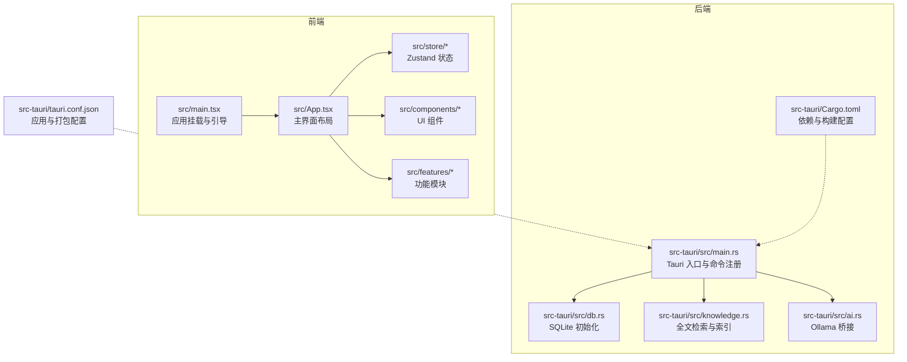
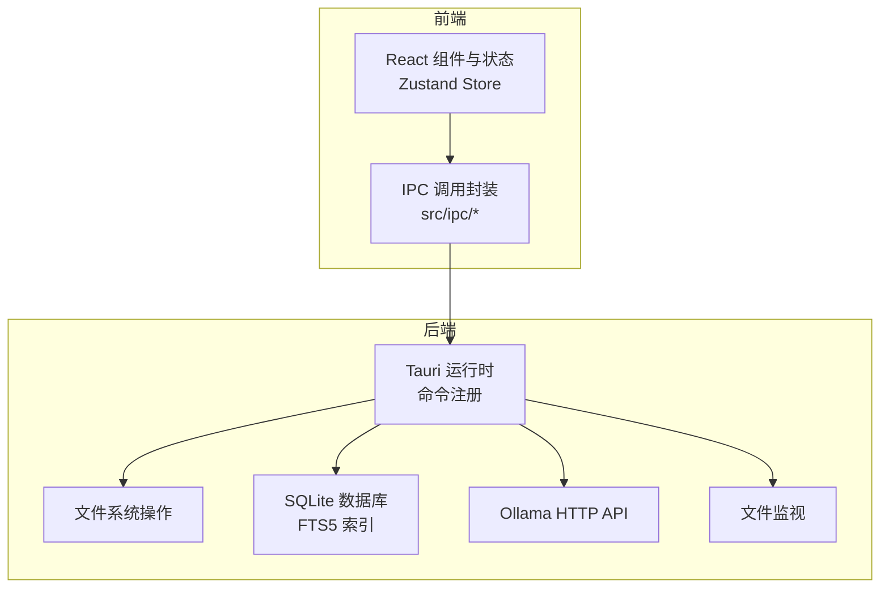
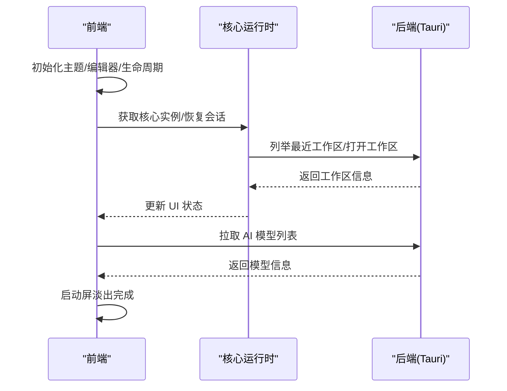
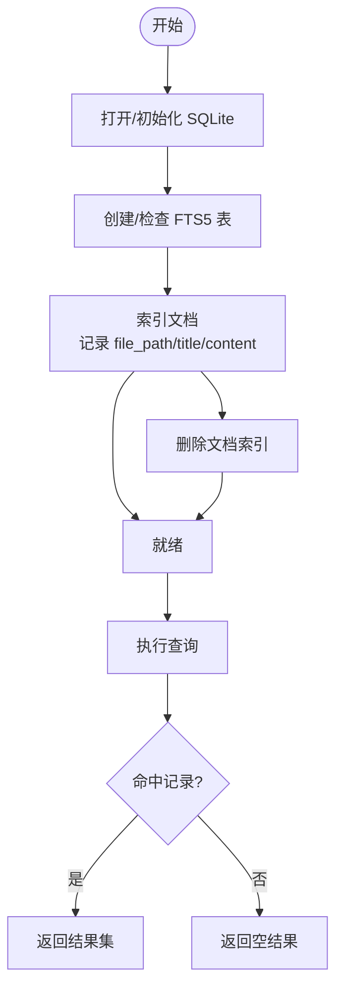
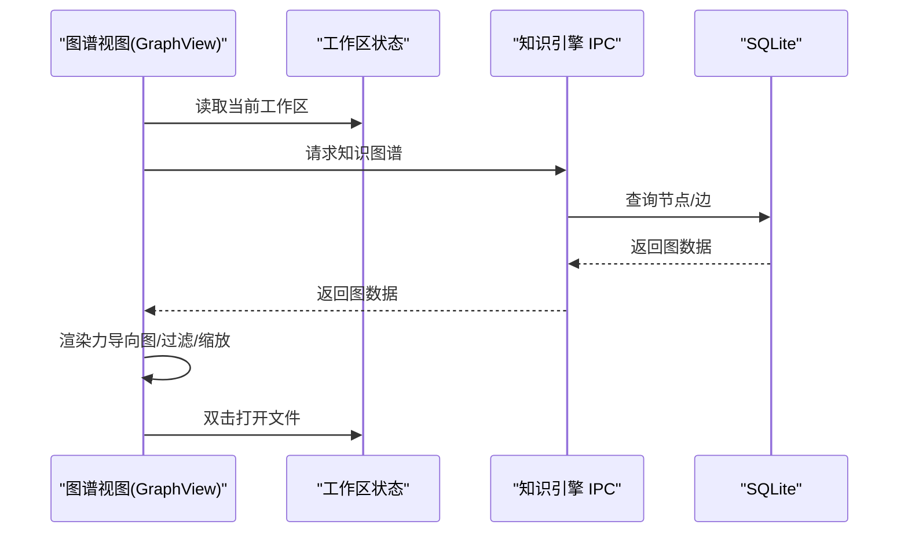
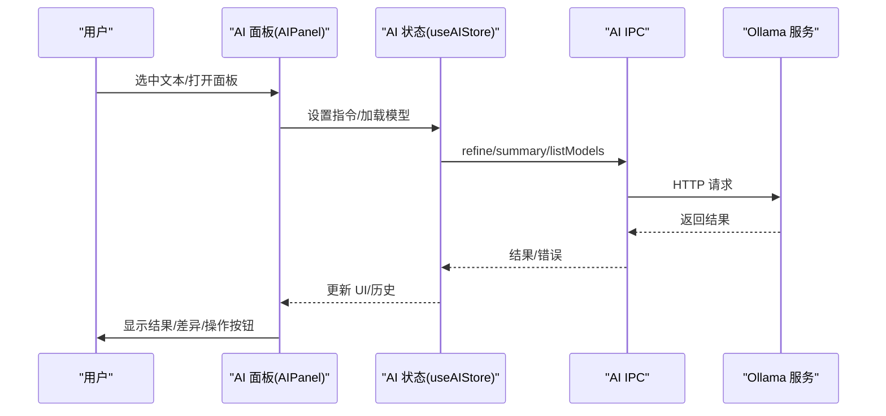
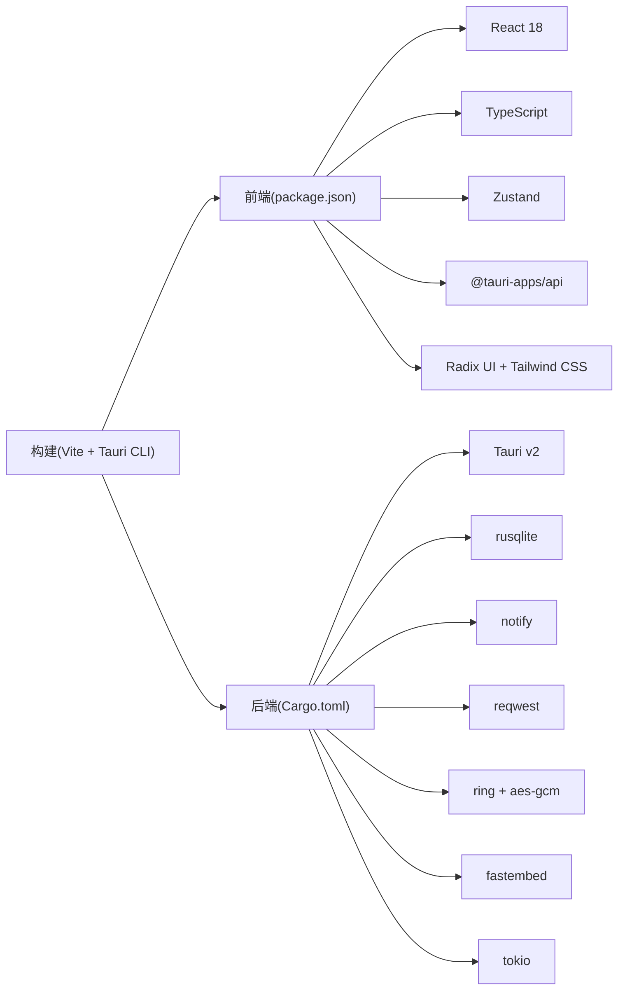

# 项目概述

<cite>
**本文引用的文件**
- [README.md](file://README.md)
- [package.json](file://package.json)
- [src-tauri/Cargo.toml](file://src-tauri/Cargo.toml)
- [src/main.tsx](file://src/main.tsx)
- [src/App.tsx](file://src/App.tsx)
- [src-tauri/src/main.rs](file://src-tauri/src/main.rs)
- [src-tauri/tauri.conf.json](file://src-tauri/tauri.conf.json)
- [src/core/runtime.ts](file://src/core/runtime.ts)
- [src/store/workspace.ts](file://src/store/workspace.ts)
- [src/features/graph/GraphView.tsx](file://src/features/graph/GraphView.tsx)
- [src-tauri/src/ai.rs](file://src-tauri/src/ai.rs)
- [src/features/ai/AIPanel.tsx](file://src/features/ai/AIPanel.tsx)
- [src/store/ai.ts](file://src/store/ai.ts)
- [src/lib/app-startup.ts](file://src/lib/app-startup.ts)
- [src-tauri/src/knowledge.rs](file://src-tauri/src/knowledge.rs)
</cite>

## 目录
1. [引言](#引言)
2. [项目结构](#项目结构)
3. [核心组件](#核心组件)
4. [架构总览](#架构总览)
5. [详细组件分析](#详细组件分析)
6. [依赖关系分析](#依赖关系分析)
7. [性能考量](#性能考量)
8. [故障排查指南](#故障排查指南)
9. [结论](#结论)
10. [附录](#附录)

## 引言
NoteForge 是一款“本地优先”的技术知识工作站，定位为编辑器与知识库深度融合、内置 AI 协作者的生产力工具。它面向两类用户：
- 人类知识工作者：需要在本地安全地组织、检索、可视化知识，并与编辑器无缝协作。
- AI 代理：具备知识图谱、语义检索与问答能力，支持与人类协同工作。

核心价值主张：
- 本地优先：数据驻留本地，隐私可控；支持文件系统直连与增量索引。
- 编辑器与知识库深度融合：所见即所得的 Markdown 编辑体验，同时提供全文检索、标签、反链、知识图谱等知识管理能力。
- 内置 AI 协作者：基于本地 Ollama 的轻量化 AI 能力，支持内容精炼、摘要生成、链接建议等。
- 可扩展的架构：Tauri + React + Rust 的组合，兼顾跨平台桌面体验与高性能后端处理。

## 项目结构
项目采用前后端分层与功能模块化的组织方式：
- 前端（React 18 + TypeScript + Zustand）：负责 UI、状态管理、编辑器与对话框。
- 后端（Rust + Tauri）：负责文件系统操作、数据库、知识引擎、向量与加密、AI 服务桥接。
- 配置与构建：Vite + Tauri CLI，统一开发与打包流程。

图表来源
- [src/main.tsx:1-24](file://src/main.tsx#L1-L24)
- [src/App.tsx:1-111](file://src/App.tsx#L1-L111)
- [src-tauri/src/main.rs:1-101](file://src-tauri/src/main.rs#L1-L101)
- [src-tauri/tauri.conf.json:1-40](file://src-tauri/tauri.conf.json#L1-L40)
- [src-tauri/Cargo.toml:1-40](file://src-tauri/Cargo.toml#L1-L40)

章节来源
- [README.md:75-112](file://README.md#L75-L112)
- [package.json:1-70](file://package.json#L1-L70)
- [src-tauri/Cargo.toml:1-40](file://src-tauri/Cargo.toml#L1-L40)

## 核心组件
- 应用引导与生命周期
  - 前端入口初始化主题、核心运行时、应用生命周期钩子与启动流程。
  - 后端入口初始化日志、插件、数据库与配置，并注册全部 IPC 命令。
- 核心运行时（Core Runtime）
  - 统一事件总线、文档服务、知识查询服务、工作台会话、命令注册、对话框服务与编辑器宿主。
- 状态管理
  - 前端使用 Zustand 管理工作区树、编辑器标签页、AI 面板、UI 状态等。
- 知识引擎
  - 基于 SQLite FTS5 的全文检索与索引；支持增量更新与删除。
- AI 协作者
  - 通过 Ollama HTTP API 提供内容精炼、摘要、标签与链接建议等能力。
- 图谱视图
  - 轻量力导图实现，支持节点过滤、缩放与双击打开文件。

章节来源
- [src/main.tsx:1-24](file://src/main.tsx#L1-L24)
- [src-tauri/src/main.rs:1-101](file://src-tauri/src/main.rs#L1-L101)
- [src/core/runtime.ts:1-186](file://src/core/runtime.ts#L1-L186)
- [src/store/workspace.ts:1-158](file://src/store/workspace.ts#L1-L158)
- [src-tauri/src/knowledge.rs:1-75](file://src-tauri/src/knowledge.rs#L1-L75)
- [src-tauri/src/ai.rs:1-205](file://src-tauri/src/ai.rs#L1-L205)
- [src/features/graph/GraphView.tsx:1-278](file://src/features/graph/GraphView.tsx#L1-L278)

## 架构总览
NoteForge 采用“前端 UI + 后端服务（Rust/Tauri）”的双层架构，IPC 通道连接前后端，实现文件系统、数据库、知识引擎与 AI 服务的本地化调用。

图表来源
- [src/App.tsx:1-111](file://src/App.tsx#L1-L111)
- [src-tauri/src/main.rs:19-97](file://src-tauri/src/main.rs#L19-L97)
- [src-tauri/src/knowledge.rs:1-75](file://src-tauri/src/knowledge.rs#L1-L75)
- [src-tauri/src/ai.rs:1-205](file://src-tauri/src/ai.rs#L1-L205)

## 详细组件分析

### 应用启动与会话恢复
- 前端启动顺序：主题加载 → 工作区选择 → 会话恢复 → AI 模型列表拉取 → 启动屏淡出。
- 后端初始化：数据库与配置初始化、临时缓冲与会话初始化。
- 退出前持久化：取消草稿自动保存、刷新自动保存、持久化工作台会话。

图表来源
- [src/lib/app-startup.ts:1-75](file://src/lib/app-startup.ts#L1-L75)
- [src/core/runtime.ts:113-186](file://src/core/runtime.ts#L113-L186)
- [src-tauri/src/main.rs:10-18](file://src-tauri/src/main.rs#L10-L18)

章节来源
- [src/lib/app-startup.ts:1-75](file://src/lib/app-startup.ts#L1-L75)
- [src/core/runtime.ts:113-186](file://src/core/runtime.ts#L113-L186)
- [src-tauri/src/main.rs:10-18](file://src-tauri/src/main.rs#L10-L18)

### 知识检索与索引（全文搜索）
- 索引策略：SQLite FTS5 + unicode61 分词器，中文场景结合 jieba-rs。
- 查询接口：支持关键词匹配、限制返回条数。
- 索引维护：新增/删除文档时同步更新 FTS 表。

图表来源
- [src-tauri/src/knowledge.rs:9-75](file://src-tauri/src/knowledge.rs#L9-L75)

章节来源
- [src-tauri/src/knowledge.rs:1-75](file://src-tauri/src/knowledge.rs#L1-L75)
- [README.md:134-135](file://README.md#L134-L135)

### 知识图谱构建与可视化
- 数据来源：双向链接（wikilink）解析、反链统计、标签提取。
- 可视化：轻量力导向图算法，支持节点过滤、缩放、双击打开文件。
- 交互：选中节点高亮邻接边，点击打开对应文档。

图表来源
- [src/features/graph/GraphView.tsx:81-278](file://src/features/graph/GraphView.tsx#L81-L278)
- [src/store/workspace.ts:38-85](file://src/store/workspace.ts#L38-L85)
- [src-tauri/src/knowledge.rs:25-46](file://src-tauri/src/knowledge.rs#L25-L46)

章节来源
- [src/features/graph/GraphView.tsx:1-278](file://src/features/graph/GraphView.tsx#L1-L278)
- [src/store/workspace.ts:1-158](file://src/store/workspace.ts#L1-L158)
- [src-tauri/src/knowledge.rs:1-75](file://src-tauri/src/knowledge.rs#L1-L75)

### 内置 AI 协作者（Ollama）
- 能力范围：内容精炼、摘要生成、标签建议、链接建议、问答。
- 模型发现：列举本地/云端模型并校验可用性。
- 用户交互：指令输入、快速动作、差异对比、替换编辑器选区。

图表来源
- [src/features/ai/AIPanel.tsx:42-282](file://src/features/ai/AIPanel.tsx#L42-L282)
- [src/store/ai.ts:1-111](file://src/store/ai.ts#L1-L111)
- [src-tauri/src/ai.rs:18-176](file://src-tauri/src/ai.rs#L18-L176)

章节来源
- [src/features/ai/AIPanel.tsx:1-282](file://src/features/ai/AIPanel.tsx#L1-L282)
- [src/store/ai.ts:1-111](file://src/store/ai.ts#L1-L111)
- [src-tauri/src/ai.rs:1-205](file://src-tauri/src/ai.rs#L1-L205)

### 工作区与文件树
- 工作区管理：列出/打开工作区、自动索引、树形展示。
- 文件操作：创建/重命名/删除、懒加载子节点、展开/折叠目录。
- 与知识引擎联动：开启自动索引时对工作区内容进行知识索引。

章节来源
- [src/store/workspace.ts:1-158](file://src/store/workspace.ts#L1-L158)
- [README.md:78-112](file://README.md#L78-L112)

## 依赖关系分析
- 前端依赖
  - React 18、TypeScript、Monaco Editor、Radix UI、Tailwind CSS、Zustand。
  - Tauri 插件（shell、dialog）用于系统级能力。
- 后端依赖
  - Tauri v2、rusqlite、notify、reqwest、ring/aes-gcm、fastembed、tokio。
- 构建与工具
  - Vite、Tauri CLI、ESLint、Prettier、PostCSS、Tailwind CSS。

图表来源
- [package.json:17-48](file://package.json#L17-L48)
- [src-tauri/Cargo.toml:7-32](file://src-tauri/Cargo.toml#L7-L32)

章节来源
- [package.json:1-70](file://package.json#L1-L70)
- [src-tauri/Cargo.toml:1-40](file://src-tauri/Cargo.toml#L1-L40)

## 性能考量
- 前端
  - 使用 Zustand 减少不必要的渲染；组件按需异步加载，降低首屏负担。
  - 图谱渲染采用轻量力导向算法，适合中小规模图（≤数百节点）。
- 后端
  - SQLite FTS5 提供高效的全文检索；索引采用增量更新策略。
  - 向量搜索当前降级为 JSON + 内存余弦相似度，待 sqlite-vec 就绪后迁移。
- AI 服务
  - 通过 Ollama HTTP API 异步请求，避免阻塞 UI；支持模型可用性检测与离线提示。
- 文件系统
  - 使用 notify 实时监听文件变化，减少轮询成本。

## 故障排查指南
- 启动失败
  - 检查 Node.js 与 pnpm 版本是否满足前置要求；确认 Rust 工具链与 Tauri CLI 安装。
- Ollama 连接问题
  - 确认本地 Ollama 服务可达；若无法连接，AI 面板将显示离线状态。
- 知识检索异常
  - 确认工作区已启用自动索引；如未索引，手动触发索引或检查文件权限。
- 图谱为空
  - 确保笔记间存在双向链接（wikilink）；编辑器中使用 [[文件名]] 创建链接后重新索引。
- 退出数据丢失
  - 确认应用在关闭前完成持久化；必要时手动保存并重启应用。

章节来源
- [README.md:24-31](file://README.md#L24-L31)
- [src-tauri/src/ai.rs:144-156](file://src-tauri/src/ai.rs#L144-L156)
- [src/features/graph/GraphView.tsx:181-190](file://src/features/graph/GraphView.tsx#L181-L190)
- [src/core/runtime.ts:169-177](file://src/core/runtime.ts#L169-L177)

## 结论
NoteForge 以“本地优先”为核心理念，通过 Tauri + React + Rust 的技术栈，实现了编辑器与知识库的深度融合，并内置轻量级 AI 协作者。其清晰的前后端职责划分、模块化的状态管理与可扩展的后端服务，既适合初学者快速上手，也为资深开发者提供了坚实的技术基座与灵活的扩展空间。

## 附录
- 快速开始与构建命令参见项目自述文件。
- 技术验证与环境要求详见 README 与 tauri.conf.json。

章节来源
- [README.md:32-73](file://README.md#L32-L73)
- [src-tauri/tauri.conf.json:1-40](file://src-tauri/tauri.conf.json#L1-L40)