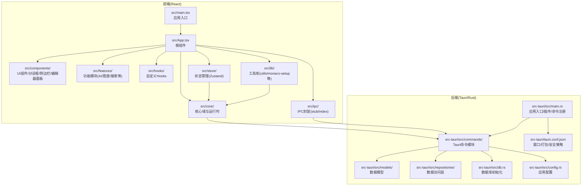
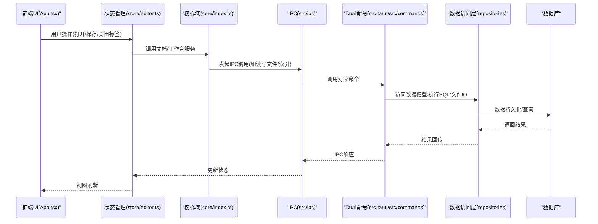
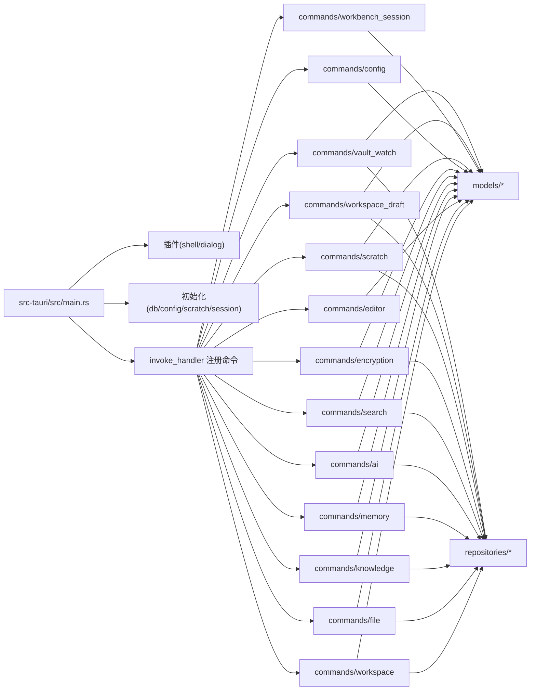
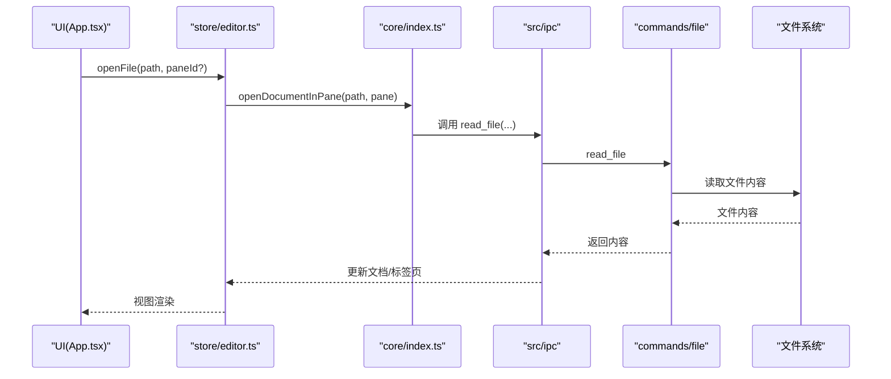
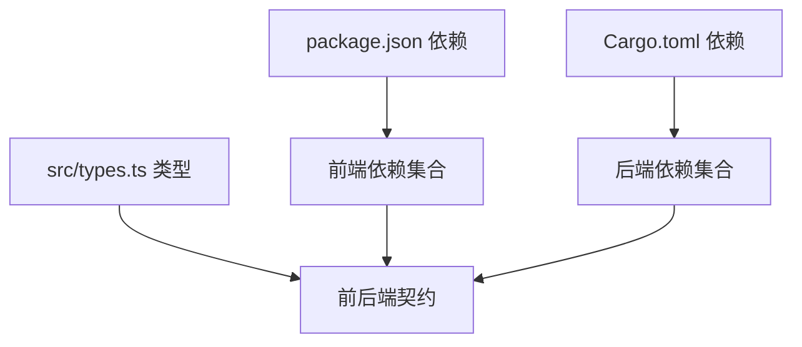

# 项目结构

<cite>
**本文引用的文件**
- [vite.config.ts](file://vite.config.ts)
- [tailwind.config.js](file://tailwind.config.js)
- [tauri.conf.json](file://src-tauri/tauri.conf.json)
- [package.json](file://package.json)
- [src/main.tsx](file://src/main.tsx)
- [src/App.tsx](file://src/App.tsx)
- [src/core/index.ts](file://src/core/index.ts)
- [src/types.ts](file://src/types.ts)
- [src/components/ui/Button.tsx](file://src/components/ui/Button.tsx)
- [src/store/editor.ts](file://src/store/editor.ts)
- [src-tauri/src/main.rs](file://src-tauri/src/main.rs)
- [src-tauri/src/commands/mod.rs](file://src-tauri/src/commands/mod.rs)
- [src-tauri/src/models/mod.rs](file://src-tauri/src/models/mod.rs)
- [src-tauri/src/repositories/mod.rs](file://src-tauri/src/repositories/mod.rs)
- [src-tauri/Cargo.toml](file://src-tauri/Cargo.toml)
</cite>

## 目录
1. [简介](#简介)
2. [项目结构](#项目结构)
3. [核心组件](#核心组件)
4. [架构总览](#架构总览)
5. [详细组件分析](#详细组件分析)
6. [依赖关系分析](#依赖关系分析)
7. [性能考量](#性能考量)
8. [故障排查指南](#故障排查指南)
9. [结论](#结论)
10. [附录](#附录)

## 简介
本文件系统性梳理 NoteForge 的项目结构与组织原则，覆盖前端 src 目录（UI 组件、功能模块、自定义 Hooks、IPC 通信、状态管理、工具库）与后端 src-tauri 目录（Tauri 命令、数据模型、数据访问层）的职责边界与分层设计，并解释关键配置文件（vite.config.ts、tailwind.config.js、tauri.conf.json）的配置要点。同时给出目录命名规范与代码组织最佳实践，帮助开发者快速理解架构与代码布局，提升开发效率。

## 项目结构
NoteForge 采用“前端 React + 后端 Tauri(Rust)”的双端架构：
- 前端位于 src 目录，使用 Vite 构建、TailwindCSS 样式体系、Zustand 状态管理、Radix UI 组件库与 Monaco/Milkdown 编辑器生态。
- 后端位于 src-tauri 目录，使用 Tauri 2 作为桌面桥接，Rust 实现业务逻辑、数据库与文件系统能力，通过 IPC 暴露命令给前端调用。

图表来源
- [src/main.tsx:1-24](file://src/main.tsx#L1-L24)
- [src/App.tsx:1-111](file://src/App.tsx#L1-L111)
- [src-tauri/src/main.rs:1-101](file://src-tauri/src/main.rs#L1-L101)
- [src-tauri/src/commands/mod.rs:1-13](file://src-tauri/src/commands/mod.rs#L1-L13)
- [src-tauri/src/models/mod.rs:1-28](file://src-tauri/src/models/mod.rs#L1-L28)
- [src-tauri/src/repositories/mod.rs:1-12](file://src-tauri/src/repositories/mod.rs#L1-L12)
- [src-tauri/tauri.conf.json:1-40](file://src-tauri/tauri.conf.json#L1-L40)

章节来源
- [src/main.tsx:1-24](file://src/main.tsx#L1-L24)
- [src/App.tsx:1-111](file://src/App.tsx#L1-L111)
- [src-tauri/src/main.rs:1-101](file://src-tauri/src/main.rs#L1-L101)

## 核心组件
- 应用入口与启动流程
  - 前端入口在 src/main.tsx，负责主题缓存应用、核心初始化、生命周期安装与引导启动。
  - 根组件 App.tsx 负责布局（顶部栏、侧边栏、编辑区、右侧面板、状态栏、对话框宿主）与全局快捷键、文件拖拽、退出前持久化等。
- 核心域与运行时
  - src/core 提供领域契约与运行时接口，统一导出命令、对话框、知识引擎、工作台、文档服务等能力，作为前后端契约的桥梁。
- 类型与共享契约
  - src/types.ts 定义了跨前后端对齐的数据结构（工作区、文件、草稿、编辑器、知识图谱、AI、配置、错误码等），确保 IPC 契约稳定。
- 状态管理
  - src/store/editor.ts 使用 Zustand 管理多面板编辑器状态、标签页生命周期、保存/关闭队列、会话持久化等，是编辑器行为的核心协调者。

章节来源
- [src/main.tsx:1-24](file://src/main.tsx#L1-L24)
- [src/App.tsx:1-111](file://src/App.tsx#L1-L111)
- [src/core/index.ts:1-62](file://src/core/index.ts#L1-L62)
- [src/types.ts:1-389](file://src/types.ts#L1-L389)
- [src/store/editor.ts:1-842](file://src/store/editor.ts#L1-L842)

## 架构总览
NoteForge 的架构以“前端 UI + 核心域 + IPC 命令 + 后端 Rust”四层协同：
- 前端 UI 层：组件树与功能模块，负责用户交互与视图渲染。
- 核心域层：统一的命令、对话框、知识查询、工作台等抽象，屏蔽底层差异。
- IPC 层：前端通过 src/ipc 与后端命令对接，调用后端能力（文件系统、索引、加密、AI 等）。
- 后端层：Tauri 主进程注册命令，Rust 模块处理业务逻辑、数据库与文件系统。

图表来源
- [src/App.tsx:1-111](file://src/App.tsx#L1-L111)
- [src/store/editor.ts:1-842](file://src/store/editor.ts#L1-L842)
- [src/core/index.ts:1-62](file://src/core/index.ts#L1-L62)
- [src-tauri/src/commands/mod.rs:1-13](file://src-tauri/src/commands/mod.rs#L1-L13)
- [src-tauri/src/repositories/mod.rs:1-12](file://src-tauri/src/repositories/mod.rs#L1-L12)

## 详细组件分析

### 前端目录结构与职责
- src/components
  - UI 组件：基础控件（Button、Input、Dropdown、Tooltip 等），用于构建一致的视觉与交互体验。
  - 功能区域：编辑器区域、右侧面板、侧边栏、顶部栏、对话框宿主等。
  - 示例：src/components/ui/Button.tsx 通过 variants/sizes 抽象样式类，结合 Tailwind 变量实现主题化。
- src/features
  - 功能模块：AI 面板、图谱视图、JSON/YAML 树形视图、Markdown 渲染与 Milkdown 表面、欢迎页等。
- src/hooks
  - 自定义 Hook：如 useDocumentContent、useFileDrop、useShortcuts、useTabStripScroll 等，封装可复用的副作用与状态。
- src/ipc
  - IPC 封装：提供前端与后端命令的统一调用入口，当前为 stub/index.ts 与 stub.ts，便于在 Web 环境与 Tauri 环境间切换。
- src/store
  - 状态管理：以 Zustand 切分领域状态（editor、ui、theme、workspace、startup），避免全局耦合。
  - 示例：src/store/editor.ts 管理多面板、标签页、保存/关闭队列、会话持久化等。
- src/lib
  - 工具库：monaco-setup、utils、editor-doc、surface-mode、wiki-resolve、front-matter 等，支撑编辑器与文档处理。
- src/core
  - 核心域：命令注册、对话框 API、文档服务、知识查询、工作台、事件总线、运行时初始化等。
  - 示例：src/core/index.ts 统一导出核心类型与工厂方法，作为前后端契约的“门面”。

章节来源
- [src/components/ui/Button.tsx:1-44](file://src/components/ui/Button.tsx#L1-L44)
- [src/store/editor.ts:1-842](file://src/store/editor.ts#L1-L842)
- [src/core/index.ts:1-62](file://src/core/index.ts#L1-L62)

### 后端目录结构与分层设计
- src-tauri/src/main.rs
  - 应用入口：初始化日志、注册插件（shell/dialog）、管理状态（如 VaultWatchState）、设置数据库/配置/临时缓冲/会话等。
  - 命令注册：集中注册所有 Tauri 命令（工作区、文件、编辑器、知识、记忆、AI、搜索、加密、配置、草稿、会话、监视等）。
- src-tauri/src/commands
  - 分层模块：按功能域划分（workspace、file、editor、knowledge、memory、ai、search、encryption、config、scratch、workbench_session、workspace_draft、vault_watch）。
- src-tauri/src/models
  - 数据模型：与数据库 Schema 对应的 Rust 结构体，统一序列化/反序列化与 IPC 传输。
- src-tauri/src/repositories
  - 数据访问层：封装 SQL 查询、向量检索、链接/标签/笔记/工作区仓库等，隔离存储细节。
- src-tauri/Cargo.toml
  - 依赖清单：包含 Tauri、数据库(rusqlite)、文件监控(notify)、网络(reqwest)、加密(ring/aes-gcm)、嵌入/fastembed、日志(tracing)等。

图表来源
- [src-tauri/src/main.rs:1-101](file://src-tauri/src/main.rs#L1-L101)
- [src-tauri/src/commands/mod.rs:1-13](file://src-tauri/src/commands/mod.rs#L1-L13)
- [src-tauri/src/models/mod.rs:1-28](file://src-tauri/src/models/mod.rs#L1-L28)
- [src-tauri/src/repositories/mod.rs:1-12](file://src-tauri/src/repositories/mod.rs#L1-L12)

章节来源
- [src-tauri/src/main.rs:1-101](file://src-tauri/src/main.rs#L1-L101)
- [src-tauri/src/commands/mod.rs:1-13](file://src-tauri/src/commands/mod.rs#L1-L13)
- [src-tauri/src/models/mod.rs:1-28](file://src-tauri/src/models/mod.rs#L1-L28)
- [src-tauri/src/repositories/mod.rs:1-12](file://src-tauri/src/repositories/mod.rs#L1-L12)
- [src-tauri/Cargo.toml:1-40](file://src-tauri/Cargo.toml#L1-L40)

### 关键配置文件解析
- vite.config.ts
  - 插件：React 插件；路径别名 @ -> src；开发服务器端口 1420；环境变量前缀 VITE_/TAURI_。
  - 构建优化：目标 esnext、esbuild 最小化、禁用 SourceMap、手动分包（monaco、milkdown、radix）。
- tailwind.config.js
  - 内容扫描：index.html 与 src/**/*.{ts,tsx}；深色模式 class；主题变量映射到 CSS 变量（背景、文本、强调色、圆角、间距、字体、阴影、动画）。
- tauri.conf.json
  - 开发/构建：devUrl 指向 Vite；frontendDist 指向 dist；脚本集成 pnpm dev/build。
  - 窗口：标题、尺寸、最小尺寸、装饰、透明度、全屏、可调整、背景色。
  - 安全：CSP 为空（允许内联）。
  - 打包：目标平台 all，分类 Productivity，描述与图标。

章节来源
- [vite.config.ts:1-42](file://vite.config.ts#L1-L42)
- [tailwind.config.js:1-105](file://tailwind.config.js#L1-L105)
- [tauri.conf.json:1-40](file://src-tauri/tauri.conf.json#L1-L40)
- [package.json:1-70](file://package.json#L1-L70)

### 典型流程：打开文件与保存

图表来源
- [src/App.tsx:1-111](file://src/App.tsx#L1-L111)
- [src/store/editor.ts:1-842](file://src/store/editor.ts#L1-L842)
- [src/core/index.ts:1-62](file://src/core/index.ts#L1-L62)
- [src-tauri/src/commands/mod.rs:1-13](file://src-tauri/src/commands/mod.rs#L1-L13)

## 依赖关系分析
- 前端依赖
  - React 生态（@milkdown、@monaco-editor/react、@radix-ui/react-*）、TailwindCSS、Zustand、@tauri-apps/api 等。
  - 构建链路：Vite + TypeScript；开发服务器 1420；生产构建产物 dist。
- 后端依赖
  - Tauri 2、rusqlite（SQLite）、notify（文件监控）、reqwest（HTTP）、ring/aes-gcm（加密）、fastembed（向量）、tracing（日志）等。
- 前后端契约
  - src/types.ts 定义共享数据结构，确保命令签名与模型一致，降低重构成本。

图表来源
- [package.json:1-70](file://package.json#L1-L70)
- [src-tauri/Cargo.toml:1-40](file://src-tauri/Cargo.toml#L1-L40)
- [src/types.ts:1-389](file://src/types.ts#L1-L389)

章节来源
- [package.json:1-70](file://package.json#L1-L70)
- [src-tauri/Cargo.toml:1-40](file://src-tauri/Cargo.toml#L1-L40)
- [src/types.ts:1-389](file://src/types.ts#L1-L389)

## 性能考量
- 代码分割：Vite 通过 manualChunks 将大型库（monaco、milkdown、radix）独立分包，减少首包体积与加载时间。
- 构建目标：esnext + esbuild 最小化，适合现代浏览器；SourceMap 默认关闭，降低生产体积。
- 编辑器性能：Milkdown 与 Monaco 并存，按需启用；编辑器状态与草稿自动保存策略降低丢失风险。
- 后端性能：rusqlite 内嵌 SQLite、notify 轻量文件监控、fastembed 向量化检索，兼顾本地与语义检索。

## 故障排查指南
- 启动失败
  - 检查 Vite 开发服务器端口 1420 是否被占用；确认 tauri.conf.json 中 devUrl 与前端构建输出路径一致。
- IPC 调用异常
  - 确认命令已在 src-tauri/src/main.rs 的 invoke_handler 中注册；检查 src/types.ts 中请求/响应结构是否匹配。
- 编辑器状态不一致
  - 查看 src/store/editor.ts 的标签页生命周期与保存队列逻辑；关注草稿/会话持久化时机。
- 样式/主题问题
  - 检查 tailwind.config.js 的 content 扫描范围与 CSS 变量映射；确认主题缓存与类名一致性。

章节来源
- [vite.config.ts:1-42](file://vite.config.ts#L1-L42)
- [tauri.conf.json:1-40](file://src-tauri/tauri.conf.json#L1-L40)
- [src/types.ts:1-389](file://src/types.ts#L1-L389)
- [src/store/editor.ts:1-842](file://src/store/editor.ts#L1-L842)
- [tailwind.config.js:1-105](file://tailwind.config.js#L1-L105)

## 结论
NoteForge 采用清晰的前后端分层与模块化组织：前端以组件/功能/状态三层解耦，后端以命令/模型/仓库三层分层，配合统一的类型契约与构建配置，形成高内聚、低耦合的工程化架构。遵循本文档的命名规范与最佳实践，可显著提升协作效率与可维护性。

## 附录

### 目录命名规范与最佳实践
- 前端
  - src/components：仅放可复用 UI 组件，按功能域子目录组织（如 dialogs、editor、sidebar、ui）。
  - src/features：按功能模块拆分（如 ai、graph、json-yaml、markdown、welcome）。
  - src/hooks：按职责拆分（文档、拖拽、快捷键、滚动）。
  - src/ipc：统一 IPC 调用入口，区分 stub 与实际实现。
  - src/store：按领域拆分（editor、ui、theme、workspace、startup），避免跨域混杂。
  - src/lib：纯工具函数与第三方初始化（monaco-setup、utils、surface-mode 等）。
  - src/core：核心域与运行时，统一导出契约与工厂方法。
- 后端
  - src-tauri/src/commands：按功能域模块化（workspace、file、editor、knowledge、memory、ai、search、encryption、config、scratch、workbench_session、workspace_draft、vault_watch）。
  - src-tauri/src/models：与数据库/传输结构一一对应，保持 snake_case 与 Rust 结构体一致。
  - src-tauri/src/repositories：封装 SQL/文件/向量检索，暴露领域方法。
  - src-tauri/src/main.rs：集中初始化与命令注册，避免分散逻辑。
- 配置
  - vite.config.ts：明确别名、端口、分包策略与环境变量前缀。
  - tailwind.config.js：以 CSS 变量驱动主题，扩展常用颜色/圆角/字体/阴影/动画。
  - tauri.conf.json：窗口尺寸/最小尺寸/背景色/打包信息/安全策略。