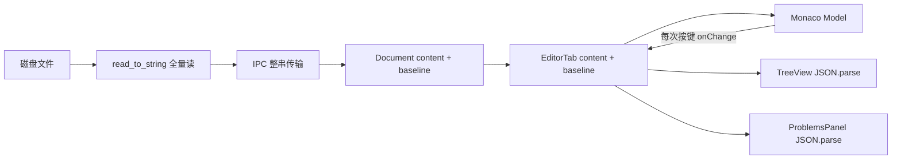
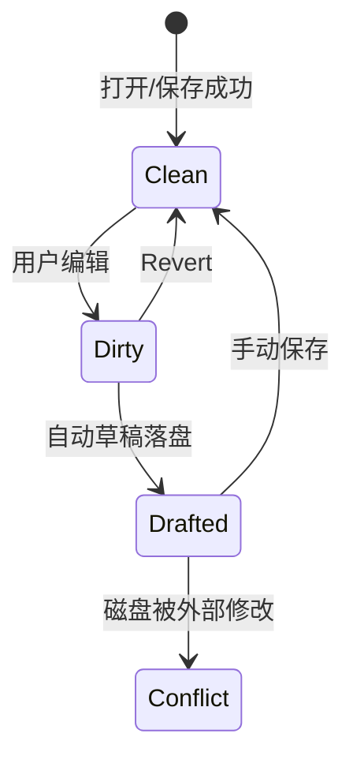
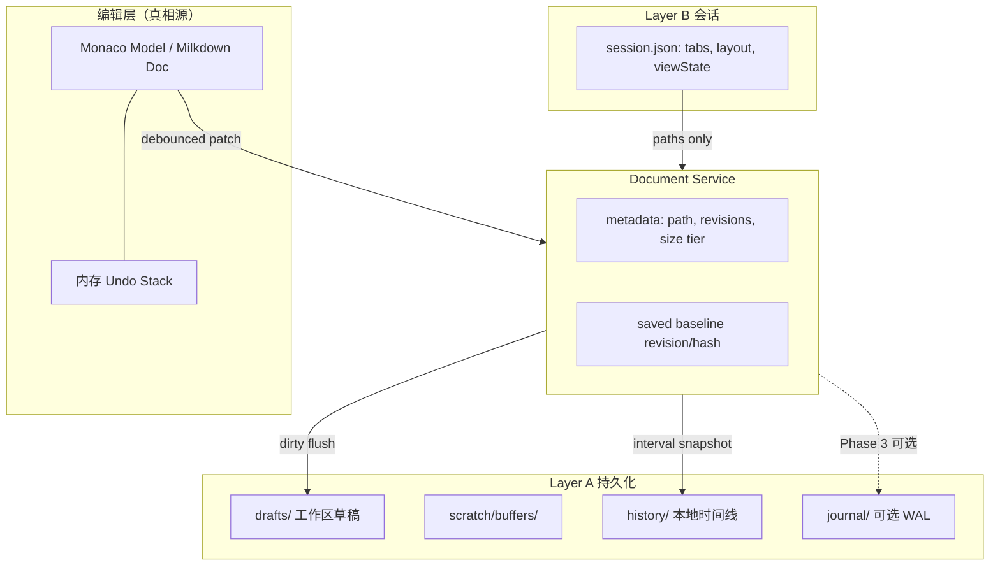

# 笔记强化

## User

考虑超大文件的查看编辑场景，能够更快的响应且避免卡死，如何优化？

## Assistant

先梳理当前文件加载、编辑与持久化链路，再针对超大文件给出可落地的优化方向。

### Tool Semantic Search Full

```
{"query":"How are files loaded and displayed in the Monaco editor?","targetDirectories":[],"explanation":""}
```

### Tool Ripgrep Raw Search

```
{"pattern":"largeFile|large.?file|maxFile|fileSize|chunk|virtual|worker","path":"/Users/fanjunwei/Projects/noteforge","caseInsensitive":true,"multiline":false,"toolCallId":"tool_576d6ada-ff8c-4223-86a9-277f541296c","offset":0}
```

### Tool Glob File Search

```
{"targetDirectory":"/Users/fanjunwei/Projects/noteforge","globPattern":"**/*Monaco*"}
```

### Tool Read File V2

```
{"path":"/Users/fanjunwei/Projects/noteforge/src/components/editor/JsonYamlPanel.tsx"}
```

### Tool Read File V2

```
{"path":"/Users/fanjunwei/Projects/noteforge/src-tauri/src/commands/file.rs"}
```

### Tool Ripgrep Raw Search

```
{"pattern":"updateContent|readText|tab\\.content","path":"/Users/fanjunwei/Projects/noteforge/src","glob":"*.{ts,tsx}","caseInsensitive":false,"headLimit":40,"multiline":false,"toolCallId":"tool_d508e710-3bd1-48d5-a4f9-5d4aa38c93e","offset":0}
```

### Tool Read File V2

```
{"path":"/Users/fanjunwei/Projects/noteforge/src/features/json-yaml/TreeView.tsx","limit":80}
```

### Tool Read File V2

```
{"path":"/Users/fanjunwei/Projects/noteforge/src/store/editor.ts","offset":495,"limit":80}
```

### Tool Read File V2

```
{"path":"/Users/fanjunwei/Projects/noteforge/src/core/bridge/editor-sync.ts","limit":80}
```

### Tool Ripgrep Raw Search

```
{"pattern":"session\\.json|persistSession|EditorTab","path":"/Users/fanjunwei/Projects/noteforge/src","glob":"**/workbench/**","caseInsensitive":false,"multiline":false,"toolCallId":"tool_00e78a64-b5bb-4fec-bdb4-0e16256f1f5","offset":0}
```

### Tool Read File V2

```
{"path":"/Users/fanjunwei/Projects/noteforge/src/features/json-yaml/TreeView.tsx","offset":200,"limit":80}
```

### Tool Read File V2

```
{"path":"/Users/fanjunwei/Projects/noteforge/src/core/workbench/workbench-service.impl.ts","limit":100}
```

### Tool Read File V2

```
{"path":"/Users/fanjunwei/Projects/noteforge/src/components/editor/ProblemsPanel.tsx","limit":60}
```

### Tool Ripgrep Raw Search

```
{"pattern":"scheduleWorkspaceDraftAutosave|document:changed","path":"/Users/fanjunwei/Projects/noteforge/src","caseInsensitive":false,"multiline":false,"toolCallId":"tool_514453ba-a829-4f99-bf60-d0b0df182fb","offset":0}
```

### Tool Read File V2

```
{"path":"/Users/fanjunwei/Projects/noteforge/src/lib/json-location.ts","limit":80}
```

### Tool Read File V2

```
{"path":"/Users/fanjunwei/Projects/noteforge/src/core/runtime.ts","offset":70,"limit":50}
```

### Tool Ripgrep Raw Search

```
{"pattern":"size|fileSize|LARGE|threshold|MB","path":"/Users/fanjunwei/Projects/noteforge/src","glob":"*.{ts,tsx}","caseInsensitive":false,"headLimit":30,"multiline":false,"toolCallId":"tool_7d02b6f3-64e2-445a-a190-9db5cffb274","offset":0}
```

### Tool Ripgrep Raw Search

```
{"pattern":"editorHost|EditorHost","path":"/Users/fanjunwei/Projects/noteforge/src/core","caseInsensitive":false,"multiline":false,"toolCallId":"tool_f9f4528d-dfbb-4916-b030-3d06e98ce86","offset":0}
```

### Tool Read File V2

```
{"path":"/Users/fanjunwei/Projects/noteforge/src/components/editor/EditorArea.tsx","limit":60}
```

### Tool Read File V2

```
{"path":"/Users/fanjunwei/Projects/noteforge/src/core/editor/editor-host.impl.ts"}
```

## Assistant

你的判断是对的。以 `extract-manifest.json` 这类超大/单行 JSON 为例，当前架构在多个环节都会把整份内容反复拷贝、解析，很容易卡死。下面按「瓶颈 → 策略 → 落地顺序」说明。

## 当前主要瓶颈



**1. 全量读、全量传、多份驻留**

Rust `read_file` 一次性 `read_to_string`，前端至少同时持有：

* `DocumentRecord.content` + `baseline`

* `EditorTab.content` + `baseline`（Zustand）

* Monaco Model

* draft 序列化时再拷贝一份

10MB 文件实际内存占用往往是 **30–50MB+**。

**2. 受控组件 + 全量 replace**

```308:309:src/components/editor/MonacoEditor.tsx
        value={tab.content}
        onChange={(v) => updateContent(tab.id, v || "")}
```

每次按键走 `updateContent` → `applyPatch({ kind: "replace-all" })` → `document:changed` → `syncDocumentToEditorTabs`，等于**每键全量字符串替换 + React 重渲染**。Monaco 虽开了 `largeFileOptimizations`，但挡不住这条数据流。

**3. JSON 侧栏是「杀手」**

```204:222:src/features/json-yaml/TreeView.tsx
  const parsed = useMemo(() => {
    try {
      if (language === "json") {
        return { ok: true as const, value: JSON.parse(content) as JsonValue, errors: [] };
```

`content` 一变就 `JSON.parse` 整文件，再递归渲染 DOM 树。`ProblemsPanel` 也对所有 JSON tab 做全量 parse。对你截图里那种**单行压缩 JSON**，树形视图和联动几乎必然卡死。

**4. 单行超长文本是 Monaco 最差场景**

`largeFileOptimizations` 主要优化「行数多」，对「只有 1 行、几百万字符」帮助有限：tokenization、选区、minimap、JSON worker 校验都会很重。

***

## 优化方向（按优先级）

### P0：文件分级策略（最快见效，建议先做）

打开时根据 `stat.size`（`list_directory` 已有 `size`）分级：

| 级别     | 大小     | 行为            |
| ------ | ------ | ------------- |
| Normal | < 2MB  | 现有体验          |
| Large  | 2–20MB | 降级模式          |
| Huge   | > 20MB | 只读预览 / 强制外部工具 |

**Large 模式自动：**

* 禁用 JSON/YAML 树形视图（或默认折叠，手动「解析」才启用）

* 禁用 `ProblemsPanel` 全量 parse

* Monaco：关 minimap、folding、`wordBasedSuggestions`、`formatOnPaste`；JSON 校验改为 `validate: false` 或仅语法高亮

* draft 防抖从 1.5s 提到 10–30s

* 打开时显示 loading，用 `requestIdleCallback` / `setTimeout(0)` 让 UI 先响应

对**单行 JSON**：检测 `lineCount === 1 && size > 512KB` 时，提示「建议先格式化再编辑」，默认只开 Monaco、不开树。

### P1：编辑数据流改造（治本）

核心原则：**Monaco Model 是活跃编辑区的唯一真相源，Zustand 只存元数据。**

```
按键 → Monaco incremental edit（executeEdits）
     → debounce 200ms 同步到 DocumentService
     → dirty 用 revision/hash 标记，不做 content === baseline 全串比较
```

具体改动：

* Monaco 改为非受控：挂载时 `model.setValue` 一次，之后不走 `value={tab.content}`

* `onChange` 改为取 `model.getValue()` 或增量 patch，debounce 写回 document

* `syncDocumentToEditorTabs` 在大文件模式下**不同步 content**，只同步 dirty/language/path

* `isDirty` 改为 `doc.revision !== doc.savedRevision`

这样按键不再触发整文件 Zustand 更新，卡顿会明显下降。

### P2：I/O 与草稿层

**Rust 侧：**

```rust
// 新增，不全量读
file_stat(path) -> { size, mtime, line_count_estimate }
read_file_range(path, offset, length) -> String  // 按需读
read_file_head(path, max_bytes) -> { head, truncated, size }
```

**草稿层：**

* 大文件 draft 存**原始文本**（`.draft`），不要 JSON 包一层 `content` 字段（避免再序列化一份）

* 超过阈值可跳过 draft，或仅记 `{ vaultPath, hash, mtime }` 提示「有未保存编辑，请尽快手动保存」

**打开流程：**

```
stat → 显示 loading → 后台 read → idle 时注入 Monaco
→ 大文件跳过 draft===disk 字符串全量比较，改用 hash
```

### P3：JSON 大文件专项

树形视图不要 `JSON.parse` 全文件，可选方案：

1. **按需解析**：用户点「展开树」才在 Web Worker 里 parse，主线程不阻塞
2. **流式/增量**：用 `@streamparser/json` 或 Rust 侧建索引，只渲染当前展开路径的子树
3. **虚拟列表**：树节点用 `react-virtuoso` / 自研 flatten + windowing
4. **联动降级**：大文件关闭 cursor↔tree 联动（`findJsonPathAtLine` 每次 `split("\n")` 整文件也很贵）

`ProblemsPanel` 改为：仅 active tab + 延迟 2s debounce + Worker，大文件直接显示「已跳过校验」。

### P4：多 tab / 会话

* 非 active 的大文件 tab：**卸载 Monaco**（只保留 tab 元数据），切回时再加载（VS Code 同款）

* 限制同时打开的大文件数（如最多 2 个 Large）

* Session 恢复时，大文件 tab 只恢复路径，内容懒加载

***

## 不建议走的路

1. **继续堆 Monaco 配置** — `largeFileOptimizations: true` 已有，单靠选项解决不了数据流问题。
2. **大文件仍走 React 受控 + 全量 parse** — 树形视图、Problems、draft 对比都会拖死主线程。
3. **一开始就上分块编辑引擎** — 成本高；NoteForge 先做分级 + 数据流改造，通常能覆盖 90% 场景。
4. **Huge 文件强行可编辑** — >50MB 建议只读 + 「用外部编辑器打开」，否则内存和 IPC 都不划算。

***

## 推荐落地顺序

```
Phase 1（1–2 天）: 文件分级 + Large 模式降级（关树/关校验/调 Monaco/draft 防抖）
Phase 2（3–5 天）: Monaco 非受控 + debounce 同步 + dirty 用 revision
Phase 3（可选）   : Rust stat/range read + draft 原始文件 + Worker parse
Phase 4（按需）   : 非 active tab 卸载 + 虚拟化树
```

对你现在的 `extract-manifest.json`，**Phase 1 就能明显改善**：关掉树形视图和全量 parse 后，至少能流畅滚动查看；配合格式化后再开树，体验会合理很多。

如果你要动手实现，建议从 **P0 文件分级 + Large 模式开关** 和 **P1 Monaco 非受控** 两条线并行，收益最大、改动也相对可控。需要的话我可以直接按这个方案改一版。

## User

业内优秀的优化思路是怎样的？大文件, 脏页 还有修改回退撤销（重启后仍考虑支持回退功能）等功能

## Assistant

从 VS Code、JetBrains、Zed 等成熟编辑器的做法出发，结合 NoteForge 现有的 Layer A（draft）/ Layer B（session）架构，整理一套可落地的行业级方案。

### Tool Ripgrep Raw Search

```
{"pattern":"undo|redo|history|LocalHistory|piece|rope","path":"/Users/fanjunwei/Projects/noteforge/src","caseInsensitive":true,"multiline":false,"toolCallId":"tool_33e16a54-6484-441b-9cde-7fdbef9ec02","offset":0}
```

### Tool Ripgrep Raw Search

```
{"pattern":"undo|redo","path":"/Users/fanjunwei/Projects/noteforge","glob":"*.{ts,tsx,rs}","caseInsensitive":false,"headLimit":30,"multiline":false,"toolCallId":"tool_4b76f930-af59-4122-ba67-9d6e52798f1","offset":0}
```

## Assistant

业内成熟编辑器在这三块上的共识，其实和「理想功能」之间有一条清晰的分界线。先把行业做法讲清楚，再映射到 NoteForge 可以怎么走。

***

## 一、大文件：行业主流不是「更快读全文件」，而是「少做事」

### 1. 缓冲区结构（最底层）

| 方案                           | 代表                  | 特点                                       |
| ---------------------------- | ------------------- | ---------------------------------------- |
| **Piece Table / Piece Tree** | VS Code、Xi          | 原文只读块 + 追加 edit buffer，编辑 O(log n)，不整串拷贝 |
| **Rope**                     | Zed（早期）、部分 Emacs 实现 | 树状字符序列，切片/拼接便宜                           |
| **Gap Buffer**               | 传统编辑器               | 中小文件好，超大单块移动差                            |
| **整段 String**                | 多数 Web 编辑器默认        | 实现简单，大文件 + 频繁编辑会崩                        |

Monaco 内部已有 piece tree，但 NoteForge 若在 React/Zustand 层再持有一份全量 `content`，等于**底层优化被上层抵消**。行业做法是：

> **编辑真相只在 Editor Model 里一份**；业务层只记 metadata（path、dirty revision、viewState）。

### 2. 加载策略（分级）

VS Code / JetBrains 的共同模式：

```
stat(size) → 选策略
  ├─ Normal   (<~2MB)   全量读入
  ├─ Large    (2–50MB)  读入 + 关 token/校验/minimap/联想
  ├─ Huge     (>50MB)   警告 + 只读 / 外部打开
  └─ 单行巨行            单独处理（格式化建议、禁用行级功能）
```

进阶（VS Code 部分场景、部分查看器）：

* **mmap 只读**：OS 页缓存，不一次性进 JS heap

* **分块读 + 行索引后台建**：先显示 viewport，滚动时再补

* **非激活 tab 卸载 Model**：内存只保留 1～2 个大文件

### 3. 渲染与附属功能

行业共识：**大文件先保「能看、能滚、能改局部」**，附属功能按需、延迟、可关：

* JSON 树 / Schema 校验 → Worker + 手动触发，或默认关

* 语法高亮 → 可见区域优先 tokenize（Monaco 已有类似逻辑）

* 搜索 → 流式/分块，或 Rust 侧 ripgrep 返回 match 行号

***

## 二、脏页（Dirty）：行业是「多层状态机」，不是 `content !== baseline`

### 典型四层模型



| 层                  | 含义              | 行业对应                                                    |
| ------------------ | --------------- | ------------------------------------------------------- |
| **Disk Canonical** | 磁盘权威版本          | 文件系统                                                    |
| **Saved Baseline** | 上次保存/打开时认定的磁盘快照 | VS Code `versionId` / JetBrains `document stamp`        |
| **Working Buffer** | 当前编辑内容          | Editor Model                                            |
| **Recovery Draft** | 崩溃/退出未保存副本      | VS Code `BackupWorkspaces`、Vim swap、NoteForge `drafts/` |

### 脏标记怎么做

行业**不用**每次按键做全串 `content === baseline`：

* `bufferRevision++` 每次编辑

* `savedRevision` 在 open/save/revert 时对齐

* `dirty = bufferRevision !== savedRevision`

* 大文件对比用 **hash(mtime+size)** 或 **content hash 采样**，避免全量 strcmp

### 草稿（Dirty Page 持久化）行业形态

| 产品           | 策略                                                   |
| ------------ | ---------------------------------------------------- |
| **VS Code**  | Hot Exit：关窗把 buffer 写到 backup 目录，重启恢复内容，**不恢复 undo** |
| **IntelliJ** | Salvage + Local History：按间隔快照                        |
| **Vim**      | `.swp` 交换文件                                          |
| **Emacs**    | `#file#` autosave + optional desktop save            |

NoteForge 现有 `drafts/` + `session.json` 已接近 VS Code Hot Exit，方向对。可补强：

1. Draft 存**原始文本**（非 JSON 包一层），大文件用**流式写**
2. 元数据：`{ vaultPath, baseRevision, draftRevision, savedAt, contentHash }`
3. 打开时：hash 快比 → 不等才读全文 diff
4. 退出：flush draft，不弹「是否保存到磁盘」（你们已改）

***

## 三、撤销/重做：要分清「会话内」和「跨重启」

这是最容易被高估的需求。行业真相：

> **几乎没有任何主流编辑器在重启后完整恢复 keystroke 级 undo 栈。**

| 产品       | 会话内 Undo      | 重启后                               |
| -------- | ------------- | --------------------------------- |
| VS Code  | Monaco undo 栈 | 恢复未保存**内容**，undo 清空               |
| IntelliJ | 内存 undo       | **Local History** 按时间线回滚（版本级，非逐键） |
| Sublime  | 内存 undo       | Session 恢复文件与选区，undo 通常丢          |
| Zed      | 内存 + 协作 OT    | 本地单文件重启一般不持久 undo                 |

用户说「重启后仍要回退」，行业里通常用**两种不同能力**满足：

### A. 会话内 Undo/Redo（必须做，成本低）

* **Monaco Model 自带 undo 栈** → 源码模式直接用，别 `setValue` 整文件替换（会破坏 undo）

* 编辑走 **incremental edit**（`executeEdits`），不用 `replace-all`

* Markdown（Milkdown/ProseMirror）自带 `history` 插件

* 与 DocumentService 同步用 **debounce**，且同步时标记 `preserveUndo: true`

### B. 跨重启「可回退」（行业妥协方案：Local History）

不叫 undo，叫 **Timeline / Local History**：

```
每次：手动保存 / 自动快照(间隔) / draft flush
  → 写入 history/{vaultPath_hash}/{timestamp}.patch 或 .snapshot
保留：最近 N 个版本或 M 天
恢复：用户从时间线选一个版本 diff 后应用
```

JetBrains Local History、VS Code Timeline（+ 扩展）、Git 本地变更，都是这个思路。

**优点**：实现可控、大文件友好（可只存 patch）、语义清晰\
**缺点**：粒度是「版本」不是「每一次 Ctrl+Z」

### C. 跨重启 keystroke 级 Undo（极少做，成本高）

只有在你愿意上 **Edit Journal（WAL）** 时才合理：

```
打开 → 加载 last snapshot
编辑 → 每条 op 追加 journal:
       { docId, seq, ts, op: insert|delete, offset, text }
关闭 → compact：每 500 ops 或 5min 打 snapshot，截断 journal
重启 → replay journal on snapshot → 重建 buffer + 重建 undo 栈（可选）
```

参考：数据库 WAL、协同编辑（Yjs update log）、部分游戏存档。

**代价**：

* 大文件 journal 体积、replay 时间

* 与外部改盘、Git、多实例冲突复杂

* Monaco undo 栈与 journal 要对齐，工程量大

**建议**：NoteForge 若要做「重启后可回退」，优先 **Local History**，把「Undo」和「历史版本」在 UI 上分开展示，避免用户以为 Ctrl+Z 能跨会话。

***

## 四、三者如何组合（推荐架构）



### 打开大文件

1. `stat` → 定 tier
2. 读入或 mmap → **只注入 Monaco 一次**
3. 比对 draft hash vs disk hash → 冲突再读全文
4. **不**自动 parse JSON 树；**不**把 content 放进 Zustand

### 编辑中

1. 按键 → Monaco 内部 undo + incremental edit
2. 200～500ms debounce → DocumentService `revision++`
3. 1.5s（大文件 10～30s）→ flush draft
4. 每 5min 或 save 时 → Local History snapshot

### 退出 / 崩溃

1. flush draft + persist session（仅元数据）
2. 不阻塞用户「保存到磁盘」

### 重启恢复

1. restore session → 按 path 懒加载
2. draft vs disk → 恢复冲突对话框
3. **Ctrl+Z**：仅当前会话 Monaco undo
4. **时间线面板**：Local History 选版本恢复（跨重启）

***

## 五、和 NoteForge 现状的差距（优先级）

| 能力      | 现状                             | 行业目标                    |
| ------- | ------------------------------ | ----------------------- |
| 缓冲区     | Zustand 全量 content + Monaco 双持 | Model 唯一真相              |
| 脏标记     | `content !== baseline` 全串比     | revision + hash         |
| 草稿      | drafts/ JSON 全量                | 原始文件 + 元数据              |
| 会话 Undo | Monaco 有，但被 `setValue` 破坏风险    | 禁止整量替换                  |
| 重启 Undo | 无                              | Local History，不是 undo 栈 |
| 大文件     | 无分级，树形全量 parse                 | tier + 功能降级             |

### 建议落地顺序

1. **P1** Monaco 非受控 + incremental edit + revision 脏标记（大文件 + undo 地基）
2. **P2** 文件分级 + 关树/关校验 + draft 原始化 + hash 对比
3. **P3** Local History（跨重启「回退」的产品形态）
4. **P4** 仅当强需求：Edit Journal + snapshot compact（真·跨重启 undo）

***

## 六、直接回答你的三个点

**大文件**\
行业优秀思路是 **piece tree + 单份 buffer + 分级降级 + 非激活卸载**，不是把 50MB 字符串在 React 里传来传去。

**脏页**\
行业优秀思路是 **baseline revision + recovery draft 分层**，磁盘、草稿、会话三者职责分离；脏标记用 revision/hash，不用全串比较。

**修改回退（含重启）**

* **会话内**：编辑器原生 undo，保证不做整文件 `setValue`

* **跨重启**：行业标准是 **Local History / Timeline**，不是完整 undo 栈；若要坚持 keystroke 级，需要 WAL + snapshot，成本和冲突处理接近一个小型协同编辑子系统

如果你决定做，我建议先做 **P1 + P3（Local History）**：用户能感知到「重启后还能回到之前的版本」，实现成本比持久化 undo 栈低一个数量级，也更符合业内预期。需要的话我可以按这个架构拆一版具体接口设计（`DocumentRecord`、`history/` 目录结构、与现有 `drafts/` 的关系）。

## User

Monaco 内部已有 piece tree，但 NoteForge 若在 React/Zustand 层再持有一份全量 content，等于底层优化被上层抵消。行业做法是：
编辑真相只在 Editor Model 里一份；业务层只记 metadata（path、dirty revision、viewState）。
======================================================================

我们现在为什么 “ React/Zustand 层再持有一份全量 content”？

## Assistant

追溯 `content` 在 Zustand 与 Monaco 之间的数据流，说明为何会形成双份全量持有。

### Tool Ripgrep Raw Search

```
{"pattern":"interface EditorTab|type EditorTab|content:","path":"/Users/fanjunwei/Projects/noteforge/src/store/editor.ts","caseInsensitive":false,"multiline":false,"toolCallId":"tool_1151a2fe-59bb-4794-820e-603e551dca0","offset":0}
```

### Tool Read File V2

```
{"path":"/Users/fanjunwei/Projects/noteforge/src/core/bridge/editor-sync.ts"}
```

### Tool Read File V2

```
{"path":"/Users/fanjunwei/Projects/noteforge/src/store/editor.ts","limit":120}
```

### Tool Read File V2

```
{"path":"/Users/fanjunwei/Projects/noteforge/src/core/document/types.ts","limit":60}
```

### Tool Read File V2

```
{"path":"/Users/fanjunwei/Projects/noteforge/src/store/editor.ts","offset":498,"limit":50}
```

### Tool Ripgrep Raw Search

```
{"pattern":"tab\\.content|t\\.content","path":"/Users/fanjunwei/Projects/noteforge/src","glob":"*.{ts,tsx}","caseInsensitive":false,"headLimit":45,"multiline":false,"toolCallId":"tool_2cabb060-c362-4912-ae3d-b5a68d3b653","offset":0}
```

### Tool Ripgrep Raw Search

```
{"pattern":"syncDocumentToEditorTabs","path":"/Users/fanjunwei/Projects/noteforge/src","caseInsensitive":false,"multiline":false,"toolCallId":"tool_716204e6-0d6d-4642-9579-32644c1cb10","offset":0}
```

### Tool Read File V2

```
{"path":"/Users/fanjunwei/Projects/noteforge/src/core/runtime.ts","offset":75,"limit":50}
```

### Tool Read File V2

```
{"path":"/Users/fanjunwei/Projects/noteforge/src/core/runtime.ts","limit":55}
```

### Tool Read File V2

```
{"path":"/Users/fanjunwei/Projects/noteforge/src/core/session/scratch-autosave.ts","limit":50}
```

### Tool Read File V2

```
{"path":"/Users/fanjunwei/Projects/noteforge/src/core/document/document-service.impl.ts","offset":85,"limit":30}
```

## Assistant

这是个很好的问题。不是「故意多存一份」，而是架构演进过程中，**React 受控模式 + 多消费者直连 + Document/Tab 双模型**叠在一起，自然形成了多份全量 `content`。

***

## 实际有几份？

打开一个工作区文件时，同一份文本至少会出现在：

| 位置                   | 字段                     | 角色                 |
| -------------------- | ---------------------- | ------------------ |
| `DocumentRecord`     | `content` + `baseline` | 领域层「文档真相」（ADR-002） |
| `EditorTab`（Zustand） | `content` + `baseline` | UI 层 tab 状态        |
| Monaco Model         | 内部 piece tree          | 编辑器渲染/输入           |

再加上 draft 序列化、磁盘 baseline 对比，内存里往往是 **3 份起步**。

***

## 为什么 Zustand 里要有 `content`？

### 1. 最初把 `EditorTab` 当成「全能 tab 对象」

```37:49:src/store/editor.ts
export interface EditorTab {
  id: string;
  kind: EditorTabKind;
  ...
  content: string;
  /** Last persisted snapshot (disk or scratch buffer) */
  baseline: string;
```

设计意图是：**一个 tab 对象就能驱动整个 UI**——标题、语言、脏点、编辑器、侧栏，都从 `tabs[]` 读。这是典型早期 React 应用做法：Zustand 当单一数据源，组件 `useEditorStore(s => s.tabs)` 直接消费。

### 2. Monaco 走了 React 受控组件模式

```308:309:src/components/editor/MonacoEditor.tsx
        value={tab.content}
        onChange={(v) => updateContent(tab.id, v || "")}
```

`@monaco-editor/react` 的惯用写法就是 `value` + `onChange`。每次按键：

```
Monaco onChange → updateContent → 写回 Zustand tab.content → React 重渲染 → value 再喂给 Monaco
```

所以 Zustand **必须**持有一份 `content`，否则受控组件跑不起来。

### 3. 很多侧栏/面板不经过 EditorHost，直接读 `tab.content`

这些组件没有从 Monaco Model 取文本，而是订阅 Zustand：

* `JsonYamlPanel` / `TreeView` → `tab.content`

* `ProblemsPanel` → 遍历 tabs 做 `JSON.parse(tab.content)`

* `RightPanel` → `OutlinePanel` / `PropertiesPanel` 用 `tab.content`

* `isDirty(tab)` → `tab.content !== tab.baseline`

* `scratch-autosave` → 从 store 读 `tab.content` 写盘

```41:41:src/core/session/scratch-autosave.ts
      content: tab.content,
```

如果 Zustand 不存 `content`，这些功能要么全改接口，要么每次从 Monaco 异步拉——当前架构选了「store 里放一份，大家随便读」。

### 4. Scratch tab 曾长期只活在 Zustand

`updateContent` 有两条路径：

```502:533:src/store/editor.ts
  updateContent(id: string, content: string) {
    const coreDoc = getCore().document.get(id);
    if (coreDoc) {
      getCore().document.applyPatch(id, { kind: "replace-all", content });
      return;
    }
    // scratch / 无 Document 的 tab：直接写 Zustand
    set({ tabs: get().tabs.map(...) });
```

工作区文件走 `DocumentService`；scratch 等没有 `DocumentRecord` 时，**Zustand 就是唯一真相源**。这强化了「tab 上必须有 content」的设计。

### 5. 引入 DocumentService 后做了「镜像同步」，没有删掉 tab.content

后来加了 ADR-002 的 `DocumentRecord`，但 UI 层没重构，而是用 bridge **双向镜像**：

```66:102:src/core/bridge/editor-sync.ts
export function syncDocumentToEditorTabs(doc: DocumentRecord): void {
  useEditorStore.setState({
    tabs: state.tabs.map((t) => ({
      ...
      content: doc.content,
      baseline: doc.baseline,
    })),
  });
  getCore().editorHost.applyExternalContent(doc.id, doc.content);
}
```

打开、保存、revert、外部变更时，把 `DocumentRecord` **再抄一份**到 `EditorTab`，并 `applyExternalContent` 给 Monaco。

更关键的是，`onDocumentsChanged` 会对**所有** document 调 `syncDocumentToEditorTabs`：

```52:55:src/core/runtime.ts
    onDocumentsChanged: () => {
      for (const doc of document.list()) {
        syncDocumentToEditorTabs(doc);
      }
```

所以工作区文件编辑时路径是：

```
按键 → DocumentService.applyPatch(全量 replace)
     → notifyChange
     → syncDocumentToEditorTabs（Zustand 再存一份）
     → editorHost.applyExternalContent（Monaco 可能再 setValue）
```

**Document 和 Tab 各持一份，还互相全量同步**——这是演进残留，不是 Monaco 的要求。

### 6. `baseline` 也在 Tab 上，服务于脏标记

```883:883:src/store/editor.ts
  return tab.content !== tab.baseline;
```

脏点、Tab 黄点、autosave 触发，都基于 Tab 上的 `content`/`baseline` 字符串比较，而不是 `DocumentRecord.dirty` 或 revision。这又绑定了「Tab 上必须有完整正文」。

***

## 总结成一句话

**不是因为 Monaco 需要 Zustand 存 content，而是为了：**

1. React 受控 Monaco（`value={tab.content}`）
2. 侧栏/校验/大纲等直接读 store
3. Scratch tab 历史路径
4. DocumentService 引入后的镜像同步

把 `content` 放在了 `EditorTab` 上，且每次编辑用 **全量 replace** 保持两边一致。

Monaco 内部的 piece tree 只优化了**编辑器内部**的编辑；一旦上层每键做 `replace-all` + Zustand 更新 + `syncDocumentToEditorTabs`，底层优化就被抵消了。

***

## 和「行业做法」差在哪

| 现在                           | 目标                                                           |
| ---------------------------- | ------------------------------------------------------------ |
| `EditorTab.content` 是编辑真相的镜像 | `EditorTab` 只留 `path`、`dirtyRevision`、`language`、`viewState` |
| 侧栏读 `tab.content`            | 侧栏读 DocumentService，或向 EditorHost 订阅                         |
| Monaco 受控 `value`            | 挂载时 `setValue` 一次，之后只走 Model 增量编辑                            |
| `isDirty` 全串比较               | `bufferRevision !== savedRevision`                           |
| Document 变更 → 同步全文到 Tab      | 只同步 metadata；正文变更不抄进 Zustand                                 |

所以「为什么现在会双持」——**是历史架构选择 + 未完成的 Document/View 分层**，不是大文件场景下的必然设计。要优化大文件和 undo，第一步就是打破「Zustand 持全量 content」这条链，而不是只调 Monaco 配置。

## User

如果改了这个架构，我们现在实现的功能还能正常使用么？会不会有些功能会不被支持？

## Assistant

全面梳理依赖 `tab.content` 的功能点，评估架构改造后的兼容性与风险。

### Tool Ripgrep Raw Search

```
{"pattern":"tab\\.content|t\\.content|\\.content\\b","path":"/Users/fanjunwei/Projects/noteforge/src","glob":"*.{ts,tsx}","outputMode":"content","caseInsensitive":false,"headLimit":120,"multiline":false,"toolCallId":"tool_c89c5fff-6ffb-47cd-8f18-08768195416","offset":0}
```

### Tool Ripgrep Raw Search

```
{"pattern":"doc\\.content|document\\.get|DocumentRecord|baseline","path":"/Users/fanjunwei/Projects/noteforge/src","glob":"*.{ts,tsx}","outputMode":"content","caseInsensitive":false,"headLimit":80,"multiline":false,"toolCallId":"tool_a03c5901-d6dc-4701-8592-708175da156","offset":0}
```

### Tool Read File V2

```
{"path":"/Users/fanjunwei/Projects/noteforge/src/core/editor/surface-handle.ts"}
```

### Tool Ripgrep Raw Search

```
{"pattern":"getValue|applyExternalContent|flush\\(","path":"/Users/fanjunwei/Projects/noteforge/src","glob":"*.{ts,tsx}","caseInsensitive":false,"headLimit":40,"multiline":false,"toolCallId":"tool_8491d5a0-917b-4d49-8d34-4b436167cbf","offset":0}
```

### Tool Read File V2

```
{"path":"/Users/fanjunwei/Projects/noteforge/src/core/workbench/workbench-service.impl.ts","offset":400,"limit":80}
```

### Tool Read File V2

```
{"path":"/Users/fanjunwei/Projects/noteforge/src/components/editor/MonacoEditor.tsx","offset":205,"limit":50}
```

### Tool Read File V2

```
{"path":"/Users/fanjunwei/Projects/noteforge/src/store/editor.ts","offset":820,"limit":50}
```

### Tool Ripgrep Raw Search

```
{"pattern":"isSameDocument|split|duplicateTab","path":"/Users/fanjunwei/Projects/noteforge/src","glob":"*.{ts,tsx}","caseInsensitive":false,"headLimit":30,"multiline":false,"toolCallId":"tool_3a99e016-b820-4c69-85c0-f15d1af7d8e","offset":0}
```

### Tool Read File V2

```
{"path":"/Users/fanjunwei/Projects/noteforge/src/store/editor.ts","offset":198,"limit":80}
```

### Tool Read File V2

```
{"path":"/Users/fanjunwei/Projects/noteforge/src/components/editor/EditorArea.tsx","limit":40}
```

### Tool Ripgrep Raw Search

```
{"pattern":"hostSurfaceMode","path":"/Users/fanjunwei/Projects/noteforge/src","caseInsensitive":false,"multiline":false,"toolCallId":"tool_7b3ab43c-b91d-4966-945e-56d68aab7c4","offset":0}
```

### Tool Read File V2

```
{"path":"/Users/fanjunwei/Projects/noteforge/src/store/editor.ts","offset":650,"limit":100}
```

### Tool Read File V2

```
{"path":"/Users/fanjunwei/Projects/noteforge/src/features/markdown/MarkdownPanel.tsx"}
```

### Tool Read File V2

```
{"path":"/Users/fanjunwei/Projects/noteforge/src/store/editor.ts","offset":735,"limit":50}
```

## Assistant

结论先说：**可以全部保留，没有必须砍掉的功能**；但如果「只删 Zustand 里的 `content`、不补读取路径」，会立刻坏掉一批能力。需要分阶段迁移，而不是一刀切。

你们代码里的 invariant 其实已经写了目标形态：

```9:9:src/core/invariants.ts
    "Canonical content lives on DocumentRecord.content only. Surfaces emit patches; they do not persist independently.",
```
    
也就是说，这次改造是**对齐既有设计**，不是换一套产品能力。

***

## 功能兼容性总览

| 类别                     | 代表功能              | 改造后    | 说明                                                                 |
| ---------------------- | ----------------- | ------ | ------------------------------------------------------------------ |
| **核心编辑**               | 打开/编辑/保存/关闭       | ✅ 可保留  | 保存前 `flushSurface`，从 Model 取正文                                     |
| **脏标记 / Tab 黄点**       | `isDirty`         | ✅ 可保留  | 改用 `DocumentRecord.dirty` 或 revision，别用 `tab.content !== baseline` |
| **Draft 草稿**           | `drafts/`         | ✅ 可保留  | flush 后写 `doc.content`，逻辑不变                                        |
| **冲突对话框**              | 恢复/保存冲突           | ✅ 可保留  | 全在 DocumentService，几乎不用动                                           |
| **会话恢复**               | tab/布局/viewState  | ✅ 可保留  | Layer B 本来就不存正文，按 path 重开即可                                        |
| **Scratch 未命名**        | autosave + 恢复     | ✅ 可保留  | 统一进 DocumentService（ephemeral），或 flush 再读                          |
| **Markdown 三模式**       | write/source/read | ✅ 可保留  | 已有 `EditorHost.flush()` / `applyExternalContent`                   |
| **分屏 / 多 Pane**        | 同文件拆到两侧           | ⚠️ 要修  | 见下文「隐患」                                                            |
| **JSON/YAML 树**        | TreeView          | ✅ 可保留  | 改读 `document.content`；大文件应降级，不是不支持                                 |
| **大纲 / 属性 / Problems** | 侧栏                | ✅ 可保留  | 改数据源 + 大文件跳过/延迟                                                    |
| **外部文件变更**             | watcher + reload  | ✅ 可保留  | `applyExternalContent` 已有                                          |
| **AI 选区工具栏**           | 浮动条               | ✅ 已 OK | 直接从 Monaco `getValueInRange` 读                                     |
| **知识库检索**              | `knowledge-query` | ✅ 可保留  | 已读 `document.list()`                                               |

**没有哪块业务逻辑本质上依赖「Zustand 必须存全量字符串」**；依赖的是「某处能拿到当前正文」。换数据源即可。

***

## 若改架构，各块要怎么接

### 1. 编辑主路径（Monaco / Milkdown）

今天有两条路：

* **普通 Monaco**：`value={tab.content}` 受控，每键写 Zustand

* **Markdown source**：`hostSurfaceMode` + `flush()` 从 Model 取字，更接近目标架构

```217:223:src/components/editor/MonacoEditor.tsx
        flush() {
          const model = editor.getModel();
          if (!model) return null;
          const content = model.getValue();
          const doc = getCore().document.get(tab.id);
          if (!doc || content === doc.content) return null;
          return { kind: "replace-all", content };
```

改造后统一成：

```
按键 → Surface(Model) 内部编辑
     → debounce → DocumentService.applyPatch
保存/关 tab/切模式/退出 → editorHost.flushSurface() 再落盘
```

**不会丢的能力**：编辑、Undo（会话内）、保存、draft。\
**前提**：去掉每键 `model.setValue` / 全量 `replace-all` 同步到 React。

### 2. 侧栏 / 校验（今天直接读 `tab.content`）

| 组件                                 | 今天               | 改造后                                                   |
| ---------------------------------- | ---------------- | ----------------------------------------------------- |
| `JsonYamlPanel` / `TreeView`       | `tab.content`    | `document.get(tabId).content`，或 `document:changed` 订阅 |
| `OutlinePanel` / `PropertiesPanel` | `tab.content`    | 同上                                                    |
| `ProblemsPanel`                    | 遍历 tabs 全量 parse | 仅 active doc + debounce；大文件跳过                         |

这些**功能都还在**，只是不能从 Zustand 读；要从 DocumentService 或 EditorHost 读。\
大文件下树/校验变慢是**性能策略**（默认关），不是功能删除。

### 3. 持久化（save / draft / scratch）

今天部分路径仍从 tab 取内容：

```561:561:src/store/editor.ts
      await fs.write(tab.path, tab.content);
```

改造后统一：**先 flush 当前 Surface，再** **`document.save()`**。\
`workspace-draft-autosave` 已在读 `doc.content`，这条链改动小。

### 4. 脏标记与 Tab UI

今天：

```883:883:src/store/editor.ts
  return tab.content !== tab.baseline;
```

改造后 Tab 只存 `documentId`、`path`、`displayName`、`language`、`viewState` 等；\
黄点用 `document.get(id)?.dirty` 或 `bufferRevision !== savedRevision`。

**Tab 栏、关闭逻辑、退出 flush** 都还能用，只是判断脏的方式变了。

***

## 真正要小心的地方（不是「不支持」，是当前就有坑）

### 1. 分屏同文件 — 改造时应一并修

`duplicateTab` 会生成**新 tab id**，但工作区文档的 `DocumentRecord.id` 是固定的：

```209:217:src/store/editor.ts
function duplicateTab(source: EditorTab, targetPaneId: string, panes: string[]): EditorTab {
  return {
    ...source,
    id: tabId(),  // 新 id，不再等于 document.id
    paneId: targetPaneId,
```

分屏后 `getCore().document.get(clonedTab.id)` 会失败，`updateContent` 走 Zustand 分支，**DocumentService 可能不同步**。\
这是现有隐患；架构改造时应改成：**多 Pane 共享同一** **`documentId`，每个 Pane 一个 view，而不是复制 tab 对象**。

### 2. 保存 / draft 前必须 flush

若 Monaco 是真相源、`DocumentRecord` 延迟同步，则：

* `save`、`draft flush`、退出持久化前必须 `flushSurface`

* 否则存的是旧 `doc.content`

这是流程约束，不是功能取消。

### 3. 非激活 Tab 卸载 Model（可选优化）

为省内存，非当前 tab 可卸载 Monaco；切回时从 `DocumentRecord` 再注入。\
**会话恢复、切 tab 仍支持**；仅多一次加载（可加缓存）。

### 4. 侧栏「随键更新」

若侧栏订阅 `document:changed` 且每次全量 parse JSON，大文件仍会卡。\
应：**debounce + 仅 active tab + 大文件降级**。功能保留，体验分级。

***

## 若「只删 tab.content、不做配套」会立刻坏什么

| 会坏                         | 原因                               |
| -------------------------- | -------------------------------- |
| JSON/YAML 树、联动             | `JsonYamlPanel` 依赖 `tab.content` |
| 大纲 / 属性                    | `RightPanel` 传 `tab.content`     |
| Problems                   | 遍历 `tab.content` parse           |
| Tab 脏点                     | `isDirty(tab)` 字符串比较             |
| Scratch autosave           | 从 store 读 `tab.content`          |
| 部分 save 路径                 | 直接 `tab.content` 写盘              |
| Monaco 初始显示                | `value={tab.content}` 没值         |
| `ensureFreshFromDisk` 兜底路径 | 直接改 tab 的 content/baseline       |

所以：**不是功能不支持，是读数据的入口要一起迁。**

***

## 建议迁移方式（每阶段功能不退化）

```
Phase A（低风险）
  DocumentRecord 仍为正文权威
  Tab 仍可有 content，但停止每键 syncDocumentToEditorTabs 全量镜像
  → 大文件立刻好转，功能不变

Phase B（核心）
  Monaco 非受控 + debounce 写 Document
  Tab 去掉 content，侧栏改读 document
  save/draft/close 统一 flushSurface
  → 功能等价，Undo 变好

Phase C（增强）
  分屏改为 documentId 多 view
  非激活 tab 卸载 model
  大文件分级降级树/校验
  → 功能更完整，不是砍能力
```

***

## 直接回答你的问题

**「改了这个架构，现有功能还能不能正常用？」**\
—— **能**，save、draft、会话恢复、冲突处理、Markdown 多模式、分屏、侧栏等都可以保留。

**「会不会有些功能不被支持？」**\
—— **不必放弃任何产品能力**；需要注意的是：

1. **不能零配套地删** **`tab.content`**，否则侧栏、脏标记、部分 save 会断。
2. **分屏同文件**建议趁改造修掉（今天就有同步风险）。
3. **超大文件的树形视图 / 实时校验**应做成「自动降级」，不是「不支持」，和 VS Code 大文件策略一致。
4. **跨重启 keystroke 级 Undo**本来就没做，与这次改造无关；会话内 Undo 反而会变好（少 `setValue`）。

如果你打算动手，最稳的是先做 **Phase A**：保留 `tab.content` 作只读缓存，但编辑不再每键全量回写 Zustand——这样风险最小，大文件收益已经很明显。需要的话我可以按 Phase A 列一版具体改哪些文件、哪些调用点。
